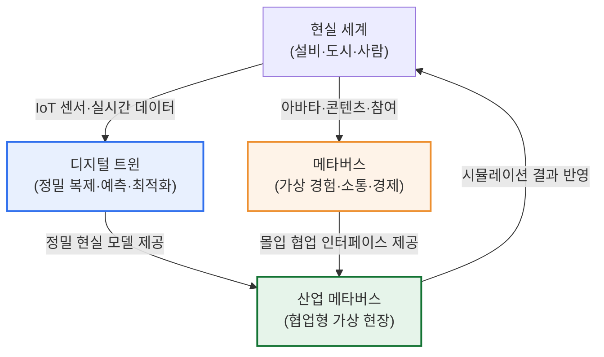
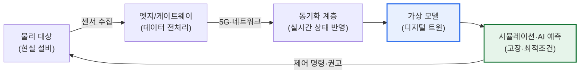

# 디지털 트윈(Digital Twin)과 메타버스(Metaverse)

## 1. 개요

### 가. 정의
> **디지털 트윈(Digital Twin)** 은 현실의 물리적 대상(설비·건물·도시·공정)을 **디지털 공간에 정밀하게 복제하고 IoT 센서 데이터로 실시간 동기화**하여 시뮬레이션·예측·최적화하는 기술이며, **메타버스(Metaverse)** 는 현실과 융합된 **3차원 가상 공간에서 사람들이 아바타(Avatar)로 상호작용·경제활동·협업**하는 지속적(persistent) 가상세계다.

두 기술을 나란히 이해하는 핵심은 '**둘 다 현실을 디지털로 옮기지만 목적과 주체가 다르다**'는 데 있다. 디지털 트윈의 목적은 '**현실을 정확히 반영해 문제를 예측·해결**'하는 것이다. 산업 현장의 실제 온도·진동·전류 같은 데이터로 가상 모델을 끊임없이 동기화하여, 설비 고장 시점을 미리 예측하고(예지정비) 공정의 최적 운영 조건을 가상에서 먼저 찾아본다. 즉 디지털 트윈은 실용·산업 중심이며, 데이터의 흐름이 '현실 → 가상'으로 향하는 관측·분석의 기술이다. 반면 메타버스의 목적은 '**현실을 확장한 새로운 경험·소통·경제의 공간을 창출**'하는 것이다. 사람이 아바타의 몸을 빌려 그 안에 들어가 놀고, 일하고, 회의하고, 가상 자산을 거래한다. 즉 메타버스는 경험·사회 중심이며, 사람의 참여와 상호작용이 본질인 인터페이스·플랫폼의 기술이다.

그러나 두 기술은 서로 대립하기보다 **융합**할 때 진가를 발휘한다. 디지털 트윈이 '현실을 그대로 반영한 정밀한 가상 무대'를 제공하고, 메타버스가 '그 무대 안에서 여러 사람이 아바타로 함께 들어가 협업·체험하는 인터페이스'를 제공하면, 이른바 '**산업 메타버스(Industrial Metaverse)**'가 성립한다. 예컨대 실제 공장의 디지털 트윈 위에서 원격지의 여러 엔지니어가 아바타로 만나 설비를 함께 점검하고, 공정 변경을 가상에서 시뮬레이션한 뒤 현실에 반영하는 식이다. 요컨대 디지털 트윈은 메타버스에 '현실성(정밀도)'을, 메타버스는 디지털 트윈에 '참여성(협업·몰입)'을 부여하는 상호보완 관계다.

### 나. 등장 배경과 필요성
두 기술이 동시에 부상한 배경에는 공통의 기술 성숙이 있다. IoT 센서와 5G의 초저지연·대용량 통신으로 현실의 상태를 지연 없이 대량으로 수집·전송할 수 있게 되었고, AI로 그 데이터를 분석·예측할 수 있게 되었으며, XR(VR/AR)과 고성능 GPU·클라우드 렌더링으로 현실 같은 3차원 공간을 실시간으로 그려낼 수 있게 되었다. 즉 '현실을 정밀하게 디지털화하는 능력'과 '그 디지털을 몰입적으로 경험하는 능력'이 같은 시기에 함께 성숙하면서, 디지털 트윈(전자)과 메타버스(후자)가 나란히 실용 단계에 진입한 것이다. 여기에 코로나19 이후 비대면 협업·원격 운영 수요가 급증하면서, 물리적으로 떨어진 사람들이 같은 가상 현장에서 일하는 방식에 대한 필요성이 산업계 전반으로 확산되었다.

## 2. 개념 구조와 관계

### 가. 전체 구조도
현실 세계를 출발점으로 삼아 디지털 트윈과 메타버스가 어떻게 갈라지고 다시 만나는지를 구조적으로 보면 두 기술의 관계가 분명해진다. 디지털 트윈은 현실을 '관측·복제'하는 방향으로, 메타버스는 현실을 '확장·창조'하는 방향으로 나아가되, 두 흐름이 산업 메타버스에서 합류한다.

```mermaid
flowchart TB
  R["현실 세계<br/>(설비·도시·사람)"] -->|IoT 센서·실시간 데이터| DT["디지털 트윈<br/>(정밀 복제·예측·최적화)"]
  R -->|아바타·콘텐츠·참여| MV["메타버스<br/>(가상 경험·소통·경제)"]
  DT -->|정밀 현실 모델 제공| IM["산업 메타버스<br/>(협업형 가상 현장)"]
  MV -->|몰입 협업 인터페이스 제공| IM
  IM -->|시뮬레이션 결과 반영| R
  style DT fill:#e8f0fe,stroke:#2f6fed,stroke-width:2px
  style MV fill:#fef3e8,stroke:#ed8f2f,stroke-width:2px
  style IM fill:#e6f4ea,stroke:#137333,stroke-width:2px
```

이 구조도에서 주목할 점은 화살표의 방향성이다. 디지털 트윈에서는 데이터가 주로 '현실 → 가상'으로 흘러 현실을 비추는 거울이 되고, 최적화 결과가 다시 현실로 되먹임된다. 메타버스에서는 사람이 '현실 → 가상'으로 들어가 새로운 활동을 만들어낸다. 두 흐름이 만나는 산업 메타버스는 '정밀한 현실 반영(디지털 트윈)' 위에 '사람의 협업(메타버스)'을 얹어, 가상에서 검증한 결정을 현실에 반영하는 폐루프(closed loop)를 완성한다.

### 나. 디지털 트윈의 작동 원리 — 폐루프 아키텍처
디지털 트윈은 단순한 3D 모델이 아니라 '살아 움직이는 모델'이라는 점이 핵심이다. 현실의 대상에 부착된 센서가 상태 데이터를 지속적으로 보내오면, 가상 모델이 그 값을 실시간으로 반영해 현실과 동일한 상태를 유지한다.

여기에 물리 법칙 기반 시뮬레이션이나 AI 예측 모델을 결합하면, '지금 이 조건이 계속되면 3일 뒤 베어링이 마모 한계에 도달한다'와 같은 미래 예측이 가능해진다. 이렇게 예측된 결과를 바탕으로 현실 설비의 운전 조건을 바꾸면, 그 변화가 다시 센서로 관측되어 모델에 반영되는 순환이 이어진다. 이 '**관측 → 동기화 → 예측 → 최적화 → 되먹임**'의 폐루프(closed loop)가 디지털 트윈을 정적 도면과 구별 짓는 결정적 특징이다.

```mermaid
flowchart LR
  P["물리 대상<br/>(현실 설비)"] -->|센서 수집| E["엣지/게이트웨이<br/>(데이터 전처리)"]
  E -->|5G·네트워크| SY["동기화 계층<br/>(실시간 상태 반영)"]
  SY --> VM["가상 모델<br/>(디지털 트윈)"]
  VM --> SIM["시뮬레이션·AI 예측<br/>(고장·최적조건)"]
  SIM -->|제어 명령·권고| P
  style VM fill:#e8f0fe,stroke:#2f6fed,stroke-width:2px
  style SIM fill:#e6f4ea,stroke:#137333,stroke-width:2px
```

이 아키텍처 세부도가 보여주듯, 디지털 트윈의 가치는 개별 구성요소가 아니라 이들이 이루는 순환 고리에서 나온다. 센서·엣지가 현실을 데이터화하고, 네트워크가 지연 없이 전달하며, 동기화 계층이 가상 모델을 현실과 일치시키고, 시뮬레이션·AI가 미래를 예측해 제어 명령을 현실로 되돌린다. 이 고리가 빠르고 정확할수록 트윈의 성숙도가 높다.

따라서 디지털 트윈의 성숙도는 크게 세 단계로 이해된다. 1단계는 현실을 가상으로 '**시각화·모니터링**'하는 수준으로, 데이터가 현실에서 가상으로 흐르지만 되먹임은 없다. 2단계는 가상에서 '**분석·예측**'을 수행하는 수준으로, 예지정비 같은 미래 예측이 더해진다. 3단계는 가상의 최적 결정을 현실에 '**자동 제어·되먹임**'하는 수준으로, 사람 개입 없이 폐루프가 스스로 도는 자율 최적화에 이른다. 대부분의 산업 현장은 아직 1~2단계에 머물러 있으며, 완전 자율의 3단계는 신뢰성·안전성 검증이라는 높은 문턱을 넘어야 하는 지향점으로 보는 것이 정확하다.

### 다. 메타버스의 구성 요소와 특성
메타버스는 네 가지 특성으로 정의된다. **지속성**(사용자가 접속을 끊어도 세계가 계속 존재), **실시간성**(다수 사용자의 동시 상호작용), **상호운용성**(자산·아이덴티티의 서비스 간 이동), **경제성**(가상 재화의 생산·거래)이 그것이다. 이 네 특성이 모두 갖춰질 때 비로소 단순한 온라인 게임이나 화상회의가 아닌 '지속적 가상세계'가 된다.

이를 구현하는 구성 요소는 세 계층으로 나뉜다. 첫째는 아바타·3D 공간·실시간 렌더링 엔진으로 이루어진 **표현 계층**으로, 사용자가 보고 조작하는 가상세계의 외형을 만든다. 둘째는 VR/AR 헤드셋과 촉각(햅틱) 장비, 모션 캡처로 이루어진 **몰입 인터페이스 계층**으로, 사용자의 감각과 동작을 가상세계에 연결한다. 셋째는 블록체인·NFT·가상화폐로 대표되는 **가상경제 계층**으로, 가상 재화에 소유권과 거래 가능성을 부여한다.

특히 상호운용성과 경제성은 메타버스가 단순한 3D 게임과 구별되는 결정적 지점이다. 한 공간에서 산 아이템을 다른 공간에서도 쓰고, 창작물을 거래해 실제 가치를 얻는 구조가 가능해야 메타버스의 사회·경제적 잠재력이 실현된다. 그러나 현실에서는 서비스마다 폐쇄적 규격을 써서 자산이 그 안에 갇히는 경우가 많아, 이 상호운용성이 메타버스의 최대 미해결 과제로 남아 있다.

## 3. 비교와 핵심 기술

### 가. 목적·초점의 차이
두 기술의 차이는 단순한 기능 차이가 아니라 '무엇을 위한 기술인가'라는 지향점의 차이에서 비롯된다. 디지털 트윈은 정확성과 예측력이 생명이므로 실제 데이터와의 오차를 줄이는 데 모든 역량을 집중한다. 반대로 메타버스는 몰입감과 연결성이 생명이므로, 반드시 현실과 일치할 필요는 없고 오히려 현실에 없는 경험(중력을 무시한 이동, 물리적으로 불가능한 공간)을 만드는 자유가 가치가 된다. 이 지향점 차이가 아래 표의 모든 항목을 갈라놓는 근원이다.

| 구분 | 디지털 트윈 | 메타버스 |
|---|---|---|
| **목적** | 현실 복제·예측·최적화 | 가상 경험·소통·경제활동 |
| **초점** | 실용·산업(정확성·예측력) | 경험·사회(몰입·연결성) |
| **데이터 방향** | 현실 → 가상(실시간 동기화) | 가상 ↔ 사람(상호작용) |
| **현실 일치성** | 높을수록 좋음(오차 최소화) | 필수 아님(창작적 확장 허용) |
| **핵심 가치** | 시뮬레이션·예지정비·최적화 | 몰입·연결·가상경제 |
| **대표 적용** | 스마트팩토리·스마트시티·플랜트 | 가상 회의·게임·가상 오피스·전시 |

### 나. 핵심 기술 스택
두 기술은 3D 모델링·렌더링, AI, 클라우드, 고성능 GPU라는 기반 기술을 공유한다. 이 공통 기반이 있기에 융합이 기술적으로 자연스럽다. 다만 각자의 목적을 위한 고유 기술이 존재한다. 디지털 트윈은 IoT 센서·엣지 컴퓨팅·실시간 동기화 미들웨어와 물리 기반 시뮬레이션(CAE/CFD)이 고유 영역이고, 메타버스는 XR(VR/AR) 디바이스·아바타 및 모션 캡처·블록체인 기반 가상경제가 고유 영역이다.

| 계층 | 디지털 트윈 고유 | 메타버스 고유 | 공통 기반 |
|---|---|---|---|
| **데이터·연결** | IoT 센서, 엣지, 실시간 동기화 | 아바타·모션 캡처, 저지연 네트워크 | 5G, 클라우드 |
| **처리·지능** | 물리 시뮬레이션, AI 예지분석 | 실시간 다중접속 서버 | AI, GPU |
| **표현·경제** | 3D 정밀 모델(오차 최소) | XR 렌더링, 블록체인·NFT | 3D 렌더링 엔진 |

## 4. 사례와 융합 — 산업 메타버스

구체적 사례를 통해 융합의 실체를 보면 이해가 분명해진다. **첫째, 제조 분야**에서는 글로벌 자동차·항공 제조사들이 신규 공장을 짓기 전에 가상에서 전체 라인을 디지털 트윈으로 구축하고, 여러 국가의 설계·생산 엔지니어가 그 가상 공장에 아바타로 접속해 설비 배치·동선·안전을 함께 검증한 뒤 실제 착공에 들어가는 방식을 도입하고 있다. 이로써 물리적 시제작 없이 설계 오류를 조기에 잡아 착공 후 재작업을 줄인다. **둘째, 도시·인프라 분야**에서는 스마트시티의 디지털 트윈 위에서 교통·에너지 시나리오를 시뮬레이션하고, 정책 담당자들이 가상 공간에서 결과를 함께 보며 의사결정하는 활용이 늘고 있다. **셋째, 플랜트·에너지 분야**에서는 위험한 발전소·화학공장 내부를 디지털 트윈으로 재현하고 작업자가 VR로 사전 교육·원격 점검을 수행해, 현장 진입 없이 안전을 확보한다.

이들 사례의 공통점은 '디지털 트윈의 정밀 데이터'와 '메타버스의 협업 인터페이스'가 결합해 **현실 진입 없이 가상에서 먼저 검증·훈련·의사결정**하고, 그 결과를 현실에 반영한다는 점이다. 즉 산업 메타버스의 본질적 가치는 '재미'가 아니라 '현실 리스크와 비용을 가상으로 옮겨 줄이는 것'에 있다.

이 지점에서 소비자용 메타버스와 산업 메타버스의 성패가 갈린 이유도 설명된다. 소비자용 메타버스는 '왜 굳이 가상 공간에서 만나야 하는가'라는 뚜렷한 효용을 제시하지 못해 열기가 식었지만, 산업 메타버스는 시제작 비용 절감·안전사고 예방·원격 협업 효율화라는 정량화 가능한 효용이 명확하기 때문에 투자가 지속된다. 결국 두 기술의 융합이 성공하려면 '몰입이라는 신기함'이 아니라 '해결하는 현실 문제와 그 경제적 가치'가 앞서야 한다는 것이 최근 사례들이 주는 교훈이다.

## 5. 심화 — 최신 동향과 표준화

**최신 동향** 측면에서, 초기 소비자용 메타버스(가상 게임·소셜)의 과열이 가라앉은 반면, 명확한 투자수익이 보이는 산업 메타버스와 디지털 트윈은 제조·건설·에너지·국방을 중심으로 실질적 도입이 확대되고 있다. 여기에 생성형 AI가 결합되면서, 3D 자산·가상 환경을 자동 생성하고 디지털 트윈의 예측을 자연어로 설명하는 등 구축 비용과 활용 문턱이 낮아지는 흐름이 관찰된다. 또한 5G 특화망(Private 5G)과 엣지 컴퓨팅이 공장 현장에 보급되면서, 대량 센서 데이터의 실시간 동기화라는 디지털 트윈의 전제 조건이 현장에서 충족되기 시작했다.

**표준화** 측면에서는 상호운용성이 핵심 과제로 부상하고 있다. 서로 다른 벤더의 3D 모델·가상 공간·아바타·자산이 오가려면 공통 포맷과 프로토콜이 필요하기 때문이다. 이에 따라 3D 데이터 교환을 위한 개방형 포맷(예: glTF, USD 계열)과 산업계의 상호운용성 표준화 협의체가 논의를 진전시키고 있으나, 아직 단일 표준으로 수렴하지는 않은 상태로 이해하는 것이 정확하다. 표준화가 성숙해야 개별 서비스에 갇힌 '섬(silo)' 형태의 가상세계가 서로 연결되어 메타버스의 상호운용성이라는 본질적 가치가 실현될 수 있다.

**예상 출제 방향**으로는 ① 디지털 트윈과 메타버스를 정의·비교하고 융합(산업 메타버스) 방안을 논하라, ② 디지털 트윈의 구성·성숙도 단계와 예지정비 활용을 설명하라, ③ 메타버스의 특성(지속성·상호운용성·경제성)과 보안 위협·대응을 서술하라 등이 예상된다.

## 6. 고려사항 및 시사점 (기술사 관점)

1. **융합으로 시너지를 극대화하되 목적을 혼동하지 말아야 한다.** 디지털 트윈(정밀 반영)과 메타버스(몰입 협업)를 결합한 산업 메타버스는 강력하지만, '현실 정확성이 필요한 영역'과 '경험 자유도가 필요한 영역'을 구분해 설계해야 한다. 시뮬레이션 정확도가 생명인 곳에 메타버스식 창작적 확장을 섞으면 오히려 신뢰성을 해친다.

2. **데이터·상호운용성 확보가 실용화의 관건이다.** 현실을 정확히 반영하려면 대량의 실시간 데이터와 표준화된 3D·데이터 포맷, 서비스 간 상호운용성이 필수다. 벤더별 폐쇄 규격에 갇히면 확장·연계가 막히므로, 개방형 표준 채택과 데이터 거버넌스를 함께 설계해야 한다.

3. **보안·프라이버시 위협에 선제 대응해야 한다.** 현실을 디지털화하고 사람이 아바타로 활동하는 만큼, 산업 데이터 유출·디지털 트윈 조작(현실 오작동 유발), 아바타 사칭·가상자산 탈취·행동 데이터의 과도한 수집 등 새로운 위협 표면이 생긴다. 접근통제·암호화·무결성 검증과 함께, 개인의 몰입 행동 데이터에 대한 프라이버시 보호 원칙을 설계 단계부터 반영(Privacy by Design)해야 한다.

4. **투자 대비 효과(ROI)를 명확히 하고 성숙도에 맞춰 단계적으로 도입해야 한다.** 소비자용 메타버스의 거품 경험이 보여주듯, 기술 자체가 아니라 '어떤 문제를 얼마의 비용으로 해결하는가'가 관건이다. 예지정비·설계 검증처럼 효과가 정량화되는 영역부터 파일럿으로 시작하고, 조직·인프라 성숙도에 맞춰 점진적으로 범위를 넓히는 접근이 현실적이다.

5. **AI·5G·클라우드 등 인접 기술과의 연계 설계가 필요하다.** 디지털 트윈의 예측 정확도는 AI 모델 품질에, 실시간 동기화는 5G·엣지 인프라에, 대규모 렌더링은 클라우드·GPU 자원에 좌우된다. 따라서 디지털 트윈·메타버스를 독립 프로젝트로 보지 말고, 조직의 AI·클라우드·네트워크 전략과 통합된 아키텍처로 설계해야 지속 가능한 성과를 낸다. 특히 생성형 AI와의 결합은 3D 자산 생성과 예측 결과 해석의 비용을 낮춰, 두 기술의 대중화를 가속하는 촉매가 될 전망이다.

## 참고자료
- 한국지능정보사회진흥원(NIA), 디지털 트윈·메타버스 관련 이슈리포트 — https://www.nia.or.kr/
- 과학기술정보통신부, 메타버스 신산업 선도전략 등 정책자료 — https://www.msit.go.kr/
- 한국전자통신연구원(ETRI), 디지털 트윈·산업 메타버스 기술동향 자료 — https://www.etri.re.kr/

---

> **한 줄 요약**: 디지털 트윈은 *현실을 정밀 복제·동기화해 예측·최적화* 하는 산업·실용 기술이고 메타버스는 *가상 공간에서 아바타로 경험·소통·거래* 하는 경험·사회 기술로, 목적은 다르나 '산업 메타버스'로 융합해 현실 진입 없이 협업·시뮬레이션·검증하는 시너지를 내며 데이터 상호운용성과 보안 확보가 실용화의 관건이다.
