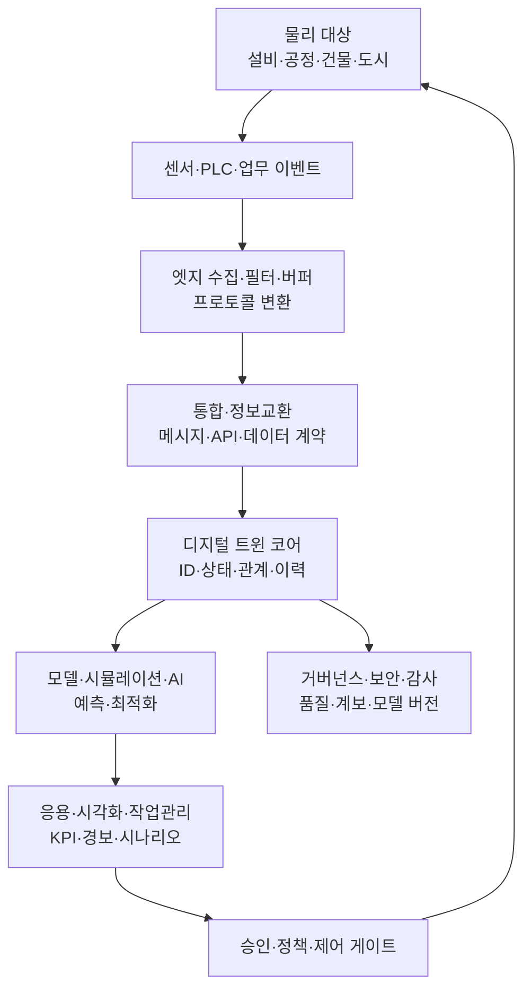
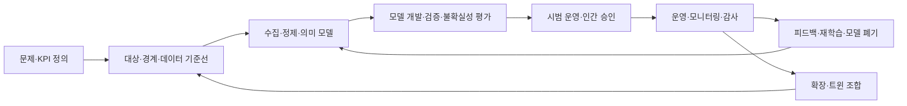

# 디지털 트윈(Digital Twin) 아키텍처와 구현 전략

## 1. 개요

> **정의**: 디지털 트윈(Digital Twin)은 현실의 관찰 가능한 대상·공정·시스템을 목적에 맞게 디지털로 표현하고, 센서·업무 데이터와 모델을 통해 현실과 디지털 표현을 지속적으로 동기화하여 관찰·예측·시뮬레이션·최적화에 활용하는 시스템이다.

디지털 트윈은 단순한 3D 모델이나 대시보드와 구별된다. 3D 모델은 형상과 공간을 시각화할 수 있지만 시간에 따른 상태 변화와 행위의 의미를 반드시 표현하지는 않는다. 대시보드는 측정값을 보여주지만 모델의 상태를 바꾸거나 미래 조건을 실험하는 기능이 없을 수 있다. 디지털 트윈은 대상의 식별자, 속성, 상태, 이력, 관계, 규칙, 시뮬레이션 모델을 연결하고, 현실에서 발생한 변화가 디지털 표현에 반영되며 분석 결과가 의사결정이나 제어로 다시 이어지는 폐루프를 지향한다.

등장 배경은 제조·건설·에너지·물류·도시 운영에서 대상이 복잡해지고 운영 데이터가 폭증한 데 있다. 과거에는 설계 문서, 운전 기록, 점검표가 서로 분리되어 있어 문제가 발생한 뒤 원인을 추적했다. IoT 센서, 엣지 컴퓨팅, 클라우드, 시계열 데이터베이스, AI·시뮬레이션 기술이 결합되면서 실제 대상의 현재 상태를 가상 공간에서 재현하고 가동 전에 여러 조건을 시험할 수 있게 되었다.

그러나 디지털 트윈은 센서를 많이 설치하는 프로젝트가 아니다. 무엇을 관찰할 것인지, 어느 수준의 정확도와 지연시간을 허용할 것인지, 어떤 의사결정을 개선할 것인지, 잘못된 모델이 운영을 방해할 때 누가 책임질 것인지가 먼저 정의되어야 한다. 목적이 정비라면 고장 징후와 잔여수명 추정에 필요한 데이터가 핵심이고, 생산 최적화라면 설비 간 제약·품질·납기·에너지 비용의 관계가 핵심이 된다.

ISO 23247은 제조 분야의 디지털 트윈을 관찰 가능한 제조 요소와 그 디지털 표현 사이의 동기화로 설명하고, 일반 원칙·참조 아키텍처·디지털 표현·정보교환으로 구성되는 프레임워크를 제시한다. 이는 모든 산업의 구현 제품을 규정하는 단일 솔루션이라기보다 공통 용어와 인터페이스를 사용하여 조합 가능한 트윈을 설계하기 위한 기준으로 이해해야 한다.

기술사 답안에서는 디지털 트윈의 가치를 “현실 복제”로만 설명하지 말고, 관측 → 모델링 → 분석·시뮬레이션 → 업무 의사결정 → 현실 피드백의 데이터 순환으로 제시해야 한다. 또한 모델 정확도와 구축 비용, 실시간성·일관성, 개방성·보안, 자동제어·인간승인의 트레이드오프를 함께 논술해야 한다.

## 2. 개념과 발전 단계

디지털 트윈의 대상은 설비 한 대일 수도 있고 공장·도시·공급망처럼 여러 트윈이 연결된 시스템일 수도 있다. 대상의 경계가 넓어질수록 데이터의 종류와 지연시간, 소유 조직, 모델 간 의존성이 증가하므로 먼저 트윈의 목적과 경계를 명확히 해야 한다. 같은 공장이라도 설계 검증용 트윈, 예지정비용 트윈, 에너지 최적화용 트윈은 필요한 모델과 정확도 기준이 다르다.

### 가. 디지털 표현의 핵심 요소

**식별과 맥락**은 트윈의 출발점이다. 자산 ID가 설비 관리 시스템, 센서 게이트웨이, 도면, 작업지시서에서 서로 다르면 온도 값이 어느 펌프의 것인지 판단할 수 없다. 따라서 자산의 글로벌 식별자, 계층 관계, 위치, 소유 조직, 유효기간을 공통 메타데이터로 관리한다.

**상태와 이벤트**는 현재를 표현한다. 상태는 가동·정지·경고·정비 중과 같은 현재의 해석 결과이며, 이벤트는 진동 임계치 초과·부품 교체·작업 승인처럼 특정 시점에 발생한 변화다. 원시 센서값을 상태로 덮어쓰면 원인 분석이 어려우므로 원시 데이터, 정제 데이터, 파생 상태를 서로 구분하고 시간과 품질 플래그를 함께 보존한다.

**모델과 규칙**은 관측값을 의미 있는 판단으로 바꾼다. 물리 기반 모델은 보존 법칙과 설계식을 이용해 설명 가능성이 높지만 구축에 전문지식이 필요하다. 데이터 기반 모델은 충분한 학습 데이터가 있으면 복잡한 패턴을 잡지만 분포가 바뀌었을 때 성능이 떨어질 수 있다. 실무에서는 물리 제약, 통계 모델, 머신러닝을 목적에 맞게 결합한다.

**동기화 정책**은 현실과 디지털 표현 사이의 시간 관계를 정의한다. 모든 데이터를 실시간으로 보내는 것이 항상 좋은 것은 아니다. 온도 제어는 초 단위가 필요하지만 월간 생산계획은 분 단위·시간 단위 집계로도 충분하다. 데이터의 수집 주기, 허용 지연, 순서 보정, 결측치 처리, 재전송 정책을 명시해야 분석 결과의 의미가 유지된다.

| 요소 | 주요 질문 | 대표 구현 |
|---|---|---|
| 식별자·맥락 | 무엇의 데이터인가? | 자산 ID, 계층, 위치, 관계 그래프 |
| 관측·상태 | 지금 어떤 상태인가? | 센서, 이벤트, 상태 머신, 품질 플래그 |
| 모델·규칙 | 왜 그런 변화가 생겼는가? | 물리식, 시뮬레이션, ML, 룰 엔진 |
| 동기화 | 현실과 얼마나 빨리 맞추는가? | 스트리밍, 배치, 시간창, 보정 |
| 실행·피드백 | 어떤 조치를 취하는가? | 경보, 작업지시, 제어명령, 승인 |

### 나. 단순 모델에서 시스템 트윈으로의 발전

첫 단계인 **디지털 모델**은 현실 대상의 속성과 관계를 정적으로 표현한다. CAD, BOM, 설비 마스터, 공정 라우팅이 여기에 해당한다. 이 단계는 기준 정보를 통합하는 데 유용하지만 운전 중인 센서나 이벤트와 자동으로 동기화되지 않으므로 트윈이라고 부르기에는 기능이 제한적이다.

두 번째 단계인 **디지털 섀도(digital shadow)**는 현실의 변화가 일방향으로 디지털 표현에 반영되는 상태다. 설비의 회전수와 전력량을 수집하여 상태 화면에 표시하는 것이 예다. 운영자는 가시성을 얻지만 디지털 영역의 분석 결과가 자동으로 현실 장비를 변경하지 않으므로 폐루프 제어의 위험은 상대적으로 낮다.

세 번째 단계인 **디지털 트윈**은 현실과 디지털 영역 사이에 양방향 상호작용이 있다. 예측 모델이 정비 필요성을 판단하여 작업지시를 생성하거나, 시뮬레이션이 도출한 설정값을 승인 후 제어 시스템에 반영할 수 있다. 다만 양방향 연결이 있다고 곧바로 완전 자동제어가 되는 것은 아니며 권한, 안전 인터록, 인간 승인, 롤백을 별도로 설계해야 한다.

네 번째 단계인 **트윈 네트워크·시스템 오브 트윈스**는 설비 트윈, 공정 트윈, 공장 트윈, 공급망 트윈이 표준 인터페이스로 연결되는 구조다. 개별 트윈의 최적화가 전체 시스템의 최적화와 다를 수 있으므로 자원·품질·납기·에너지 제약을 상위 수준에서 조정해야 한다. 이 단계에서는 데이터 계약, 모델 버전, 의미 체계, 책임 경계가 기술만큼 중요해진다.

## 3. 참조 아키텍처와 데이터 흐름

디지털 트윈 아키텍처는 물리 영역, 연결·수집 영역, 디지털 표현 영역, 모델·분석 영역, 응용·의사결정 영역의 계층으로 나누어 설명할 수 있다. 계층화는 제품 이름을 나열하기 위한 것이 아니라 각 계층의 책임과 장애 격리를 명확히 하기 위한 방법이다. 예를 들어 센서가 오작동해도 원시 데이터의 품질 플래그가 분석 계층에 전달되어 잘못된 제어가 일어나지 않아야 한다.

**물리 영역**은 설비, 제품, 작업자, 환경, 물류 자산 등 관찰 대상이다. 모든 물리 특성을 복제하려 하지 말고 의사결정에 필요한 관측 가능 변수와 불확실성을 선정한다. 센서가 직접 측정하지 못하는 값은 추정값일 수 있으므로 측정값·추정값·시뮬레이션 값을 데이터 유형으로 구분한다.

**엣지 영역**은 현장 프로토콜을 변환하고 지연·대역폭·연결 단절을 흡수한다. 안전에 영향을 주는 제어는 클라우드 왕복에 의존하지 않고 현장 인터록과 로컬 제어기가 우선권을 가져야 한다. 엣지는 데이터를 무조건 전송하는 대신 이상치 탐지, 윈도 집계, 압축, 로컬 버퍼링을 수행하여 비용과 지연을 줄인다.

**통합 영역**은 MQTT, OPC UA, REST, 이벤트 스트림 등 프로토콜과 데이터 계약을 연결한다. 프로토콜이 같아도 의미가 같다는 보장은 없으므로 단위, 시간대, 샘플링 주기, 품질 코드, 스키마 버전을 함께 관리한다. 메시지의 중복·순서 뒤바뀜·재처리를 고려해 이벤트 ID와 멱등 처리 규칙을 둔다.

**트윈 코어**는 자산의 현재 상태와 이력, 자산 간 관계, 모델 참조, 권한을 관리한다. 상태를 한 테이블에 덮어쓰기만 하면 과거 시점의 재현이 어려워지므로 이벤트 로그와 현재 상태 저장을 목적에 맞게 병행한다. 관계 그래프는 “펌프가 어느 라인에 연결되는가”, “부품이 어느 BOM과 작업지시에 속하는가”를 표현하여 분석의 맥락을 제공한다.

**모델·분석 영역**은 규칙, 시뮬레이션, 통계, 머신러닝을 조합한다. 예측 결과에는 값만 표시하지 말고 모델 버전, 학습 데이터 범위, 신뢰구간, 입력 품질, 설명 근거를 함께 기록한다. 예측이 불확실한데도 단일 숫자로 제어하면 운영자는 모델을 과신할 수 있으므로 불확실성의 표현이 중요하다.

**응용·제어 영역**은 사람과 업무 프로세스가 결과를 사용하는 곳이다. 경보를 많이 발생시키는 것이 관제 품질을 높이지 않으며, 심각도·중복 억제·담당자 라우팅·조치기한·완료 검증을 포함한 운영 흐름이 필요하다. 자동 제어는 허용 범위, 승인 조건, 안전 정지, 수동 전환, 감사 로그를 갖춘 정책 게이트 뒤에 둔다.

## 4. 구축 절차와 운영 생명주기

### 가. 목표와 대상 선정

첫 단계에서는 비즈니스 문제를 KPI와 손실 함수로 표현한다. “스마트 팩토리 구축”은 실행 가능한 목표가 아니지만 “병목 설비의 비계획 정지 시간을 분기 기준으로 줄이고 정비 리드타임을 단축한다”는 목표는 데이터와 모델의 범위를 좁힐 수 있다. 효과 측정 시 모델 정확도뿐 아니라 오탐 경보에 투입된 작업시간, 생산 중단 회피 비용, 의사결정 소요시간을 함께 평가한다.

대상은 중요도·관측 가능성·변경 비용을 기준으로 우선순위를 정한다. 고장 비용이 크고 센서 데이터가 이미 있는 설비를 첫 대상에 포함하면 빠르게 가설을 검증할 수 있다. 반대로 데이터가 전혀 없는 대상을 처음부터 전면 디지털화하면 센서 설치와 데이터 정제에 일정이 묶여 가치 검증이 늦어질 수 있다.

### 나. 데이터·의미 모델 설계

자산 ID, 단위, 시간 기준, 상태 코드, 이벤트 유형, 위치와 계층을 표준화한다. 설비명만으로 관계를 연결하면 현장별 약어와 개명 때문에 통합이 깨진다. 자산의 생성·이동·폐기와 센서 교체 이력을 관리하고, 과거 데이터가 어느 자산 버전에 속하는지도 재현 가능하게 한다.

데이터 계약은 생산자와 소비자 사이의 책임을 정한다. 생산자는 어떤 주기와 품질 수준으로 데이터를 발행할지, 소비자는 어떤 스키마 버전까지 호환할지 정한다. 스키마 변경을 조용히 배포하면 모델 입력의 의미가 달라질 수 있으므로 호환성 검사와 변경 승인을 자동화한다.

### 다. 모델 개발·검증

모델은 정확도만으로 평가하지 않는다. 예지정비 모델이라면 고장 전에 얼마나 빨리 경고하는지, 오탐과 미탐의 비용이 얼마인지, 새로운 운전 조건에서 성능이 유지되는지 평가한다. 시뮬레이션 모델이라면 실제 측정값과의 잔차, 계산시간, 경계조건의 범위를 검증한다.

검증 데이터는 학습 데이터와 시간·설비·환경이 겹치지 않도록 분리한다. 같은 고장 사건의 전후 데이터가 학습과 테스트에 섞이면 성능이 과대평가된다. 운영 환경에서 센서 교정, 계절 변화, 생산 품목 변경, 설비 개조가 발생할 때 드리프트를 탐지하고 재학습이나 모델 폐기를 결정한다.

### 라. 시범 운영과 확장

시범 운영은 하나의 설비 또는 공정에서 데이터 흐름과 업무 조치를 끝까지 연결한다. 화면이 잘 보이는지보다 경보가 실제 정비 작업으로 이어지고, 작업 결과가 다시 모델 개선에 사용되는지를 확인한다. 베이스라인 기간을 확보한 뒤 트윈 적용 전후 KPI를 비교해야 단순한 시장 변화나 작업자 숙련 효과를 성과로 오인하지 않는다.

확장 단계에서는 공통 플랫폼을 복제하는 것과 현장별 모델을 허용하는 것 사이의 균형이 필요하다. ID·보안·감사·데이터 품질은 표준화하고, 설비 특유의 물리 모델과 화면은 도메인 확장을 허용하는 방식이 현실적이다. 모든 업무를 하나의 거대한 트윈으로 만들기보다 목적별 트윈을 표준 인터페이스로 조합하는 편이 변경 영향도를 낮출 수 있다.

## 5. 기술 구성과 핵심 설계 이슈

### 가. 실시간성·일관성·비용의 트레이드오프

초저지연 스트리밍은 최신 상태를 빠르게 반영하지만 네트워크·저장·처리 비용이 증가한다. 모든 데이터를 실시간으로 중앙에 보내면 대역폭과 메시지 처리량이 병목이 될 수 있다. 중요 이벤트는 스트리밍하고 장기 분석용 원시 데이터는 배치·압축·티어드 스토리지로 보내는 계층화가 필요하다.

디지털 표현이 항상 최신이라는 보장은 어렵다. 이벤트가 늦게 도착하거나 장치 시계가 어긋나면 수집 시각과 발생 시각을 구분해야 한다. 워터마크, 이벤트 시간 윈도, 재정렬 허용시간, 결측·중복 정책을 정의하지 않으면 상태 계산이 실행마다 달라진다.

일관성 수준도 용도에 따라 선택한다. 안전 제어는 로컬에서 강한 순서를 요구할 수 있지만, 에너지 분석 대시보드는 수 분의 지연과 최종 일관성을 허용할 수 있다. 기술사 관점에서는 “실시간”을 모호하게 쓰지 않고 지연시간 SLA, 데이터 신선도, 손실률, 재처리 가능성을 수치로 제시해야 한다.

### 나. 상호운용성과 개방형 표준

트윈 간 연동을 위해서는 데이터 포맷보다 의미와 책임이 중요하다. 한 시스템의 `temperature`가 섭씨인지 화씨인지, 측정인지 추정인지, 어느 위치의 값인지 합의하지 않으면 API 연결이 되어도 분석이 틀린다. 공통 온톨로지, 단위 체계, 자산 분류, 시간·공간 기준을 조직 간 계약으로 관리한다.

제조 환경에서는 기존 PLC·SCADA·MES·ERP가 이미 운영 중이므로 전면 교체보다 어댑터와 이벤트 기반 통합이 현실적이다. OPC UA와 같은 산업 인터페이스, 메시지 브로커, REST·GraphQL API, 파일 교환을 역할에 맞게 조합하고, 특정 벤더 모델에 데이터 의미가 종속되지 않도록 원천 데이터와 정규화 데이터를 분리한다.

표준을 도입해도 모든 상호운용 문제가 자동으로 사라지지는 않는다. 표준의 프로파일, 선택 항목, 버전, 구현 적합성을 확인하고 실제 연동 테스트를 수행해야 한다. 표준 적합성 시험과 계약 테스트를 CI 파이프라인에 포함하면 시스템 교체 때 의미가 깨지는 것을 조기에 발견할 수 있다.

### 다. 보안·안전·신뢰

디지털 트윈은 설비의 구조와 운전 상태, 취약한 지점, 생산량과 같은 민감 정보를 한곳에 모을 수 있다. 읽기 권한과 제어 권한을 분리하고, 자산·테넌트·작업·시간을 기준으로 세분화된 접근통제를 적용한다. 현장 장치의 자격증명, 인증서 수명, 키 교체, 네트워크 구간 암호화, 명령 서명을 운영 절차와 함께 관리한다.

센서 데이터가 위조되면 모델은 정상적으로 계산하면서 잘못된 결론을 낼 수 있다. 센서 인증, 출처와 계보, 품질 코드, 범위 검증, 교차 센서 검증, 이상 탐지로 입력 신뢰성을 높인다. 이상치 제거가 실제 고장 신호를 삭제할 수 있으므로 원시 데이터는 보존하고 정제 결과와 제거 이유를 별도로 기록한다.

분석 결과가 제어 명령으로 연결될 때는 IT 보안만이 아니라 기능 안전과 운영 안전을 검토한다. 허용 범위를 벗어난 명령은 거부하고, 통신이 끊기면 안전 상태로 전환하며, 사람이 긴급 정지할 수 있어야 한다. 모델이 높은 확률을 제시하더라도 안전 인터록과 법적 책임을 우회할 수 없도록 권한 경계를 명시한다.

## 6. 비교와 적용 사례

### 가. 디지털 트윈과 유사 개념 비교

디지털 트윈과 디지털 모델의 차이는 동기화와 운영 목적에 있다. 모델은 물리 대상의 구조·행동을 표현하지만 실제 상태와 연결되지 않을 수 있다. 트윈은 최소한 정의된 범위에서 대상의 데이터와 디지털 표현을 동기화하며, 관측 결과가 업무 의사결정으로 사용된다.

디지털 섀도는 현실에서 디지털로 흐르는 단방향 연결에 초점을 둔다. 트윈은 디지털 분석 결과가 현실의 작업이나 제어로 반영되는 양방향 흐름을 포함할 수 있다. 다만 양방향성은 위험도 높이므로 인간 승인과 정책 게이트를 통해 단계적으로 도입한다.

시뮬레이션은 특정 조건을 가정해 미래나 대안을 계산하는 모델·실행 과정이다. 트윈은 시뮬레이션을 포함할 수 있지만 실시간 상태·이력·식별자·운영 프로세스와의 연결까지 요구한다. 따라서 시뮬레이션 결과가 좋아도 실제 데이터 품질과 업무 채택이 없으면 트윈의 운영 가치는 제한적이다.

| 구분 | 디지털 모델 | 디지털 섀도 | 디지털 트윈 | 시뮬레이션 |
|---|---|---|---|---|
| 현실 동기화 | 선택적·정적 | 현실→디지털 | 양방향 가능 | 가정·시나리오 중심 |
| 핵심 가치 | 설계·문서화 | 가시성·모니터링 | 운영 최적화·폐루프 | 예측·대안 비교 |
| 데이터 요구 | 기준정보 | 센서·이벤트 | 센서·이력·관계·모델 | 입력조건·모델 파라미터 |
| 위험 요소 | 현실과 불일치 | 분석 한계 | 잘못된 자동제어 | 가정과 현실의 차이 |

### 나. 제조·설비 예지정비 사례

회전 설비의 진동, 온도, 전류, 운전 부하를 트윈에 연결하면 정상 운전 패턴과 현재 상태의 차이를 계산할 수 있다. 단순 임계치 경보는 부하 변화에 따른 정상 진동을 고장으로 판단할 수 있으므로 운전 조건별 기준선과 설비 이력을 함께 사용한다. 고장 예측 결과는 “몇 일 후 고장”으로 단정하기보다 잔여수명 구간과 신뢰도를 제시하고 정비자가 확인하도록 한다.

정비 작업이 완료되면 교체 부품, 원인 코드, 작업 시간, 실제 고장 여부를 다시 트윈에 기록한다. 이 피드백이 없으면 모델은 운영자의 판단을 학습하지 못하고 오탐을 반복한다. 사례의 성과는 예측 정확도만이 아니라 계획정비 전환율, 비계획 정지 시간, 부품 재고와 정비 투입의 변화로 검증한다.

### 다. 건물·에너지 운영 사례

건물 트윈은 BIM·공간 정보, HVAC 설비, 점유율, 외기 조건, 전력 계측을 결합하여 구역별 에너지 수요와 쾌적도를 분석할 수 있다. 단순히 전력 사용량을 낮추면 실내 온도와 공기질이 악화될 수 있으므로 에너지·쾌적도·설비 수명 사이의 다목적 최적화가 필요하다.

외기 온도와 점유율 예측으로 냉난방 설정값을 제안하더라도 관리자가 승인할 수 있는 범위와 수동 운전 절차를 둔다. 센서 누락이나 공조기 고장으로 모델 입력이 불완전할 때는 최근 정상값을 무조건 재사용하지 말고 품질 상태를 표시하고 보수적인 운전 모드로 전환한다.

### 라. 공급망·물류 네트워크 사례

공급망 트윈은 공장·창고·운송·수요·재고를 연결하여 납기 지연이나 공급 중단 시나리오를 시험한다. 하나의 창고를 최적화해도 전체 네트워크의 재고와 운송비가 증가할 수 있으므로 노드 간 재고 정책, 리드타임 분포, 대체 조달, 서비스 수준을 함께 모델링해야 한다.

실제 주문과 배송 이벤트는 지연되거나 중복될 수 있으므로 이벤트 ID, 발생 시각, 수집 시각, 상태 전이 규칙을 관리한다. 시뮬레이션 결과는 의사결정 지원으로 사용하고, 발주·경로 변경은 승인과 예외 처리를 거쳐 실행한다. 공급망 데이터에는 협력사 정보와 상업 기밀이 포함되므로 조직 간 최소공유와 접근 감사가 중요하다.

## 7. 심화: 표준화와 트윈 조합 전략

최근 디지털 트윈의 확장 과제는 개별 트윈의 정밀도를 높이는 것에서 서로 다른 트윈을 안전하게 조합하는 것으로 이동하고 있다. NIST는 표준화가 공통 용어, 참조 모델, 인터페이스를 제공하여 고립된 맞춤형 솔루션을 확장 가능한 산업 도구로 발전시키는 데 도움이 된다고 설명한다. 이는 단일 플랫폼을 선택하면 모든 문제가 해결된다는 뜻이 아니라, 교체 가능한 구성요소 사이의 계약을 먼저 설계해야 한다는 의미다.

ISO 23247의 제조 참조 구조는 물리 제조 요소, 디지털 표현, 사용자·서비스·접근·근접 네트워크의 책임을 분리하여 설명한다. 구현자는 이 구조를 그대로 제품 구성도로 복사하기보다 자사 공정의 관찰 대상, 기능 엔티티, 정보교환 경계를 매핑해야 한다. 특히 데이터 수집과 모델 계산의 위치, 제어 명령의 승인 주체, 트윈 간 조합의 책임을 문서화해야 한다.

향후 트윈 조합에서는 모델의 입력·출력 계약, 시간 해상도, 좌표계·단위, 불확실성, 버전, 사용 권한을 기계 판독 가능한 형태로 관리하는 것이 중요하다. 트윈 A가 생산계획을 내보내고 트윈 B가 설비 가능량을 제공할 때, 두 결과가 서로 다른 기준 시점과 모델 버전을 사용하면 최적화 결과가 재현되지 않는다. 따라서 모델 레지스트리와 데이터 계보를 트윈 플랫폼의 핵심 구성요소로 둔다.

AI가 생성한 시나리오나 자동화된 최적화가 도입되면 모델 위험관리도 필요하다. 학습 데이터의 대표성, 설명 가능성, 드리프트, 승인 로그, 인간 개입, 모델 롤백을 운영 통제에 포함한다. 모델이 제안한 행동과 실제 실행된 행동을 구분하여 기록하면 사고 발생 시 원인과 책임을 재구성할 수 있다.

## 8. 고려사항 및 시사점

- **목적·범위 우선**: 센서와 3D 화면을 먼저 도입하지 말고 개선할 의사결정과 KPI, 대상의 경계, 허용 지연, 정확도 목표를 먼저 정의한다. 하나의 범용 트윈보다 가치가 명확한 사용 사례에서 시작하여 데이터·모델·업무의 폐루프를 검증한다.
- **데이터 품질·계보**: 원시값, 정제값, 상태, 예측값을 구분하고 발생 시각·수집 시각·단위·품질 플래그를 보존한다. 결측·중복·지연·센서 교체를 숨기지 말고 모델 입력과 화면에 신뢰 수준으로 전달한다.
- **상호운용성·표준화**: 자산 ID, 의미 모델, 단위, 이벤트 계약, 모델 버전을 공통 규칙으로 정한다. ISO 23247 등 참조 프레임워크를 조직의 설계 언어로 활용하되, 실제 프로파일과 적합성 시험을 통해 벤더 종속과 의미 불일치를 검증한다.
- **실시간성의 정량화**: “실시간”을 수집·전송·처리·표시·제어의 단계별 지연 예산으로 나눈다. 제어에 필요한 흐름은 엣지에 두고, 장기 분석·학습은 비용 효율적인 저장 계층으로 분리하여 성능과 비용을 함께 최적화한다.
- **모델 신뢰와 변화관리**: 정확도, 오탐·미탐 비용, 불확실성, 드리프트, 모델 버전을 관리하고 모델 변경을 배포 전후로 검증한다. 현장 작업자의 지식과 예외 판단을 데이터로 회수하여 모델의 추천이 실제 운영에서 개선되도록 한다.
- **보안·기능 안전**: 트윈 저장소의 민감 정보와 제어 명령을 동일 권한으로 다루지 않는다. 장치 인증, 세분화된 권한, 명령 서명, 안전 인터록, 수동 전환, 감사 로그, 장애 시 안전 상태를 설계에 포함한다.
- **자동화 단계적 확대**: 관찰과 분석에서 시작하여 추천, 승인 기반 실행, 제한적 자동제어 순으로 위험을 낮춘다. 자동제어의 허용범위와 롤백 조건을 테스트하고, 고장·통신 단절·잘못된 입력을 포함한 시나리오 훈련을 수행한다.
- **경제성·조직 거버넌스**: 플랫폼 구축비뿐 아니라 센서 교정, 데이터 운영, 모델 재학습, 현장 교육, 레거시 연동 비용을 TCO로 계산한다. 데이터 소유자·모델 소유자·운영 승인자·사고 대응자의 책임을 RACI로 명확히 한다.
- **트윈 네트워크 확장**: 개별 트윈의 성공을 곧바로 전사 플랫폼으로 확대하지 말고, 조합 계약과 보안 경계가 검증된 영역부터 연결한다. 트윈 간 시간 기준·모델 버전·불확실성·권한이 합의되지 않으면 연결 수보다 결과의 신뢰성이 먼저 무너진다.

## 참고자료

- NIST, Digital Twin Standardization: https://www.nist.gov/digital-twins/digital-twin-standardization
- NIST, An Analysis of the New ISO 23247 Series of Standards on Digital Twin Framework for Manufacturing: https://www.nist.gov/publications/analysis-new-iso-23247-series-standards-digital-twin-framework-manufacturing
- ISO 23247-2:2021, Digital twin framework for manufacturing — Part 2: Reference architecture: https://www.iso.org/standard/78743.html
- ISO 23247-4:2021, Digital twin framework for manufacturing — Part 4: Information exchange: https://www.iso.org/standard/78745.html
- ISO/DIS 23247-6, Digital twin framework for manufacturing — Part 6: Digital twin composition: https://www.iso.org/standard/87426.html

---

> **한 줄 요약**: 디지털 트윈은 현실 대상의 식별·상태·관계·모델을 신뢰성 있게 동기화하여 관찰과 시뮬레이션을 실행 가능한 의사결정으로 연결하는 폐루프 운영 아키텍처다.
