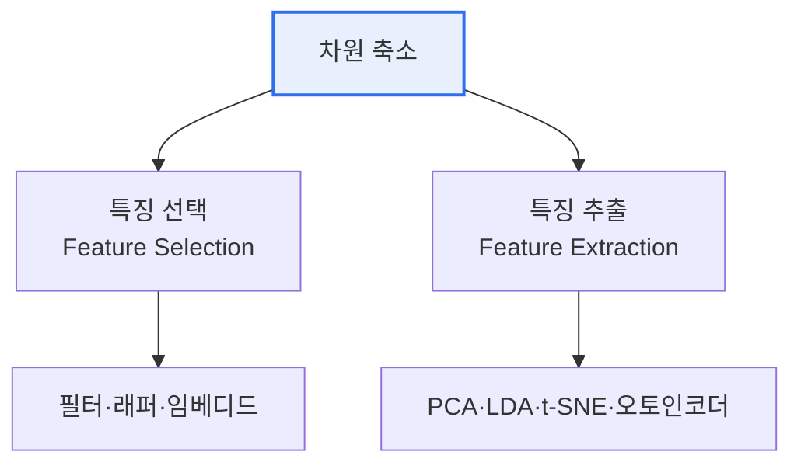

# 데이터 차원 축소(Data Dimensionality Reduction)

## 1. 개요

### 가. 정의
> 고차원 데이터의 **정보 손실을 최소화하며 변수(차원)의 개수를 줄이는** 기법. **차원의 저주**를 완화하고 계산 효율·시각화·과적합 방지를 목적으로 한다.

차원 축소가 필요한 근본 이유는 '**차원의 저주(Curse of Dimensionality)**'다. 변수가 늘수록 데이터가 공간에 희소하게 퍼져 거리·밀도 계산이 무의미해지고, 학습에 필요한 데이터량이 지수적으로 증가하며 과적합 위험이 커진다. 차원 축소는 중요한 정보를 담은 소수의 축으로 데이터를 재표현해 이 문제를 푼다.

## 2. 방식 분류

| 방식 | 개념 | 특징 |
|---|---|---|
| **특징 선택** | 원 변수 중 유용한 것만 선별 | 해석 용이(원 변수 유지) |
| **특징 추출** | 변수를 조합해 새 축 생성 | 정보 압축 우수(해석 어려움) |

## 3. 주요 기법

| 기법 | 설명 |
|---|---|
| **PCA** | 분산 최대 방향으로 직교 축(주성분) 추출(선형·비지도) |
| **LDA** | 클래스 구분 최대화(지도 학습) |
| **t-SNE / UMAP** | 비선형 구조 보존 시각화(2·3D) |
| **오토인코더** | 신경망 인코더-디코더로 잠재표현 학습 |

## 4. 시사점
- 목적에 따라 선택: **시각화**는 t-SNE/UMAP, **전처리·압축**은 PCA/오토인코더
- 과적합 방지·학습 속도 향상, 노이즈 제거 효과
- 정보 손실·해석성 저하와의 트레이드오프 고려

---

> **한 줄 요약**: 차원 축소는 *특징 선택·특징 추출(PCA·LDA·t-SNE·오토인코더)* 로 차원의 저주를 완화하며, 계산 효율·시각화·과적합 방지를 위해 정보 손실을 최소화하며 변수를 줄이는 기법이다.
