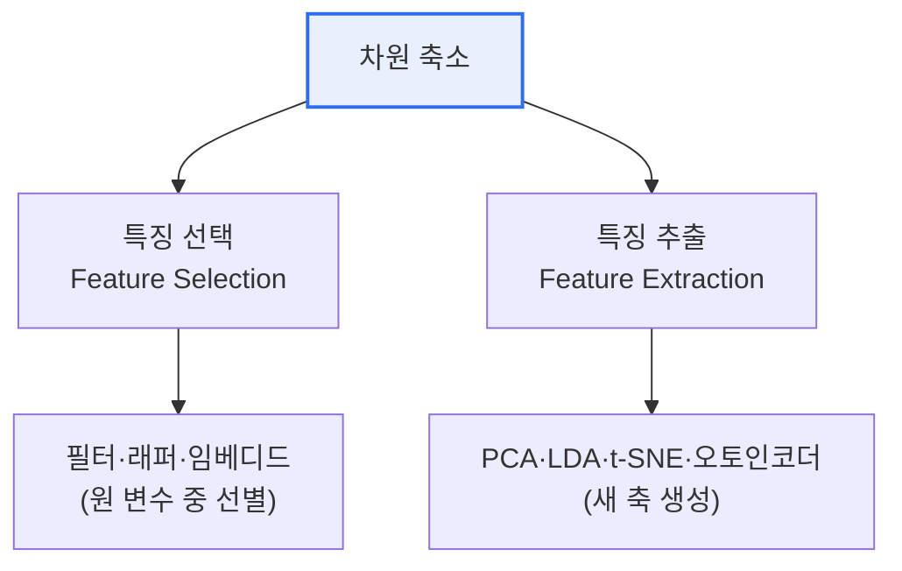

# 데이터 차원 축소(Data Dimensionality Reduction)

## 1. 개요

### 가. 정의
> 고차원 데이터를 **정보 손실을 최소화하면서 더 적은 수의 변수(차원)로 재표현**하는 기법. '차원의 저주'를 완화하고 계산 효율·시각화·과적합 방지를 목적으로 한다.

차원 축소가 필요한 근본 이유는 '**차원의 저주(Curse of Dimensionality)**'라는 역설 때문이다. 직관적으로는 변수(특징)가 많을수록 정보가 풍부해 더 좋은 예측이 될 것 같지만, 실제로는 변수가 늘어날수록 데이터 포인트들이 고차원 공간에 극도로 희소하게 흩어져 서로 멀어진다. 그 결과 거리·밀도에 기반한 알고리즘이 무력해지고, 필요한 학습 데이터량이 지수적으로 증가하며, 모델이 노이즈까지 외워버리는 과적합 위험이 커진다. 차원 축소는 데이터의 본질적 정보를 담은 소수의 축을 찾아 이 문제를 해소한다.

### 나. 필요성
차원 축소는 세 가지 실질적 이득을 준다. 첫째, **계산·저장 효율**이 향상되어 학습과 추론이 빨라진다. 둘째, 3차원 이하로 줄이면 사람이 눈으로 데이터 구조를 **시각화·탐색**할 수 있다. 셋째, 불필요한 변수·노이즈를 제거해 **과적합을 방지**하고 일반화 성능을 높인다.

## 2. 방식 분류: 특징 선택 vs 특징 추출

차원을 줄이는 데는 두 갈래가 있다. **특징 선택(Feature Selection)** 은 기존 변수 중 유용한 것만 골라내고 나머지를 버리는 방식으로, 남은 변수가 원래 의미를 유지하므로 **해석이 쉽다**(예: 진단에서 실제로 중요한 검사 항목만 남김). 반면 **특징 추출(Feature Extraction)** 은 여러 변수를 수학적으로 조합해 완전히 새로운 축을 만드는 방식으로, 정보를 더 효율적으로 압축하지만 새 축이 물리적 의미를 갖지 않아 **해석이 어렵다**.

| 방식 | 개념 | 장점 | 단점 |
|---|---|---|---|
| **특징 선택** | 원 변수 중 유용한 것 선별 | 해석 용이(의미 보존) | 조합 정보 손실 |
| **특징 추출** | 변수를 조합해 새 축 생성 | 정보 압축 우수 | 해석 곤란 |

## 3. 주요 기법

가장 널리 쓰이는 **PCA(주성분분석)** 는 데이터의 분산이 가장 큰 방향을 찾아 그 축(주성분)으로 데이터를 사영한다. 분산이 크다는 것은 그 방향에 정보가 많다는 뜻이므로, 상위 몇 개 주성분만으로 원 데이터를 상당 부분 복원할 수 있다. **LDA** 는 PCA와 달리 클래스 레이블을 활용해 '클래스 구분이 가장 잘 되는' 축을 찾는 지도 학습 기법이다. **t-SNE·UMAP** 은 고차원의 비선형 이웃 구조를 보존하며 2·3차원으로 펼쳐 시각화에 탁월하다. **오토인코더** 는 신경망으로 데이터를 압축(인코더)했다 복원(디코더)하며 잠재표현을 학습한다.

| 기법 | 원리 | 특성 |
|---|---|---|
| **PCA** | 분산 최대 방향의 직교 축 추출 | 선형·비지도, 전처리 표준 |
| **LDA** | 클래스 구분 최대화 | 지도 학습(분류 전처리) |
| **t-SNE / UMAP** | 비선형 이웃 구조 보존 | 시각화 특화 |
| **오토인코더** | 인코더-디코더 잠재표현 학습 | 비선형·딥러닝 |

## 4. 고려사항 및 시사점

1. **목적에 따른 기법 선택**이 중요하다. 데이터 구조를 눈으로 보려면 t-SNE/UMAP, 모델 전처리·압축이면 PCA/오토인코더, 분류 성능 향상이면 LDA가 적합하다.
2. **정보 손실·해석성과의 트레이드오프**를 항상 고려해야 한다. 차원을 과하게 줄이면 중요한 정보까지 잃고, 특징 추출은 해석성을 희생한다. PCA에서는 설명 분산 비율로 적정 차원 수를 결정한다.
3. 고차원 임베딩이 일상이 된 **딥러닝·벡터 검색 시대**에 차원 축소는 근사최근접탐색(ANN), 임베딩 시각화 등으로 그 역할이 오히려 확대되고 있다.

---

> **한 줄 요약**: 차원 축소는 *차원의 저주* 를 완화하기 위해 정보 손실을 최소화하며 변수를 줄이는 기법으로, 해석이 쉬운 특징 선택과 압축이 뛰어난 특징 추출(PCA·LDA·t-SNE·오토인코더)로 나뉘며 목적에 맞게 선택한다.
