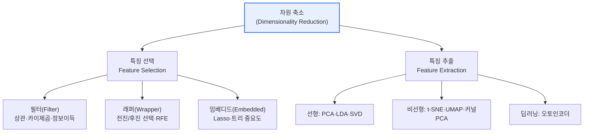
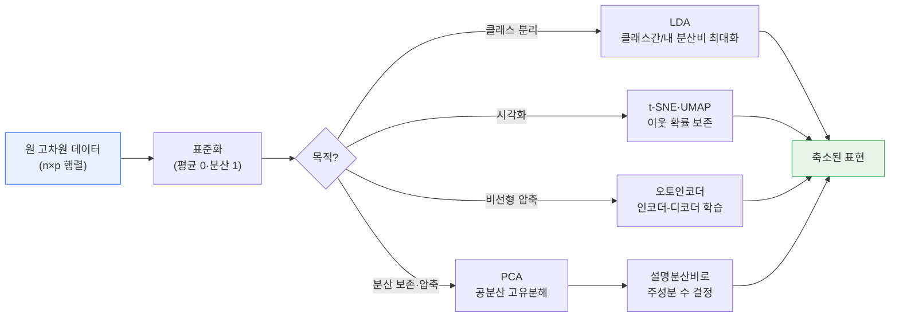

# 데이터 차원 축소(Data Dimensionality Reduction)

## 1. 개요

### 가. 정의
> **차원 축소(Dimensionality Reduction)** 란 고차원 데이터를 **정보 손실을 최소화하면서 더 적은 수의 변수(차원)로 재표현**하는 기법이다. '차원의 저주'를 완화하고 계산 효율·시각화·과적합 방지를 목적으로 하며, 원 변수 중 일부를 고르는 특징 선택과 새로운 축을 만드는 특징 추출로 크게 나뉜다.

차원 축소가 필요한 근본 이유는 '**차원의 저주(Curse of Dimensionality)**'라는 역설 때문이다. 직관적으로는 변수(특징)가 많을수록 정보가 풍부해 더 좋은 예측이 될 것 같지만, 실제로는 변수가 늘어날수록 데이터 포인트들이 고차원 공간에 극도로 희소하게 흩어져 서로 멀어진다. 예컨대 한 변수를 0~1 구간에서 균일하게 채우려면 10개 표본이면 충분하지만, 같은 밀도를 10차원에서 유지하려면 표본이 10^10개 필요하다. 차원이 늘수록 필요한 데이터량이 지수적으로 폭증하는 것이다.

이 희소성은 알고리즘을 직접 무력화한다. k-최근접이웃(kNN)이나 군집화처럼 **거리·밀도에 기반한 알고리즘**은 고차원에서 모든 점 사이의 거리가 비슷해지는 '거리 집중(distance concentration)' 현상 때문에 '가까움'과 '멀음'의 구분이 흐려진다. 가장 가까운 이웃과 가장 먼 이웃의 거리 비율이 1에 수렴하면, 근접성에 의미를 부여하던 알고리즘이 사실상 무작위 추측에 가까워진다. 결국 변수가 많다는 것은 정보가 아니라 잡음과 계산 부담이 늘어난다는 뜻이 되기 쉽다.

또한 변수가 많아질수록 모델의 자유도(파라미터 수)가 늘어 학습 데이터의 노이즈까지 외워버리는 **과적합(Overfitting)** 위험이 커진다. 표본 수 대비 변수 수가 큰 이른바 'HDLSS(High-Dimension, Low-Sample-Size)' 상황(예: 수만 개 유전자 발현 값 대 수백 명 환자)에서 이 문제가 특히 심각하다. 차원 축소는 데이터의 본질적 정보를 담은 소수의 축을 찾아 이 문제들을 한꺼번에 완화한다.

### 나. 필요성과 효과
차원 축소는 세 가지 실질적 이득을 준다. 첫째, **계산·저장 효율**이 향상되어 학습과 추론이 빨라지고 메모리 사용이 줄어든다. 수천 차원의 벡터를 수십 차원으로 줄이면 거리 계산량과 인덱스 크기가 극적으로 감소한다. 둘째, 데이터를 2~3차원으로 줄이면 사람이 눈으로 데이터의 군집·이상치·클래스 분리 구조를 **시각화·탐색**할 수 있어 데이터 이해와 가설 수립을 돕는다. 셋째, 불필요한 변수·상관 변수·노이즈를 제거해 **과적합을 방지**하고 일반화 성능과 모델 안정성을 높인다. 실무에서는 여기에 '**다중공선성(multicollinearity) 제거**'가 더해져, 회귀·분류 모델의 계수 추정이 안정되는 효과도 크다.

## 2. 방식 분류: 특징 선택 vs 특징 추출

차원을 줄이는 방법은 크게 원 변수를 그대로 골라내는 **특징 선택**과, 변수들을 조합해 새 축을 만드는 **특징 추출**로 나뉜다. 전체 지형을 먼저 조망한다.

```mermaid
flowchart TB
  D["차원 축소<br/>(Dimensionality Reduction)"] --> S["특징 선택<br/>Feature Selection"]
  D --> E["특징 추출<br/>Feature Extraction"]
  S --> S1["필터(Filter)<br/>상관·카이제곱·정보이득"]
  S --> S2["래퍼(Wrapper)<br/>전진/후진 선택·RFE"]
  S --> S3["임베디드(Embedded)<br/>Lasso·트리 중요도"]
  E --> E1["선형: PCA·LDA·SVD"]
  E --> E2["비선형: t-SNE·UMAP·커널PCA"]
  E --> E3["딥러닝: 오토인코더"]
  style D fill:#e8f0fe,stroke:#2f6fed,stroke-width:2px
```

**특징 선택(Feature Selection)** 은 기존 변수 중 유용한 것만 골라내고 나머지를 버리는 방식이다. 남은 변수가 원래의 물리적 의미를 그대로 유지하므로 **해석이 쉽다**는 것이 최대 장점이다. 예를 들어 질병 진단 모델에서 수백 개 검사 항목 중 실제로 중요한 10여 개만 남기면, 의료진이 "이 검사값이 높으면 위험"이라고 곧바로 해석할 수 있다. 다만 버려진 변수와 남은 변수의 조합에서 나오는 정보는 잃는다.

특징 선택은 다시 세 갈래로 나뉜다. **필터(Filter)** 방식은 모델과 무관하게 상관계수·카이제곱·상호정보량 같은 통계 지표로 변수를 평가해 빠르게 걸러낸다. **래퍼(Wrapper)** 방식은 실제 모델의 성능을 기준으로 변수 부분집합을 반복 탐색(전진 선택·후진 제거·RFE)하므로 정확하지만 계산 비용이 매우 크다. **임베디드(Embedded)** 방식은 Lasso(L1 규제)나 트리 기반 변수 중요도처럼 모델 학습 과정 자체에 변수 선택이 내장된 절충안이다.

반면 **특징 추출(Feature Extraction)** 은 여러 변수를 수학적으로 조합해 완전히 새로운 축을 만드는 방식이다. 정보를 더 효율적으로 압축하지만 새 축이 원래의 물리적 의미를 갖지 않아 **해석이 어렵다**. 예컨대 PCA의 '제1주성분'은 '키·몸무게·허리둘레의 가중합' 같은 형태여서 그 자체로 직관적 의미를 부여하기 힘들다. 대신 상관된 변수들의 정보를 소수 축에 밀도 높게 담아내므로 압축률과 표현력은 특징 선택보다 우수한 경우가 많다.

| 방식 | 개념 | 대표 기법 | 장점 | 단점 |
|---|---|---|---|---|
| **특징 선택** | 원 변수 중 유용한 것 선별 | 필터·래퍼·임베디드 | 해석 용이(의미 보존), 원 데이터 파이프라인 단순 | 변수 조합 정보 손실 |
| **특징 추출** | 변수를 조합해 새 축 생성 | PCA·LDA·t-SNE·오토인코더 | 정보 압축·표현력 우수 | 해석 곤란, 새 데이터에도 변환 필요 |

## 3. 주요 기법과 원리

특징 추출 기법은 '무엇을 최적화하는가'에 따라 성격이 갈린다. 대표 기법의 내부 절차를 하나의 흐름으로 정리하면 다음과 같다.

```mermaid
flowchart LR
  A["원 고차원 데이터<br/>(n×p 행렬)"] --> B["표준화<br/>(평균 0·분산 1)"]
  B --> C{"목적?"}
  C -->|"분산 보존·압축"| D["PCA<br/>공분산 고유분해"]
  C -->|"클래스 분리"| E["LDA<br/>클래스간/내 분산비 최대화"]
  C -->|"시각화"| F["t-SNE·UMAP<br/>이웃 확률 보존"]
  C -->|"비선형 압축"| G["오토인코더<br/>인코더-디코더 학습"]
  D --> H["설명분산비로<br/>주성분 수 결정"]
  E --> I["저차원 사영"]
  F --> I
  G --> I
  H --> I["축소된 표현"]
  style A fill:#e8f0fe,stroke:#2f6fed
  style I fill:#e6f4ea,stroke:#34a853
```

**PCA(주성분분석, Principal Component Analysis)** 는 가장 널리 쓰이는 선형·비지도 기법이다. 데이터의 **분산이 가장 큰 방향**을 첫 번째 주성분으로 삼고, 그에 직교하면서 남은 분산이 최대인 방향을 차례로 찾는다. 분산이 크다는 것은 그 방향으로 데이터가 넓게 퍼져 정보(변별력)가 많다는 뜻이므로, 상위 몇 개 주성분만으로 원 데이터를 상당 부분 복원할 수 있다. 수학적으로는 공분산 행렬의 고유값 분해(또는 SVD)로 구하며, 고유값의 크기가 각 축이 설명하는 분산량이다. 실무에서는 '누적 설명분산비(explained variance ratio)'가 85~95%가 되는 지점까지 주성분을 취하는 것이 관례다. 단, PCA는 변수 스케일에 민감하므로 **반드시 표준화 후 적용**해야 하며, 선형 상관만 포착한다는 한계가 있다.

**LDA(선형판별분석, Linear Discriminant Analysis)** 는 PCA와 달리 **클래스 레이블을 활용하는 지도 학습** 기법이다. PCA가 '전체 분산이 큰 축'을 찾는다면, LDA는 '**클래스 간 분산은 크게, 클래스 내 분산은 작게**' 만드는 축을 찾아 클래스가 가장 잘 구분되는 방향으로 사영한다. 따라서 분류 문제의 전처리로 강력하지만, 축소 가능한 차원 수가 '클래스 수 − 1'로 제한된다는 특성이 있다(예: 3개 클래스면 최대 2차원).

**t-SNE**와 **UMAP**은 **비선형 이웃 구조를 보존**하며 주로 2·3차원 시각화에 쓰인다. 고차원에서 가까운 점은 저차원에서도 가깝도록 확률 분포를 맞추는 방식으로, 복잡하게 얽힌 매니폴드(manifold) 구조를 펼쳐 군집을 드러내는 데 탁월하다. 다만 이들은 주로 시각화용이며, 축 사이 거리나 군집 크기를 정량적으로 해석해서는 안 된다는 점을 유의해야 한다. UMAP은 t-SNE보다 계산이 빠르고 전역 구조 보존이 나은 편이라 최근 실무에서 선호된다.

**오토인코더(Autoencoder)** 는 신경망으로 데이터를 병목(잠재) 층까지 압축(인코더)했다가 원본으로 복원(디코더)하도록 학습하며, 그 병목층의 표현을 축소된 특징으로 사용한다. 비선형 관계를 학습할 수 있어 이미지·음성 등 복잡한 데이터에 강하고, 변형인 VAE는 생성 모델로도 확장된다.

| 기법 | 원리 | 지도/비지도 | 선형/비선형 | 주 용도 |
|---|---|---|---|---|
| **PCA** | 분산 최대 직교 축 추출(고유분해) | 비지도 | 선형 | 전처리·압축 표준 |
| **LDA** | 클래스 간/내 분산비 최대화 | 지도 | 선형 | 분류 전처리 |
| **t-SNE / UMAP** | 이웃 확률 분포 보존 | 비지도 | 비선형 | 시각화 특화 |
| **오토인코더** | 인코더-디코더 잠재표현 학습 | 비지도 | 비선형 | 딥러닝·복잡 데이터 |

## 4. 적용 사례와 비교

기법 선택은 데이터 성격과 목적에서 갈린다. 몇 가지 구체 사례로 차이가 나는 이유를 살펴본다.

**사례 1 — 유전체 분석(Bioinformatics).** 마이크로어레이 실험은 표본은 수백 명인데 유전자(변수)는 2만 개가 넘는 전형적 HDLSS 상황이다. 변수를 그대로 두면 어떤 분류기도 과적합한다. 이때 먼저 필터 방식으로 발현 변동이 큰 유전자를 걸러내고, PCA로 상위 수십 개 주성분만 남긴 뒤 분류를 수행하는 파이프라인이 표준으로 쓰인다. 여기서 PCA를 택하는 이유는 유전자 간 강한 상관을 소수 축으로 압축할 수 있기 때문이다.

**사례 2 — 이미지 인식과 임베딩.** 28×28 픽셀 MNIST 숫자 이미지는 784차원 벡터인데, 실제 정보는 훨씬 낮은 차원의 매니폴드에 놓여 있다. t-SNE/UMAP으로 2차원에 펼치면 0~9 숫자가 뚜렷한 10개 군집으로 나뉘어 데이터 품질과 클래스 분리도를 한눈에 검증할 수 있다. 반면 압축·복원이 목적이면 오토인코더가 적합하다. 목적이 '보기'냐 '압축'이냐에 따라 정반대 기법이 선택되는 것이다.

**사례 3 — 추천·검색 시스템.** 사용자·상품을 수백 차원 임베딩으로 표현한 뒤 유사도로 추천할 때, 차원이 크면 최근접 탐색이 느리고 거리 집중으로 정확도도 떨어진다. 이때 PCA로 차원을 줄이거나 임베딩 자체를 저차원으로 학습해 근사최근접탐색(ANN) 인덱스의 속도와 품질을 함께 개선한다.

이처럼 비교의 핵심은 단순 나열이 아니라 **'왜 그 기법이 그 상황에 맞는가'** 이다. PCA는 선형·상관 구조가 지배적이고 해석보다 압축이 중요할 때, LDA는 레이블이 있고 분류 성능이 목표일 때, t-SNE/UMAP은 구조를 눈으로 확인할 때, 오토인코더는 비선형·대규모·복잡 데이터일 때 각각 우위를 가진다.

## 5. 심화: 최신 동향과 예상 출제 방향

**첫째, 임베딩·벡터DB 시대의 재부상.** 대규모 언어모델과 멀티모달 모델이 만들어내는 고차원 임베딩(수백~수천 차원)이 검색·추천·RAG의 기본 단위가 되면서, 차원 축소는 오히려 쓰임이 넓어지고 있다. 벡터 검색에서는 PQ(Product Quantization)·OPQ 같은 양자화 기반 축소로 인덱스 크기를 수십 분의 일로 줄이고, HNSW 같은 ANN 그래프와 결합해 대규모 유사도 검색을 실시간으로 처리한다.

**둘째, 매니폴드 학습과 표현학습(Representation Learning)의 융합.** 전통적 PCA를 넘어, 자기지도학습(self-supervised learning)으로 얻은 표현 자체가 '학습된 차원 축소' 역할을 한다. 즉 다운스트림 과제에 유용한 저차원 표현을 데이터로부터 직접 배우는 방향으로 무게중심이 이동하고 있다.

**셋째, 기출·예상 출제 방향.** 기술사 시험에서는 (1) 차원의 저주를 정의하고 차원 축소가 이를 어떻게 완화하는지 설명, (2) 특징 선택과 특징 추출을 비교하고 각각의 세부 기법을 논술, (3) PCA의 원리(분산 최대·고유분해)와 LDA와의 차이(비지도 vs 지도)를 대비, (4) 빅데이터·AI 파이프라인에서 차원 축소의 위치와 효과를 사례로 서술하는 형태가 자주 요구된다. 답안 구성 시 **'개념→분류→기법 원리→사례→트레이드오프'** 순으로 전개하면 심화 논술의 완결성을 갖출 수 있다.

## 6. 고려사항 및 시사점

기술사 관점에서 차원 축소를 적용·평가할 때 다음을 종합적으로 고려해야 한다.

1. **목적 기반 기법 선택 전략.** 데이터 구조 탐색은 t-SNE/UMAP, 모델 전처리·압축은 PCA/오토인코더, 분류 성능 향상은 LDA가 원칙이다. '만능 기법'은 없으므로 데이터 규모·선형성·레이블 유무·해석 요구를 함께 저울질해 선택해야 한다.

2. **정보 손실·해석성·성능의 트레이드오프.** 차원을 과하게 줄이면 중요한 정보까지 잃어 성능이 떨어지고, 특징 추출은 압축률을 얻는 대신 해석성을 희생한다. PCA에서는 누적 설명분산비(예: 90%)와 스크리 도표(scree plot)로 적정 차원을 정량 결정하고, 규제 산업(금융·의료)에서는 설명가능성 요구 때문에 특징 선택을 선호하는 등 맥락별 판단이 필요하다.

3. **데이터 누수(Data Leakage) 방지.** PCA·LDA·스케일러 같은 변환은 **반드시 학습 데이터로만 적합(fit)** 하고 검증·테스트 데이터에는 그 변환을 적용(transform)만 해야 한다. 교차검증에서 전체 데이터로 먼저 축소하면 테스트 정보가 새어 성능이 낙관적으로 왜곡된다. 파이프라인으로 순서를 강제하는 것이 안전하다.

4. **확장성과 운영 관점.** 대용량·스트리밍 데이터에는 증분 PCA·랜덤 사영(Random Projection) 등 확장 가능한 기법을, 실시간 서비스에는 사전 학습된 변환을 저장해 추론 시 빠르게 적용하는 구조를 택한다. 또한 축소 후에도 원 변수와의 매핑을 관리해 모델 모니터링·디버깅이 가능하도록 설계해야 한다.

5. **연계 기술과의 결합.** 차원 축소는 단독 기법이 아니라 특징공학·정규화·앙상블·ANN 검색과 결합될 때 효과가 극대화된다. 특히 벡터 검색·RAG 아키텍처에서는 축소·양자화·인덱싱을 하나의 파이프라인으로 설계하는 것이 성능과 비용을 동시에 좌우한다.

## 참고자료
- scikit-learn, "Decomposition & Manifold learning": https://scikit-learn.org/stable/modules/decomposition.html
- UMAP documentation: https://umap-learn.readthedocs.io/en/latest/
- L. van der Maaten, G. Hinton, "Visualizing Data using t-SNE": https://www.jmlr.org/papers/v9/vandermaaten08a.html

---

> **한 줄 요약**: 차원 축소는 *차원의 저주* 를 완화하기 위해 정보 손실을 최소화하며 변수를 줄이는 기법으로, 해석이 쉬운 특징 선택과 압축이 뛰어난 특징 추출(PCA·LDA·t-SNE·오토인코더)로 나뉘며, 데이터 성격·목적·해석 요구에 맞춰 선택하고 데이터 누수 방지·트레이드오프 관리와 함께 적용한다.
