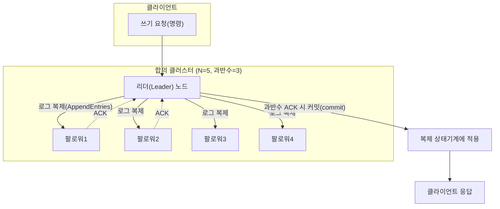
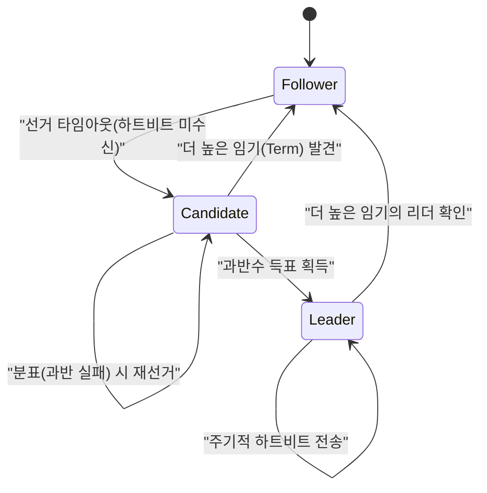

# 분산 합의 알고리즘(Distributed Consensus) — Paxos와 Raft

## 1. 개요

### 가. 정의

> **분산 합의(Distributed Consensus)**란 네트워크로 연결된 여러 노드가 일부 노드의 장애·지연·메시지 유실이 존재하는 환경에서도, 하나의 값(또는 명령의 순서)에 대해 **모두 동일한 결정**에 도달하도록 보장하는 알고리즘적 절차이다. **Paxos**와 **Raft**는 이러한 합의를 다수결(Quorum) 기반으로 달성하는 대표적 알고리즘이다.

합의 알고리즘은 분산 시스템을 "여러 대의 컴퓨터를 마치 한 대의 신뢰할 수 있는 컴퓨터처럼" 동작하게 만드는 핵심 기반 기술이다. 복제된 상태 기계(Replicated State Machine)에서 각 노드가 동일한 명령을 **동일한 순서**로 적용하면 결과 상태가 항상 일치하는데, 바로 그 "동일한 순서"를 장애 상황에서도 합의로 확정한다. Kubernetes의 etcd, 구글 Chubby/Spanner, Apache ZooKeeper, CockroachDB·TiDB 등 현대 분산 데이터 인프라의 신뢰성은 모두 합의 알고리즘 위에 서 있다.

### 나. 등장 배경과 필요성

단일 서버는 장애가 나면 서비스가 중단되므로, 가용성을 높이기 위해 데이터를 여러 노드에 **복제(replication)**한다. 그런데 복제본이 여럿이면 "어느 복제본의 값이 정답인가", "쓰기 요청을 어떤 순서로 반영할 것인가"라는 문제가 즉시 발생한다. 네트워크는 메시지를 지연·재정렬·유실시키고, 노드는 임의 시점에 죽었다 살아나며, 관리자는 새 리더를 잘못 선출할 수 있다. 이처럼 **부분 실패(partial failure)**가 상시 존재하는 환경에서 데이터 정합성을 지키려면 단순 다수결 이상의 엄밀한 프로토콜이 필요하다.

이론적으로 **FLP 불가능성(Fischer-Lynch-Paterson, 1985)**은 "완전 비동기 네트워크에서 단 하나의 노드라도 죽을 수 있다면, 항상 종료하면서(termination) 안전한(safety) 결정론적 합의는 불가능하다"고 증명했다. 현실의 합의 알고리즘은 이 한계를 우회하기 위해 **타임아웃(부분 동기 가정)**과 **무작위성/리더 선출**을 도입해 실용적 가용성을 확보한다. 즉 합의 알고리즘의 설계 목표는 "이론적 완벽함"이 아니라 **안전성은 절대 위반하지 않으면서(never wrong)**, 네트워크가 안정될 때 진전을 보장하는(eventually makes progress) 균형점을 찾는 데 있다.

Paxos(Leslie Lamport, 1998)는 이 문제를 최초로 엄밀히 푼 알고리즘이지만 "이해하기 어렵다(notoriously difficult)"는 악명이 높았다. Raft(Diego Ongaro·John Ousterhout, 2014)는 동일한 안전성을 유지하면서 **이해 가능성(understandability)**을 제1 설계 목표로 삼아, 리더 선출·로그 복제·안전성을 명확히 분리한 알고리즘으로 오늘날 산업계 표준으로 자리 잡았다.

## 2. 합의가 보장해야 하는 속성과 전체 구조

합의 알고리즘은 다음 네 가지 속성을 만족해야 한다. **합의(Agreement)**: 모든 정상 노드는 같은 값을 결정한다. **유효성(Validity)**: 결정된 값은 어느 노드가 실제로 제안한 값이어야 한다. **무결성(Integrity)**: 각 노드는 최대 한 번만 결정한다. **종료성(Termination)**: 정상 노드는 언젠가 반드시 값을 결정한다. 앞의 세 가지는 **안전성(Safety)**에, 마지막 하나는 **활성/진전(Liveness)**에 해당하며, 실무 알고리즘은 안전성을 절대 원칙으로 두고 활성은 최선 노력으로 제공한다.

핵심 메커니즘은 **정족수(Quorum)** 원리다. 전체 노드 수를 N이라 하면 과반수 `⌊N/2⌋+1` 노드의 동의를 얻어야 결정이 확정된다. 서로 다른 두 결정이 각각 과반수를 얻으려면 최소 한 노드가 양쪽에 모두 속해야 하는데(교집합 존재), 이 겹치는 노드가 "이전 결정"을 기억해 새 결정이 이를 존중하도록 강제함으로써 **분열(split-brain)**을 원천 차단한다. 그래서 N=5이면 2노드까지 장애를 견디고(과반 3 확보), 일반적으로 **F개 장애를 견디려면 N=2F+1**개의 노드가 필요하다.

위 구조에서 리더는 클라이언트 명령을 로그 항목으로 만들어 팔로워에게 복제하고, **과반수의 ACK가 모이는 순간** 해당 항목을 커밋(commit)으로 확정한 뒤 상태 기계에 적용한다. 커밋된 항목은 절대 뒤집히지 않으므로, 이후 어떤 리더가 새로 선출되더라도 이미 커밋된 명령을 반드시 포함하게 된다. 이것이 "한 번 결정하면 영원히 유지"라는 안전성의 실체다.

## 3. Paxos — 합의의 원형

Paxos는 역할을 **제안자(Proposer)**, **수락자(Acceptor)**, **학습자(Learner)**로 나눈다. 제안자는 값을 제안하고, 수락자는 과반수 정족수를 이루어 값을 수락하며, 학습자는 확정된 값을 전파받는다. 하나의 값을 정하는 **Basic Paxos**는 2단계(Two-Phase)로 동작한다.

**1단계 Prepare/Promise**에서 제안자는 전역적으로 단조 증가하는 제안번호 n을 골라 `Prepare(n)`을 과반수 수락자에게 보낸다. 수락자는 자신이 본 것보다 큰 n이면, "앞으로 n보다 작은 제안은 무시하겠다"는 **약속(Promise)**과 함께 이미 수락한 값이 있으면 그 값을 함께 회신한다. **2단계 Accept/Accepted**에서 제안자는 과반수의 약속을 받으면, 회신된 값 중 **가장 높은 번호의 값**(없으면 자신의 값)을 골라 `Accept(n, v)`를 보내고, 수락자가 과반수로 수락하면 v가 확정된다. 회신된 기존 값을 존중하는 이 규칙이 "이미 정해졌을지 모르는 값을 덮어쓰지 않도록" 보장하는 안전성의 핵심 장치다.

Basic Paxos는 값 하나만 정하므로, 연속된 명령 로그를 채우려면 각 로그 슬롯마다 Paxos 인스턴스를 돌리는 **Multi-Paxos**로 확장한다. Multi-Paxos는 안정적 리더를 선출해 1단계를 생략하고 2단계만 반복함으로써 정상 구간에서 **메시지 1왕복(1 RTT)**으로 명령을 확정해 성능을 끌어올린다. 다만 Paxos 논문은 리더 선출·멤버십 변경·로그 압축 같은 실무 요소를 명세하지 않아, 구현마다 해석이 갈리고 검증이 어렵다는 실무적 난점을 남겼다.

## 4. Raft — 이해 가능한 합의

Raft는 합의 문제를 **① 리더 선출(Leader Election) ② 로그 복제(Log Replication) ③ 안전성(Safety)**의 세 하위 문제로 분해해 각각을 독립적으로 이해할 수 있게 만들었다. 모든 노드는 **팔로워(Follower)·후보(Candidate)·리더(Leader)** 중 하나의 상태를 가지며, 시간은 단조 증가하는 **임기(Term)** 번호로 논리적으로 구획된다. 임기는 일종의 논리 시계로, 오래된 리더의 명령을 즉시 식별·기각하는 데 쓰인다.

리더 선출은 **하트비트 타임아웃**으로 촉발된다. 팔로워가 일정 시간(election timeout, 보통 150~300ms 무작위) 내에 리더의 하트비트를 받지 못하면 후보로 전환해 자신의 임기를 올리고 `RequestVote`를 뿌린다. 각 노드는 임기당 한 표만 던지므로, **과반수 득표**한 후보만 리더가 된다. 타임아웃을 무작위화해 여러 후보가 동시에 나서는 분표(split vote)를 확률적으로 회피하는 것이 Raft 진전성의 비결이다.

로그 복제는 리더가 클라이언트 명령을 로그에 추가한 뒤 `AppendEntries` RPC로 팔로워에 전파하고, 과반수가 저장하면 커밋하는 방식이다. Raft는 **로그 일치 속성(Log Matching)**을 강제해, 같은 인덱스·임기의 항목은 내용이 같고 그 이전 로그도 모두 동일함을 보장한다. 팔로워 로그가 리더와 불일치하면 리더가 강제로 자신의 로그로 덮어 정합성을 복원한다. 나아가 **선출 제약(Election Restriction)**으로 최신 커밋 로그를 가진 후보만 리더가 될 수 있게 해, 커밋된 명령이 절대 유실되지 않도록 안전성을 확보한다. 멤버십 변경은 **공동 합의(Joint Consensus)**나 단일 노드 변경 방식으로 무중단 처리한다.

## 5. Paxos와 Raft 비교, 그리고 실무 적용

두 알고리즘은 동일한 안전성(과반수 정족수·커밋 불변성)을 제공하지만, 설계 철학과 실무 용이성에서 뚜렷한 차이를 보인다. Paxos는 리더가 없어도 동작하는 일반성과 이론적 우아함을 갖지만 실무 명세가 부족하고, Raft는 강한 리더(Strong Leader) 중심으로 흐름을 단순화해 구현·디버깅·교육이 쉽다. "왜 그런 차이가 나는가"는 설계 목표의 차이에서 비롯한다 — Paxos는 최소 가정에서의 정확성 증명을, Raft는 엔지니어가 실제로 구현·운영할 수 있는 명료함을 우선했다.

| 구분 | Paxos(Multi-Paxos) | Raft |
|------|--------------------|------|
| 설계 목표 | 이론적 정확성·일반성 | 이해 가능성·구현 용이성 |
| 리더 개념 | 선택적(성능용 리더) | 필수(강한 리더 중심) |
| 로그 흐름 | 양방향 허용 | 리더→팔로워 단방향 |
| 멤버십 변경 | 논문 미명세(구현 의존) | Joint Consensus로 명시 |
| 대표 구현 | Chubby, Spanner, Cassandra(LWT) | etcd, Consul, TiKV, CockroachDB |

구체적 적용 사례로 **Kubernetes**는 클러스터의 모든 상태(오브젝트·설정)를 **etcd**에 저장하는데, etcd는 Raft로 3~5대 노드에 데이터를 복제한다. 노드 5대 구성 시 2대까지 장애가 나도 과반수 3대가 살아 있으면 API 서버는 정상적으로 읽기·쓰기를 지속한다. 실무 권고가 홀수(3·5·7) 노드인 이유도 여기에 있다 — 짝수 노드는 장애 허용 대수를 늘리지 못하면서 과반수 문턱만 높여 오히려 비효율적이다(예: 4노드도 5노드와 동일하게 2대까지만 견딤). 또한 노드를 지역(AZ)에 걸쳐 배치하면 가용성은 오르지만 합의 왕복 지연(latency)이 커지므로, **일관성·가용성·지연**을 저울질하는 배치 설계가 핵심 과제가 된다.

한편 블록체인의 **PBFT·Tendermint** 계열은 노드가 단순 고장이 아니라 **악의적으로 거짓 메시지**를 보내는 비잔틴 장애까지 견디는 BFT 합의로, 3F+1 노드가 있어야 F개의 배신 노드를 견딘다. Paxos·Raft가 신뢰 도메인 내부(Crash Fault Tolerant)를 가정하는 것과 달리, 개방형·무신뢰 환경에서는 더 비싼 BFT 합의가 요구된다는 점이 중요한 구분선이다.

## 6. 고려사항 및 시사점

기술사 관점에서 분산 합의는 단순한 알고리즘 지식을 넘어 시스템 신뢰성 아키텍처의 근간이므로 다음을 종합적으로 고려해야 한다.

- **일관성과 지연의 트레이드오프**: 합의는 매 쓰기마다 과반수 왕복이 필요해 지연이 증가한다. 강한 일관성이 필수인 메타데이터·설정·리더십 정보에는 합의를, 대용량·고빈도 데이터에는 결과적 일관성(Dynamo형)을 적용하는 **일관성 등급 분리** 설계가 바람직하다. PACELC 관점의 의사결정과 연계된다.
- **노드 수·배치 전략**: 홀수 노드(3·5·7)로 장애 허용과 정족수 효율을 맞추고, 다중 AZ/리전 배치 시 합의 지연과 가용성의 균형을 정량 검토한다. 노드가 많을수록 장애 내성은 오르지만 쓰기 지연·네트워크 비용이 상승한다.
- **성능 최적화 기법**: 로그 배치(batching)·파이프라이닝, 리더 리스(lease) 기반 로컬 읽기, 스냅샷·로그 압축(log compaction), 읽기 부하 분산을 위한 팔로워 읽기 등을 통해 합의의 비용을 상쇄한다.
- **운영·관측 요구**: 리더 선출 플래핑(flapping), 클럭 스큐, 네트워크 파티션에 대비해 임기·커밋 인덱스·정족수 상태를 관측(Observability)하고, 스플릿-브레인 방지를 위해 반드시 과반수 기반 구성을 유지한다.
- **위협 모델 선정**: 신뢰 도메인 내부라면 Crash-Fault(Paxos/Raft), 무신뢰·개방형이라면 Byzantine-Fault(PBFT/PoS)로 위협 모델을 명확히 구분해 과도하거나 부족한 안전장치를 피한다.
- **기술 전망**: EPaxos·Flexible Paxos 등 지연을 낮추는 변형, 지역성을 활용하는 다중 리더·리스 기반 읽기, 그리고 지분증명(PoS) 기반 확장형 BFT가 발전하고 있어, 요구 일관성·규모·신뢰 가정에 맞춘 합의 방식 선택 역량이 점점 중요해진다.

---
> **한 줄 요약**: 분산 합의(Paxos·Raft)는 부분 실패 환경에서 과반수 정족수와 로그 복제로 여러 노드가 동일한 명령 순서에 도달하게 하는 기술로, 안전성을 절대 원칙으로 지키며 가용성·지연을 저울질해 분산 시스템을 단일 신뢰 시스템처럼 동작시키는 기반이다.
