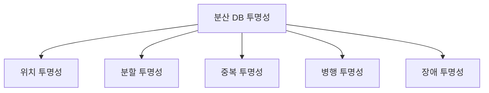

# 분산 데이터베이스의 5가지 투명성(Transparency)

## 1. 개요

### 가. 정의
> **분산 데이터베이스**는 물리적으로 여러 site에 분산된 데이터를 사용자에게 **논리적으로 하나의 DB처럼** 보이게 하는 시스템. 이 '숨김'의 정도를 **투명성**이라 한다.

### 나. 필요성
- 사용자가 분산 위치·중복·구조를 **의식하지 않고** 접근하도록 지원

## 2. 5가지 투명성

| 투명성 | 설명 |
|---|---|
| **위치 투명성(Location)** | 데이터의 물리적 위치를 몰라도 접근 가능 |
| **분할 투명성(Fragmentation)** | 데이터가 여러 조각으로 분할됨을 의식하지 않음 |
| **중복 투명성(Replication)** | 복제본 존재·개수를 몰라도 일관되게 접근 |
| **병행 투명성(Concurrency)** | 동시 트랜잭션이 간섭 없이 수행되는 것처럼 보장 |
| **장애 투명성(Failure)** | 일부 site 장애에도 트랜잭션 원자성·일관성 유지 |

## 3. 관련 기술

| 투명성 | 지원 기술 |
|---|---|
| 위치·분할 | 전역 카탈로그, 분산 질의 처리 |
| 중복 | 복제 동기화, 일관성 프로토콜 |
| 병행 | 분산 잠금·2PL, 타임스탬프 |
| 장애 | **2단계 커밋(2PC)**, 로그·복구 |

## 4. 장단점

| 장점 | 단점 |
|---|---|
| 가용성·확장성·지역성 | 설계·관리 복잡 |
| 투명한 접근 편의 | 동기화·일관성 비용, 통신 오버헤드 |

## 5. 고려사항 및 시사점
- **CAP 정리**에 따라 일관성·가용성 트레이드오프 선택
- NewSQL·글로벌 분산DB(Spanner)·NoSQL로 발전
- 분산 트랜잭션 일관성(2PC·Saga)과 성능 균형

---

> **한 줄 요약**: 분산 DB의 투명성은 *위치·분할·중복·병행·장애* 5가지로, 분산·복제·동시성·장애를 사용자에게 숨겨 하나의 DB처럼 보이게 하며 2PC·복제 동기화 등으로 구현된다.
