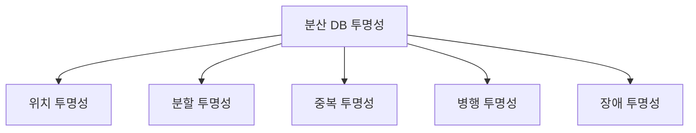

# 분산 데이터베이스의 5가지 투명성(Transparency)

## 1. 개요

### 가. 정의
> **분산 데이터베이스(DDB)** 는 물리적으로 여러 사이트(site)에 나뉘어 저장·관리되는 데이터를, 사용자에게는 **논리적으로 하나의 통합된 DB처럼** 보이게 하는 시스템이다. 이때 "분산되어 있다는 사실을 사용자에게서 얼마나 감추는가"의 정도를 **투명성(Transparency)** 이라 한다.

투명성의 본질은 **복잡성의 은닉(abstraction)** 이다. 데이터가 실제로 어디에 있고, 몇 조각으로 나뉘었으며, 복제본이 몇 개인지는 시스템 내부의 사정일 뿐, 사용자는 단일 DB에 질의하듯 SQL 한 줄만 던지면 된다. 분산의 세부를 몰라도 되므로 응용 개발이 단순해지고, 데이터 배치가 바뀌어도 응용을 고치지 않아도 되는 **위치 독립성**이 확보된다.

### 나. 등장 배경 및 필요성
데이터가 특정 서버 한 대에 집중되면 그 서버가 곧 병목이자 단일 장애점(SPOF)이 되고, 지리적으로 떨어진 사용자는 원거리 접근으로 지연을 겪는다. 이를 해결하려면 데이터를 **여러 지역·노드에 분산·복제**해야 하지만, 그러면 응용이 "어느 노드에 접속해 어느 복제본을 읽을지"를 일일이 신경 써야 하는 부담이 생긴다. 투명성은 바로 이 부담을 시스템이 대신 떠안아, 분산의 이점(가용성·확장성·지역성)은 취하면서도 사용자에게는 **단일 DB의 단순함**을 유지시키기 위해 필요하다.

## 2. 5가지 투명성

다섯 투명성은 각각 "사용자에게서 무엇을 숨기는가"가 다르다. 앞의 셋(위치·분할·중복)은 **데이터 배치**를 숨기고, 뒤의 둘(병행·장애)은 **동시성과 신뢰성**을 보장한다.

- **위치 투명성(Location)**: 데이터가 물리적으로 어느 사이트에 저장돼 있는지 몰라도 접근할 수 있다. 시스템이 **전역 카탈로그(global catalog)** 를 참조해 질의를 해당 노드로 라우팅한다. 예컨대 서울·부산 두 데이터센터에 회원 정보가 나뉘어 있어도 응용은 `SELECT * FROM member`만 실행하면 된다.
- **분할 투명성(Fragmentation)**: 하나의 테이블이 여러 조각(fragment)으로 쪼개져 저장된 사실을 의식하지 않는다. **수평 분할**(행 단위, 예: 지역별 주문)과 **수직 분할**(열 단위)이 있으며, 시스템이 조각들을 재조합해 온전한 결과를 돌려준다.
- **중복 투명성(Replication)**: 같은 데이터의 복제본이 여러 개 존재하고 갱신 시 이를 동기화해야 하는 사실을 사용자가 몰라도 된다. 사용자는 하나의 데이터를 다루는 것처럼 보이지만 내부적으로는 복제본 간 **일관성 프로토콜**이 작동한다.
- **병행 투명성(Concurrency)**: 여러 사이트에서 다수 트랜잭션이 동시에 실행돼도, 마치 혼자 순차적으로 수행한 것과 같은 **직렬성(serializability)** 이 보장된다. 분산 잠금·타임스탬프로 상호 간섭을 차단한다.
- **장애 투명성(Failure)**: 일부 사이트나 통신 링크에 장애가 나도 트랜잭션의 **원자성(All-or-Nothing)과 일관성**이 유지된다. 부분 실패가 전체를 오염시키지 않도록 커밋을 조율한다.

| 투명성 | 숨기는 대상 | 핵심 효과 |
|---|---|---|
| **위치** | 물리적 저장 위치 | 위치 독립성 |
| **분할** | 데이터 조각화 | 통합 뷰 제공 |
| **중복** | 복제본 존재·개수 | 일관된 단일 뷰 |
| **병행** | 동시 실행 간섭 | 직렬성 보장 |
| **장애** | 부분 장애 | 원자성·복구 |

## 3. 관련 구현 기술

각 투명성은 저절로 얻어지지 않고, 아래처럼 상응하는 분산 처리 기술로 뒷받침된다. 특히 장애 투명성의 핵심인 **2단계 커밋(2PC)** 은 조정자(coordinator)가 모든 참여 사이트에 '준비(prepare)'를 물어 전원이 동의할 때만 '커밋'을 지시함으로써, 일부 노드만 커밋되는 부분 반영을 막아 원자성을 보장한다. 다만 2PC는 조정자가 죽으면 참여자들이 대기 상태에 묶이는 **블로킹(blocking)** 약점이 있어, 최근에는 이를 완화한 3PC나 합의 알고리즘(Paxos·Raft), 보상 트랜잭션 기반의 Saga가 함께 쓰인다.

| 투명성 | 지원 기술 |
|---|---|
| 위치·분할 | 전역 카탈로그, 분산 질의 처리·최적화 |
| 중복 | 복제 동기화, 일관성 프로토콜(동기·비동기) |
| 병행 | 분산 잠금·2PL, 타임스탬프 순서화 |
| 장애 | **2단계 커밋(2PC)**·3PC, 로그 기반 복구 |

## 4. 장단점

투명성이 높을수록 사용 편의는 커지지만, 그 편의를 시스템이 대신 감당하는 만큼 내부 비용이 늘어난다. 예를 들어 중복 투명성을 완전히 보장하려면 모든 복제본을 즉시 동기화해야 하는데(동기 복제), 이는 갱신 지연과 통신 오버헤드를 키운다. 반대로 성능을 위해 비동기 복제를 쓰면 일시적으로 복제본 간 값이 달라져 일관성이 흔들린다. 이처럼 **투명성·일관성·성능은 서로 당기는 관계**다.

| 장점 | 단점 |
|---|---|
| 가용성·확장성·데이터 지역성 확보 | 설계·운영 복잡도 증가 |
| 투명한 접근으로 응용 단순화 | 동기화·일관성 유지 비용, 통신 오버헤드 |

## 5. 고려사항 및 시사점
- **CAP 정리의 트레이드오프**: 네트워크 분단(P)은 피할 수 없으므로, 분산 시스템은 **일관성(C)** 과 **가용성(A)** 중 무엇을 우선할지 선택해야 한다. 금융처럼 정합성이 중요하면 C, 대규모 서비스처럼 무중단이 중요하면 A를 택하는 식이다.
- **일관성 모델 선택**: 강한 일관성(2PC) 대신 **최종 일관성(eventual consistency)** 을 허용하면 성능·가용성을 얻는 대신 순간적 불일치를 감수한다. 요구사항에 맞는 수준을 정해야 한다.
- **연계·전망**: 구글 Spanner·CockroachDB 같은 **NewSQL/글로벌 분산DB** 는 TrueTime·합의 알고리즘으로 강한 일관성과 확장성을 동시에 추구하며, NoSQL은 가용성 중심으로 발전해 왔다. 분산 트랜잭션은 2PC와 Saga를 상황에 맞게 조합해 일관성과 성능의 균형을 잡는 것이 실무의 핵심이다.

---

> **한 줄 요약**: 분산 DB의 투명성은 *위치·분할·중복·병행·장애* 5가지로, 분산·복제·동시성·부분장애를 사용자에게 숨겨 하나의 DB처럼 보이게 하며, 전역 카탈로그·복제 동기화·분산 잠금·2PC 등으로 구현되되 CAP·일관성 트레이드오프 속에서 성능과 균형을 맞춰야 한다.
