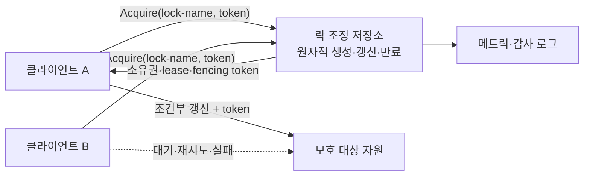
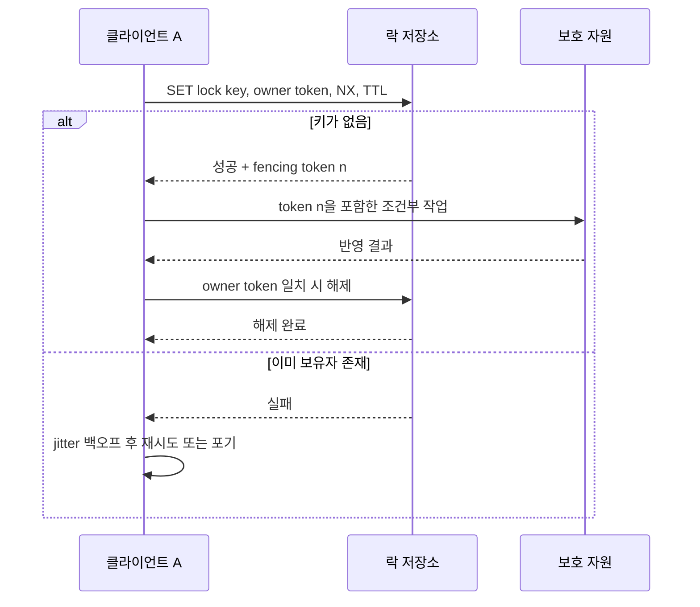

# 분산 락(Distributed Lock)

## 1. 개요

> **정의**: 분산 락(Distributed Lock)은 여러 서버·프로세스·컨테이너가 공유 자원이나 임계구역을 동시에 변경하지 않도록, 네트워크로 연결된 참여자 사이에서 상호 배제와 소유권을 조정하는 제어 기법이다.

단일 프로세스 안에서는 뮤텍스나 세마포어가 공유 메모리의 원자적 명령으로 임계구역을 보호한다. 그러나 서비스가 수평 확장되면 요청을 처리하는 인스턴스가 여러 대가 되고, 각 인스턴스의 메모리에 둔 락은 다른 인스턴스가 볼 수 없다. 이때 재고 차감, 중복 배치 실행, 동일 파일 생성, 스케줄러 리더 선출처럼 "한 시점에 한 주체만 수행"되어야 하는 작업은 네트워크를 사이에 둔 조정이 필요하다.

분산 락은 단순히 키 하나를 저장하는 기능이 아니다. 락을 획득한 주체가 정상적으로 종료하지 않을 수 있고, 네트워크가 분리될 수 있으며, 응답이 늦어져 주체가 자신의 락이 이미 만료된 사실을 모를 수 있다. 따라서 상호 배제(mutual exclusion)만 정의하면 부족하고, 대기 중인 주체가 언젠가 진행하는 생존성(liveness), 장애 후 자동 회복, 잘못된 소유자가 늦게 작업을 완료해도 데이터를 오염시키지 않는 안전성(safety)을 함께 설계해야 한다.

예를 들어 주문 서비스의 재고가 1개 남은 상황에서 두 인스턴스가 동시에 차감하면, 각 인스턴스가 같은 잔여 재고를 읽고 모두 성공 처리할 수 있다. 분산 락은 이 경쟁을 직렬화하지만, 락을 사용한다고 해서 데이터베이스의 조건부 갱신·트랜잭션·제약조건이 불필요해지는 것은 아니다. 락은 경합을 줄이는 조정 장치이고, 최종 정합성은 원장 데이터의 원자적 검증이 보장해야 한다.

기술사 답안에서는 "어떤 저장소를 락 서비스로 선택했는가"보다 먼저 보호 대상, 락 범위, 소유권 수명, 장애 모델, 정합성 요구사항을 명시하는 것이 중요하다. 작업이 짧고 데이터베이스 한 곳에서 원자적으로 처리된다면 조건부 UPDATE가 더 단순하고 강하다. 반대로 여러 자원이나 외부 시스템을 조율해야 한다면 임대(lease), 펜싱 토큰(fencing token), 재시도와 관측성을 포함한 분산 락 설계가 필요하다.

- **상호 배제**: 같은 락 이름에 대해 허용된 소유자는 한 시점에 하나여야 한다.
- **소유권 식별**: 획득 주체를 임의의 고유 토큰으로 식별하여 다른 주체의 락을 해제하지 않게 한다.
- **자동 회복**: 소유자가 장애를 일으켜도 TTL·세션·임대 만료로 영구 교착을 피한다.
- **업무 정합성 연계**: 락 획득만으로 완료를 선언하지 않고, 조건부 갱신·펜싱·트랜잭션으로 늦은 작업을 차단한다.

## 2. 전체 구조와 구성요소

분산 락 시스템은 클라이언트, 락 조정 저장소, 보호 대상 자원으로 나누어 보는 것이 출발점이다. 클라이언트는 락을 획득한 뒤 임계구역을 실행하고 해제하지만, 락의 실제 소유권과 만료 정보는 모든 클라이언트가 관찰할 수 있는 일관된 저장소에 둔다. 이 저장소는 관계형 데이터베이스, 강한 일관성의 코디네이터, 인메모리 키-값 저장소 등으로 구현할 수 있다.



**락 이름(lock key)** 은 보호할 논리 자원을 식별한다. `inventory:item:1234`, `job:daily-settlement:2026-09-16`, `file:report.csv`처럼 업무 단위가 드러나도록 설계하되, 너무 넓은 전역 락은 불필요한 직렬화를 일으킨다. 반대로 키가 지나치게 세분화되면 같은 업무의 여러 단계가 서로 다른 락을 사용하여 보호 범위를 놓칠 수 있다.

**소유자 토큰(owner token)** 은 락을 얻을 때 난수나 UUID로 발급한다. 해제 요청에는 이 토큰을 함께 보내고, 저장된 토큰과 일치할 때만 삭제한다. 단순히 `DEL lock-key`를 실행하면 이전 소유자의 작업이 늦어진 사이 새 소유자가 락을 얻은 뒤, 이전 소유자가 새 소유자의 락까지 지우는 사고가 발생한다. 소유자 검증은 해제 연산의 기본 안전장치다.

**임대(lease)와 TTL** 은 락의 유효기간을 표현한다. 프로세스가 죽거나 네트워크가 끊겨 해제 요청을 보내지 못해도 만료 후 다른 주체가 진행할 수 있게 한다. 다만 TTL은 작업이 끝난다는 보장이 아니라 "소유권을 주장할 수 있는 시간의 상한"이다. 작업이 TTL보다 오래 걸리면 갱신(renewal)이 필요하고, 갱신이 실패하면 즉시 임계구역을 중단하거나 결과 반영을 펜싱으로 거부해야 한다.

**펜싱 토큰(fencing token)** 은 락을 획득할 때마다 증가하는 단조 증가 번호다. 보호 대상 자원은 요청에 포함된 토큰이 마지막으로 처리한 토큰보다 큰 경우에만 반영한다. 이 장치는 네트워크 지연으로 과거 소유자가 늦게 도착하는 "좀비 클라이언트" 문제를 해결한다. TTL만 있는 락은 만료 시점의 클라이언트가 계속 실행될 수 있으므로, 외부 저장소가 토큰을 검사하지 않으면 상호 배제의 직관이 실제 데이터 안전성으로 이어지지 않는다.

## 3. 획득·유지·해제 프로토콜

### 가. 락 획득

획득 과정은 먼저 충돌 모델을 정의하는 데서 시작한다. 클라이언트는 고유한 소유자 토큰을 만들고, 조정 저장소에 "키가 없을 때만 생성"하는 원자 연산을 요청한다. 성공하면 임대 만료 시각과 필요할 경우 펜싱 토큰을 함께 얻는다. 실패하면 무한 반복하지 않고 백오프와 최대 대기시간을 적용한다.



원자성은 "확인한 다음 저장"을 하나의 논리 연산으로 묶는다는 뜻이다. 먼저 `EXISTS`를 호출하고 이후 `SET`을 수행하면 두 클라이언트가 동시에 없음을 관찰하여 모두 저장하는 경쟁 조건이 생긴다. 데이터베이스의 유니크 제약과 INSERT, 조정기의 compare-and-set(CAS), 키-값 저장소의 `SET NX`가 이 원자성을 제공한다.

획득 성공 후에는 반환된 결과를 기록해야 한다. 소유자 토큰, 획득 시각, 만료 시각, 펜싱 토큰, 요청·작업 ID를 로그에 남기면 락 경합과 장애 원인을 추적할 수 있다. 단순한 Boolean 성공 여부만 기록하면 "누가 오래 잡고 있었는가"와 "만료 후 늦은 요청이 있었는가"를 분석하기 어렵다.

재시도는 고정 간격보다 지수 백오프와 무작위 지터(jitter)를 조합하는 편이 안전하다. 모든 대기자가 같은 시점에 다시 요청하면 저장소에 thundering herd가 발생하고, 락이 풀릴 때 또 다른 경합 폭발이 일어난다. 대기시간 상한과 업무의 중복 허용 여부를 정해, 락을 얻지 못하면 큐에 넣거나 사용자에게 재처리를 반환하는 대안도 마련한다.

### 나. 락 유지와 갱신

임대 갱신은 TTL을 무조건 늘리는 작업이 아니다. 클라이언트가 아직 살아 있고 해당 토큰을 보유하고 있는지 원자적으로 확인한 뒤, 남은 임대가 임계값보다 짧을 때만 갱신해야 한다. 갱신 응답이 지연되거나 타임아웃이면 성공으로 간주하지 말고, 보호 자원에 대한 추가 쓰기를 중단하는 보수적 정책이 안전하다.

작업 예상 시간이 짧고 변동성이 낮다면 TTL을 작업 시간보다 충분히 길게 잡을 수 있다. 하지만 너무 긴 TTL은 장애 후 회복을 늦추고, 너무 짧은 TTL은 정상 작업을 좀비 작업으로 만들 가능성을 높인다. 따라서 평균 시간이 아니라 p99·p999 지연, GC pause, 컨테이너 스케줄링 지연, 네트워크 왕복시간을 포함하여 임대 예산을 계산한다.

갱신 스레드가 작업 스레드와 분리되어 있으면 작업이 중지된 뒤에도 갱신하는 오류가 생길 수 있다. 작업 취소·타임아웃·프로세스 종료 신호를 받으면 갱신을 먼저 멈추고, 신규 I/O를 차단한 다음 정리 절차를 수행한다. 갱신 실패를 감지한 뒤에도 이미 발행한 비동기 작업이 남아 있을 수 있으므로, 큐·DB·외부 API의 결과 반영 단계에 펜싱 또는 멱등 키를 둔다.

### 다. 락 해제

정상 해제는 소유자 검증과 삭제를 하나의 원자 연산으로 수행한다. Redis라면 토큰을 비교한 뒤 삭제하는 Lua 스크립트, 관계형 DB라면 `WHERE lock_name = ? AND owner_token = ?` 조건의 DELETE를 사용할 수 있다. 비교와 삭제가 분리되면 확인 직후 TTL 만료와 신규 획득이 끼어들 수 있다.

해제 요청의 타임아웃은 실제 해제 성공 여부와 다르다. 클라이언트가 타임아웃을 받고 재시도하더라도 토큰 검증이 멱등적이면 안전하게 실패나 성공을 재확인할 수 있다. 반대로 해제 응답이 없다고 새 락을 강제로 지우면 현재 소유자의 작업을 훼손할 수 있다. 만료를 기다리거나 관리자용 강제 해제 절차를 별도로 통제해야 한다.

업무 커밋과 락 해제 순서도 중요하다. 데이터베이스 트랜잭션이 커밋되기 전에 락을 놓으면 다른 주체가 같은 자원을 읽고 중복 작업을 시작할 수 있다. 일반적으로 보호 데이터 커밋을 완료하고 외부 부작용의 상태를 기록한 뒤 락을 해제하지만, 외부 API 호출이 포함되면 보상·아웃박스·멱등 처리까지 함께 설계해야 한다.

## 4. 구현 방식과 동작 원리

### 가. 관계형 데이터베이스 기반 락

관계형 데이터베이스는 이미 트랜잭션·로그·장애 복구·유니크 제약을 제공하므로, 업무 데이터와 락의 수명이 같은 경우 가장 먼저 검토할 수 있다. 락 테이블에 `lock_name`을 기본키로 두고 INSERT가 성공한 한 트랜잭션만 소유권을 얻도록 하면 경쟁자 사이의 상호 배제를 데이터베이스가 판정한다.

```sql
CREATE TABLE distributed_lock (
  lock_name    VARCHAR(200) PRIMARY KEY,
  owner_token  VARCHAR(100) NOT NULL,
  fencing_seq  BIGINT NOT NULL,
  lease_until  TIMESTAMP NOT NULL,
  updated_at   TIMESTAMP NOT NULL
);
```

INSERT 또는 조건부 UPDATE의 성공 여부만 믿지 말고, 데이터베이스 시계와 애플리케이션 시계의 차이를 고려해야 한다. 애플리케이션이 계산한 만료 시각을 저장하면 시계가 크게 어긋난 서버가 아직 유효한 락을 만료된 것으로 판단할 수 있다. 가능하면 데이터베이스의 단조 증가 값·트랜잭션 시간·서버 측 조건식을 활용하고, 시간 기반 판단의 허용 오차를 명시한다.

행 잠금과 advisory lock은 서로 다른 성격을 가진다. 행 잠금은 트랜잭션이 끝나면 자동으로 풀리고 DB 내부 행과 직접 결합되지만, 장시간 외부 호출을 트랜잭션 안에 두면 커넥션과 잠금이 오래 점유된다. advisory lock은 애플리케이션이 정한 키에 대한 협력적 락이라서 편리하지만, 모든 참여자가 같은 규칙을 지켜야 하며 DB 세션 단절·커넥션 풀 재사용의 의미를 확인해야 한다.

데이터베이스 기반 락의 장점은 보호 데이터와 락 획득을 같은 트랜잭션으로 묶을 수 있다는 점이다. 재고 차감처럼 한 행에 조건부 UPDATE로 완료되는 작업은 별도 분산 락보다 `UPDATE inventory SET quantity = quantity - 1 WHERE id = ? AND quantity > 0`가 더 직접적인 정합성 수단이다. 반면 락 획득 경쟁이 매우 크면 업무 DB가 락 서버 역할까지 맡아 병목이 될 수 있다.

### 나. 인메모리 키-값 저장소 기반 락

Redis 계열 저장소는 낮은 지연의 원자 명령과 TTL을 제공해 짧은 임계구역의 락에 자주 사용된다. 기본 패턴은 난수 토큰과 함께 `SET resource token NX PX ttl`을 실행하는 것이다. `NX`는 키가 없을 때만 저장하고 `PX`는 자동 만료 시간을 붙여, 별도의 확인·저장 경쟁과 무한 점유를 줄인다.

해제는 반드시 소유자 토큰을 비교해야 한다. 의사 코드는 다음과 같다.

```text
if GET(resource) == my_token:
    DEL(resource)
```

그러나 위 두 줄을 각각 네트워크 명령으로 보내면 비교와 삭제 사이의 경쟁이 재발한다. 따라서 저장소 내부 스크립트나 CAS를 사용해 다음을 하나의 원자 연산으로 만든다.

```text
if value(resource) == my_token then
    delete(resource)
    return 1
else
    return 0
end
```

단일 Redis 인스턴스 기반 락은 구현이 단순하지만, 인스턴스 장애·복제 지연·failover 시점의 데이터 손실을 장애 모델에 포함해야 한다. 락의 실패가 중복 결제나 데이터 손상으로 이어지는 업무라면 Redis TTL만으로 강한 보장을 주장하지 말고, DB 제약·펜싱 토큰·업무 멱등성을 결합한다. Redis 클러스터의 샤딩은 서로 다른 키를 원자적으로 묶지 못할 수 있으므로 락 키 분포와 명령 범위를 확인한다.

여러 독립 Redis 노드에 락을 복제해 가용성을 높이는 알고리즘은 시계 정확도, 네트워크 지연, 장애 중복, 과반 획득 조건 등 강한 전제를 요구한다. 특히 클라이언트가 임대 만료 뒤에도 멈추지 않고 실행할 수 있다는 문제는 다중 노드 수만 늘린다고 해결되지 않는다. 고위험 자원은 클라이언트가 받은 락 결과를 최종 권위로 보지 않고, 자원 측에서 fencing token을 검사하도록 설계한다.

### 다. 합의 기반 코디네이터

ZooKeeper, etcd, Consul처럼 합의 프로토콜과 세션·watch를 제공하는 코디네이터는 임시 노드(ephemeral node), 세션 만료, 순차 노드, compare-and-swap을 통해 강한 조정 기능을 제공한다. 클라이언트가 세션을 잃으면 임시 노드가 사라지고 대기자는 변경 알림을 받아 다시 시도할 수 있다. 이는 단순 키-값 저장보다 락의 생명주기와 장애 감지를 명시적으로 표현하기 쉽다.

다만 watch 이벤트는 "이제 내 차례"라는 확정 통지가 아니다. 이벤트를 받은 뒤 실제로 키를 다시 조회하고, 자신의 조건이 여전히 성립하는지 확인해야 한다. 모든 클라이언트가 한 노드를 감시하면 이벤트 폭풍이 생길 수 있으므로, 순차 노드에서 바로 앞의 선행자만 감시하는 herd-effect 완화 패턴을 사용한다.

합의 기반 저장소도 무한히 빠른 락 서버는 아니다. 합의 로그와 quorum 통신은 일관성을 제공하는 대신 네트워크 왕복과 운영 복잡도를 요구한다. 멤버 수, quorum, 디스크 지연, 스냅샷·로그 보존, 인증서 갱신, 리더 장애 전환을 관리해야 하며, 데이터베이스나 Redis를 단순히 하나 더 설치하는 방식으로 접근하면 안 된다.

## 5. 안전성·생존성·공정성

분산 락의 품질은 다음 세 축으로 나누어 평가한다. **안전성**은 동시에 둘 이상의 유효 소유자가 보호 작업을 수행하지 않는 성질이고, **생존성**은 장애가 지나간 뒤 언젠가 새 소유자가 진행할 수 있는 성질이다. **공정성**은 특정 클라이언트가 계속 기회를 빼앗기지 않고 대기 순서를 예측할 수 있는 성질이다.

안전성은 저장소의 원자적 획득만으로 완성되지 않는다. TTL 만료 뒤에도 실행 중인 클라이언트, 네트워크 파티션, 응답 재전송, 프로세스 일시정지 같은 상황에서 이전 주체가 자원에 쓰지 못해야 한다. 따라서 보호 대상이 펜싱 번호를 비교하거나, 작업 자체가 멱등적이고 조건부인지를 검토한다.

생존성은 임대 만료, 세션 단절, 클라이언트 취소로 확보한다. 그러나 만료 시간을 너무 짧게 잡으면 일시적인 지연에도 락이 재할당되어 두 주체가 겹칠 수 있다. 반대로 너무 길면 장애 복구가 늦어진다. 안전성과 생존성 사이의 선택을 SLA와 장애 예산에 맞춰 명시한다.

공정성은 필요에 따라 FIFO 큐나 순차 노드로 구현한다. 공정성을 보장하지 않는 비차단 재시도 방식은 처리량은 높지만 특정 클라이언트가 계속 실패할 수 있다. 배치 작업에는 공정한 대기가 중요할 수 있지만, 사용자 요청의 짧은 임계구역에는 대기열보다 즉시 실패 후 상위 큐로 넘기는 것이 더 적절할 수 있다.

| 평가축 | 질문 | 대표 설계 수단 | 실패 시 영향 |
|---|---|---|---|
| 안전성 | 두 주체가 함께 반영하지 않는가? | 원자적 획득, 소유자 토큰, fencing | 중복 처리·데이터 손상 |
| 생존성 | 장애 후 락이 풀리는가? | TTL, 세션, 취소·복구 | 영구 교착·처리 지연 |
| 공정성 | 특정 주체가 굶지 않는가? | FIFO, 순차 큐, 지터 조정 | starvation·불예측 지연 |
| 관측성 | 원인을 추적할 수 있는가? | holder·age·wait·renew 지표 | 장애 분석 불가 |

## 6. 비교와 적용 사례

### 가. 분산 락과 대체 정합성 기법 비교

분산 락은 여러 요청을 잠시 직렬화하는 방식이다. 반면 낙관적 동시성 제어는 버전 번호나 조건부 갱신으로 충돌을 감지하고 실패한 요청을 재시도한다. 경쟁이 낮고 충돌 복구가 쉬운 경우에는 낙관적 방식이 락 대기보다 처리량이 좋다. 충돌 비용이 크고 외부 부작용을 되돌리기 어렵다면 락이나 큐가 더 적합할 수 있다.

메시지 큐의 단일 소비자 파티션은 특정 키의 순서를 보장하여 분산 락의 필요를 줄인다. 그러나 소비자 장애·리밸런싱·다중 파티션 간 작업에는 별도의 멱등성과 진행 상태 설계가 필요하다. 데이터베이스의 유니크 키는 중복 생성을 막지만, 여러 자원이나 외부 시스템의 실행 순서를 조정하는 일반 락을 대체하지는 못한다.

| 기법 | 충돌 처리 | 강점 | 한계·적합 상황 |
|---|---|---|---|
| 분산 락 | 실행 전 선점 | 직관적 직렬화, 외부 작업 조정 | TTL·좀비·저장소 장애를 설계해야 함 |
| 조건부 갱신 | 커밋 시 검증 | DB 정합성과 직접 결합 | 충돌 재시도·외부 부작용에 약함 |
| 메시지 큐 파티션 | 키별 순서화 | 비동기 처리·재처리 | 파티션 설계와 중복 소비 필요 |
| 단일 리더/스케줄러 | 리더가 작업 수행 | 배치에 단순 | 리더 전환·작업 분할 필요 |
| 사가·보상 | 단계별 확정·취소 | 장시간 분산 업무 | 보상 로직과 중간 상태 복잡성 |

차이가 생기는 이유는 "누가 충돌을 통제하는가"에 있다. 락은 실행 전에 경쟁자를 막고, 낙관적 방식은 실행 후 버전 충돌을 발견하며, 큐는 순서가 있는 처리 흐름으로 경쟁을 흡수한다. 그러므로 답안에는 락을 만능 해법으로 쓰지 말고 보호 자원의 특성과 부작용을 근거로 선택한다고 서술해야 한다.

### 나. 사례 1: 중복 배치와 리더 선출

여러 애플리케이션 인스턴스가 매일 정산 배치를 실행하는 환경에서는 스케줄러가 모든 인스턴스에서 깨어날 수 있다. `job:settlement:date` 락을 획득한 한 인스턴스만 작업을 시작하게 하면 중복 실행을 줄일 수 있다. 다만 작업이 긴 경우에는 갱신 실패 시 중단하고, 완료 마커를 날짜별 유니크 키로 기록해 재시작도 멱등적으로 만든다.

리더 선출과 분산 락은 유사하지만 동일하지 않다. 리더는 장시간 책임을 가지며 구성원 변화와 리더 장애 전환을 지속적으로 처리해야 한다. 단발성 배치는 임대 락이 적합할 수 있지만, 클러스터 제어 평면처럼 리더가 모든 상태 변경을 책임지는 경우에는 합의 기반 선출과 fencing이 필요하다.

### 다. 사례 2: 재고 예약과 결제 연계

상품 재고 1개를 여러 주문이 동시에 예약하는 상황에서 상품별 락은 경쟁 구간을 줄일 수 있다. 그러나 결제 승인, 배송 API, 알림 서비스까지 락을 잡은 채 호출하면 외부 지연이 락 점유시간을 길게 만들고 장애 시 전체 처리량이 급락한다. 실무적으로는 DB 트랜잭션 안에서 재고를 조건부 차감하고, 결제·알림은 아웃박스와 상태 머신으로 분리하는 편이 강하다.

락을 사용하더라도 `quantity > 0` 조건과 주문 ID 유니크 제약을 유지해야 한다. 락 만료 후 늦은 인스턴스가 재고를 다시 차감하지 않도록 주문 상태 전이와 버전 검사를 포함한다. 이 사례는 락이 데이터베이스의 정합성 제약을 대신하지 않고, 경합 폭을 줄이는 보조 계층임을 보여준다.

### 라. 사례 3: 파일 생성과 공유 스토리지

여러 워커가 같은 리포트 파일을 생성하는 시스템에서는 `report:tenant:period` 락을 이용해 중복 계산을 줄일 수 있다. 하지만 파일 쓰기 도중 락이 만료되면 두 워커가 같은 경로를 덮을 수 있다. 임시 파일에 쓰고 fsync·검증을 수행한 후 원자적 rename을 하며, 메타데이터 저장소에 작업 버전과 생성자 토큰을 기록하는 방식이 더 안전하다.

공유 파일 시스템이나 오브젝트 스토리지는 락 저장소와 별개의 장애 모델을 가진다. 락을 얻었다는 사실만으로 파일 시스템의 가시성·내구성·조건부 생성이 보장되지 않으므로, 객체의 If-None-Match, 버전 ID, 완료 마커와 같은 자원 측 조건을 함께 사용한다. 대용량 생성물은 락보다 작업 큐와 중복 제거 키가 적합할 수 있다.

## 7. 심화: 임대 만료와 펜싱 토큰의 관계

분산 락에서 가장 위험한 오해는 "TTL이 끝났으니 이전 작업도 끝났다"고 가정하는 것이다. 프로세스는 중지 신호를 받았지만 커널 스케줄러에 의해 잠시 실행되지 않을 수 있고, 네트워크 응답은 지연된 뒤 도착할 수 있다. 이전 클라이언트가 락 저장소에서 소유권을 잃었음을 알지 못한 채 보호 자원에 쓰면, 새 클라이언트와 동시에 부작용이 발생한다.

펜싱 토큰은 이 문제를 자원 측에서 차단한다. 락 획득마다 `n`, `n+1`처럼 증가하는 번호를 발급하고, 보호 자원은 마지막으로 승인한 번호를 저장한다. 요청 토큰이 더 작으면 늦게 도착한 오래된 작업으로 보고 거부한다. 이 검사는 애플리케이션 코드의 if문에만 두지 말고 DB의 `WHERE version < :token`, 스토리지의 조건부 쓰기, 작업 큐의 세대 번호처럼 가능한 한 자원 가까이에 둔다.

토큰의 단조 증가는 임대 갱신과 구분한다. 동일 소유자가 TTL만 연장할 때 토큰을 매번 바꾸지 않아도 되지만, 소유권이 다른 클라이언트로 넘어갈 때는 반드시 더 큰 세대가 발급되어야 한다. 저장소 복구·스냅샷 복원으로 카운터가 뒤로 가지 않도록 영속 저장과 복구 절차를 검토하며, 토큰이 재사용되지 않는다는 불변조건을 문서화한다.

펜싱 토큰을 적용할 수 없는 외부 API도 있다. 이 경우 외부 호출의 멱등 키, 요청 만료 시각, 중복 감지 테이블, 보상 거래를 조합해 위험을 줄인다. 그래도 원자적 취소가 불가능한 결제·송금 같은 작업은 분산 락만으로 정확한 한 번 처리를 약속하지 않고, 결제 사업자의 멱등 키와 사후 대사 프로세스를 정합성의 최종 방어선으로 삼는다.

## 8. 고려사항 및 시사점

- **보호 범위와 키 설계**: 전역 락·테넌트 락·자원별 락을 업무 경합 그래프로 분석하여 필요한 범위만 잠근다. 락 키에 버전·테넌트·기간을 포함하되, 서로 다른 서비스가 같은 논리 자원을 다른 이름으로 부르지 않도록 공통 명명 규칙과 소유 팀을 정한다.
- **장애 모델의 명시**: 저장소 장애, 네트워크 분할, 프로세스 정지, GC pause, 시간 오차, 재시작·스냅샷 복원을 목록화한다. 각 장애에서 안전성을 우선할지 가용성을 우선할지 결정하고, 설계 가정이 깨질 때 fail-closed·fail-open 중 어떤 동작을 할지 답안과 운영 런북에 남긴다.
- **TTL·갱신 예산**: p99 작업시간과 최대 일시정지를 바탕으로 TTL을 계산하고, 갱신 실패를 즉시 업무 실패로 전파한다. 만료·갱신 지연·장기 보유를 메트릭으로 수집하고, 락 보유시간에 상한을 둬 장애가 장시간 전파되지 않게 한다.
- **좀비 방지와 정합성**: 소유자 토큰 검증 해제, fencing token, DB 조건부 갱신, 멱등 키를 함께 적용한다. 락 획득 성공을 업무 성공으로 기록하지 말고, 보호 자원의 커밋 결과와 대사 상태를 별도로 관리한다.
- **성능과 비용**: 락 서버의 왕복시간, 경합률, 대기열 길이, 저장소 quorum 지연을 SLA에 반영한다. 고빈도·초단기 작업은 락 서버 호출 자체가 병목이 될 수 있으므로 로컬 배치·키 파티션·큐 직렬화·낙관적 검증을 비교한다.
- **운영·보안**: 락 저장소의 인증·암호화·네트워크 격리·백업 정책을 업무 데이터 수준으로 보호한다. 관리자 강제 해제는 승인·사유·만료·감사 로그를 요구하고, 임의 키 삭제를 표준 장애 대응으로 허용하지 않는다.
- **테스트와 검증**: 정상 경합뿐 아니라 TTL 직전 중지, 응답 지연, 저장소 failover, 네트워크 분할, 재시도 중복, 시계 오차를 주입한다. 핵심 불변조건인 "낮은 펜싱 토큰이 높은 토큰 이후 반영되지 않음"을 자동 검증하고, 장애 주입 결과를 복구 시간과 함께 기록한다.
- **기술 선택의 시사점**: 단일 DB 트랜잭션으로 끝나는 작업은 조건부 갱신을 우선하고, 장시간 다중 시스템 업무는 사가·아웃박스·큐와 결합한다. 고위험 공유 자원은 합의 기반 코디네이터와 fencing을 검토하되, 복잡성이 늘어나는 만큼 운영 역량과 비용을 함께 평가한다.

## 참고자료

- Redis Documentation, "Distributed Locks with Redis": https://redis.io/docs/latest/develop/clients/patterns/distributed-locks/
- Martin Kleppmann, "How to do distributed locking": https://martin.kleppmann.com/2016/02/08/how-to-do-distributed-locking.html
- PostgreSQL Documentation, "Explicit Locking": https://www.postgresql.org/docs/current/explicit-locking.html
- Apache ZooKeeper Documentation, "Locks": https://zookeeper.apache.org/doc/current/recipes.html#Locks
- etcd Documentation, "Concurrency API": https://etcd.io/docs/v3.6/dev-guide/api_concurrency_reference_v3/

---

> **한 줄 요약**: 분산 락은 네트워크 너머의 임계구역을 직렬화하는 수단이지만 TTL만으로 안전성이 완성되지 않으므로, 원자적 소유권·장애 회복·펜싱 토큰·조건부 갱신·멱등성을 함께 설계해야 한다.
