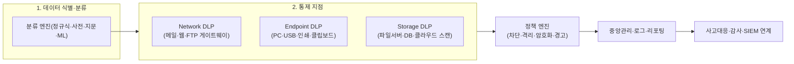
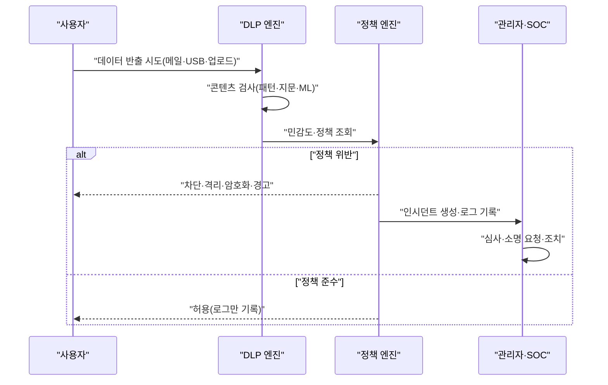

# DLP(Data Loss Prevention, 데이터 유출 방지)

## 1. 개요

### 가. 정의 및 등장 배경
> **DLP**는 조직이 보유한 **민감·기밀 데이터의 이동을 콘텐츠 기반으로 식별·감시·차단**하여, 정책에 위배되는 저장(at rest)·전송(in motion)·사용(in use)을 사전에 통제함으로써 **의도적 유출과 부주의에 의한 노출을 함께 방지**하는 보안 체계이다.

DLP가 등장한 근본 배경은 '**지켜야 할 자산이 성(城)의 담장 안이 아니라 데이터 그 자체로 옮겨갔다**'는 인식의 전환이다. 전통적 경계 보안(방화벽·IPS)은 외부에서 안으로 들어오는 침입을 막는 데 초점이 맞춰져 있었으나, 정작 사고의 상당수는 정당한 접근 권한을 가진 내부자가 데이터를 밖으로 내보내면서 발생한다. 퇴직 예정 직원이 고객 명단을 개인 메일로 보내거나, 개발자가 소스코드를 USB에 복사하거나, 담당자가 주민등록번호가 든 엑셀을 실수로 외부 협력사에 첨부하는 상황은 경계 보안으로는 막을 수 없다. 이런 유출은 '**나가는 방향(egress)**'에서, 그것도 '**데이터의 내용(content)을 이해해야만**' 판단할 수 있기 때문이다. DLP는 바로 이 지점 — 데이터가 조직의 통제 밖으로 빠져나가는 모든 경로에서 그 내용을 검사하고, 정책에 어긋나면 막는다는 발상에서 출발했다.

이런 위협의 심각성은 실제 사례에서 뚜렷하다. 국내외를 막론하고 대형 개인정보 유출 사고의 상당수는 외부 해킹이 아니라 정당한 접근 권한을 가진 내부자·협력사에 의해 발생했으며, 대량의 고객정보가 개인 저장매체나 메일을 통해 반출되는 형태가 반복되었다. 카드사 고객정보 대량 유출, 통신사·포털의 개인정보 노출 등 사회적 파장이 컸던 사건들은 공통적으로 '내부에서 데이터를 들고 나가는 경로'가 통제되지 않았다는 점을 드러냈고, 이는 경계 방어만으로는 데이터를 지킬 수 없다는 교훈을 남기며 DLP 도입을 가속했다.

또 하나의 배경은 **규제 압박**이다. 개인정보보호법과 GDPR은 개인정보 유출 시 통지·과징금을 규정하고, 신용정보법·전자금융감독규정은 금융권의 고객정보 통제를 강제한다. PCI-DSS는 카드번호(PAN)의 저장·전송을 엄격히 제한한다. 이처럼 '**어떤 데이터가 어디로 흘러가는지 조직이 입증할 수 있어야 한다**'는 요구가 DLP를 컴플라이언스 필수 통제로 끌어올렸다.

### 나. 필요성
내부자 위협의 상시화, 재택·클라우드 확산으로 인한 데이터 경계의 소멸, 그리고 개인정보·영업비밀 유출 시의 막대한 법적·평판 손실이 맞물리면서, 콘텐츠를 이해하고 이동을 통제하는 DLP는 데이터 중심 보안(Data-centric Security)의 핵심 축이 되었다. 특히 "무슨 데이터를 얼마나 보유하고 있으며 그것이 어디로 이동했는가"를 소명해야 하는 감사·사고대응 국면에서 DLP의 로그와 정책 이력은 대체 불가능한 근거가 된다.

## 2. DLP의 통제 지점과 전체 구조

DLP는 특정 장비 한 대가 아니라, 데이터가 존재하고 이동하는 **세 가지 상태(state)를 각기 다른 지점에서 통제**하는 아키텍처로 이해해야 한다. 아래는 전체 구조도이다.

DLP의 출발점은 항상 '**무엇을 지킬 것인가(분류)**'이다. 지켜야 할 데이터를 정의하지 못하면 어떤 통제 지점도 무의미하다. 그래서 DLP 도입 프로젝트의 8할은 정책·분류 설계에 있고, 제품 설치는 나머지 2할에 불과하다는 실무 격언이 있다. 분류가 끝나면 데이터가 흐르는 세 관문 — 네트워크로 나가는 통로, 엔드포인트(PC)의 반출 경로, 서버·클라우드에 잠들어 있는 저장소 — 각각에 검사 엔진을 배치하고, 공통의 정책 엔진이 위반 여부를 판정하여 차단·격리·암호화·경고 중 하나로 대응한다. 모든 판정과 대응은 중앙에서 로깅되어 감사와 SIEM 상관분석의 재료가 된다.

### 가. 데이터의 세 가지 상태와 대응 통제
DLP를 관통하는 첫 번째 원리는 '**데이터는 정지·이동·사용 세 상태로 존재하며, 각 상태마다 유출 경로가 다르다**'는 것이다. **저장 데이터(Data at Rest)**는 파일서버·DB·NAS·클라우드 스토리지에 잠들어 있는 데이터로, 여기서의 위협은 '민감정보가 어디에 얼마나 방치되어 있는지 아무도 모른다'는 데 있다. 따라서 Storage DLP는 저장소를 주기적으로 스캔(discovery)하여 민감 데이터의 소재를 지도화하고, 부적절하게 방치된 파일을 격리·암호화·삭제한다. **이동 데이터(Data in Motion)**는 메일·웹·메신저·FTP를 통해 네트워크를 빠져나가는 데이터로, Network DLP가 게이트웨이나 프록시 지점에서 페이로드를 검사해 차단한다. **사용 데이터(Data in Use)**는 사용자의 PC에서 편집·복사·인쇄되는 데이터로, USB 복사·화면 캡처·클립보드·프린터·문서 출력 등 네트워크를 거치지 않는 반출 경로가 여기 해당하며 오직 Endpoint DLP만이 통제할 수 있다.

이 세 상태를 구분하는 실무적 함의는 명확하다. Network DLP만 도입한 조직은 직원이 USB로 파일을 복사해 나가는 것을 전혀 막지 못하고, Endpoint DLP만 도입한 조직은 서버에 방치된 대량의 민감 파일을 방치한다. 세 상태를 모두 덮어야 유출 경로가 닫히며, 그래서 성숙한 DLP는 세 통제가 하나의 정책 엔진으로 통합된 형태를 지향한다.

### 나. 데이터 분류·탐지 기법
DLP의 정확도는 전적으로 '**민감 데이터를 얼마나 정확히 알아보는가**'에 달려 있다. 탐지 기법은 크게 네 갈래다. 첫째, **패턴·정규식 매칭**은 주민등록번호(6자리-7자리)·카드번호·계좌번호처럼 형식이 정해진 데이터에 강력하다. 단순하고 빠르지만, 형식만 맞으면 무엇이든 걸리므로 오탐(false positive)이 많아 반드시 체크섬(예: 카드번호 Luhn 검증)이나 문맥 키워드와 결합해야 한다. 둘째, **사전·키워드 기반**은 '대외비', '영업비밀' 같은 특정 단어의 출현을 탐지하며, 문서 분류 라벨과 연동된다. 셋째, **정확 데이터 매칭(EDM, Exact Data Matching)과 문서 지문(Document Fingerprinting)**은 실제 고객 DB의 값이나 원본 문서에서 추출한 해시 지문과 대조하는 방식으로, "우리 회사가 실제로 보유한 바로 그 데이터"만 정밀 탐지하므로 오탐이 극히 낮다. 넷째, **머신러닝·통계 분류**는 사전 학습된 모델로 계약서·소스코드·설계도 같은 '유형'을 문맥적으로 인식하며, 형식이 불규칙한 비정형 데이터에 유용하다.

실무에서는 이들을 단독으로 쓰지 않고 **가중치를 조합**한다. 예컨대 "주민등록번호 패턴이 1건이면 무시, 한 문서에 20건 이상이면서 '고객명단' 키워드가 함께 있으면 차단"처럼 다중 조건을 걸어 오탐과 미탐(false negative)의 균형을 맞춘다. DLP 운영의 성패는 이 룰 튜닝에 있으며, 초기 수개월은 '**차단 없이 관찰(monitor-only)**'하며 오탐률을 낮춘 뒤 점진적으로 차단으로 전환하는 것이 정석이다.

각 탐지 기법의 적용 국면과 한계를 정리하면 다음과 같다.

| 탐지 기법 | 원리 | 강점 | 한계·유의점 |
|-----------|------|------|-------------|
| 패턴·정규식 | 정해진 형식 매칭 | 빠르고 구현 단순 | 오탐 多, 체크섬·문맥 결합 필수 |
| 사전·키워드 | 특정 단어 출현 탐지 | 문서 라벨과 연동 용이 | 표현 변형·우회에 취약 |
| EDM·지문 | 원본 값·해시 대조 | 오탐 극소, 정밀 | 원본 등록·갱신 관리 부담 |
| ML·통계 분류 | 문맥·유형 학습 | 비정형 문서 대응 | 학습데이터 품질 의존, 설명성 낮음 |

### 다. 엔드포인트 통제의 특수성
세 통제 지점 중 **Endpoint DLP는 가장 넓은 유출 경로를 담당하면서도 가장 다루기 까다로운 영역**이다. 사용자의 PC에서 데이터는 네트워크로 나가기 전에 이미 복호화된 평문 상태로 존재하고, 반출 경로도 USB 저장장치·외장하드·프린터 출력·화면 캡처·클립보드 복사·블루투스·개인 클라우드 동기화 폴더 등으로 극히 다양하다. 이 모든 경로는 회사 게이트웨이를 거치지 않으므로 Network DLP로는 원천적으로 통제가 불가능하며, 오직 PC에 상주하는 에이전트만이 각 경로에서 데이터의 내용을 검사하고 정책을 강제할 수 있다.

그러나 엔드포인트 에이전트는 그 자체가 관리 부담과 성능·안정성 리스크를 안고 있다. 수천~수만 대 PC에 에이전트를 배포·업데이트해야 하고, 실시간 콘텐츠 검사가 사용자 체감 성능을 떨어뜨리며, OS·백신과의 충돌이나 에이전트 우회·강제 종료 시도에도 대비해야 한다. 따라서 엔드포인트 정책은 '전면 차단'보다 '**핵심 자산·고위험 그룹 우선 적용 후 확대**'하는 접근이 현실적이며, 에이전트 무결성 보호(tamper protection)와 오프라인 상태에서도 정책이 유지되는 로컬 캐시 설계가 함께 요구된다. 실제 제조·연구개발 조직에서는 소스코드·설계도면 유출의 주 경로가 USB와 개인 클라우드였던 만큼, 엔드포인트 통제가 DLP 투자의 우선순위를 차지하는 경우가 많다.

## 3. 동작 절차와 사고 대응 흐름

DLP가 한 건의 유출 시도를 처리하는 과정은 아래 프로세스로 정형화된다.

이 흐름에서 주목할 지점은 **대응 방식이 이분법이 아니라는 것**이다. 위반이 확인되어도 무조건 차단하는 것이 아니라, 위험도에 따라 단계적으로 대응한다. 낮은 위험은 **로그만 기록(audit)**, 중간 위험은 사용자에게 '**정말 보내시겠습니까**'를 되묻는 **사용자 확인·경고(justification)**, 높은 위험은 **자동 암호화**(예: 외부 메일 첨부 시 자동 암호화 전송), 최고 위험은 **완전 차단·격리·관리자 통보**로 대응한다. 이 단계적 대응은 보안과 업무 연속성 사이의 트레이드오프를 조율하는 핵심 장치다. 모든 것을 차단하면 정상 업무까지 마비되어 사용자가 DLP를 우회하려 들고, 반대로 모두 허용하면 통제가 무의미해진다.

특히 '**사용자 확인**' 단계는 부주의성 유출을 막는 데 대단히 효과적이다. 실수로 민감 파일을 첨부한 직원에게 "이 메일에 개인정보가 포함되어 있습니다"라는 팝업을 띄우는 것만으로도 상당수의 사고를 원천 차단할 수 있으며, 동시에 직원의 보안 인식을 높이는 교육 효과까지 얻는다. 실제 금융권 사례에서는 이 경고성 통제 도입 후 외부 메일을 통한 개인정보 오발송 건수가 도입 전 대비 절반 이하로 감소한 것으로 보고된다.

## 4. DLP 유형 비교와 유사 기술과의 관계

DLP의 세 유형은 통제 대상과 배치 위치, 그리고 우회 취약점이 서로 다르다. 아래 표는 그 차이가 실무에서 어떤 함의를 갖는지를 정리한 것이다.

| 구분 | Network DLP | Endpoint DLP | Storage DLP |
|------|-------------|--------------|-------------|
| 통제 대상 | 이동 데이터(메일·웹·FTP) | 사용 데이터(USB·인쇄·클립보드) | 저장 데이터(파일·DB·클라우드) |
| 배치 | 게이트웨이·프록시 | PC 에이전트 | 스캐너·API 연동 |
| 강점 | 대규모 트래픽 일괄 통제 | 오프라인·물리 반출 통제 | 민감정보 소재 발견 |
| 약점 | 암호화 트래픽·오프라인 사각 | 에이전트 부하·관리 비용 | 실시간 차단 불가 |

세 유형의 차이가 생기는 근본 이유는 '**어느 지점에서 데이터를 만나는가**'이다. Network DLP는 네트워크 관문에서 만나므로 트래픽이 TLS로 암호화되면 복호화(SSL 인터셉션) 없이는 내용을 볼 수 없다는 근본적 사각지대를 갖는다. 반면 Endpoint DLP는 암호화되기 전 사용자의 화면·메모리 단에서 데이터를 만나므로 이 사각을 메우지만, 모든 PC에 에이전트를 깔아야 하므로 관리 부담과 성능 저하가 따른다. 이 상보 관계 때문에 성숙한 조직은 세 유형을 함께 운용하고 하나의 콘솔로 통합 관리한다.

DLP와 인접 기술의 관계를 정리하면 다음과 같으며, 이들은 대체재가 아니라 계층적 보완재로 함께 운용된다.

| 기술 | 통제 방식 | DLP와의 관계 |
|------|-----------|--------------|
| DLP | 유출 경로 검사·차단 | 데이터가 나가는 길목을 지킴 |
| DRM | 문서 자체에 암호·권한 부착 | 나간 데이터도 열람 통제(이중 방어) |
| CASB | 클라우드 접근·데이터 통제 | 클라우드로 DLP를 확장 |
| UEBA | 사용자 이상행위 분석 | 정적 룰이 놓친 신종 유출 보완 |

DLP는 인접 기술과 명확히 구분해야 한다. **DRM(Digital Rights Management)**이 문서 자체에 암호와 권한을 심어 '어디로 가든' 열람·편집·인쇄를 통제하는 '데이터 동반형' 통제라면, DLP는 데이터가 '나가는 길목'을 지키는 '경로형' 통제다. 둘은 경쟁이 아니라 보완 관계로, DLP가 유출을 차단하지 못한 데이터라도 DRM이 걸려 있으면 외부에서 열리지 않는 이중 방어가 성립한다. 또 **CASB(Cloud Access Security Broker)**는 클라우드로 향하는 데이터에 DLP 기능을 확장한 것으로 볼 수 있고, **UEBA**는 사용자의 이상행위(평소와 다른 대량 다운로드 등)를 탐지해 DLP의 정적 룰이 놓치는 신종 유출을 보완한다.

## 5. DLP 구축·운영 절차

DLP는 '제품을 설치하는 프로젝트'가 아니라 '데이터 거버넌스를 정착시키는 지속적 운영'으로 이해해야 한다. 그 생애주기는 대략 다섯 단계로 정형화된다.

첫째, **정보자산 식별·분류(Data Discovery & Classification)** 단계다. 조직이 어떤 데이터를 어디에 얼마나 보유하고 있는지 스캔하여 지도화하고, 공개·내부·기밀·극비 같은 등급 체계를 정의한다. 이 단계는 DLP 성패의 8할을 좌우하며, 개인정보·영업비밀·규제 대상 데이터의 소재를 파악하는 것 자체가 이미 큰 보안 개선 효과를 낸다.

둘째, **정책 설계(Policy Design)** 단계다. "무엇을, 누가, 어느 경로로 다루면 어떻게 대응할 것인가"를 규칙으로 구체화한다. 이때 부서·직무·데이터 등급별로 차등 정책을 설계하고, 위험도별 대응(로그·경고·암호화·차단)을 매핑한다. 규제 요건(개인정보보호법·PCI-DSS 등)을 정책으로 번역하는 것도 이 단계의 핵심이다.

셋째, **관찰·튜닝(Monitor & Tune)** 단계다. 초기에는 차단을 걸지 않고 위반 이벤트만 수집하며, 오탐이 많은 룰을 다듬는다. 이 기간을 건너뛰고 곧바로 전면 차단하면 정상 업무가 마비되어 DLP 자체가 조직의 저항에 부딪히므로, 통상 수개월의 관찰 기간이 필수적이다.

넷째, **집행·대응(Enforce & Respond)** 단계다. 검증된 정책부터 점진적으로 차단을 활성화하고, 탐지된 인시던트를 심사·소명·조치하는 대응 프로세스를 가동한다. 이때 DLP 경보는 SIEM·SOAR로 연계되어 사고대응 워크플로로 자동 흘러가야 실효성을 갖는다.

다섯째, **지속 개선(Continuous Improvement)** 단계다. 신종 유출 경로(생성형 AI 입력, 신규 SaaS 등)와 조직 변화(신규 규제, 인수합병)를 반영해 정책을 상시 갱신하고, 위반 통계를 경영진에 보고하며, 임직원 보안 인식 교육으로 통제를 문화로 정착시킨다. DLP는 한 번 구축하면 끝나는 것이 아니라 이 순환을 반복하며 성숙해진다.

## 6. 심화 — 클라우드·재택 환경으로의 확장과 최신 동향

전통적 DLP의 전제는 '**데이터가 회사 네트워크 안에 있고, 게이트웨이라는 좁은 관문을 반드시 통과한다**'는 것이었다. 그러나 SaaS·재택근무·BYOD가 보편화되면서 이 전제가 무너졌다. 직원이 집에서 개인 노트북으로 회사 클라우드(예: Microsoft 365, Google Workspace)에 접속해 데이터를 다루면, 그 트래픽은 회사 게이트웨이를 아예 지나지 않는다. 이 사각지대를 메우기 위해 DLP는 세 방향으로 진화하고 있다.

첫째, **클라우드 네이티브 DLP**로의 이동이다. SaaS 제공사의 API와 직접 연동(API 기반 CASB)하여 클라우드에 저장된 데이터를 스캔하고 외부 공유를 통제한다. 예를 들어 임직원이 클라우드 드라이브의 민감 파일을 '링크가 있는 모든 사용자'로 공유하려 하면 이를 탐지·차단한다. 둘째, **SASE·SSE로의 통합**이다. DLP가 독립 제품에서 벗어나, ZTNA·SWG·CASB와 함께 클라우드에서 제공되는 통합 보안 서비스 엣지(SSE)의 한 기능으로 흡수되는 흐름이다. 사용자가 어디에 있든 트래픽이 클라우드 보안 엣지를 경유하게 하여, 재택·모바일에서도 일관된 DLP 정책을 적용한다. 셋째, **AI·생성형 AI 대응 DLP**의 부상이다. 임직원이 ChatGPT 같은 외부 생성형 AI에 소스코드나 고객정보를 프롬프트로 입력하는 새로운 유출 경로가 열리면서, 이를 실시간 탐지·차단하는 'AI 프롬프트 DLP'가 최근 핵심 화두로 떠올랐다. 실제로 한 글로벌 제조사에서 엔지니어가 사내 소스코드를 외부 AI에 붙여넣어 유출된 사건 이후, 다수 기업이 생성형 AI 입력 통제를 DLP 정책에 편입하였다.

한편 콘텐츠 검사 자체도 정교해지고 있다. 과거의 정규식·키워드 방식을 넘어, 문서의 문맥과 의미를 이해하는 NLP·LLM 기반 분류가 도입되면서 계약서·기밀 보고서처럼 형식이 자유로운 비정형 문서의 탐지 정확도가 향상되고 있다. 다만 이는 개인정보를 검사한다는 명목으로 오히려 통신·행위를 광범위 감시하게 되는 프라이버시 침해 위험을 동반하므로, 검사 범위의 최소화와 근로자 동의·사전 고지라는 법적 요건과 반드시 균형을 이뤄야 한다.

## 7. 고려사항 및 시사점

기술사 관점에서 DLP 도입은 제품 선택이 아니라 데이터 거버넌스 전략의 문제로 접근해야 하며, 다음을 종합적으로 고려한다.

- **분류 체계 선행 원칙**: DLP의 성패는 제품이 아니라 데이터 분류·정책 설계에 좌우된다. 무엇이 민감 데이터인지 정의(공개·내부·기밀·극비 등 라벨링)하고 정보 자산을 식별하는 작업이 선행되지 않으면, 아무리 좋은 엔진도 오탐·미탐의 늪에 빠진다. 데이터 분류·거버넌스 → 정책 설계 → 통제 지점 배치의 순서를 지켜야 한다.
- **오탐·미탐의 트레이드오프와 단계적 전환**: 차단을 너무 세게 걸면 정상 업무가 마비되어 사용자가 DLP를 우회하고(shadow IT), 너무 느슨하면 통제가 무력화된다. 초기 수개월은 monitor-only로 운영해 룰을 튜닝한 뒤 위험도별 단계적 대응(로그→경고→암호화→차단)으로 전환하는 것이 실무 정석이다.
- **프라이버시·법적 균형**: DLP는 본질적으로 임직원의 메일·파일·행위를 검사하므로 근로자 사생활·통신비밀 침해 소지가 있다. 검사 범위 최소화, 취업규칙·개인정보 처리방침을 통한 사전 고지와 동의, 로그 접근 통제·목적 외 사용 금지 등 적법성 요건을 반드시 갖춰야 하며, 통제와 감시의 경계를 명확히 해야 한다.
- **경계 소멸 시대의 아키텍처 전환**: 클라우드·재택 확산으로 게이트웨이 중심 DLP는 사각이 커졌다. 엔드포인트·클라우드(CASB)·SASE/SSE를 아우르는 데이터 중심(Data-centric) 통제로 확장하고, 제로 트러스트·DRM·UEBA와 연계해 다층 방어를 구성해야 한다. 특히 생성형 AI 입력 경로 등 신종 유출 채널을 정책에 상시 편입하는 지속적 갱신 체계가 요구된다.
- **거버넌스·운영 체계와의 결합**: DLP 경보는 SIEM·SOAR와 연계해 사고대응 프로세스로 자동 흘러가야 실효성이 있으며, 탐지된 인시던트의 심사·소명·조치를 담당할 조직(정보보호 전담팀)과 절차, 그리고 임직원 보안 인식 교육이 함께 갖춰져야 기술 통제가 조직 문화로 정착된다.

## 참고자료
- 개인정보보호위원회, 「개인정보의 안전성 확보조치 기준」 해설서 — https://www.pipc.go.kr
- Gartner, "Magic Quadrant for Data Loss Prevention" / SSE 관련 리서치 — https://www.gartner.com
- Microsoft Learn, "Microsoft Purview Data Loss Prevention" — https://learn.microsoft.com/purview/dlp-learn-about-dlp

---
> **한 줄 요약**: DLP는 민감 데이터의 저장·이동·사용을 콘텐츠 기반으로 식별·통제해 내부자·부주의 유출을 함께 막는 데이터 중심 보안 체계로, 분류 설계 선행과 오탐·프라이버시의 균형, 그리고 클라우드·AI 시대에 맞는 SASE·CASB로의 확장이 핵심이다.
