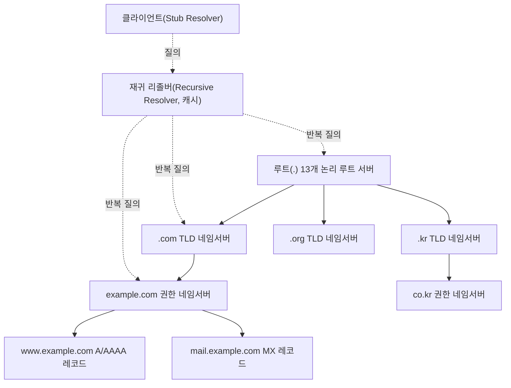
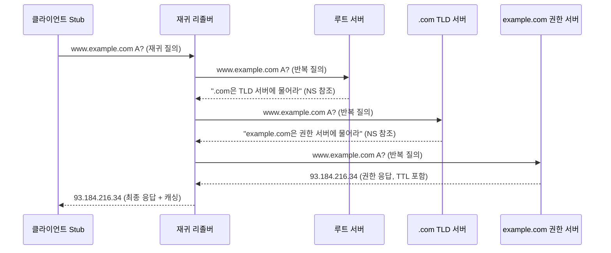
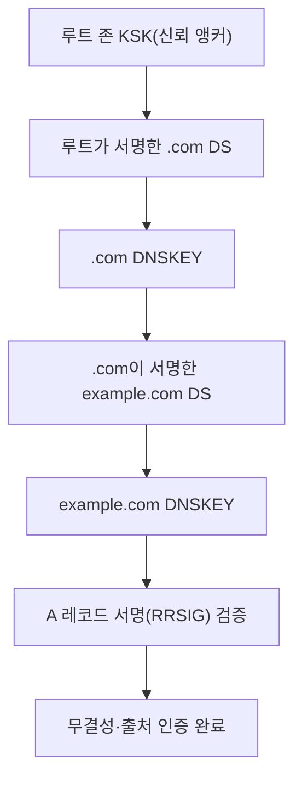

# DNS(Domain Name System)와 DNS 보안

## 1. 개요

> **정의**: DNS(Domain Name System)는 사람이 기억하기 쉬운 도메인 이름(예: `www.example.com`)을 컴퓨터가 통신에 사용하는 IP 주소(예: `93.184.216.34`)로 상호 변환해 주는, 계층적·분산형(hierarchical & distributed)의 전역 이름 해석(name resolution) 체계이다.

인터넷 초창기에는 모든 호스트의 이름과 주소를 단일 텍스트 파일(`HOSTS.TXT`)에 담아 중앙에서 배포했다. 그러나 연결 호스트 수가 폭증하면서 이 단일 파일 방식은 배포 지연, 이름 충돌, 갱신 병목이라는 세 가지 한계를 드러냈다. 즉 중앙 집중형 정적 파일은 인터넷의 규모 확장(scalability)을 감당할 수 없었고, 이를 해결하기 위해 1983년 Paul Mockapetris가 계층적 이름 공간과 분산 데이터베이스라는 발상을 결합한 DNS를 설계했다(RFC 882/883, 이후 RFC 1034/1035로 표준화). DNS의 본질적 가치는 "이름 공간을 트리 구조로 계층화하고, 각 구역(zone)에 대한 관리 권한을 독립 주체에게 위임(delegation)함으로써 전 세계 어느 조직도 중앙의 승인 없이 자신의 이름을 관리"할 수 있게 한 점에 있다.

DNS가 없다면 모든 웹·메일·API 통신은 IP 주소를 직접 지정해야 하며, 서버 이전이나 부하 분산 때마다 전 세계 클라이언트를 일일이 수정해야 한다. 반대로 DNS가 있기에 도메인이라는 '간접 계층(indirection layer)'을 통해 서비스와 물리적 위치를 분리(decoupling)할 수 있고, 이것이 CDN·GSLB(전역 부하분산)·이메일 라우팅·서비스 디스커버리 등 현대 인터넷 인프라의 토대가 된다. 다만 DNS는 설계 당시 '가용성과 확장성'을 최우선으로 삼아 '인증과 기밀성'을 고려하지 않았기에, 오늘날 캐시 오염·증폭 DDoS·프라이버시 노출 같은 구조적 취약점을 안고 있으며 이를 보완하는 DNSSEC·DoH/DoT가 함께 다뤄져야 한다.

특징을 요약하면 ① 트리형 계층 이름 공간, ② 관리 권한의 위임을 통한 분산 운영, ③ TTL 기반 캐싱을 통한 성능·확장성 확보, ④ UDP/53 중심의 경량 질의, ⑤ 최종 일관성(eventual consistency) 지향으로 정리된다.

흔히 DNS를 '인터넷의 전화번호부'에 비유하지만, 이 비유는 규모와 동작 방식을 과소평가한다. 전화번호부가 정적 목록이라면 DNS는 전 세계 수억 개 도메인을 대상으로 초당 수백만 건 이상의 질의를 실시간 분산 처리하는 동적 시스템이며, 어느 조직도 전체를 소유하지 않는다는 점에서 인터넷의 '분산 협력' 철학을 가장 잘 구현한 인프라다. 이 때문에 DNS는 웹(HTTP)보다도 먼저 동작하는 '모든 통신의 첫 관문'이며, DNS가 멈추면 IP를 직접 아는 극소수를 제외한 사실상 모든 서비스가 접속 불능이 된다. 바로 이 '보편적 의존성' 때문에 DNS의 성능·가용성·보안은 개별 서비스의 문제가 아니라 인터넷 전체의 신뢰성 문제로 다뤄진다.

## 2. DNS 이름 공간과 전체 구조

DNS 이름 공간은 최상위의 루트(root, `.`)를 정점으로, 그 아래 TLD(Top-Level Domain), 2차 도메인, 서브도메인으로 내려가는 역트리(inverted tree) 구조이다. 각 노드는 최대 63바이트의 레이블(label)을 가지며, 전체 FQDN(Fully Qualified Domain Name)은 255바이트를 넘을 수 없다. 이 계층 구조가 중요한 이유는 이름의 '유일성(uniqueness)'을 지역적으로만 보장하면 되도록 만들기 때문이다. 즉 `example.com` 구역 관리자는 자기 구역 내에서 이름 충돌만 방지하면 되고, 전 세계와 조율할 필요가 없다.

권한의 위임은 '구역(zone)' 단위로 이뤄진다. 구역은 하나의 관리 주체가 책임지는 이름 공간의 연속된 부분이며, 상위 구역은 하위 구역의 권한 있는 네임서버(authoritative name server)를 NS 레코드로 가리키는 방식으로 위임한다. 예컨대 루트는 `.com` TLD를 위임하고, `.com` TLD는 `example.com`의 네임서버를 위임한다. 이 위임 사슬 덕분에 어느 한 서버도 전체 데이터를 보유하지 않으면서 전역 해석이 가능하다.

DNS 인프라를 구성하는 핵심 주체는 네 가지다. 첫째, **스텁 리졸버(stub resolver)**는 운영체제나 브라우저에 내장된 최소 기능의 클라이언트로, 질의를 재귀 리졸버에 위임한다. 둘째, **재귀 리졸버(recursive resolver, caching resolver)**는 클라이언트를 대신해 루트→TLD→권한 서버를 차례로 방문해 최종 답을 찾아 반환하고, 그 결과를 TTL 동안 캐싱한다. ISP의 리졸버나 Google `8.8.8.8`, Cloudflare `1.1.1.1`가 대표적이다. 셋째, **권한 있는 네임서버(authoritative server)**는 특정 구역의 원본 데이터를 보유한 최종 근원지다. 넷째, **루트 서버**는 13개의 논리 주소(A~M)로 운영되되, 실제로는 Anycast 기술로 전 세계 수천 개 물리 인스턴스에 복제되어 가용성과 응답 속도를 확보한다.

이 구조에서 핵심 성능 기제는 **캐싱**이다. 각 레코드에는 TTL(Time To Live)이 부여되어, 재귀 리졸버는 TTL이 만료되기 전까지 상위 서버에 재질의하지 않는다. TTL이 짧으면 변경 반영은 빠르지만 루트·TLD 부하가 커지고, 길면 부하는 줄지만 IP 변경 시 전 세계 반영이 지연된다. 따라서 서버 이전을 계획할 때는 사전에 TTL을 300초 등으로 낮춰 두는 것이 실무 관행이다. 이 캐싱이 곧 DNS를 '최종 일관성' 시스템으로 만드는 원인이며, 동시에 캐시 오염(cache poisoning) 공격의 표적이 되는 지점이기도 하다.

## 3. DNS 동작 원리 — 재귀 질의와 반복 질의

DNS 해석은 성격이 다른 두 질의 방식이 결합되어 이뤄진다. 클라이언트와 재귀 리졸버 사이에서는 **재귀 질의(recursive query)**가 쓰인다. 클라이언트는 "완성된 답을 달라"고 요청하고, 리졸버는 답을 찾을 책임을 진다. 반면 리졸버와 각 계층 서버 사이에서는 **반복 질의(iterative query)**가 쓰인다. 각 서버는 자신이 답을 모르면 "더 아래를 물어보라"며 하위 서버의 참조(referral)만 돌려준다. 이 역할 분담이 중요한 이유는, 무거운 탐색 작업을 리졸버 한 곳에 집중시키고 그 결과를 캐싱해 재사용함으로써 전체 인터넷의 질의 총량을 극적으로 줄이기 때문이다.

구체적 흐름을 보면, 사용자가 `www.example.com`을 요청하면 스텁 리졸버가 재귀 리졸버에 재귀 질의를 던진다. 리졸버는 캐시에 답이 없을 경우 먼저 루트 서버에 묻고, 루트는 `.com` TLD 서버의 NS 참조를 반환한다. 리졸버는 다시 TLD 서버에 물어 `example.com` 권한 서버의 참조를 얻고, 마지막으로 권한 서버에서 실제 A 레코드(`93.184.216.34`)를 받아 클라이언트에 전달하며 TTL 동안 캐싱한다. 최초 질의는 이렇게 여러 왕복(round-trip)을 거치지만, 이후 동일·유사 질의는 캐시에서 즉시 처리되어 수 밀리초 내에 응답된다. 실무에서 캐시 히트율은 통상 80~90% 이상으로, DNS 전체 질의의 대부분이 상위 서버에 도달하지 않고 리졸버 캐시에서 종결된다.

전송 계층 측면에서 DNS는 기본적으로 **UDP 포트 53**을 사용한다. 이름 해석은 단발성·소용량이라 연결 설정 오버헤드가 없는 UDP가 유리하기 때문이다. 다만 응답이 512바이트를 초과하거나(전통적 UDP 한계) 구역 전송(zone transfer, AXFR/IXFR)처럼 신뢰성이 필요한 경우에는 **TCP 포트 53**으로 대체(fallback)한다. DNSSEC 서명 데이터처럼 응답이 커진 현대 환경에서는 **EDNS0**(RFC 6891)로 UDP 페이로드를 4096바이트까지 확장해 TCP 재시도를 줄이는 것이 표준 관행이다.

권한 서버의 가용성은 **1차/2차(primary/secondary, master/slave) 이중화**로 확보한다. 원본 구역 데이터는 1차 서버가 보유하고, 2차 서버는 **구역 전송(zone transfer)**으로 이를 복제한다. 이때 전체를 매번 복사하는 AXFR 대신 변경분만 전송하는 **IXFR(Incremental Zone Transfer)**를 쓰면 대역폭을 절약하며, SOA 레코드의 시리얼 번호(serial number) 증가를 감지해 갱신 여부를 판단한다. 구역 전송은 내부 토폴로지를 노출할 수 있어 반드시 인가된 2차 서버로만 제한하고 TSIG(Transaction Signature)로 인증하는 것이 보안 원칙이다. 이 이중화 구조가 있기에 1차 서버 장애 시에도 복수의 권한 서버가 응답을 지속해 DNS의 높은 가용성이 유지된다.

성능 최적화에서 간과되기 쉬운 요소가 **부정 캐싱(negative caching, RFC 2308)**이다. 존재하지 않는 이름(NXDOMAIN)에 대한 응답도 캐싱되어야 반복적인 무효 질의가 상위 서버로 흘러가는 것을 막을 수 있는데, 이때 캐싱 시간은 해당 구역 SOA 레코드의 최소 TTL 값으로 결정된다. 만약 부정 캐싱이 없다면 오타나 봇의 존재하지 않는 서브도메인 질의가 권한 서버에 그대로 도달해 부하를 키우고, 실제로 NXDOMAIN 폭주(flood)는 DDoS 기법의 하나로 악용된다. 이처럼 '없음'이라는 답조차 캐싱 대상으로 삼는 설계가 DNS의 확장성을 뒷받침한다.

## 4. 주요 리소스 레코드(Resource Record) 유형

DNS 데이터의 기본 단위는 리소스 레코드(RR)이며, 각 레코드는 `이름 / TTL / 클래스(IN) / 유형 / 값`으로 구성된다. 레코드 유형을 이해하는 것은 단순 암기가 아니라 "각 유형이 어떤 서비스 요구를 충족하려고 존재하는가"를 파악하는 문제다. 예컨대 A/AAAA는 웹 접속의 종착점을, MX는 메일 라우팅을, SRV는 서비스 디스커버리를, CAA는 인증서 발급 통제를 각각 담당한다. 아래 표는 보조적 정리이며, 실제 답안에서는 각 레코드가 등장하는 맥락을 함께 서술하는 것이 좋다.

| 유형 | 역할 | 예시/비고 |
|------|------|-----------|
| A | 도메인 → IPv4 주소 | `www.example.com → 93.184.216.34` |
| AAAA | 도메인 → IPv6 주소 | IPv6 전환 필수 |
| CNAME | 별칭(정규 이름으로 위임) | 루트 도메인엔 사용 제약 |
| MX | 메일 서버 지정(우선순위 포함) | 낮은 우선순위 값이 우선 |
| NS | 구역의 권한 네임서버 위임 | 위임 사슬의 핵심 |
| SOA | 구역 시작·관리 정보(시리얼·갱신주기) | 구역당 1개 |
| PTR | IP → 도메인(역방향 조회) | `in-addr.arpa` |
| TXT | 임의 텍스트(SPF·DKIM·검증) | 메일 인증에 광범위 활용 |
| SRV | 서비스 위치(호스트·포트) | SIP·LDAP 등 |
| CAA | 인증서 발급 가능 CA 제한 | 오발급 방지 |
| DNSKEY/RRSIG/DS/NSEC | DNSSEC 서명·검증·부재증명 | 4절 심화 참조 |

역방향 조회(reverse lookup)를 담당하는 **PTR 레코드**도 실무적 의미가 크다. 정방향이 이름→IP라면, PTR은 IP→이름을 해석하며 `in-addr.arpa`(IPv4)·`ip6.arpa`(IPv6) 특수 도메인 아래에 IP를 역순으로 배열해 표현한다. PTR의 대표적 활용처는 **메일 서버 스팸 필터링**으로, 수신 메일 서버는 발신 IP의 역방향 조회 결과가 정방향과 일치(forward-confirmed reverse DNS)하는지 검사해 위조된 발신자를 걸러낸다. 따라서 자체 메일 서버를 운영할 때 PTR 미설정은 곧 정상 메일의 스팸 처리로 이어질 수 있어, 이는 DNS 레코드 하나가 서비스 신뢰성에 직결되는 구체적 사례다.

CNAME과 A 레코드의 차이는 실무에서 자주 혼동되는 지점이다. A는 이름을 IP에 직접 대응시키는 반면, CNAME은 이름을 다른 '정규 이름(canonical name)'으로 위임한다. CNAME 체인은 유연하지만 추가 조회를 유발해 지연을 늘리고, 루트 도메인(zone apex)에는 SOA·NS와 공존할 수 없다는 RFC 제약 때문에 사용할 수 없다. 이를 우회하기 위해 CDN 사업자들은 ALIAS/ANAME 같은 벤더 확장 레코드를 제공한다. 또 하나의 실무 사례로, 이메일 스푸핑 방지를 위한 **SPF·DKIM·DMARC**는 모두 TXT 레코드에 정책을 담아 배포하는데, 이는 DNS가 단순 주소 변환을 넘어 '신뢰 정책 배포 채널'로 활용되는 대표 예다.

## 5. DNS 보안 위협과 비교

DNS는 무결성·인증 장치 없이 설계된 UDP 기반 프로토콜이라 다양한 위협에 노출된다. 위협을 나열하는 데 그치지 말고, '왜 그 공격이 성립하는가'라는 구조적 원인과 함께 이해해야 한다.

**캐시 오염(Cache Poisoning)**은 공격자가 재귀 리졸버에 위조된 응답을 먼저 주입해, 리졸버가 잘못된 IP를 캐싱하게 만드는 공격이다. UDP는 출발지 검증이 약하고, 응답의 진위는 질의 ID(16비트)와 출발지 포트로만 대조되므로 무차별 추측이 가능했다. 2008년 Dan Kaminsky가 발표한 기법은 서브도메인을 이용해 추측 기회를 무한히 반복함으로써 이 취약점의 심각성을 입증했고, 그 대응으로 **출발지 포트 무작위화(source port randomization)**와 궁극적으로 DNSSEC 도입이 촉진되었다. **DNS 증폭·반사 DDoS(Amplification/Reflection)**는 작은 질의로 큰 응답을 유발하는 DNS 특성(증폭률 수십 배)과 UDP의 출발지 위조 가능성을 결합해, 피해자 IP로 대량 응답을 쏟아붓는 공격이다. 2016년 Mirai 봇넷에 의한 Dyn DNS 대란은 DNS 인프라 자체가 공격 표적이 될 때 트위터·넷플릭스 등 수많은 서비스가 동시에 마비될 수 있음을 보여준 대표 사례다. 이 밖에도 **DNS 터널링**(DNS 질의에 데이터를 은닉해 보안장비를 우회하는 유출·C2 채널), **서브도메인 탈취(subdomain takeover)**, **도메인 하이재킹**(등록기관 계정 탈취) 등이 있다.

| 위협 | 근본 원인 | 주요 대응책 |
|------|-----------|-------------|
| 캐시 오염 | 응답 진위 검증 부재(16비트 ID) | DNSSEC, 포트 무작위화, 0x20 인코딩 |
| 증폭 DDoS | UDP 출발지 위조 + 큰 응답 | RRL(응답 속도 제한), Anycast, BCP38 |
| DNS 터널링 | 질의 페이로드 감시 미흡 | 트래픽 분석·이상탐지, 페이로드 검사 |
| 서브도메인 탈취 | 방치된 CNAME 위임 | 미사용 레코드 정리, 소유권 검증 |
| 도메인 하이재킹 | 등록기관 계정 취약 | 레지스트리 락, MFA, DNSSEC |

추가로, DNS는 공격 인프라의 은닉에도 악용된다. 악성코드가 매일 대량의 임의 도메인을 생성해 그중 일부만 C2 서버로 등록하는 **DGA(Domain Generation Algorithm)**는 단순 블랙리스트 차단을 무력화하며, 시각적으로 유사한 도메인을 등록해 사용자를 속이는 **타이포스쿼팅(typosquatting)·IDN 호모그래프 공격**은 피싱의 단골 수법이다. 이런 위협은 정적 차단만으로는 대응이 어렵기 때문에, 질의 패턴의 엔트로피 분석·머신러닝 기반 도메인 평판 평가 같은 동적 탐지 기법이 함께 요구된다. 실제로 대형 보안 사업자들은 하루 수천억 건의 DNS 질의 로그를 분석해 신규 악성 도메인을 조기에 식별하고 있다.

위협 대응책들은 서로 다른 계층에서 작동하므로 함께 이해해야 한다. 예컨대 DNSSEC는 '무결성·인증'은 제공하지만 '기밀성'은 제공하지 않으므로, 프라이버시 문제는 DoH/DoT가 별도로 해결한다. 반대로 DoH/DoT는 전송 구간 암호화로 도청·조작은 막지만, 리졸버가 반환한 데이터가 '진짜 권한 서버의 답'임을 보증하지는 못하므로 DNSSEC와 상호 보완적이다. 이처럼 하나의 장치가 모든 위협을 덮지 못한다는 점이 DNS 보안의 핵심 함의다.

## 6. 심화 — DNSSEC와 암호화 DNS(DoH/DoT) 최신 동향

DNSSEC(DNS Security Extensions, RFC 4033~4035)는 각 레코드 집합(RRset)에 디지털 서명(RRSIG)을 부여하고, 그 검증 열쇠(DNSKEY)의 진위를 상위 구역의 DS 레코드로 연결하는 '신뢰 사슬(chain of trust)'을 통해 응답의 위·변조 여부를 검증한다. 신뢰의 최상단은 루트 존의 공개키이며, 이를 주기적으로 교체하는 **KSK 롤오버(Key Signing Key Rollover)**는 2018년 처음 수행되어 전 세계 리졸버가 일제히 새 루트 키를 신뢰하도록 전환한 역사적 사례다. 존재하지 않는 이름에 대한 위조 응답을 막기 위해 DNSSEC는 **NSEC/NSEC3**로 '부재 증명(authenticated denial of existence)'을 제공하는데, NSEC가 이름을 그대로 노출해 존 워킹(zone walking)에 악용되는 문제를 NSEC3가 해시로 보완한다.

클라우드 네이티브 환경에서 DNS의 역할은 오히려 확장되고 있다. 쿠버네티스는 **CoreDNS**를 클러스터 내부 DNS로 사용해 파드·서비스에 `service.namespace.svc.cluster.local` 형태의 이름을 부여하고, 이를 통해 마이크로서비스 간 **서비스 디스커버리(service discovery)**를 구현한다. 즉 서비스가 스케일 인/아웃으로 IP가 계속 바뀌어도 이름은 고정되므로, 호출 측은 IP 변화를 의식하지 않고 통신할 수 있다. 또한 기업 내부망과 외부에 서로 다른 응답을 반환하는 **스플릿 호라이즌 DNS(split-horizon)**는, 동일 도메인이라도 내부 사용자에게는 사설 IP를, 외부 사용자에게는 공인 IP를 제공해 내부 자산 노출을 줄이는 실무 기법이다. 이처럼 DNS는 전통적 인터넷 이름 해석을 넘어 컨테이너·제로 트러스트 환경의 핵심 제어 지점으로 진화하고 있다.

한편 DNSSEC가 다루지 못하는 '프라이버시'를 겨냥해 등장한 것이 암호화 DNS다. **DoT(DNS over TLS, RFC 7858)**는 포트 853에서 TLS로 질의를 암호화하고, **DoH(DNS over HTTPS, RFC 8484)**는 포트 443에서 HTTPS 트래픽에 DNS를 실어 일반 웹 트래픽과 구분되지 않게 만든다. Cloudflare·Google·Mozilla가 공개 DoH 리졸버를 운영하며 브라우저 기본 적용을 확대해 왔다. 다만 DoH는 프라이버시를 강화하는 동시에, 기업의 보안 장비가 DNS를 감시·차단하기 어렵게 만들어 '망 가시성 저하'라는 상충(trade-off)을 낳는다. 이 때문에 많은 기업은 내부 리졸버를 강제하는 정책과 DoH 탐지를 병행한다. 가장 최근 흐름으로는 SNI(Server Name Indication)까지 감추는 **ECH(Encrypted Client Hello)**, 그리고 '오블리비어스 DoH(Oblivious DoH)'처럼 리졸버조차 질의자와 질의 내용을 동시에 알 수 없게 하는 프라이버시 강화 기술이 논의되고 있다. 정확한 배포 현황은 표준·구현별로 유동적이므로 도입 시 최신 RFC와 벤더 문서를 확인하는 것이 바람직하다.

## 7. 고려사항 및 시사점 (기술사 관점)

**첫째, 가용성·보안·프라이버시의 균형 설계.** DNS는 인터넷의 단일 실패점(SPOF)이 되기 쉬우므로, 권한 서버를 지리적으로 분산하고 복수 DNS 사업자를 병행(multi-provider)하며 Anycast를 적용하는 것이 필수다. 여기에 DNSSEC(무결성)와 DoH/DoT(기밀성)를 계층적으로 결합하되, DoH가 초래하는 망 가시성 저하와 기업 보안정책 간의 상충을 사전에 조율해야 한다.

**둘째, TTL·다중화 기반 운영 전략.** 서비스 이전·장애 조치(failover) 상황을 대비해 평시 TTL 정책을 계획적으로 관리하고, GSLB·헬스체크와 연동한 DNS 기반 부하분산으로 지연을 줄이면서도, TTL이 지나치게 짧아 상위 인프라 부하를 키우지 않도록 트레이드오프를 조율한다. 캐시 무효화 지연이 곧 장애 복구 시간(RTO)에 직결됨을 인식해야 한다. 특히 DNS 기반 GSLB는 사용자 위치·서버 부하·지연시간을 기준으로 최적 데이터센터의 IP를 반환해 전 세계 트래픽을 분산하지만, 클라이언트·중간 리졸버의 캐싱 때문에 장애 노드로의 라우팅이 TTL만큼 잔존한다는 한계가 있다. 이 때문에 대규모 서비스는 DNS 기반 분산을 1차로 두되, 애니캐스트·L4/L7 로드밸런서와 다계층으로 결합해 즉각적 장애 우회를 보완하는 것이 정석이다.

**셋째, DNS를 보안 관제의 핵심 축으로 활용.** 대부분의 악성코드 C2·피싱·데이터 유출이 DNS를 경유하므로, **Protective DNS(보호 DNS)**·DNS 방화벽(RPZ, Response Policy Zone)·DNS 로그 기반 이상탐지를 SIEM·XDR과 연동하면 위협을 조기에 차단할 수 있다. DNS는 '공격 통로'인 동시에 가장 효과적인 '탐지 지점'이라는 양면성을 전략적으로 활용해야 한다.

**넷째, 표준 전환기의 거버넌스와 검증 체계.** IPv6(AAAA) 전면화, 루트 KSK 롤오버, 암호화 DNS 확산 등 표준이 계속 변화하므로, 조직은 DNSSEC 서명·검증 자동화, 레지스트리 락과 MFA를 통한 도메인 하이재킹 방지, 미사용 레코드 정리를 통한 서브도메인 탈취 예방 등 운영 거버넌스를 체계화해야 한다. 향후에는 제로 트러스트 아키텍처와의 연계, 클라우드 네이티브 환경의 내부 서비스 디스커버리(CoreDNS 등)로 DNS의 역할이 더욱 확장될 전망이다.

**다섯째, 인프라 소유·비용 구조와 공급망 관점.** DNS 운영을 자체 구축할지, 관리형 DNS(Managed DNS) 사업자에 위탁할지는 가용성·비용·통제권의 트레이드오프 문제다. 위탁은 전 세계 애니캐스트 인프라를 즉시 활용할 수 있어 비용 효율적이지만 특정 사업자에 대한 종속(vendor lock-in)과 그 사업자 장애가 곧 자사 서비스 마비로 직결되는 공급망 위험을 낳는다. 실제 대형 DNS 사업자 장애가 다수 서비스의 동시 중단으로 번진 사례들이 이 위험을 방증하므로, 복수 사업자 병행과 장애 시 자동 전환(failover) 설계를 함께 고려해야 한다. 아울러 도메인 이름 공간은 ICANN·레지스트리·레지스트라로 이어지는 거버넌스 체계 위에 존재하므로, 도메인 만료·소유권 관리를 조직 자산관리 프로세스에 정식으로 편입해 '도메인 실효로 인한 서비스 중단'이라는 초보적 사고를 예방해야 한다.

## 참고자료
- RFC 1034/1035, Domain Names — Concepts and Implementation/Specification, IETF
- RFC 4033/4034/4035, DNS Security Introduction and Requirements (DNSSEC), IETF
- RFC 7858, Specification for DNS over Transport Layer Security (DoT), IETF
- RFC 8484, DNS Queries over HTTPS (DoH), IETF
- RFC 6891, Extension Mechanisms for DNS (EDNS0), IETF
- ICANN, KSK Rollover 관련 문서: https://www.icann.org/resources/pages/ksk-rollover
- Cloudflare Learning Center, What is DNS?: https://www.cloudflare.com/learning/dns/what-is-dns/
- RFC 2308, Negative Caching of DNS Queries (DNS NCACHE), IETF
- ICANN Root Server System (Anycast/루트 서버 운영): https://www.iana.org/domains/root/servers

---
> **한 줄 요약**: DNS는 도메인 이름을 IP로 변환하는 계층적·분산형 이름 해석 체계로, 위임과 캐싱으로 확장성을 확보하지만 설계상 인증·기밀성 부재로 캐시 오염·증폭 DDoS 등에 취약하며, 이를 DNSSEC(무결성)와 DoH/DoT(기밀성)로 보완하는 것이 핵심이다.
