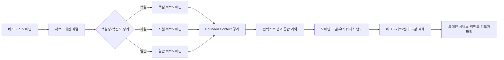
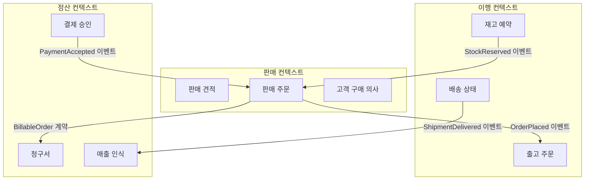
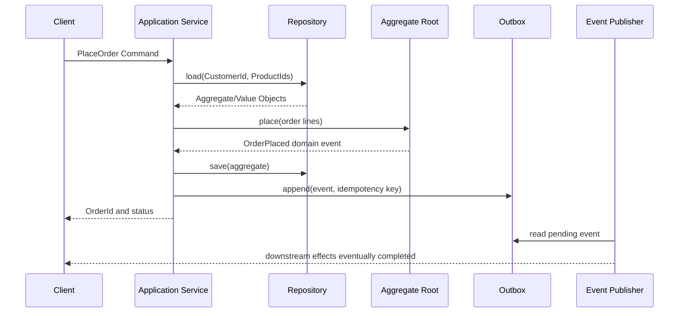

# 도메인 주도 설계(DDD, Domain-Driven Design)

## 1. 개요

> 도메인 주도 설계(DDD)는 소프트웨어의 중심을 기술 프레임워크가 아니라 업무 도메인의 문제와 모델에 두고, 도메인 전문가와 개발자가 공유하는 모델을 반복적으로 발전시키는 설계 접근법이다.

기업 시스템은 단순한 데이터 입력·조회 프로그램을 넘어, 상품·계약·정산·배송·규제와 같은 업무 규칙을 조합해 의사결정을 수행한다.
업무가 복잡해질수록 같은 단어가 부서마다 다른 의미로 쓰이고, 한 화면의 변경이 여러 시스템과 조직의 정책에 연쇄적으로 영향을 준다.
이때 데이터베이스 테이블을 먼저 만들고 서비스 화면을 덧붙이는 방식은 기능은 빨리 만들 수 있어도 규칙의 소유권과 변경 경계를 설명하기 어렵다.
DDD는 이러한 복잡성을 도메인 모델, 언어, 경계, 불변식으로 드러내어 설계와 구현의 일관성을 높인다.

DDD의 핵심은 특정 프레임워크나 클래스 패턴을 기계적으로 적용하는 데 있지 않다.
개발자는 도메인 전문가의 표현을 듣고 후보 개념을 모델링하며, 모델이 실제 업무 의사결정을 설명하지 못하면 다시 질문하고 수정한다.
따라서 DDD는 분석·설계·구현·테스트·운영을 연결하는 사고방식이며, 기술팀만의 리팩터링 기법으로 축소해서는 안 된다.

도메인(domain)은 시스템이 해결하려는 업무 영역이고, 서브도메인(subdomain)은 그 영역을 목적과 책임에 따라 나눈 부분이다.
핵심 서브도메인은 경쟁력과 차별화의 원천이므로 내부 역량으로 개발할 가치가 높다.
지원 서브도메인은 업무에 필요하지만 차별화가 상대적으로 낮으므로 표준 제품이나 단순한 내부 서비스로 구현할 수 있다.
일반 서브도메인은 대부분의 조직이 공통으로 필요로 하는 기능으로, 구매·인증·메일처럼 패키지나 외부 서비스를 활용하는 편이 합리적일 수 있다.

DDD가 필요한지는 시스템의 규모보다 규칙의 복잡성과 변화 빈도로 판단한다.
규칙이 단순한 조회 시스템에 무거운 도메인 모델을 도입하면 개발 속도와 운영 복잡성만 커질 수 있다.
반대로 할인·재고·정산·권한·규제 예외가 얽힌 시스템은 모델이 없을 때 코드와 데이터의 암묵적 규칙이 빠르게 부채로 누적된다.
기술사는 DDD 적용 여부를 유행이 아니라 도메인 복잡도, 변경 비용, 조직 구조, 통합 요구사항의 관점에서 판단해야 한다.

## 2. DDD의 전체 개념도와 설계 원리

DDD는 전략적 설계로 큰 경계를 먼저 정하고, 전술적 설계로 각 경계 안의 모델과 책임을 구체화한다.
두 단계는 분리되어 있지만 서로 피드백한다.
전략적 경계가 잘못되면 전술 패턴을 아무리 정교하게 작성해도 서비스 간 결합과 번역 비용이 줄지 않는다.

도메인 분해는 조직의 현재 부서도를 복사하는 작업이 아니다.
고객이라는 단어가 영업에서는 잠재 구매자, 주문에서는 구매 주체, 채권에서는 채무자로 다뤄질 수 있음을 확인하고, 각 업무의 규칙과 책임을 기준으로 경계를 정한다.
같은 용어를 모든 시스템에서 하나의 거대한 객체로 통일하려 하면 불필요한 의존성이 생기므로, 문맥에 따른 의미 차이를 인정하는 것이 오히려 일관성을 높인다.

유비쿼터스 언어(ubiquitous language)는 도메인 전문가와 개발자가 모델·코드·테스트·문서에서 함께 사용하는 언어다.
회의에서 “예약 확정”이라고 말하면서 코드에서는 `createOrder`로 구현한다면, 언어와 모델 사이에 번역 손실이 생긴다.
용어집은 시작점일 뿐이며, 실제 모델의 속성·상태·행동·오류 메시지까지 같은 의미를 유지할 때 비로소 효과가 나타난다.

도메인 모델은 데이터 구조의 집합이 아니라 업무 규칙과 의사결정의 구조다.
예를 들어 주문의 총액은 단순히 상품 가격을 더한 값이 아니라, 할인 적용 순서와 세금 반올림과 배송 조건을 반영한 결과일 수 있다.
이 계산 규칙을 화면 컨트롤러나 배치 SQL에 흩어 놓으면 변경 시 누락이 발생하므로, 모델 안에 규칙의 주인과 불변식을 배치한다.

표는 DDD의 주요 개념을 빠르게 대조하는 보조 수단이다.
각 개념은 독립적인 체크리스트가 아니라 모델의 의미와 책임을 연결하는 관계로 이해해야 한다.

| 개념 | 핵심 질문 | 주요 책임 | 흔한 오해 |
|---|---|---|---|
| 도메인 | 어떤 업무 문제를 푸는가? | 문제의 범위와 목적 정의 | 데이터베이스 자체를 도메인으로 보는 것 |
| 서브도메인 | 어디까지가 하나의 업무 능력인가? | 핵심·지원·일반 영역 구분 | 부서 조직도를 그대로 복사하는 것 |
| 바운디드 컨텍스트 | 어떤 모델과 언어가 유효한가? | 모델의 적용 경계와 계약 정의 | 모든 컨텍스트가 같은 객체를 공유하는 것 |
| 엔터티 | 시간에 따라 같은 대상을 추적해야 하는가? | 식별자와 생명주기 관리 | 모든 테이블을 엔터티로 만드는 것 |
| 값 객체 | 값 자체가 의미이며 식별자가 불필요한가? | 불변 값과 검증 캡슐화 | 문자열·숫자를 무제한으로 전달하는 것 |
| 애그리거트 | 어떤 변경을 하나의 일관성 경계로 묶는가? | 불변식 보호와 트랜잭션 경계 | 모든 객체를 하나의 큰 루트에 넣는 것 |
| 도메인 이벤트 | 어떤 업무 사실이 발생했는가? | 컨텍스트 간 사실 전달 | 단순 로그 메시지와 동일시하는 것 |

DDD의 원리는 “모든 것을 객체로 만들자”가 아니다.
어떤 규칙이 즉시 함께 만족되어야 하는지, 어떤 정보는 이벤트로 나중에 반영해도 되는지를 구분하는 것이 모델링의 핵심이다.
이 구분이 트랜잭션 범위, 저장소 구조, API 계약, 장애 복구 방식까지 결정한다.

## 3. 전략적 설계: 서브도메인과 바운디드 컨텍스트

### 3.1 서브도메인 분류와 투자 우선순위

서브도메인 분류는 경영 전략과 아키텍처 결정을 연결한다.
핵심 서브도메인은 고객이 다른 사업자와 구별해 인식하는 능력이며, 구현 난도가 높고 규칙이 자주 바뀌는 영역일 가능성이 크다.
따라서 핵심 영역에는 도메인 전문가와 숙련 개발자를 배치하고, 모델의 품질과 테스트에 투자한다.

지원 서브도메인은 핵심 업무를 보조하지만 자체 경쟁우위가 낮다.
예를 들어 제조 기업의 생산 최적화가 핵심이라면 일반 인사·전자결재는 지원 또는 일반 영역으로 분류될 수 있다.
지원 영역을 무조건 외부화하는 것이 아니라 통합 비용, 데이터 주권, 보안, 변경 요구를 함께 비교해 결정한다.

일반 서브도메인은 여러 조직이 유사하게 해결하는 능력이다.
이 영역에서 직접 독자 모델을 만들면 유지보수 비용이 불필요하게 증가할 수 있으므로, 표준 솔루션을 사용하고 차별화 영역에 역량을 집중한다.
다만 패키지를 도입하더라도 내부 용어와 외부 용어의 차이를 번역 계층에서 관리해야 핵심 모델이 오염되지 않는다.

사업 포트폴리오와 서브도메인 분류는 고정된 진실이 아니다.
규제 변화나 사업 전략에 따라 일반 기능이 핵심 역량으로 바뀔 수 있으며, 외부 플랫폼의 가격·종속성 변화도 재평가 요인이 된다.
분류 결과에는 중요도뿐 아니라 변경 빈도, 실패 비용, 확보 가능한 전문성, 외부 대체 가능성을 함께 기록한다.

### 3.2 바운디드 컨텍스트와 모델 경계

바운디드 컨텍스트는 특정 도메인 모델과 유비쿼터스 언어가 유효한 명시적 경계다.
경계 안에서는 “고객”, “주문”, “상태”의 의미와 불변식을 일관되게 유지하지만, 경계를 넘을 때는 API·이벤트·번역기를 통해 필요한 정보만 교환한다.
이렇게 하면 모델의 내부 구현을 숨기고, 각 팀이 자신의 업무 규칙을 독립적으로 변경할 수 있다.

컨텍스트의 경계는 데이터베이스 스키마의 경계와 일치할 수도 있지만 항상 같지는 않다.
하나의 컨텍스트가 여러 저장소를 사용할 수 있고, 초기에는 하나의 데이터베이스 안에서 논리 스키마를 분리한 뒤 점진적으로 물리 분리할 수도 있다.
중요한 것은 저장 위치보다 모델의 소유권과 변경 계약을 명확히 하는 것이다.

경계를 정할 때는 용어의 의미, 변경 이유, 트랜잭션 일관성, 팀의 책임, 외부 연계, 보안 등급을 함께 본다.
같은 변경 이유를 갖는 기능은 가까이 두고, 서로 다른 이유로 변경되는 기능은 불필요하게 묶지 않는다.
마이크로서비스 수를 먼저 정한 뒤 도메인을 끼워 맞추면 분산 모놀리스가 될 위험이 커진다.

위 구조에서 판매 주문과 출고 주문은 서로 관련되지만 같은 객체가 아니다.
판매는 가격·고객 약속·주문 상태를 관리하고, 이행은 물리 재고와 배송 가능성을 관리한다.
판매 컨텍스트가 이행의 내부 재고 객체를 직접 수정하면 두 팀의 변경이 결합되므로, 주문 접수 이벤트와 출고 요청 계약으로 필요한 사실만 전달한다.

### 3.3 컨텍스트 맵과 통합 관계

컨텍스트 맵은 바운디드 컨텍스트 사이의 의존 방향과 관계 유형을 시각화한다.
공유 커널(Shared Kernel)은 여러 팀이 공동으로 유지하는 모델의 일부이며, 변경 합의와 공동 테스트가 필요하다.
공유 커널은 재사용처럼 보이지만 변경 조정 비용이 모든 팀에 전파되므로 작고 안정적인 값에 제한하는 것이 안전하다.

고객·공급자 관계에서는 업스트림이 계약을 제공하고 다운스트림이 소비한다.
다운스트림이 업스트림의 모델을 그대로 따라야 하는지, 번역 계층을 두어 내부 모델을 보호할지를 결정해야 한다.
공급자 변경이 빈번하거나 신뢰성이 낮다면 안티코럽션 레이어(ACL)로 외부 모델을 내부 언어로 변환한다.

오픈 호스트 서비스는 여러 소비자가 사용할 수 있는 표준화된 공개 계약을 제공한다.
게시된 언어(Published Language)는 이벤트 스키마나 API 문서처럼 여러 컨텍스트가 합의한 표현이다.
이 관계는 편리하지만 계약 버전 관리와 하위 호환성 테스트가 없으면 컨텍스트 간 결합이 다시 커진다.

| 관계 | 의미 | 적용 시점 | 통제 포인트 |
|---|---|---|---|
| 공유 커널 | 모델 일부를 공동 소유 | 강한 도메인 공통성과 긴밀한 협업 | 변경 승인·공동 테스트 |
| 고객-공급자 | 업스트림이 계약 제공 | 업무 흐름상 공급 방향이 명확할 때 | 계약 버전·영향 분석 |
| 순응자 | 다운스트림이 업스트림 모델을 수용 | 외부 모델을 바꿀 실익이 적을 때 | 내부 오염 범위 제한 |
| 안티코럽션 레이어 | 외부 모델을 내부 모델로 번역 | 레거시·패키지 연계 시 | 변환 규칙·오류 처리 |
| 이벤트 협력 | 업무 사실을 비동기 공유 | 시간적 결합을 줄일 때 | 중복·순서·재처리 |

## 4. 전술적 설계: 모델의 구성요소와 실행 흐름

### 4.1 엔터티와 값 객체

엔터티는 속성이 바뀌어도 식별자를 통해 동일성을 유지하는 객체다.
주문번호가 같은 주문은 배송 주소가 변경되어도 같은 주문이지만, 주소 자체는 값의 조합으로 의미가 완성될 수 있다.
엔터티의 식별자는 데이터베이스 자동 증가값일 수도 있지만, 업무적으로 의미 있는 식별자와 기술적 식별자를 분리하는 편이 외부 계약에 유리하다.

값 객체(Value Object)는 속성의 값과 불변 조건으로 동일성을 판단한다.
금액은 숫자 하나가 아니라 통화와 정밀도와 반올림 규칙을 포함할 수 있으며, 이메일 주소는 형식과 정규화 규칙을 포함할 수 있다.
값 객체를 불변으로 만들면 공유로 인한 부작용이 줄고, 잘못된 상태를 생성자나 팩토리에서 차단할 수 있다.

원시 타입을 모든 곳에 전달하는 원시 집착은 단위 혼동과 검증 누락을 유발한다.
예를 들어 `1000`이라는 값만으로는 원화 금액인지 포인트인지, 부가세 포함인지 알 수 없다.
`Money`, `CustomerId`, `DeliveryAddress`와 같은 의미 있는 타입은 컴파일러와 테스트가 업무 규칙을 지키도록 돕는다.

### 4.2 애그리거트와 불변식

애그리거트(Aggregate)는 하나의 일관성 경계로 취급할 객체 묶음이며, 외부는 애그리거트 루트를 통해서만 내부를 변경한다.
주문을 루트로 하면 주문 항목을 직접 수정하는 대신 주문의 `addLineItem` 같은 행동을 통해 수량·가격·상태 규칙을 지키게 한다.
애그리거트는 객체를 많이 묶는 설계가 아니라, 반드시 함께 일관되어야 하는 최소 단위를 찾는 설계다.

애그리거트가 너무 크면 매번 잠가야 할 데이터와 트랜잭션이 늘어나 동시성이 낮아진다.
반대로 너무 작으면 하나의 업무 명령을 처리하기 위해 여러 애그리거트를 동시에 수정해야 하고, 분산 트랜잭션이나 보상 처리가 필요해진다.
따라서 경계는 객체의 자연스러운 포함 관계보다 불변식과 변경 빈도, 동시성 패턴으로 결정한다.

애그리거트 간 참조는 객체를 직접 들고 있기보다 식별자로 표현하는 것이 일반적이다.
주문이 고객 전체 객체를 보유하면 고객 모델 변경이 주문 모델에 전파되므로 `CustomerId`만 저장하고 필요한 고객 정보는 별도 조회나 이벤트로 얻는다.
이 방식은 결합을 낮추지만 조회 일관성과 캐시 최신성 문제를 함께 설계해야 한다.

### 4.3 도메인 서비스와 애플리케이션 서비스

도메인 서비스는 하나의 엔터티에 자연스럽게 귀속하기 어려운 도메인 규칙을 표현한다.
두 계좌 사이의 자금 이체처럼 여러 애그리거트의 협력이 필요하거나, 환율 조회처럼 특정 객체의 본질적 책임이 아닌 규칙이 도메인 서비스 후보가 된다.
그러나 모든 계산을 서비스로 보내면 빈약한 도메인 모델이 되므로, 먼저 엔터티와 값 객체에 책임을 배치한 뒤 남는 규칙만 서비스로 둔다.

애플리케이션 서비스는 사용자의 유스케이스를 조정한다.
명령을 받고 권한을 확인하며 리포지터리에서 애그리거트를 가져와 도메인 행동을 호출하고, 트랜잭션과 이벤트 발행을 조정한다.
업무 규칙 자체를 애플리케이션 서비스에 직접 작성하면 여러 진입점에서 규칙이 복제되므로, 서비스는 흐름 조정자에 가깝게 유지한다.

도메인 서비스와 애플리케이션 서비스의 구분은 계층 이름의 문제가 아니다.
“이 고객은 VIP인가”처럼 업무 의미가 있는 계산은 도메인에 속할 수 있고, “HTTP 요청을 받아 JSON으로 변환한다”는 기술 흐름은 애플리케이션·인터페이스 계층에 속한다.
책임이 변경되는 이유를 기준으로 위치를 결정해야 테스트와 유지보수가 쉬워진다.

### 4.4 도메인 이벤트와 리포지터리

도메인 이벤트는 도메인에서 의미 있는 사실이 발생했음을 나타낸다.
`OrderPlaced`, `PaymentAccepted`, `ShipmentDelivered`와 같은 이벤트는 과거형으로 표현하며, 발행자가 소비자의 내부 구현을 알지 않아도 되도록 한다.
이벤트는 명령과 다르므로 “재고를 차감하라”보다 “주문이 접수되었다”처럼 사실을 전달하는 것이 컨텍스트 간 결합을 줄인다.

리포지터리는 애그리거트의 저장과 복원을 도메인 관점의 컬렉션처럼 추상화한다.
도메인 계층은 SQL이나 ORM 세부사항 대신 `findById`, `save`와 같은 의미 있는 계약을 사용하고, 인프라 계층이 이를 구현한다.
다만 모든 조회를 리포지터리 객체 모델로 처리하면 복잡한 보고서 조회의 성능이 떨어질 수 있으므로, 읽기 전용 쿼리 모델을 별도로 두는 판단도 필요하다.

이벤트 발행과 저장을 분리하면 저장은 성공했으나 이벤트가 유실되는 문제가 생길 수 있다.
이를 완화하기 위해 같은 로컬 트랜잭션에 도메인 이벤트를 아웃박스에 기록하고, 별도 전달자가 재시도하는 아웃박스 패턴을 적용할 수 있다.
이 경우 소비자는 중복 이벤트를 받을 수 있으므로 이벤트 ID와 멱등성 키를 기준으로 중복 처리를 설계해야 한다.

### 4.5 명령 처리의 기준 흐름

DDD 애플리케이션은 보통 입력 어댑터, 애플리케이션 서비스, 도메인 모델, 저장소·메시지 인프라의 흐름으로 구현한다.
입력 DTO를 곧바로 엔터티로 노출하지 않고 명령 객체로 변환하면 외부 API 계약과 내부 모델의 변경 속도를 분리할 수 있다.

이 흐름에서 애그리거트는 가격과 상태의 불변식을 검증하고, 애플리케이션 서비스는 트랜잭션 경계를 조정한다.
아웃박스 기록이 같은 트랜잭션에 포함되지 않으면 주문은 저장됐지만 재고 예약 이벤트가 사라질 수 있다.
반대로 소비자가 이벤트 처리 결과를 즉시 사용자에게 확정 상태로 표시하면 비동기 지연을 오해할 수 있으므로, `접수됨`과 `처리 완료` 상태를 구분해야 한다.

## 5. DDD와 유사 접근법 비교

### 5.1 DDD와 데이터 중심 설계

데이터 중심 설계는 정규화, 무결성, 조회 성능과 데이터 통합을 중시한다.
DDD는 데이터가 어떤 업무 행동과 규칙을 표현하는지, 변경의 책임이 어디에 있는지를 중시한다.
두 방식은 대립하지 않으며, 복잡한 시스템에서는 도메인 모델과 관계형 저장 모델 사이의 매핑이 필요하다.

테이블 중심으로 주문·고객·상품을 하나의 공통 모델로 묶으면 보고서 작성은 편해 보이지만, 판매·이행·정산의 서로 다른 규칙이 한 스키마에 얽힐 수 있다.
DDD는 컨텍스트마다 필요한 모델을 허용하고, 통합 조회는 별도 읽기 모델이나 데이터 제품으로 제공한다.
그 대신 중복 데이터와 동기화 비용을 감수해야 하므로 일관성 요구와 조회 편의의 균형이 필요하다.

### 5.2 DDD와 마이크로서비스

마이크로서비스는 배포·확장·장애 격리의 단위를 작게 만드는 아키텍처 스타일이고, DDD는 업무 모델과 경계를 발견하는 설계 접근법이다.
DDD의 바운디드 컨텍스트가 마이크로서비스 후보가 될 수 있지만, 하나의 컨텍스트를 여러 서비스로 나눌 수도 있고 여러 컨텍스트를 초기에는 하나의 모듈형 모놀리스로 구현할 수도 있다.
DDD를 근거 없이 서비스 분할의 명분으로 사용하면 네트워크 호출과 운영 복잡성만 증가한다.

모듈형 모놀리스는 컨텍스트 간 모듈과 계약을 지키면서 배포 단위는 하나로 유지하는 방식이다.
도메인 경계를 검증하고 팀의 운영 역량을 확보한 후, 변경 충돌이나 확장 요구가 뚜렷한 컨텍스트만 서비스로 추출하는 점진적 전략에 적합하다.
반면 독립 배포와 강한 장애 격리가 처음부터 필요한 대규모 조직에서는 컨텍스트별 서비스가 합리적일 수 있다.

| 비교 기준 | DDD | 데이터 중심 설계 | 마이크로서비스 |
|---|---|---|---|
| 주된 관심 | 업무 의미와 변화 경계 | 데이터 무결성과 활용 | 배포·확장·장애 격리 |
| 경계 기준 | 언어·불변식·변경 이유 | 스키마·엔터티 관계 | 서비스 운영 단위 |
| 일관성 | 애그리거트별 강한 일관성, 컨텍스트 간 eventual consistency | 중앙 트랜잭션으로 강한 일관성 확보 용이 | 서비스 간 비동기·보상 처리 빈번 |
| 장점 | 복잡한 업무 규칙의 응집 | 통합 조회와 정합성 관리 | 독립 배포와 확장 |
| 위험 | 모델링·협업 비용 | 규칙 분산과 거대 스키마 | 분산 시스템 운영 부담 |
| 적합 조건 | 복잡하고 변화하는 핵심 업무 | 단순 CRUD·통합 분석 | 독립 팀·배포·확장 요구 |

## 6. 적용 사례: 온라인 주문과 정산 플랫폼

온라인 커머스 플랫폼에서 판매, 재고, 배송, 결제가 하나의 주문 테이블을 공유한다고 가정한다.
할인 쿠폰 변경이 재고 처리에 영향을 주고, 배송 상태 변경이 매출 인식 배치에 영향을 주면 작은 정책 변경도 전체 배포로 이어진다.
먼저 판매 주문, 재고 이행, 결제, 정산을 컨텍스트로 나누고 각 컨텍스트의 유비쿼터스 언어를 정의한다.

판매 컨텍스트는 주문 생성·취소·할인 적용·고객 약속을 책임진다.
주문 애그리거트는 주문 항목과 할인 결과를 함께 관리하되, 실제 재고 객체를 직접 변경하지 않는다.
주문이 접수되면 `OrderPlaced` 이벤트를 발행하고 이행 컨텍스트는 자신의 재고 정책에 따라 예약을 시도한다.

재고 컨텍스트는 창고별 가용 수량과 예약 만료를 책임진다.
판매가 표시한 재고 수량과 이행이 확정한 물리 재고는 시점과 목적이 다를 수 있으므로, 두 값을 하나의 공통 필드로 취급하지 않는다.
예약 성공은 `StockReserved`, 실패는 `StockReservationFailed`로 통지하고 판매 컨텍스트는 주문을 대기·취소·대체 상태로 전이한다.

결제 컨텍스트는 승인·취소·환불과 결제수단 보안 정책을 책임진다.
카드사 응답 지연 때문에 사용자 요청이 타임아웃되더라도 재시도 시 중복 결제가 발생하지 않도록 결제 요청 키를 멱등성 키로 사용한다.
결제 완료 이벤트는 주문 상태와 정산 기록을 갱신하는 근거가 되지만, 결제 컨텍스트가 판매의 내부 상태를 직접 조작하지 않도록 계약을 분리한다.

정산 컨텍스트는 주문 가격이 아니라 회계·세금·수수료 기준에 따라 매출과 채권을 확정한다.
판매의 할인 계산 결과를 그대로 회계 원장으로 사용하면 규정 변경과 반올림 차이를 추적하기 어려우므로, 정산이 필요한 증빙과 계산 규칙을 별도로 소유한다.
이 구조는 데이터가 일부 중복되지만 각 컨텍스트의 규칙을 독립적으로 변경하고 감사 추적을 남길 수 있게 한다.

구체적으로 월 100만 건 주문을 처리하는 플랫폼이라면 모든 컨텍스트가 주문 테이블을 조인하는 구조보다, 주문 접수 이벤트와 정산 전용 읽기 모델을 이용하는 구조가 확장에 유리할 수 있다.
다만 이벤트 지연이 30초 발생하면 고객센터와 운영 대시보드의 상태가 늦게 보일 수 있으므로, SLA와 보정 조회를 함께 설계해야 한다.
DDD는 분산을 선택하는 구호가 아니라 일관성 수준과 업무 실패 비용을 명시하는 방법이다.

## 7. 심화: 점진적 도입과 운영 설계

### 7.1 레거시 시스템에서의 도입

레거시 시스템에 DDD를 한 번에 적용하면 기존 기능의 안정성을 해칠 수 있다.
먼저 변경이 빈번하고 장애 비용이 큰 업무 흐름을 선정한 뒤, 이벤트 스토밍이나 워크숍으로 용어와 경계를 확인한다.
외부 시스템을 바로 재작성하지 않고 ACL과 파사드로 주변부터 보호하면 새로운 모델을 점진적으로 검증할 수 있다.

스트랭글러 패턴을 이용하면 기존 기능의 앞단에 새 컨텍스트를 추가하고, 트래픽이나 업무 유형별로 점차 책임을 이동할 수 있다.
구현 초기에는 기존 데이터베이스를 읽기 전용으로 참조할 수 있지만, 새 모델의 소유권이 생기면 쓰기 경로를 분리하고 동기화 지연을 관측해야 한다.
이동 완료 기준은 코드량이 아니라 업무 규칙의 소유권, 데이터 정합성, 장애 복구 가능성으로 정의한다.

### 7.2 모델링 워크숍과 품질 지표

도메인 전문가·개발자·기획자·운영자가 함께 과거형 이벤트와 명령을 나열하면 업무 흐름과 예외가 빠르게 드러난다.
정상 흐름만 기록하면 모델이 현실을 과도하게 단순화하므로, 취소·반품·재처리·규제 예외·권한 거부를 반드시 포함한다.
워크숍 결과는 용어집, 컨텍스트 맵, 불변식 목록, 이벤트 계약, 미결정 질문으로 정리한다.

DDD의 품질은 클래스 수나 서비스 수로 평가할 수 없다.
핵심 지표에는 변경 시 영향 범위, 애그리거트 충돌률, 컨텍스트 간 동기 호출 수, 이벤트 재처리 성공률, 규칙 테스트 커버리지, 업무 용어 불일치 건수가 포함될 수 있다.
예를 들어 주문 취소 규칙 변경이 판매 컨텍스트의 테스트와 배포만으로 끝나는지, 결제·배송·정산까지 수동 조정이 필요한지를 관찰한다.

### 7.3 이벤트 기반 통합의 운영 통제

이벤트 기반 구조는 결합을 낮추지만 전달 지연, 중복, 순서 역전, 소비자 장애라는 새로운 실패 양상을 만든다.
이벤트 스키마에 발생 시각·식별자·버전·원천 컨텍스트를 담고, 소비자는 순서가 바뀌어도 안전한 처리와 재처리 정책을 가져야 한다.
DLQ, 재시도 횟수, 처리 지연, 소비자별 lag를 관측하지 않으면 eventual consistency가 단순한 데이터 불일치로 보인다.

계약 테스트는 발행자와 소비자 사이의 필드·의미·필수성·하위 호환성을 자동 검증한다.
스키마 레지스트리나 버전 정책을 사용하더라도 필드 이름이 같다는 사실만으로 업무 의미가 보장되지는 않는다.
이벤트의 의미와 개인정보 포함 여부를 카탈로그에 기록하고, 보존 기간과 접근 권한을 데이터 거버넌스에 연결한다.

## 8. 고려사항 및 시사점

### 8.1 복잡도와 투자 범위

DDD는 도메인 복잡도가 높은 핵심 업무에 우선 적용해야 한다.
단순 조회·관리 화면을 모두 애그리거트와 이벤트로 감싸면 설계 산출물과 테스트 비용이 업무 가치보다 커질 수 있다.
업무 규칙의 변경 빈도와 실패 비용을 기준으로 모델링 깊이와 분리 수준을 차등화한다.

### 8.2 경계와 조직 책임

바운디드 컨텍스트는 기술 모듈만이 아니라 팀의 책임과 의사결정 권한을 반영해야 한다.
팀이 계약을 바꿀 권한이 없는데 서비스만 분리하면 운영 중 조정 회의와 긴급 배포가 늘어난다.
컨텍스트별 제품 책임자, 데이터 소유자, 온콜, SLO, 변경 승인자를 명확히 하여 Conway의 법칙이 무질서한 결합으로 나타나지 않게 한다.

### 8.3 일관성과 사용자 경험

컨텍스트 간 eventual consistency를 채택할 때 사용자가 보는 상태와 확정 상태를 구분해야 한다.
주문 접수 직후 배송 가능 여부가 확정되지 않았다면 UI와 API에서 `처리 중`을 표현하고, 실패 시 재시도·대체·환불의 경로를 제공한다.
일관성 지연 목표를 업무별로 수치화하고, 지연이 목표를 넘으면 보정 작업과 알림이 동작하도록 한다.

### 8.4 데이터·보안·감사

컨텍스트가 데이터를 분리해 소유하면 개인정보의 복제와 삭제 요청 처리가 복잡해질 수 있다.
이벤트에 주민번호나 결제 원문을 넣지 않고 식별자와 최소한의 업무 사실만 전달하며, 필요한 경우 토큰화·마스킹·접근통제를 적용한다.
법적 보존과 파기 의무가 서로 충돌할 수 있으므로 원천 데이터, 파생 읽기 모델, 로그, 백업의 보존 정책을 함께 설계한다.

### 8.5 성능과 장애 복구

애그리거트 단위의 트랜잭션은 불변식 보호에 유리하지만, 대량 배치에서 하나씩 저장하면 처리량이 낮아질 수 있다.
핵심 명령과 분석·집계 경로를 분리하고, 읽기 전용 모델·배치·캐시를 사용하되 캐시가 업무의 최종 진실이 되지 않게 한다.
이벤트 재처리, 중복 방지, 부분 실패 보상, 데이터 재구축 절차를 정기적으로 검증해야 한다.

### 8.6 기술사 관점의 답안 전략

답안은 먼저 도메인 복잡성과 DDD의 필요성을 제시하고, 서브도메인과 바운디드 컨텍스트의 경계를 개념도로 설명하는 방식이 효과적이다.
그 다음 유비쿼터스 언어, 엔터티·값 객체·애그리거트·도메인 이벤트를 불변식과 트랜잭션의 관점에서 연결한다.
마이크로서비스와의 관계에서는 “DDD가 곧 마이크로서비스”라는 오해를 바로잡고, 모듈형 모놀리스와 점진적 분리의 장단점을 비교한다.

결론에서는 비용·성능·일관성·보안·조직 책임의 트레이드오프를 제시해야 한다.
도메인 전문가 협업과 용어집만 언급하지 말고, 계약 테스트·아웃박스·멱등성·관측성·복구훈련을 운영 방안으로 연결한다.
기술사는 특정 패턴의 도입을 권고하기보다 문제의 경계와 변화 이유에 맞는 수준을 선택하는 아키텍처 의사결정자가 되어야 한다.

## 참고자료

- Martin Fowler, Domain-Driven Design: https://martinfowler.com/bliki/DomainDrivenDesign.html
- Martin Fowler, Bounded Context: https://martinfowler.com/bliki/BoundedContext.html
- Martin Fowler, Repository: https://martinfowler.com/eaaCatalog/repository.html
- Microsoft Azure Architecture Center, Domain analysis: https://learn.microsoft.com/en-us/azure/architecture/microservices/model/domain-analysis
- Microsoft Azure Architecture Center, Tactical DDD: https://learn.microsoft.com/en-us/azure/architecture/microservices/model/tactical-ddd

---

> **한 줄 요약**: DDD는 업무 언어와 규칙을 바운디드 컨텍스트·애그리거트·이벤트로 명시해 복잡한 시스템의 변화 경계를 지키는 설계이며, 도메인 복잡도와 조직 운영 역량에 맞춰 점진적으로 적용해야 한다.
