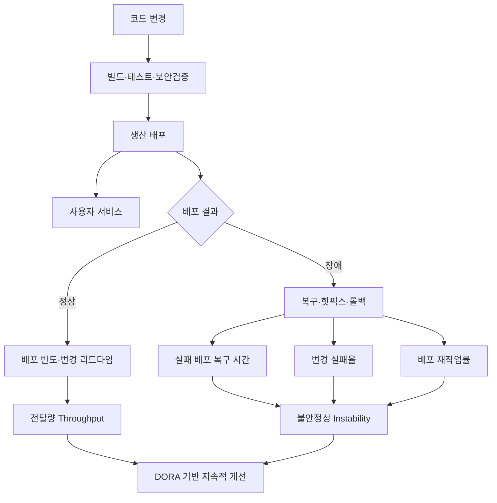
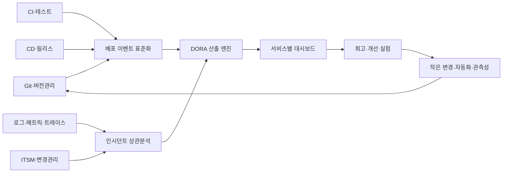

# DORA 소프트웨어 전달 성과 지표(DORA Metrics)

## 1. 개요

> **DORA 지표**란 소프트웨어를 얼마나 자주, 빠르게, 안정적으로 사용자에게 전달하고 장애·재작업을 얼마나 잘 통제하는지를 애플리케이션 또는 서비스 단위로 측정하는 전달 성과 지표 체계다.

DevOps와 지속적 전달을 도입한 조직은 파이프라인 실행 횟수나 완료한 티켓 수가 늘었다는 사실만으로 성과를 판단하기 어렵다.

배포 횟수가 많아도 장애가 반복되면 사용자 가치가 증가하지 않고, 개발자가 많은 기능을 만들었어도 운영 복구가 느리면 조직 전체의 신뢰성이 떨어진다.

반대로 변경을 작게 나누고 자동화된 검증을 통과시켜 자주 배포하면서도 장애 영향을 짧게 제한한다면, 속도와 안정성을 함께 개선할 수 있다.

DORA 지표는 이러한 결과를 공통 언어로 표현해 개발·테스트·보안·운영·제품 조직이 하나의 서비스 성과를 놓고 대화하게 한다.

DORA는 전달량(Throughput)과 불안정성(Instability)을 함께 보도록 구성한다.

현재 공식 가이드의 다섯 지표는 변경 리드타임, 배포 빈도, 실패 배포 복구 시간, 변경 실패율, 배포 재작업률이다.

앞의 세 지표는 얼마나 많은 변경이 생산 환경으로 흐르는지를 설명하고, 뒤의 두 지표는 그 변경이 얼마나 안정적으로 작동했는지를 설명한다.

따라서 DORA를 단순히 “배포를 빨리 하는 방법”으로 해석하면 안 된다.

측정의 목적은 특정 팀을 줄 세우거나 목표 숫자를 강제하는 것이 아니라, 서비스 전달 흐름의 병목과 개선 실험의 효과를 발견하는 데 있다.

역사적으로는 배포 빈도·변경 리드타임·복구 시간·변경 실패율의 네 가지 핵심 지표에서 출발했으며, 최근에는 실패 배포 복구 시간을 변경으로 유발된 장애에 더 초점을 맞춰 정의하고 배포 재작업률을 추가하는 방향으로 정교화되었다.

이러한 정의 변화는 지표가 고정된 평가표가 아니라 기술과 연구 결과에 맞춰 개선되는 측정 모델임을 보여준다.

## 2. 지표 체계와 개념도

DORA 지표는 서비스의 전달 흐름을 한쪽 축으로, 배포 결과의 안정성을 다른 축으로 놓는다.

전달량이 높다는 것은 변경이 오랫동안 대기하지 않고 생산 환경에 도달한다는 뜻이다.

불안정성이 낮다는 것은 배포가 사용자 장애를 만들지 않고, 문제가 생겨도 신속하게 복구되며, 계획되지 않은 재작업이 작다는 뜻이다.

두 축을 함께 보아야 “빠르지만 깨지는 팀”과 “안정적이지만 아무것도 배포하지 못하는 팀”을 구분할 수 있다.

변경 리드타임은 하나의 커밋이 생산 환경에서 성공적으로 실행될 때까지 걸린 시간이다.

배포 빈도는 일정 기간에 성공적으로 생산 배포한 횟수 또는 배포 사이의 간격으로 측정한다.

실패 배포 복구 시간은 소프트웨어 변경으로 서비스가 저하된 뒤 복구하는 데 걸린 시간에 초점을 맞춘다.

변경 실패율은 생산 배포 가운데 즉각적인 개입, 롤백, 핫픽스 또는 수정 배포가 필요했던 비율이다.

배포 재작업률은 정상적인 계획 기능이 아니라 생산 장애를 고치기 위해 수행한 계획되지 않은 배포의 비율이다.

다섯 지표는 같은 분모와 시간 범위를 사용해야 의미 있는 흐름을 보여준다.

예를 들어 한 팀은 커밋부터 배포까지를 재고, 다른 팀은 풀 리퀘스트 생성부터 배포까지를 재면 두 팀의 리드타임을 비교할 수 없다.

또한 서비스마다 배포 단위와 장애의 정의가 다르므로, 조직 전체 평균보다 하나의 애플리케이션 또는 서비스에 대한 추세를 먼저 관찰해야 한다.

## 3. 다섯 가지 핵심 지표

### 가. 변경 리드타임(Change Lead Time)

변경 리드타임은 변경이 버전 관리 시스템에 커밋된 시점부터 생산 환경에 성공적으로 배포된 시점까지의 시간이다.

이 지표는 개발자가 실제 코드를 작성한 시간만 재는 것이 아니라, 검토·빌드·테스트·승인·릴리스 대기까지 전달 시스템 전체의 대기와 처리 시간을 포함한다.

따라서 값이 길다면 개발자 개인의 생산성이 낮다고 결론 내리기보다 어느 단계에서 큐가 형성되는지 먼저 확인해야 한다.

예를 들어 평균 코딩 시간은 짧지만 보안 검토가 주 1회 배치로 운영되면 변경은 검토 대기열에서 오래 머문다.

반대로 작은 변경을 자주 통합하고 자동화된 테스트와 배포를 사용하면 단계별 대기 시간이 줄어든다.

측정식은 다음과 같이 표현할 수 있다.

`변경 리드타임 = 생산 성공 배포 시각 - 해당 변경의 커밋 시각`

하나의 배포에 여러 커밋이 포함된다면 어떤 커밋을 대표 변경으로 볼지 규칙을 정해야 한다.

가장 오래된 커밋을 기준으로 삼으면 배치 크기의 지연을 볼 수 있지만, 배포 직전의 변경만 포함하면 실제 대기 병목을 놓칠 수 있다.

기술사 답안에서는 정의뿐 아니라 측정 경계와 예외 처리까지 제시해야 지표의 신뢰성이 높아진다.

### 나. 배포 빈도(Deployment Frequency)

배포 빈도는 특정 서비스가 실제 사용자에게 변경을 전달하는 빈도다.

개발 브랜치에 코드를 자주 병합했거나 테스트 환경에 여러 번 배포했다는 사실은 생산 전달 성과와 다르므로, 생산 또는 최종 사용자 릴리스라는 기준을 명확히 해야 한다.

배포 빈도가 높으면 큰 릴리스의 위험을 작은 단위로 분해할 수 있고, 피드백 주기가 짧아진다.

그러나 빈도만 높이고 변경 실패율을 보지 않으면 기능 플래그를 무분별하게 켜거나 장애를 반복하는 잘못된 최적화가 발생할 수 있다.

따라서 빈도는 안정성 지표와 항상 묶어서 해석해야 한다.

예를 들어 월 2회 대규모 릴리스에서 주 20회의 작은 배포로 전환할 때, 배포 자체의 성공 여부와 사용자 노출 여부를 구분해 기록해야 한다.

기능 플래그로 코드가 배포되었지만 기능이 비활성 상태인 경우에는 조직의 측정 목적에 따라 배포와 릴리스를 별도로 모델링할 수 있다.

### 다. 실패 배포 복구 시간(Failed Deployment Recovery Time)

실패 배포 복구 시간은 변경이 생산 서비스에 장애 또는 성능 저하를 만든 시점부터 정상 서비스가 회복될 때까지의 시간이다.

기존의 MTTR이라는 표현은 모든 장애 원인을 포괄하는 것처럼 사용되었지만, DORA의 최신 정의는 소프트웨어 변경으로 발생한 실패 배포를 중심으로 측정한다.

데이터센터 정전이나 외부 통신사업자 장애를 변경 실패 복구 시간에 섞으면 전달 파이프라인의 안정성을 왜곡할 수 있기 때문이다.

복구 종료 조건은 모니터링 정상화, 사용자 영향 해소, 롤백 완료, 또는 서비스 수준 목표 회복 중 무엇인지 사전에 정의해야 한다.

롤백이 빠르더라도 데이터 마이그레이션이 되돌아가지 않았다면 완전한 복구로 볼 수 없는 사례가 있다.

따라서 애플리케이션·데이터베이스·메시지 소비자·캐시의 일관성까지 복구 범위에 포함할지 서비스별로 결정한다.

### 라. 변경 실패율(Change Fail Rate)

변경 실패율은 생산 배포 중 즉시 개입이 필요했던 배포의 비율이다.

`변경 실패율 = 실패로 분류된 생산 배포 수 / 전체 생산 배포 수 × 100`

실패는 장애, 롤백, 핫픽스, 긴급 패치처럼 배포 결과를 정상 상태로 되돌리기 위한 조치가 필요했던 경우로 정의할 수 있다.

단순히 자동 배포 단계가 실패했다는 이유만으로 사용자 영향이 없었던 배포를 모두 실패로 잡으면 파이프라인 품질과 서비스 품질을 혼동하게 된다.

반대로 장애를 인지하지 못했거나 수동으로 조용히 수정한 사례를 제외하면 지표가 좋아 보이는 편향이 생긴다.

사건 분류 규칙과 인시던트 기록을 연결해 동일한 기준을 유지하는 것이 중요하다.

### 마. 배포 재작업률(Deployment Rework Rate)

배포 재작업률은 계획된 기능 전달이 아니라 생산 문제를 해결하기 위해 수행한 계획되지 않은 배포의 비율이다.

변경 실패율은 특정 배포가 실패했는지를 묻지만, 재작업률은 팀의 배포량 중 얼마나 많은 용량이 버그 수정과 장애 대응에 소비되는지를 보여준다.

예를 들어 원래 계획된 기능 배포가 80건이고 장애 수정 배포가 20건이면, 간단한 운영 정의에서 재작업률은 `20 / (80 + 20) × 100 = 20%`로 볼 수 있다.

분모와 계획 여부를 조직의 릴리스 관리 방식에 맞춰 고정해야 한다.

긴급 보안 패치는 재작업이 아니라 계획되지 않은 위험 대응으로 분류할 수도 있으므로, 분류 정책과 예외를 문서화해야 한다.

재작업률이 높으면 테스트 결함, 요구사항 누락, 배포 위험, 관측성 부족, 운영 피드백 지연 중 하나가 원인일 가능성이 있다.

따라서 숫자를 낮추는 것보다 재작업이 발생한 흐름을 원인 분석하고, 자동 회귀 테스트나 점진적 배포 같은 개선 항목으로 전환해야 한다.

## 4. 측정 데이터와 산출 프로세스

DORA 지표는 하나의 모니터링 도구가 자동으로 완성해 주는 값이 아니라 여러 시스템의 사건을 연결한 결과다.

버전 관리 시스템에서는 커밋 해시, 브랜치, 작성 시각, 병합 시각을 수집한다.

CI 시스템에서는 빌드 시작·종료, 테스트 결과, 보안검사 결과, 승인 기록을 수집한다.

CD 시스템에서는 배포 시작·완료, 대상 환경, 릴리스 버전, 롤백 여부를 수집한다.

관측성 플랫폼과 ITSM에서는 오류율, 영향 시작·종료, 인시던트, 복구 조치, 사용자 영향 정보를 연결한다.

첫 단계는 서비스 카탈로그를 정하고 저장소·파이프라인·운영 자원을 하나의 서비스 식별자로 매핑하는 것이다.

서비스 식별자가 없으면 여러 팀의 커밋이 하나의 배포로 합쳐지고, 소유권과 장애 영향 범위를 파악하기 어렵다.

둘째 단계는 이벤트 스키마를 표준화하는 것이다.

최소한 `service_id`, `commit_sha`, `deployment_id`, `environment`, `started_at`, `completed_at`, `outcome`, `incident_id`, `change_type`을 보관하면 지표 계산의 기반을 만들 수 있다.

셋째 단계는 생산 배포와 사용자 영향 사건을 연결하는 것이다.

배포 버전과 인시던트 시간 창을 비교하고, 원인 분석 결과가 해당 변경에 기인하는지 운영자가 확인해야 한다.

시간 창만으로 모든 장애를 자동 귀속하면 동시 배포나 외부 장애를 잘못 분류할 수 있으므로 자동 판정과 사람의 검토를 결합한다.

넷째 단계는 원천 데이터의 수정 이력과 재계산 가능성을 보장하는 것이다.

대시보드의 현재 숫자만 저장하면 분류 기준 변경이나 장애 사건 정정이 발생했을 때 과거 추세를 재현할 수 없다.

## 5. 적용 절차와 운영 모델

### 가. 기준선 설정

처음부터 업계 상위 수준과 비교하려 하지 말고, 하나의 핵심 서비스에 대해 최근 4~8주 데이터를 수집한다.

기준선 기간에는 숫자를 평가 보상이나 인사 등급에 연결하지 않아야 팀이 불리한 사건을 숨기지 않는다.

평균만 보지 말고 중앙값과 상위 백분위수도 함께 기록하면 일부 대형 장애가 평균을 왜곡하는 문제를 줄일 수 있다.

### 나. 병목 발견

변경 리드타임을 커밋 대기, 코드 리뷰, 빌드, 테스트, 승인, 배포 대기의 구간으로 분해한다.

어떤 구간이 가장 긴지 확인하고, 그 구간의 대기 시간을 줄이는 한 가지 개선 실험을 선택한다.

예를 들어 승인 대기가 병목이면 승인자를 늘리는 것보다 위험 기반 자동 승인과 점진적 배포를 검토할 수 있다.

### 다. 작은 배치와 자동화

변경 크기를 줄이면 검토 범위와 실패 원인이 줄어들고, 장애가 발생해도 복구할 수 있는 선택지가 많아진다.

자동화된 단위 테스트만으로 충분하지 않으므로 계약 테스트, 데이터베이스 호환성 검사, 보안 검사, 배포 후 검증을 단계별로 배치한다.

다만 검증 단계를 추가할수록 리드타임이 늘어날 수 있으므로 위험도에 따라 병렬 실행과 비동기 검토를 설계한다.

### 라. 점진적 배포와 빠른 복구

블루-그린, 카나리, 롤링 배포는 전체 사용자가 동시에 새 변경을 받는 위험을 줄인다.

자동 롤백 조건은 오류율·지연시간·핵심 업무 성공률처럼 사용자 영향과 가까운 신호로 정해야 한다.

롤백만으로 해결되지 않는 스키마 변경은 expand-contract 패턴과 하위 호환을 적용해 애플리케이션과 데이터 변경의 순서를 분리한다.

### 마. 회고와 반복

지표를 주간 회의의 보고 숫자로 끝내지 않고, 서비스 담당자가 병목·실험·결과를 함께 기록하는 개선 루프로 운영한다.

개선 실험의 성공 기준은 DORA 지표 하나의 변화뿐 아니라 장애 영향, 보안 위험, 개발자 경험, 고객 가치까지 포함해야 한다.

## 6. 다른 지표 체계와 비교

DORA는 전달 시스템의 흐름과 안정성을 측정하는 데 강점이 있고, SRE 지표는 사용자 관점의 신뢰성을 설명하는 데 강점이 있다.

제품 조직의 OKR은 사업 결과를 설명하지만 배포 파이프라인의 어느 단계가 막혔는지는 직접 보여주지 못한다.

따라서 세 체계를 대체 관계로 보지 말고, 결과-서비스-전달의 서로 다른 관측 계층으로 연결해야 한다.

| 구분 | DORA 지표 | SRE 지표 | 제품·사업 OKR |
|---|---|---|---|
| 주된 질문 | 변경을 얼마나 빠르고 안정적으로 전달하는가 | 사용자에게 신뢰할 수 있는 서비스를 제공하는가 | 사업 목표와 고객 가치를 달성했는가 |
| 대표 항목 | 리드타임, 빈도, 복구 시간, 실패율, 재작업률 | SLI, SLO, 오류 예산, 가용성, 지연시간 | 전환율, 유지율, 매출, 고객 만족 |
| 관측 단위 | 애플리케이션·서비스의 전달 흐름 | 사용자 여정·서비스 신뢰성 | 제품·사업 포트폴리오 |
| 주된 활용 | 전달 병목과 개선 실험 | 운영 우선순위와 안정성 예산 | 전략 방향과 투자 판단 |

DORA 지표가 좋아졌는데 SLO 위반이 늘었다면 배포 자동화가 사용자 영향 검증보다 앞서 있을 수 있다.

반대로 SLO는 안정적이지만 리드타임이 지나치게 길다면 변경 승인과 통합 구조가 혁신을 막는지 살펴봐야 한다.

이처럼 지표 간 긴장을 숨기지 않고 원인과 맥락을 함께 읽는 것이 단일 점수화를 피하는 방법이다.

## 7. 사례: 금융 결제 서비스의 전달 개선

금융 결제 서비스는 변경 실패가 금전 손실과 규제 보고로 이어질 수 있어, 단순히 배포 빈도를 높이는 방식은 적절하지 않다.

가상의 결제 서비스가 월 8회 생산 배포, 평균 변경 리드타임 9일, 변경 실패율 12%, 실패 배포 복구 시간 6시간을 기록한다고 가정한다.

먼저 저장소·CI·CD·인시던트 데이터를 `payment-service` 식별자로 연결하고, 긴급 보안 패치와 정기 기능 배포의 분류 기준을 문서화한다.

분석 결과 코드 리뷰 대기가 평균 3일이고, 수동 회귀 테스트가 4일을 차지한다면 병목은 개발자의 코딩 속도가 아니라 전달 승인 구조다.

팀은 결제 금액 계산과 승인 흐름에 계약 테스트를 추가하고, 저위험 변경에는 자동 승인·카나리 배포를 적용한다.

데이터베이스 스키마는 구버전 애플리케이션이 읽을 수 있도록 먼저 확장하고, 모든 인스턴스가 새 코드를 사용하는 뒤에 구필드를 제거한다.

배포 후 오류율과 승인 성공률을 15분 동안 관찰하고 임계치를 넘으면 자동 중지 또는 롤백한다.

8주 뒤 월 배포 횟수가 8회에서 24회로 증가하고 평균 리드타임이 9일에서 2일로 줄어도, 변경 실패율과 복구 시간이 악화되지 않았는지 함께 확인해야 한다.

만약 재작업률이 증가했다면 테스트 범위나 데이터 검증을 보강하고, 숫자를 되돌리기 위해 배포를 억지로 줄이지 않는다.

이 사례의 핵심은 규제 환경에서도 통제된 작은 변경과 감사 가능한 자동화를 통해 속도와 안정성을 동시에 추구할 수 있다는 점이다.

## 8. 심화: 최신 정의 변화와 시험 답안 전략

DORA 지표는 과거의 네 가지 핵심 지표를 그대로 암기하는 문제가 아니라, 측정 대상과 분류 기준이 왜 바뀌었는지를 설명하는 주제로 확장할 수 있다.

최신 공식 안내는 전달량을 변경 리드타임·배포 빈도·실패 배포 복구 시간으로, 불안정성을 변경 실패율·배포 재작업률로 나누어 설명한다.

여기서 실패 배포 복구 시간은 일반적인 모든 장애 복구 시간이 아니라 소프트웨어 변경으로 발생한 서비스 저하의 복구에 초점을 둔다.

또한 배포 재작업률은 실패 배포의 존재만으로는 드러나지 않는 “계획된 전달 용량 중 재작업에 소비되는 비율”을 보완한다.

답안은 `정의와 배경 → 5대 지표 및 산식 → 데이터 수집 아키텍처 → 적용 절차 → SRE·OKR 비교 → 사례 → 한계와 시사점` 순서로 구성하면 논리 흐름이 분명하다.

표에는 항목을 정리하되, 각 지표가 어떤 의사결정을 지원하고 잘못 측정했을 때 어떤 왜곡이 생기는지를 산문으로 설명해야 한다.

“배포 빈도는 높을수록 무조건 좋다”와 같은 단정은 피하고, 서비스별 맥락·규제·배포 단위·사용자 영향을 전제해야 한다.

Goodhart의 법칙 관점에서는 지표를 목표 숫자로 강제할 때 팀이 분모를 조작하거나 장애를 숨길 수 있음을 지적할 수 있다.

기술사 관점의 차별화 포인트는 데이터 표준화, 서비스 카탈로그, 이벤트 상관분석, 자동 롤백, 오류 예산, 보안·규제 통제를 하나의 운영 거버넌스로 연결하는 데 있다.

## 9. 고려사항 및 시사점

1. **서비스 단위 측정 원칙**: 서로 다른 기술 스택과 사용자 특성을 가진 애플리케이션을 한 줄로 비교하지 말고, 서비스별 기준선과 추세를 우선 관리한다.

2. **속도와 안정성의 동시 최적화**: 배포 빈도나 리드타임만 평가하지 말고 변경 실패율·복구 시간·재작업률을 함께 보아 국소 최적화를 방지한다.

3. **측정 정의의 일관성**: 커밋 기준, 생산 배포 기준, 장애 귀속 조건, 복구 종료 조건, 재작업 분모를 데이터 사전으로 고정하고 변경 이력을 관리한다.

4. **지표의 비강제성**: 팀 간 순위와 개인 평가에 직접 연결하면 숨김·조작·위험한 배포가 늘 수 있으므로, 회고와 개선 실험의 학습 자료로 사용한다.

5. **자동화와 통제의 균형**: 승인 단계를 무조건 제거하지 말고 변경 위험도에 따라 자동 승인, 동료 검토, 보안 승인, 카나리 범위를 차등화한다.

6. **데이터·보안 변경의 복구성**: 애플리케이션 롤백만으로 데이터가 복구되지 않을 수 있으므로 스키마 호환, 백업, 보상 트랜잭션, 감사 로그를 함께 설계한다.

7. **관측성과 원인 분석**: 로그·메트릭·트레이스를 배포 버전과 연결해 사용자 영향과 변경 원인을 구분하고, 외부 장애를 변경 실패로 잘못 귀속하지 않는다.

8. **경영 성과와의 연결**: DORA 개선이 고객 가치, 신뢰성, 비용, 개발자 웰빙에 어떤 영향을 주는지 SLO·OKR과 연결하되 하나의 종합 점수로 지나치게 단순화하지 않는다.

9. **지속적 모델 개선**: 새 기술이나 운영 방식이 등장하면 지표 정의를 재검토하고 과거 데이터와의 비교 가능성을 유지하도록 버전이 있는 측정 정책을 운영한다.

## 참고자료

- DORA, “DORA’s software delivery performance metrics” — https://dora.dev/guides/dora-metrics/
- DORA, “A history of DORA’s software delivery metrics” — https://dora.dev/insights/dora-metrics-history/
- DORA, “DORA’s Research Program” — https://dora.dev/research/

---

> **한 줄 요약**: DORA 지표는 서비스별 변경 리드타임·배포 빈도·실패 배포 복구 시간·변경 실패율·배포 재작업률을 전달량과 불안정성 관점에서 함께 측정하여, 숫자 경쟁이 아니라 작고 안전한 변경과 지속적 개선을 이끄는 DevOps 성과 체계다.
