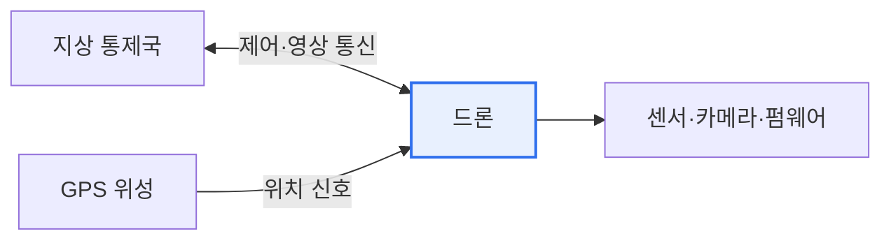

# 드론의 보안위협과 대응방안

## 1. 개요

### 가. 정의
> **드론(무인비행장치)** 은 원격 조종 또는 자율 비행하는 항공기로, 통신(제어·영상)·항법(GPS)·센서·소프트웨어로 구성된다. 물류·촬영·농업·군사·감시 등으로 급속히 확산되며 그만큼 보안 위협도 커지고 있다.

드론 보안이 특별히 중요한 이유는 '**사이버 위협이 곧바로 물리적 피해로 이어진다**'는 데 있다. 일반 IT 시스템의 해킹은 데이터 유출·서비스 중단에 그치지만, 드론은 하늘을 나는 물리적 실체다. 해킹당한 드론은 추락하거나 다른 물체·사람과 충돌해 인명 피해를 낼 수 있고, 탈취된 촬영 영상은 프라이버시를 침해하며, GPS가 교란되면 엉뚱한 곳으로 날아간다. 더 나아가 드론 자체가 불법 촬영·물리적 침투·테러의 도구가 되기도 한다. 즉 드론은 '공격의 대상'이면서 동시에 '공격의 수단'이 될 수 있어, 안전(Safety)과 보안(Security)을 함께 다뤄야 한다.

### 나. 구성과 위협 지점
드론은 지상 통제국과의 무선 통신, GPS 위성으로부터의 위치 신호, 탑재된 센서·카메라, 이를 제어하는 소프트웨어로 이뤄진다. 각 요소가 모두 공격 표면이 된다.

## 2. 위협 지점 개념도

## 3. 보안 위협

드론의 위협은 구성요소별로 나타난다. 가장 잘 알려진 것은 **GPS 스푸핑·재밍** 으로, 위조된 GPS 신호를 보내 드론의 위치 인식을 조작하거나 신호를 교란해 항법을 마비시킨다(실제로 GPS 스푸핑으로 드론을 탈취한 사례가 보고되었다). **통신 하이재킹** 은 제어 채널을 탈취하거나 중간자 공격으로 드론을 장악하는 것이고, **데이터 유출** 은 촬영 영상·비행 데이터를 가로채 프라이버시를 침해한다. **펌웨어 변조** 는 드론 소프트웨어를 감염시켜 오작동을 유발하며, 드론 자체가 불법 촬영·침투에 **악용** 되기도 한다.

| 위협 | 내용 |
|---|---|
| **GPS 스푸핑/재밍** | 위조 신호로 위치 조작·항법 마비 |
| **통신 하이재킹** | 제어 채널 탈취·중간자 공격 |
| **데이터 유출** | 촬영 영상·비행 데이터 탈취 |
| **펌웨어 변조** | 소프트웨어 감염·오작동 |
| **드론 악용** | 불법 촬영·물리 침투·테러 |

## 4. 대응 방안

대응은 위협에 대응해 다층적으로 이뤄진다. 제어·영상 통신은 암호화·인증으로 보호하고, GPS는 신호 인증과 관성항법(INS) 병행·스푸핑 탐지로 보완한다. 펌웨어는 서명·보안 부팅으로 무결성을 지키고, 침입하는 드론을 탐지·무력화하는 **안티드론** 시스템(레이더·RF 탐지, 재밍·포획)을 갖춘다. 제도적으로는 비행 등록·원격 식별(Remote ID)과 비행금지구역으로 관리한다.

| 대응 | 내용 |
|---|---|
| **통신 보안** | 제어·영상 채널 암호화·인증 |
| **GPS 보안** | 신호 인증, INS 병행, 스푸핑 탐지 |
| **펌웨어 무결성** | 서명·보안 부팅·업데이트 검증 |
| **안티드론** | 탐지(레이더·RF)·무력화(재밍·포획) |
| **제도** | 비행 등록·원격 식별(Remote ID), 비행금지구역 |

## 5. 고려사항 및 시사점

1. **안전과 보안의 융합 대응**이 필요하다. 드론은 물리와 사이버가 결합된 시스템이므로, 해킹 방어(Security)와 추락·충돌 방지(Safety)를 통합적으로 설계해야 한다.
2. **식별·추적의 제도화**가 확산되고 있다. 원격 식별(Remote ID)로 모든 드론을 식별·추적하게 해 불법 비행을 억제하고 사고 시 책임을 추적한다.
3. **자율·군집 드론 시대의 새로운 위협**에 대비해야 한다. 자율 비행이 늘수록 AI 보안(적대적 공격)이, 군집(Swarm) 운용이 늘수록 대규모 동시 위협 대응이 과제가 된다.

---

> **한 줄 요약**: 드론은 GPS 스푸핑·통신 하이재킹·데이터 유출·펌웨어 변조 위협을 받으며 사이버 위협이 물리 피해로 직결되므로, *통신·GPS·펌웨어 보안 + 안티드론 + 제도(Remote ID)* 로 안전과 보안을 통합 대응해야 한다.
