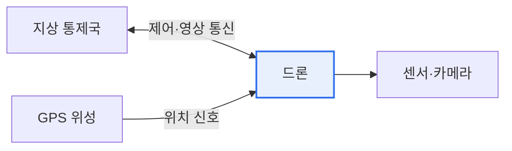

# 드론의 보안위협과 대응방안

## 1. 개요

### 가. 정의
> **드론(무인비행장치)** 은 원격·자율로 비행하는 항공기로, 통신(제어·영상)·센서(GPS)·소프트웨어로 구성된다. 물류·촬영·군사·감시 등으로 확산되며 보안 위협도 증가하고 있다.

드론의 보안이 특별히 중요한 이유는 '**물리 세계에 직접 영향**'을 미치기 때문이다. 해킹된 드론은 추락·충돌로 인명 피해를 내거나, 촬영 영상 유출로 프라이버시를 침해하고, 통신 교란으로 오작동한다. 또한 드론 자체가 공격 수단(불법 촬영·물리 침투)이 되기도 한다.

## 2. 드론 구성과 위협 지점

## 3. 보안 위협

| 위협 | 내용 |
|---|---|
| **GPS 스푸핑/재밍** | 위조 GPS 신호로 위치 조작·경로 탈취 |
| **통신 하이재킹** | 제어 채널 탈취·중간자 공격 |
| **데이터 유출** | 촬영 영상·비행 데이터 탈취(프라이버시) |
| **악성코드·펌웨어 변조** | 드론 소프트웨어 감염·오작동 |
| **드론 자체 악용** | 불법 촬영·물리 침투·테러 |

## 4. 대응 방안

| 대응 | 내용 |
|---|---|
| **통신 보안** | 제어·영상 채널 암호화·인증 |
| **GPS 보안** | 신호 인증, 다중 항법(INS 병행), 스푸핑 탐지 |
| **펌웨어 무결성** | 서명·보안 부팅, 업데이트 검증 |
| **안티드론** | 탐지(레이더·RF)·무력화(재밍·포획) 시스템 |
| **제도** | 비행 등록·식별(Remote ID), 비행금지구역 |

## 5. 시사점
- **안전(Safety)과 보안(Security)의 융합** — 물리·사이버 통합 대응 필요
- Remote ID 등 식별·추적 제도화, 안티드론 방어 체계 구축
- 자율 드론 확산으로 AI 보안·군집(Swarm) 위협 대비

---

> **한 줄 요약**: 드론은 GPS 스푸핑·통신 하이재킹·데이터 유출·펌웨어 변조 위협을 받으며, *통신·GPS·펌웨어 보안 + 안티드론 + 제도(Remote ID)* 로 물리·사이버를 통합 대응한다.
