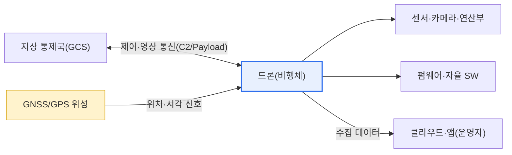
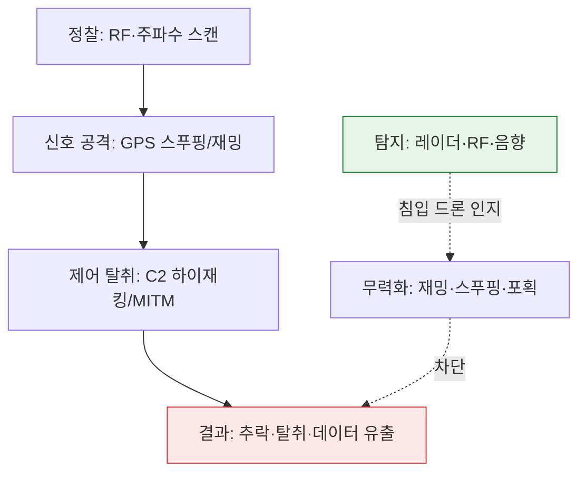

# 드론의 보안위협과 대응방안

## 1. 개요

### 가. 정의

> **드론(무인비행장치, UAV/Drone)** 은 조종사가 탑승하지 않고 원격 조종 또는 사전 프로그램·자율 알고리즘에 의해 비행하는 항공기로, 지상 통제국(GCS)과의 **통신(제어·영상 링크)**, 위성 기반 **항법(GNSS/GPS)**, 자세·환경 인식을 위한 **센서**, 이 모든 것을 제어하는 **비행 소프트웨어(펌웨어)** 로 구성된 사이버-물리 시스템(CPS)이다.

드론은 물류 배송·항공 촬영·정밀 농업·시설물 점검·재난 감시·군사 정찰 등으로 급속히 확산되고 있으며, 국토교통부 통계 기준 국내 드론 신고 대수와 조종자격 취득자가 매년 큰 폭으로 늘고 있다. 확산 속도만큼 공격 표면(Attack Surface)도 넓어져, 드론 보안은 단순한 정보보호를 넘어 **공공안전(Public Safety)** 의 문제로 부상했다.

드론 보안이 일반 IT 보안과 근본적으로 다른 이유는 '**사이버 위협이 곧바로 물리적 피해로 전환된다**'는 데 있다. 전통적 IT 시스템의 침해는 데이터 유출·서비스 중단 같은 논리적(logical) 피해에 머무는 경우가 많지만, 드론은 하늘을 나는 수 kg~수십 kg의 물리적 실체다. 제어권을 탈취당한 드론은 추락하거나 사람·건물·항공기와 충돌해 즉각적인 인명·재산 피해를 낸다. 즉 드론의 위협 모델은 기밀성(Confidentiality)·무결성(Integrity)·가용성(Availability)의 CIA 3요소에 더해 **안전(Safety)** 을 최상위 요구사항으로 포함해야 한다.

또 하나의 특수성은 드론이 '**공격의 대상(Target)이면서 동시에 공격의 수단(Weapon)**'이라는 양면성이다. 한편으로 드론 자체가 해킹·재밍의 표적이 되고, 다른 한편으로 정상 드론이 불법 촬영·물리적 침투·마약 밀반입·요인 위협·주요시설 정찰의 도구로 악용된다. 2018년 영국 개트윅 공항이 미확인 드론 출현으로 약 36시간 폐쇄되어 14만 명의 항공편이 영향을 받은 사건, 2018년 베네수엘라에서 폭발물을 탑재한 드론이 국가 행사장 상공에서 터진 사건은 드론이 수단으로 쓰일 때의 파급력을 상징적으로 보여준다. 따라서 드론 보안은 '내 드론을 지키는 방어(Blue)'와 '침입 드론을 막는 대응(Anti-Drone)'을 함께 설계해야 한다는 점에서 이중 구조를 갖는다.

### 나. 구성요소와 위협 지점

드론 시스템은 크게 지상 통제국(GCS), 무선 통신 링크(C2 및 페이로드 링크), GNSS 항법 신호, 탑재 센서·카메라·연산장치, 이를 구동하는 펌웨어·앱으로 나뉜다. 문제는 **이 요소 하나하나가 모두 독립적인 공격 표면** 이라는 점이다. 통신 링크는 대부분 2.4GHz·5.8GHz 등 개방된 ISM 대역을 쓰고, 소비자용 드론의 상당수는 제어 신호가 암호화되어 있지 않거나 약한 인증만을 사용한다. 민간용 GPS(L1 C/A)는 신호가 공개 규격이고 세기가 매우 약해(수신 전력 약 -125dBm 수준) 위조·교란에 구조적으로 취약하다. 이러한 '태생적 취약성' 때문에 드론 보안은 개별 요소의 방어를 넘어 계층 전반의 통합 설계가 요구된다.

## 2. 드론 시스템 구성 및 위협 지점 개념도

먼저 드론이 어떤 요소로 이뤄지고 각 요소가 어디에서 공격받는지를 전체 구조도로 조망한다. 지상 통제국과 드론은 양방향 무선으로 제어·영상을 주고받고, 드론은 GPS 위성에서 위치 신호를 일방적으로 수신하며, 내부적으로는 센서·펌웨어가 자율 판단을 수행한다. 각 화살표(경로)와 노드(구성요소)가 곧 위협 지점이 된다.

```mermaid
flowchart LR
  G["지상 통제국(GCS)"] <-->|"제어·영상 통신(C2/Payload)"| D["드론(비행체)"]
  S["GNSS/GPS 위성"] -->|"위치·시각 신호"| D
  D --> A["센서·카메라·연산부"]
  D --> F["펌웨어·자율 SW"]
  D -->|"수집 데이터"| C["클라우드·앱(운영자)"]
  style D fill:#e8f0fe,stroke:#2f6fed,stroke-width:2px
  style S fill:#fff3cd,stroke:#d39e00
```

전체 구조가 '통신·항법·연산·데이터'의 네 축으로 나뉜다는 점을 잡았다면, 다음으로 실제 공격이 시간 순서로 어떻게 전개되는지를 프로세스 관점에서 봐야 대응의 개입 지점을 정할 수 있다. 아래 다이어그램은 공격자가 정찰에서 시작해 신호 교란·제어 탈취·데이터 유출로 이어지는 킬체인(Kill-chain)과, 방어 측이 탐지·무력화로 개입하는 흐름을 나타낸 것이다.

```mermaid
flowchart TD
  R["정찰: RF·주파수 스캔"] --> J["신호 공격: GPS 스푸핑/재밍"]
  J --> H["제어 탈취: C2 하이재킹/MITM"]
  H --> E["결과: 추락·탈취·데이터 유출"]
  DET["탐지: 레이더·RF·음향"] -.->|"침입 드론 인지"| MIT["무력화: 재밍·스푸핑·포획"]
  MIT -.->|"차단"| E
  style E fill:#fde8e8,stroke:#e02f2f
  style DET fill:#e6f4ea,stroke:#1e7e34
```

## 3. 보안 위협 상세

드론의 위협은 구성요소별로 뚜렷하게 구분되므로, '왜 그 위협이 성립하는지'를 원리 수준에서 이해해야 방어를 설계할 수 있다.

### 가. GPS 스푸핑·재밍(항법 계층)

가장 상징적인 위협은 GNSS를 겨냥한 **스푸핑(Spoofing)과 재밍(Jamming)** 이다. 재밍은 GPS 대역에 강한 잡음을 방사해 정상 위성 신호를 묻어버리는 것으로, 드론은 위치를 잃고 호버링·귀환(RTH)·강제 착륙 등 실패 모드로 빠진다. 스푸핑은 한층 교묘하다. 실제 위성보다 약간 강한 위조 신호를 만들어 드론이 이를 진짜로 착각하게 한 뒤, 위조 신호의 좌표를 서서히 이동시켜 드론을 조종자가 의도하지 않은 곳으로 유도한다. 2011년 이란이 미국 RQ-170 정찰 드론을 스푸핑으로 유도·포획했다고 주장한 사건, 2012년 텍사스대 연구팀이 약 1,000달러 수준 장비로 민간 드론을 스푸핑해 항로를 바꾼 실증 실험은 이 위협이 이론이 아님을 보여준다.

이 위협이 근본적으로 성립하는 이유는 민간 GPS 신호가 **인증 수단이 없는 공개 규격**이고 수신 전력이 극도로 약하기 때문이다. 신호에 서명이 없으니 드론은 '이 신호가 진짜 위성에서 왔는지'를 검증할 방법이 없고, 지상 근처의 송신기가 위성보다 훨씬 강한 신호를 만들기 쉽다. 따라서 항법 계층의 방어는 '단일 신호원에 대한 맹신'을 깨는 방향이어야 한다.

### 나. 통신 하이재킹·중간자 공격(통신 계층)

**통신 하이재킹** 은 지상국과 드론 사이의 제어(C2) 채널을 탈취하거나, 중간자(MITM)로 끼어들어 명령을 위·변조하는 공격이다. 소비자용 드론의 제어 프로토콜이 약한 인증만을 쓰거나 세션 키 관리가 허술할 경우, 공격자는 재전송(Replay) 공격이나 프로토콜 취약점을 이용해 조종권을 빼앗을 수 있다. 실제로 특정 상용 드론의 Wi-Fi 기반 제어에서 인증 우회로 드론을 탈취하는 시연(예: 'SkyJack' 류의 공격)이 공개된 바 있다. 이 위협의 배경 역시 '개방 대역 + 약한 암호'라는 구조적 문제이며, 대응은 채널 암호화와 강한 상호 인증으로 귀결된다.

### 다. 데이터 유출과 펌웨어 변조(데이터·SW 계층)

**데이터 유출** 은 드론이 촬영·수집하는 영상·비행 로그·위치 정보를 전송 구간이나 저장소에서 가로채는 위협이다. 시설물·군사시설을 촬영하는 드론이라면 유출된 영상 자체가 국가·산업 기밀이 될 수 있고, 일반 촬영이라도 개인정보·초상권 침해로 이어진다. **펌웨어 변조** 는 드론의 비행 소프트웨어에 악성코드를 심거나 무결성이 확인되지 않은 업데이트를 주입해 오작동·백도어를 유발하는 것으로, 서명·보안 부팅이 없는 기체에서 특히 위험하다. 마지막으로 정상 드론이 그 자체로 **불법 촬영·물리 침투·테러의 수단으로 악용** 되는 위협은, 앞의 두 계층과 달리 '기술적 방어'만으로는 막기 어렵고 탐지·무력화·제도가 함께 필요하다.

| 위협 | 대상 계층 | 핵심 원리 | 실제/대표 사례 |
|---|---|---|---|
| **GPS 스푸핑/재밍** | 항법 | 위조·잡음으로 위치 인식 조작·마비 | 2011 RQ-170, 2012 텍사스대 실증 |
| **통신 하이재킹** | 통신 | C2 채널 탈취·MITM·재전송 | SkyJack류 Wi-Fi 탈취 시연 |
| **데이터 유출** | 데이터 | 전송·저장 구간 영상·로그 가로채기 | 시설 촬영 영상 유출 |
| **펌웨어 변조** | SW | 무결성 미검증 업데이트·악성코드 | 백도어·오작동 유발 |
| **드론 악용(수단화)** | 물리 | 정상 기체의 불법 이용 | 2018 개트윅 공항 폐쇄, 베네수엘라 폭발물 |

## 4. 대응 방안

대응은 위협 계층에 1:1로 대응하는 **다층 방어(Defense in Depth)** 로 설계하되, 기술·탐지·제도가 서로를 보완하도록 통합해야 한다.

### 가. 통신·항법·SW 계층의 방어(기체 관점)

통신 계층에서는 제어(C2)와 영상 링크를 모두 **암호화(AES 등)하고 상호 인증** 을 적용해 하이재킹·MITM을 차단하며, 재전송 방지를 위해 세션마다 난스(nonce)·시퀀스를 관리한다. 항법 계층에서는 GPS 단일 의존을 벗어나 **관성항법(INS)·시각 기반 항법(VIO)·기압·지자기 센서를 융합** 하고, 여러 위성군(GPS·Galileo·BeiDou) 신호의 정합성을 교차 검증해 스푸핑을 탐지한다. 신호 도래각(AoA)·수신 전력의 급변을 감지하는 안티스푸핑 수신기도 상용화되고 있다. SW 계층에서는 펌웨어에 **코드 서명·보안 부팅(Secure Boot)·서명된 업데이트 검증** 을 적용해 무결성을 보장한다. 이처럼 계층별 방어의 공통 원리는 '**단일 신뢰 지점을 없애고 다중 근거로 검증**'하는 것이다.

### 나. 안티드론(침입 드론 관점)

내 기체를 지키는 것과 별개로, 침입하는 드론을 막는 **안티드론(C-UAS, Counter-UAS)** 체계가 필요하다. 안티드론은 '탐지(Detect)-식별(Identify)-무력화(Mitigate)'의 단계로 구성된다. 탐지는 레이더(RCS 기반)·RF 스캐너(제어 주파수 탐지)·EO/IR 카메라·음향 센서를 복합적으로 사용해 오탐을 줄이고, 무력화는 제어·GPS 대역을 교란하는 재밍, 위조 신호로 유도하는 스푸핑, 그물·포획 드론으로 물리적으로 잡는 방식, 지향성 에너지(레이저·고출력 마이크로파) 등으로 나뉜다. 다만 공항·도심에서의 재밍은 정상 통신·항법에 부수 피해를 줄 수 있어, 환경에 맞는 무력화 수단 선택이 중요하다.

### 다. 제도·거버넌스

기술만으로는 '수단화된 정상 드론'을 막을 수 없으므로 제도가 마지막 계층을 담당한다. 모든 드론이 비행 중 식별정보를 방송하도록 하는 **원격 식별(Remote ID)** 은 불법 비행 억제와 사고 시 책임 추적의 핵심으로, 미국 FAA는 2023~2024년에 걸쳐 Remote ID를 사실상 의무화했고 EU(EASA)와 국내 제도도 등록·식별을 강화하는 방향으로 정비되고 있다. 여기에 비행금지구역(공항·원전·군사시설 주변) 지정, 기체 신고·조종자격 제도, 지오펜싱(Geo-fencing)이 결합되어 다층 방어를 완성한다.

| 대응 계층 | 핵심 수단 | 대응하는 위협 |
|---|---|---|
| **통신 보안** | C2·영상 암호화, 상호 인증, 재전송 방지 | 하이재킹·MITM |
| **항법 보안** | INS/VIO 융합, 다중 위성군 교차검증, 안티스푸핑 수신기 | GPS 스푸핑·재밍 |
| **SW 무결성** | 코드 서명, 보안 부팅, 서명된 업데이트 | 펌웨어 변조 |
| **안티드론(C-UAS)** | 탐지(레이더·RF·음향)+무력화(재밍·스푸핑·포획·DE) | 드론 악용·침입 |
| **제도·거버넌스** | Remote ID, 등록·자격, 비행금지구역, 지오펜싱 | 수단화·불법 비행 |

## 5. 심화 — 표준·정책 동향과 실무 적용

드론 보안은 기술과 제도가 빠르게 공진화하는 영역이다. 첫째, **식별의 의무화** 가 세계적 흐름이다. 미국 FAA의 Remote ID 규정(Part 89)은 대부분의 등록 드론에 원격 식별 장착·방송을 요구해, 스마트폰으로도 인근 드론의 식별정보와 위치를 확인할 수 있게 했다. EU는 U-space라는 저고도 무인기 교통관리(UTM) 체계를 정비하며 식별·지오어웨어니스를 요건화하고 있다. 이는 '**드론에도 자동차 번호판을 붙인다**'는 발상으로, 익명성에서 오는 위협을 구조적으로 낮춘다.

둘째, **안티드론 시장의 급성장** 이다. 개트윅 사태 이후 주요 공항·경기장·정상회담장에는 레이더+RF+EO/IR을 통합한 C-UAS가 상시 배치되기 시작했고, 국내에서도 국가중요시설·대형 행사(예: 정상회의, 대형 스포츠 이벤트) 경호에 안티드론이 표준 절차로 자리 잡았다. 무력화 수단은 도심 부수 피해를 줄이기 위해 광역 재밍에서 정밀 스푸핑·포획으로 진화하는 추세다.

셋째, **자율·군집(Swarm)·AI 드론이라는 새 지평** 이다. 자율 비행 비중이 커질수록 인식 모델을 겨냥한 **적대적 공격(Adversarial Attack)** — 예컨대 표지판·지형에 교란 패턴을 심어 오인식을 유도 — 이라는 AI 보안 위협이 추가된다. 군집 운용이 늘면 수십~수백 기가 동시에 침입하는 시나리오에 대응해야 하므로, 단발 무력화가 아닌 광역·자동화 대응이 과제가 된다. 실무적으로는 드론 SW 공급망(오픈소스 비행제어 스택, 부품 펌웨어)에 대한 **SW 공급망 보안(SBOM·서명)** 도 새로운 요구로 부상하고 있다.

## 6. 고려사항 및 시사점

1. **안전(Safety)과 보안(Security)의 융합 설계**: 드론은 사이버 침해가 물리 사고로 직결되는 CPS이므로, 해킹 방어와 추락·충돌 방지를 분리하지 말고 '실패해도 안전한(fail-safe) 설계'(예: 신호 상실 시 안전 착륙·귀환)를 보안 요구사항과 함께 통합해야 한다.

2. **단일 신뢰 지점 제거와 다중 검증**: GPS 스푸핑·통신 하이재킹의 근본 원인은 '검증 없는 단일 신호 의존'이다. INS·VIO·다중 위성군 융합, 상호 인증, 코드 서명 등 '여러 근거로 교차 검증'하는 아키텍처가 트레이드오프(비용·중량·연산 증가)를 감수할 가치가 있는 핵심 전략이다.

3. **탐지·무력화의 환경 적합성과 법적 한계**: 재밍·스푸핑 기반 무력화는 도심·공항에서 정상 통신·항법에 부수 피해를 주고, 전파법·항공법상 허가 문제도 얽힌다. 시설 특성(도심/외곽, 민감도)에 맞춰 포획·지향성 에너지 등 정밀 수단을 선택하고, 무력화 권한의 법적 근거를 사전에 확보해야 한다.

4. **제도·거버넌스의 선제적 확보**: Remote ID·등록·자격·지오펜싱은 기술 방어가 닿지 못하는 '수단화된 정상 드론' 위협을 억제하는 최후 계층이다. 국제 표준(FAA Part 89, EU U-space) 정합성을 유지하고, 사고 시 책임 추적·데이터 보존 체계를 갖춰야 한다.

5. **미래 위협(자율·군집·AI)에 대한 로드맵**: 자율 드론의 적대적 공격, 군집 동시 침입, SW 공급망 위협은 기존 대응으로는 부족하다. AI 모델 견고성 검증, 광역·자동화 대응 체계, SBOM 기반 공급망 보안을 중장기 투자 과제로 설정해야 한다.

## 참고자료
- FAA, "Remote Identification of Drones (Part 89)" — https://www.faa.gov/uas/getting_started/remote_id
- EASA(EU), "U-space and drone regulations" — https://www.easa.europa.eu/en/domains/civil-drones-rpas
- ENISA, "Cybersecurity threats to drones/UAS" — https://www.enisa.europa.eu/
- NIST, "Cyber-Physical Systems / Secure Boot 관련 지침" — https://www.nist.gov/

---

> **한 줄 요약**: 드론은 GPS 스푸핑·통신 하이재킹·데이터 유출·펌웨어 변조의 표적이자 불법 촬영·침투의 수단이 되는 사이버-물리 시스템으로, 사이버 위협이 물리 피해로 직결되므로 *통신·항법·SW 계층 방어 + 안티드론(탐지·무력화) + 제도(Remote ID·지오펜싱)* 를 다층으로 통합해 **안전(Safety)과 보안(Security)을 함께** 확보해야 한다.
