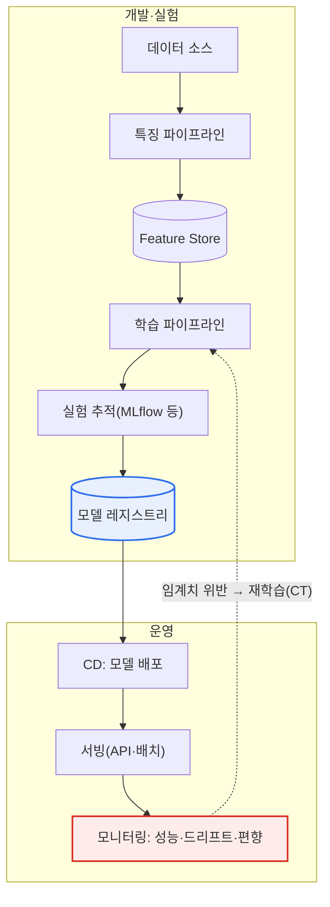

# DSML 프로젝트와 MLOps

## 1. 개요

### 가. 정의
> **DSML(Data Science & Machine Learning)** 은 데이터 사이언스와 기계학습을 융합해 데이터 기반 문제를 해결하는 프로젝트이며, **MLOps(Machine Learning Operations)** 는 ML 모델의 개발-배포-운영을 자동화·표준화해 지속 가능한 제품으로 만드는 공학적 방법론이다.

DSML 프로젝트가 유독 어려운 이유는 '**실험은 성공해도 운영에서 실패한다**'는 데 있다. 데이터 과학자가 노트북(Jupyter)에서 높은 정확도의 모델을 만들어도, 그것을 실제 서비스에 올려 지속적으로 가치를 내게 하는 것은 전혀 다른 문제다. 실제 데이터는 시간이 지나며 학습 시점과 달라지고(드리프트), 모델은 주기적으로 재학습·재배포되어야 하며, 성능을 계속 감시해야 한다. 이 '**연구와 운영 사이의 간극(Research-Production Gap)**'을 메우는 것이 MLOps다.

전통적 소프트웨어 개발에서 DevOps가 '코드'라는 하나의 산출물을 자동으로 통합·배포했듯, MLOps는 **데이터·모델·코드라는 세 가지 산출물을 함께 관리**해 모델을 지속 가능한 제품으로 만든다. 여기서 결정적 차이가 발생한다. 일반 소프트웨어는 코드가 같으면 언제 실행해도 같은 결과를 내지만, ML 시스템은 코드가 동일해도 입력 데이터의 분포가 바뀌면 성능이 달라진다. 즉 ML 시스템의 품질은 코드뿐 아니라 **데이터와 학습된 파라미터에 종속**되므로, 세 요소를 모두 버전관리하고 재현 가능하게 만들지 않으면 "그때 그 결과가 왜 나왔는지"조차 설명할 수 없게 된다.

### 나. 등장 배경 및 필요성
데이터·AI 기반 의사결정이 금융 신용평가, 제조 이상탐지, 커머스 추천 등 핵심 업무로 확산되면서, 일회성 모델이 아니라 지속적으로 신뢰할 수 있는 예측을 제공하는 시스템이 요구되었다. 그러나 현장 조사에서는 개발된 ML 모델의 상당수가 실제 운영에 배포되지 못하고 사장되는 것으로 보고되곤 한다. 그 원인은 알고리즘 성능이 아니라, **데이터 파이프라인·환경 재현·모니터링·재학습이라는 운영 요소의 부재**인 경우가 많다.

MLOps 없이 모델을 배포하면 세 가지 문제가 순차적으로 발생한다. 첫째, 배포 직후에는 잘 맞던 모델이 시간이 지나며 성능이 조용히 저하된다(**모델 부패, Model Decay**). 둘째, 성능 저하를 감지할 관측 체계가 없어 문제를 뒤늦게, 대개 사용자 불만이나 매출 하락으로 인지한다. 셋째, 재학습 파이프라인이 수동이라 대응이 느리고, 급하게 손댄 모델은 재현성이 깨져 신뢰가 무너진다. 이 악순환을 끊고 모델을 '**계속 살아 있는 제품**'으로 유지하는 것이 MLOps의 존재 이유다.

### 다. 특징
MLOps는 (1) 데이터·모델·코드의 **삼중 버전관리**, (2) 학습부터 배포까지의 **파이프라인 자동화**, (3) 운영 중 **지속 모니터링과 자동 재학습(CT)**, (4) 실험·데이터·모델 계보를 추적하는 **재현성·거버넌스**를 특징으로 한다. 이는 DevOps의 CI/CD에 ML 고유의 **CT(Continuous Training)** 개념이 추가된 것으로 요약된다.

## 2. DSML 프로젝트 수명주기

DSML 프로젝트는 데이터마이닝 표준 방법론인 CRISP-DM을 기반으로 하되, 배포·운영이 강화된 **순환 구조**를 따른다. 아래 다이어그램은 전체 수명주기의 흐름을, 각 단계가 한 번 끝나는 직선이 아니라 운영 결과가 다시 초기 단계로 되먹임되는 **닫힌 루프**임을 보여 준다.

**비즈니스 이해** 단계에서는 풀려는 문제와 성공 기준을 정의한다. 이 단계의 함정은 데이터 과학의 지표(정확도, F1)와 비즈니스의 지표(전환율, 이탈 방지 금액)를 혼동하는 것이다. 예컨대 이탈 예측 모델은 정확도 95%라도, 실제로 이탈할 고객을 놓치면(재현율 낮음) 무의미하다. 따라서 문제를 예측·분류·랭킹 중 무엇으로 정의하고 어떤 오류가 더 치명적인지를 먼저 합의해야 이후 단계가 흔들리지 않는다.

**데이터 수집·이해(EDA)** 단계에서는 데이터를 확보하고 탐색적 분석으로 분포·결측·이상치·상관을 파악한다. 실무 경험상 DSML 프로젝트 공수의 60~80%가 이 단계와 다음의 데이터 준비 단계에 집중된다. 데이터의 품질과 대표성이 모델 성능의 상한을 결정하기 때문에, 화려한 알고리즘보다 '좋은 데이터'를 확보하는 것이 우선이라는 **데이터 중심 AI(Data-centric AI)** 관점이 최근 강조되는 배경이다.

**데이터 준비** 단계에서는 정제·결측 처리·특징공학(Feature Engineering)·학습/검증/테스트 분할을 수행한다. 여기서 가장 흔한 실패가 **데이터 누수(Data Leakage)** 로, 테스트 시점에는 알 수 없는 정보(예: 미래 값, 정답에서 파생된 변수)가 학습 특징에 섞여 검증 성능만 비현실적으로 높게 나오는 현상이다. 이를 막기 위해 정규화 통계량은 반드시 학습셋에서만 산출해 검증·운영에 적용해야 한다.

**모델링·평가** 단계에서는 알고리즘을 선택하고 하이퍼파라미터를 튜닝한 뒤, 성능뿐 아니라 비즈니스 가치·공정성·설명가능성까지 검증한다. 마지막 **배포·운영** 단계에서 모델을 서빙하고 성능을 모니터링하며, 드리프트가 감지되면 다시 비즈니스 이해 단계로 돌아가 순환을 반복한다.

| 단계 | 핵심 활동 | 대표 산출물 |
|---|---|---|
| **비즈니스 이해** | 문제 정의, 성공기준·평가지표 합의 | 프로젝트 헌장, KPI 정의서 |
| **데이터 수집·이해** | 데이터 확보, EDA, 품질 진단 | 데이터 카탈로그, EDA 보고서 |
| **데이터 준비** | 정제·특징공학·분할 | 특징 저장소(Feature Store) |
| **모델링** | 알고리즘 선택·학습·튜닝 | 실험 로그, 후보 모델 |
| **평가** | 성능·비즈니스·공정성 검증 | 평가 리포트, 모델 카드 |
| **배포·운영** | 서빙, 모니터링, 재학습 | 서빙 API, 대시보드 |

## 3. MLOps 아키텍처와 구성요소

> MLOps는 DevOps를 ML로 확장한 것으로, **데이터·모델·코드 세 요소를 버전관리하고 학습-배포-모니터링을 자동화**하며, 여기에 운영 데이터로 모델을 다시 학습시키는 **지속적 학습(Continuous Training, CT)** 이 더해진다는 점이 본질적 차별점이다.

아래 아키텍처 다이어그램은 데이터 소스에서 시작해 파이프라인·레지스트리·서빙·모니터링을 거쳐 다시 재학습으로 되먹임되는 MLOps 자동화 경로를 나타낸다.

**파이프라인 자동화**는 데이터 수집→특징 생성→학습→평가→배포를 하나의 재실행 가능한 워크플로로 묶는다. 수동으로 노트북을 실행하던 방식에서 벗어나, 코드가 커밋되거나 새 데이터가 도착하거나 성능이 임계치를 넘으면 파이프라인이 자동 트리거된다. 이렇게 하면 '누가 언제 어떤 데이터로 학습했는가'가 코드로 남아 재현성과 감사 추적이 확보된다.

**특징 저장소(Feature Store)** 는 학습에 쓰인 특징과 서빙 시점에 계산되는 특징이 서로 달라지는 **학습-서빙 편향(Training-Serving Skew)** 을 방지한다. 학습 때는 배치로 집계한 '최근 7일 구매액'을 썼는데 서빙 때는 실시간 계산 로직이 미세하게 달라, 오프라인 성능은 좋은데 온라인 성능이 무너지는 사고가 대표적 사례다. 특징을 중앙에서 정의·재사용하면 이 편향을 구조적으로 줄인다.

**모델 레지스트리**는 학습된 모델의 버전·메타데이터·계보(어떤 데이터·코드·하이퍼파라미터로 만들어졌는지)를 관리하고, 스테이징→프로덕션 승격을 통제한다. **모니터링**은 예측 성능(정확도·지연시간)뿐 아니라 입력 데이터 분포 변화(**데이터 드리프트**)와 입력-출력 관계 변화(**콘셉트 드리프트**), 그리고 편향을 감시한다. 감시 결과가 임계치를 넘으면 재학습 파이프라인(CT)이 작동해 순환이 완성된다.

| 구성요소 | 역할 | 예시 도구 |
|---|---|---|
| **CI/CD/CT** | 코드·데이터·모델 통합·배포 + 지속학습 | Jenkins, GitHub Actions, Kubeflow |
| **파이프라인 오케스트레이션** | 데이터→학습→배포 자동화 | Kubeflow Pipelines, Airflow |
| **Feature Store** | 특징 정의·재사용, 편향 방지 | Feast, Vertex Feature Store |
| **실험 추적** | 지표·파라미터·아티팩트 기록 | MLflow, W&B |
| **모델 레지스트리** | 버전·계보·승격 관리 | MLflow Registry |
| **모니터링** | 성능·드리프트·편향 감시 | Evidently, Prometheus |

## 4. MLOps 성숙도 단계와 사례

Google Cloud의 MLOps 실무 가이드는 자동화 수준을 **세 단계(Level 0~2)** 로 구분한다. 이 성숙도 모델은 조직이 어디에 있고 다음에 무엇을 갖춰야 하는지를 진단하는 실용적 잣대라는 점에서 자주 인용된다.

**Level 0(수동 프로세스)** 는 데이터 준비·학습·검증이 모두 수동이며, 데이터 과학자가 만든 모델을 운영팀에 넘기는 방식이다. 재학습 빈도가 낮고(수개월에 한 번), 배포 사이에 큰 단절이 있다. 소규모 PoC나 예측이 자주 바뀌지 않는 도메인에는 충분하지만, 데이터가 빠르게 변하는 환경에서는 모델 부패에 취약하다.

**Level 1(ML 파이프라인 자동화)** 은 학습 파이프라인을 자동화해 새 데이터가 오면 모델을 자동 재학습·검증한다(CT 도입). 여기서 Feature Store와 메타데이터 저장소가 도입되어 학습-서빙 편향과 재현성 문제를 다룬다. **Level 2(CI/CD 파이프라인 자동화)** 는 파이프라인 자체를 코드로 관리해, 새 아이디어(전처리·모델 아키텍처 변경)를 코드로 커밋하면 파이프라인이 자동으로 빌드·테스트·배포되는 완전 자동 단계다. 대규모로 여러 모델을 빠르게 실험·배포해야 하는 조직이 목표로 삼는 수준이다.

산업 사례로, 넷플릭스·유튜브 같은 스트리밍/영상 서비스의 추천 모델은 사용자 행동이 시시각각 변하므로 잦은 재학습(CT)과 A/B 테스트 기반 배포가 필수적이다. 제조 분야에서는 설비 센서 데이터로 학습한 이상탐지 모델이 계절·설비 노후에 따라 분포가 바뀌므로, 드리프트 모니터링과 자동 재학습이 예측정비(PdM) 시스템의 핵심으로 자리 잡았다. 금융 신용평가 모델은 규제상 **설명가능성과 재현성**이 요구되어, 모델 카드·계보 추적 같은 MLOps 거버넌스 요소가 특히 강조된다.

### DevOps와 MLOps의 차이
MLOps를 정확히 이해하려면 DevOps와의 차이를 짚어야 한다. DevOps는 관리 대상이 '코드' 하나이고 테스트도 코드 단위·통합 테스트로 명확하지만, MLOps는 코드·데이터·모델 세 축을 함께 다루고 '데이터 검증'과 '모델 검증'이라는 새로운 시험 단계가 추가된다. 무엇보다 DevOps에는 없는 **CT(지속적 학습)** 가 핵심이다. 배포 후에도 데이터가 계속 변하므로, 코드를 바꾸지 않아도 모델을 다시 학습·배포해야 하는 상황이 반복된다.

| 관점 | DevOps | MLOps |
|---|---|---|
| **관리 대상** | 코드 | 코드 + 데이터 + 모델 |
| **버전관리** | 소스 코드 | 소스 + 데이터셋 + 모델·파라미터 |
| **테스트** | 단위·통합 테스트 | + 데이터 검증 + 모델 검증(성능·공정성) |
| **파이프라인** | CI/CD | CI/CD + **CT(지속 학습)** |
| **성능 변화 요인** | 코드 변경 | 코드 변경 **+ 데이터 분포 변화(드리프트)** |

이 차이가 함의하는 바는, 기존 DevOps 조직이라도 데이터·모델 버전관리와 드리프트 대응 체계를 새로 갖추지 않으면 ML 시스템을 안정적으로 운영할 수 없다는 점이다. 즉 MLOps는 DevOps의 단순 확장이 아니라, 데이터라는 불확실성을 다루는 별도의 운영 역량을 요구한다.

## 5. 고려사항 및 시사점 (기술사 관점)

1. **데이터 드리프트 감지·재학습 자동화가 운영 성패를 좌우한다.** 실제 데이터가 학습 시점과 달라지면 성능이 조용히 무너지므로, 통계적 거리(PSI, KL-divergence 등)로 분포 변화를 감시하고 임계치 위반 시 재학습하는 CT 체계를 설계해야 한다. 이때 재학습 빈도와 비용의 트레이드오프를 도메인 변화 속도에 맞춰 조정하는 것이 관건이다.
2. **재현성(Reproducibility)이 신뢰와 규제 대응의 기반이다.** 데이터·모델·코드를 함께 버전관리하고 실험을 추적해, 특정 예측이 왜 나왔는지 사후에 재현·감사할 수 있어야 한다. 금융·의료처럼 규제가 강한 도메인에서는 이것이 선택이 아니라 준수 요건이다.
3. **학습-서빙 편향과 데이터 누수를 구조적으로 차단해야 한다.** Feature Store로 특징 정의를 통일하고, 정규화 통계량을 학습셋에서만 산출하는 규율을 파이프라인에 내재화해 '오프라인은 좋은데 온라인은 나쁜' 사고를 예방한다.
4. **MLOps 성숙도에 맞춘 단계적 고도화가 현실적이다.** 처음부터 Level 2를 목표로 과투자하기보다, 조직 역량·모델 수·변화 속도에 맞춰 Level 0→1→2로 점진 도입하고, ROI가 확인되는 지점부터 자동화를 확대하는 것이 합리적이다.
5. **책임 있는 AI(Responsible AI)와의 연계가 필수다.** 모니터링에 성능뿐 아니라 편향·공정성 지표를 포함하고, 모델 카드로 한계·용도를 명시해 거버넌스·윤리 요건과 MLOps를 결합해야 한다.

## 참고자료
- Google Cloud, "MLOps: Continuous delivery and automation pipelines in machine learning": https://docs.cloud.google.com/architecture/mlops-continuous-delivery-and-automation-pipelines-in-machine-learning
- Google Cloud, "Practitioners Guide to MLOps (Whitepaper)": https://cloud.google.com/resources/mlops-whitepaper

---

> **한 줄 요약**: DSML 프로젝트는 *비즈니스 이해→데이터→모델링→배포·운영*의 순환 수명주기를 거치며, MLOps는 데이터·모델·코드를 삼중 버전관리하고 파이프라인 자동화·모니터링·지속학습(CT)으로 모델 부패·학습서빙편향·재현성 문제를 다스려 모델을 지속 가능한 제품으로 만드는 것이 핵심이다.
