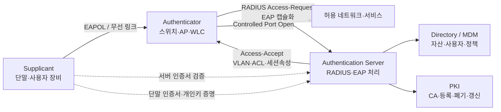
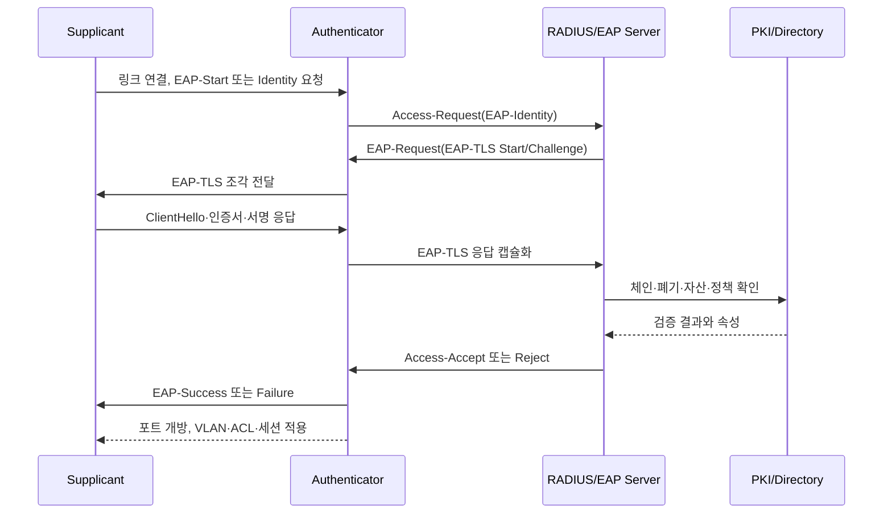

# EAP-TLS(Extensible Authentication Protocol-Transport Layer Security) 기반 네트워크 접근 인증

## 1. 개요

> **EAP-TLS**는 EAP(Extensible Authentication Protocol) 프레임워크 안에서 TLS 핸드셰이크와 X.509 인증서를 사용하여 단말과 인증 서버를 상호 인증하고, 성공한 인증으로부터 네트워크 접속에 필요한 키 재료를 도출하는 인증 방식이다.

기업 무선 LAN, 유선 802.1X, 원격 접속, 산업용 단말 접속에서는 단순한 공유 비밀번호만으로 단말의 신원을 신뢰하기 어렵다. 사용자와 장비가 많아지면 비밀번호 배포·변경·회수의 운영 부담이 커지고, 동일한 비밀번호가 여러 단말에 재사용되면서 한 대의 유출이 전체 네트워크 침해로 이어질 수 있다. EAP-TLS는 이 문제를 단말별 인증서와 개인키로 분리한다.

EAP 자체는 다양한 인증 방법을 운반하는 확장 프레임워크이지, 모든 보안 속성을 스스로 제공하는 단일 암호 프로토콜은 아니다. EAP-TLS는 그 프레임워크에서 TLS를 인증 방법으로 선택한 형태이며, EAP 메시지 안에 TLS 레코드와 핸드셰이크 메시지를 실어 교환한다. 따라서 EAP, 링크 계층 인증, TLS, RADIUS, PKI를 각각 이해해야 전체 동작을 설명할 수 있다.

전형적인 802.1X 환경에는 세 역할이 있다. **Supplicant**는 접속을 요청하는 노트북·스마트폰·IoT 단말이고, **Authenticator**는 스위치나 무선 LAN 컨트롤러처럼 접속 포트를 통제하는 장비이며, **Authentication Server**는 보통 RADIUS 서버와 연계된 인증·정책 서버다. 인증 전에는 포트가 제한 상태이고, 인증 성공 뒤에만 허용 VLAN이나 보안 정책이 적용된다.

EAP-TLS의 핵심 가치는 비밀번호를 네트워크에 보내지 않고도 단말이 개인키 소유를 증명한다는 데 있다. 서버는 신뢰할 수 있는 인증기관의 인증서인지, 유효기간·용도·폐기 상태가 적절한지 확인하고, 단말도 서버 인증서를 검증한다. 양쪽이 검증을 통과해야 하므로 서버만 단말을 믿는 단방향 인증보다 피싱 AP와 위조 인증 서버에 강한 구조를 만들 수 있다.

다만 인증서가 있다고 자동으로 안전해지는 것은 아니다. 발급 정책이 느슨하거나 개인키가 평문 파일에 저장되거나 폐기된 인증서가 계속 허용되면 EAP-TLS의 장점이 사라진다. 그러므로 기술사 답안에서는 프로토콜 절차뿐 아니라 PKI 수명주기, 단말 온보딩, 예외 처리, 운영 지표, 사고 대응을 하나의 통제 체계로 제시해야 한다.

## 2. 구성요소와 전체 아키텍처

### 가. 역할과 신뢰 경계

Supplicant는 자신의 인증서와 개인키를 보유하지만 개인키 자체를 상대방에 전송하지 않는다. TLS의 서명 검증을 통해 개인키 소유를 증명하고, 운영체제의 보안 저장소나 TPM·보안 요소에 키를 넣으면 파일 복사만으로는 인증을 재현하기 어렵다.

Authenticator는 인증 판단을 직접 수행하기보다 EAP 메시지를 전달하고 포트를 열거나 닫는 집행 지점이다. 무선 AP나 스위치가 인증 서버의 정책을 받아 VLAN, ACL, 세션 시간, 격리 여부를 적용하는 이유는 인증과 네트워크 집행을 분리하기 위해서다.

Authentication Server는 인증서 체인과 정책을 검증하고 사용자·장비·그룹·위치·시간 같은 속성을 조합하여 접근 결정을 내린다. 실제 환경에서는 RADIUS 서버가 EAP를 처리하고, 디렉터리·MDM·CMDB·PKI와 연결하여 인증서 주체와 자산 정보를 매칭한다.

PKI는 인증서 발급기관, 중간 CA, 신뢰 앵커, 등록·갱신·폐기 기능으로 구성된다. 인증 서버와 단말이 같은 루트 CA를 무조건 신뢰하는 식으로 설계하면 테스트 인증서나 다른 용도의 인증서가 허용될 수 있으므로, 용도별 CA와 EKU·SAN 정책을 함께 사용해야 한다.

### 나. 전체 구조도

이 구조에서 단말과 인증 서버 사이의 TLS 논리는 RADIUS 서버에 있지만, 단말이 직접 RADIUS와 TCP 연결을 맺는 것은 아니다. Authenticator가 링크 계층의 EAPOL과 백엔드 RADIUS 사이의 중계자 역할을 하기 때문에 무선·유선 매체가 달라도 동일한 인증 정책을 재사용할 수 있다.

EAPOL은 단말과 Authenticator 사이의 링크 계층 전달 수단이다. RADIUS는 Authenticator와 인증 서버 사이의 정책·인증 전달 수단이다. 둘을 혼동하면 스위치가 인증서 검증을 직접 하는 것으로 잘못 설명하게 되며, 장애 분석에서도 무선 구간과 백엔드 구간을 분리하지 못한다.

### 다. 핵심 구성요소 표

| 구성요소 | 주요 책임 | 실패 시 영향 | 관리 포인트 |
|---|---|---|---|
| Supplicant | 인증서 선택, TLS 응답, 서버 검증 | 단말 접속 실패 | 프로파일 배포, 키 보호, 로그 |
| Authenticator | EAPOL 중계, 포트 통제 | 인증은 성공해도 접속 불가 | RADIUS 도달성, 포트 상태, 시간 |
| RADIUS/EAP 서버 | TLS·인증서·정책 검증 | 전체 또는 일부 인증 장애 | HA, 정책 순서, 감사 로그 |
| PKI/CA | 발급·갱신·폐기 | 신규 발급·검증 실패 | 루트 보호, CRL/OCSP, 만료 |
| Directory/MDM | 주체·자산·그룹 연계 | 잘못된 권한·온보딩 실패 | 동기화, 소유권, 예외 |
| 네트워크 정책 | VLAN·ACL·세션 적용 | 과도한 권한 또는 격리 | 최소권한, 정책 버전, 검증 |

표의 구성요소는 서로 대체 관계가 아니라 연쇄적인 신뢰 사슬이다. 예를 들어 RADIUS 서버의 가용성이 높아도 CA가 만료된 인증서를 발급하면 신규 단말은 접속할 수 없다. 반대로 인증은 성공해도 Authenticator가 Access-Accept의 VLAN 속성을 이해하지 못하면 단말이 잘못된 네트워크에 놓일 수 있다.

## 3. EAP-TLS 인증 원리와 메시지 흐름

### 가. 인증 전 준비

첫째, 조직은 인증서 정책을 정의한다. 단말 인증서의 주체 식별자, SAN 형식, Key Usage, Extended Key Usage, 키 길이와 알고리즘, 최대 유효기간, 갱신 시점을 정해야 한다. 인증서의 CN 문자열만 보고 장비를 식별하는 관행은 동명이인과 재사용 문제를 만들 수 있으므로 안정적인 장비 ID와 디렉터리 속성을 함께 사용한다.

둘째, 단말에 신뢰할 서버 CA와 클라이언트 인증서 프로파일을 배포한다. MDM, GPO, 자동 등록, 제조 시 프로비저닝 등이 방법이 될 수 있다. 중요한 것은 신뢰 CA를 운영체제 전체에 무분별하게 추가하지 않고 EAP 프로파일의 서버 이름과 허용 CA를 제한하는 것이다.

셋째, RADIUS 서버에는 신뢰할 단말 CA, 허용된 EKU, 인증서 폐기 검사, 사용자·장비 그룹별 네트워크 정책을 설정한다. 인증서 서명이 유효하다는 것과 업무상 접근 권한이 있다는 것은 다른 판단이므로, 인증 성공 뒤에 그룹·자산 상태·위험도를 추가로 평가한다.

### 나. 단계별 흐름

1. 단말이 AP 또는 스위치에 연결되면 Authenticator는 아직 제어 포트를 열지 않는다.
2. Authenticator는 EAP-Request/Identity를 보내 단말 식별자 또는 익명화된 식별자를 요청한다.
3. 단말은 EAP-Response/Identity를 반환하고, Authenticator는 이를 RADIUS Access-Request에 넣는다.
4. RADIUS 서버는 EAP-TLS 방법을 선택하는 EAP-Request를 반환하며 TLS 협상을 시작한다.
5. 단말과 서버는 TLS 버전·암호 스위트·키 교환 파라미터를 협상하고 인증서 검증 자료를 교환한다.
6. 서버는 단말 인증서의 체인, 용도, 만료, 폐기 상태를 검사하고 단말은 서버 인증서를 검사한다.
7. 단말은 인증서에 대응하는 개인키로 서명하여 개인키 소유를 증명한다.
8. TLS가 공유 비밀을 만들면 EAP 방식은 세션 키 재료를 도출하여 링크 보호에 사용할 수 있게 한다.
9. RADIUS 서버는 인증 결과와 VLAN·ACL·세션 제한 같은 정책 속성을 Access-Accept 또는 Access-Reject로 전달한다.
10. Authenticator는 성공 시 제어 포트를 열고, 실패 시 차단·격리·게스트 정책 중 하나를 적용한다.

실제 메시지는 MTU에 맞지 않을 수 있어 EAP-TLS 데이터가 여러 EAP 패킷으로 분할된다. EAP-TLS의 Start, Length Included, More fragments 같은 플래그와 전체 길이 처리는 상호운용성의 핵심이다. 인증 실패가 특정 크기의 인증서에서만 발생한다면 인증서 내용보다 조각화·재조립·타임아웃을 먼저 점검해야 한다.

### 다. 키와 인증서의 의미

EAP-TLS는 인증서의 공개키와 단말이 보유한 개인키의 짝을 사용한다. 서버가 인증서를 읽는 것만으로 단말이 정당한 소유자라고 결론 내리지 않고, TLS 핸드셰이크에서 개인키 서명 검증까지 성공해야 한다. 따라서 인증서 파일이 유출되더라도 개인키가 보호되고 폐기 절차가 작동하면 피해 범위를 줄일 수 있다.

인증 성공으로 도출되는 MSK(Master Session Key)는 링크 계층 보호나 무선 암호화 키 파생의 입력으로 사용된다. EMSK(Extended Master Session Key)는 일반 애플리케이션 데이터에 직접 쓰는 만능 키가 아니라, 표준이 허용하는 추가 키 파생을 위한 재료다. 키 재료를 애플리케이션 로그에 남기거나 임의의 암호화에 재사용해서는 안 된다.

TLS 1.2 기반 EAP-TLS와 TLS 1.3 기반 EAP-TLS는 공통적으로 인증서 기반 상호 인증을 제공하지만, 핸드셰이크 메시지 보호와 키 스케줄은 다르다. RFC 9190은 EAP-TLS를 TLS 1.3과 함께 사용하는 방법을 정의하므로, 단말·RADIUS·네트워크 장비의 지원 조합을 사전에 시험해야 한다.

## 4. 구축·운영 절차

### 가. 요구사항과 위험 분석

먼저 접속 대상과 위험을 분류한다. 사내 노트북, 개인 스마트폰, 프린터, 카메라, 생산설비는 키 저장 능력·갱신 가능성·중단 허용도가 서로 다르다. 모든 장비를 같은 인증서 정책에 넣으면 보안이 약한 장비 때문에 전체 정책이 낮아지거나, 반대로 레거시 장비 때문에 신규 장비의 보안성을 포기하게 된다.

다음으로 인증 주체를 정한다. 사용자 기반 인증서, 장비 기반 인증서, 사용자와 장비의 복합 인증 중 어느 모델인지 결정해야 한다. 개인 노트북은 장비 인증만으로 퇴사자의 접근을 통제하기 어렵고, 공용 키오스크는 사용자 인증만으로 장비 분실을 설명하기 어렵다. 자산 등급에 따라 별도 인증서와 정책을 두는 것이 합리적이다.

마지막으로 실패 시 업무 영향을 정량화한다. 예를 들어 2,000대 사내 단말이 오전 9시에 동시에 갱신된다고 가정하면 RADIUS와 CA의 순간 부하, DNS·NTP 장애, 인증서 배포 지연이 모두 접속 장애로 나타날 수 있다. 정상 인증률뿐 아니라 갱신 피크와 장애 시 우회 절차까지 설계해야 한다.

### 나. PKI 수명주기 설계

발급은 등록, 신원 확인, 키 생성, 인증서 서명, 프로파일 배포 순으로 통제한다. 가능하면 개인키는 단말 내부에서 생성하고 CSR만 전송하여 CA나 등록 서버가 개인키를 보지 않도록 한다. 제조 단계에서 동일한 개인키를 여러 장비에 주입하면 단일 유출이 대량 위조로 확대된다.

갱신은 만료 직전의 일회성 작업이 아니라 지속적인 상태 전환으로 운영한다. 인증서 만료일의 30일 전부터 갱신을 시도하고, 네트워크에 접속할 수 없는 장비는 다음 연결 때 갱신하도록 대체 경로를 둔다. 새 인증서가 검증될 때까지 이전 인증서를 일정 기간 허용할지, 중복 인증서가 있을 때 어떤 것을 선택할지 명확히 해야 한다.

폐기는 도난·분실·퇴직·자산 폐기·악성코드 감염과 연결한다. CRL 또는 OCSP를 사용하더라도 인증 서버가 폐기 상태를 얼마나 자주 갱신하고, 조회 실패 시 허용할지 차단할지 결정해야 한다. 폐기 조회 실패를 항상 허용하면 가용성은 높아지지만 도난 장비 차단이 늦어지고, 항상 차단하면 CA 장애가 전체 네트워크 장애로 바뀔 수 있다.

### 다. 단계적 도입

1단계는 관찰 단계다. 기존 PSK나 MAB를 즉시 제거하지 않고 EAP-TLS 시험 SSID·시험 VLAN을 만들어 인증 성공률, 인증서 체인 오류, 지원하지 않는 장비를 수집한다.
2단계는 사용자 단말과 관리 가능한 장비부터 적용한다. MDM 또는 그룹 정책으로 프로파일을 배포하고 헬프데스크가 볼 수 있는 오류 코드를 준비한다.
3단계는 부서·건물·장비군별로 기본 인증을 전환하고, 예외 장비는 제한 VLAN과 만료일이 있는 임시 정책으로 관리한다.
4단계는 정상 운영이 확인되면 평문 인증·공유 PSK·상시 MAB를 폐지하고, 예외 목록을 정기적으로 재승인한다.

단계적 도입은 보안을 늦추기 위한 핑계가 아니라 실패 범위를 제한하는 변경관리 방식이다. 각 단계마다 성공 기준을 인증 성공률 99%처럼 하나의 숫자로만 두지 말고, 인증 지연의 상위 백분위, 신규 단말 온보딩 시간, 만료 임박 인증서 비율, 폐기 반영 시간, 예외 장비 수를 함께 본다.

## 5. 방식 비교와 적용 사례

### 가. EAP-TLS와 인접 방식 비교

EAP-TLS는 인증서 발급·갱신의 비용을 지불하는 대신 단말별 식별과 강한 상호 인증을 얻는다. PEAP나 EAP-TTLS는 보통 서버 인증서를 사용해 보호된 터널을 만든 뒤 내부에서 비밀번호나 다른 인증 방식을 운반하므로, 인증서 기반 장비 관리가 어려운 조직의 과도기 대안이 될 수 있다. 그러나 서버 인증만 제대로 검증하지 않으면 가짜 AP에 자격 증명을 입력할 위험이 남는다.

PSK는 소규모 환경에서 빠르지만 공유 비밀의 회수 범위가 크다. 한 장비가 탈취되면 같은 키를 쓰는 장비를 모두 교체해야 한다. EAP-TLS는 장비별 인증서 폐기로 범위를 좁힐 수 있지만 CA·RADIUS·프로파일 관리라는 운영 복잡성이 생긴다.

MAB는 MAC 주소를 식별자로 사용해 인증 기능이 제한된 장비를 수용하는 우회 방식이다. MAC 주소는 위조 가능하고 자격 증명 수준의 신원 증명이 아니므로, MAB를 EAP-TLS와 동등한 인증으로 설명해서는 안 된다. MAB 장비는 격리 VLAN, 목적지 ACL, 짧은 세션, 자산 등록과 결합해 위험을 제한해야 한다.

| 기준 | EAP-TLS | PEAP/EAP-TTLS | PSK | MAB |
|---|---|---|---|---|
| 주된 자격 | 단말·서버 인증서와 개인키 | 서버 인증서와 내부 인증 | 공유 비밀 | MAC 주소 |
| 상호 인증 | 가능하며 일반적인 설계 | 내부 방식에 따라 다름 | 키를 아는 주체는 구분 어려움 | 사실상 없음 |
| 단말별 폐기 | 용이 | 계정·프로파일 정책에 의존 | 키 교체 범위가 큼 | 주소 차단은 우회 가능 |
| 구축 난이도 | PKI·프로파일 필요 | 서버 인증서·내부 인증 필요 | 낮음 | 낮음 |
| 적합 환경 | 관리형 단말·고보안망 | 과도기·레거시 단말 | 소규모·제한망 | EAP 미지원 장비의 제한 수용 |

차이를 선택 기준으로 바꾸면, 자산 수가 많고 인증서 자동화가 가능하며 침해 시 개별 폐기가 중요한 환경일수록 EAP-TLS의 편익이 커진다. 반대로 인증서 저장이 불가능한 저가 센서가 많다면 EAP-TLS를 억지로 적용하기보다 장비 교체 계획과 격리·모니터링을 포함한 보완 통제를 제시해야 한다.

### 나. 기업 무선·유선 사례

1,200명의 임직원이 사용하는 사내 무선망에서 직원 노트북마다 1개 인증서를 발급한다고 가정하자. 직원이 퇴사하면 디렉터리 계정을 비활성화하는 것뿐 아니라 장비 인증서도 폐기하고 MDM에서 프로파일을 제거한다. 인증 성공 뒤에는 일반 업무 VLAN을 부여하고, 보안 상태가 낮은 장비에는 제한 VLAN을 적용한다.

유선 사무실에서는 스위치 포트에 802.1X를 적용할 수 있다. 도킹 스테이션, 회의실 장비, 프린터처럼 교체 주기가 긴 장비는 EAP-TLS 지원 여부를 점검하고, 지원하지 않는 장비만 MAB 예외로 둔다. 예외 포트의 스위치 설정에는 허용 목적지와 만료일을 함께 기록하여 영구적인 우회로 굳어지지 않게 한다.

이 사례의 운영 지표는 단순 접속 성공률이 아니다. 주간 인증 실패 중 인증서 만료 비율, 서버 이름 불일치 비율, RADIUS 응답 지연, MAB 예외 증가율, 분실 신고부터 폐기 반영까지의 시간, 비인가 AP 탐지 건수를 대시보드로 관리한다.

### 다. IoT·OT 사례

공장 내 센서 300대가 무선으로 생산망에 접속한다고 가정한다. 센서가 TPM 또는 안전한 키 저장소를 지원하면 장비별 EAP-TLS 인증서를 사용하고, 생산망에서는 센서별 허용 브로커와 시간 동기화 서버만 접근하도록 ACL을 적용한다. 센서 인증이 성공해도 데이터베이스나 관리 콘솔에 접근할 수 있게 해서는 안 된다.

레거시 PLC가 EAP-TLS를 지원하지 않는다면 해당 포트를 무기한 MAB로 열어 두는 대신, 자산 식별·물리 포트 고정·허용 목적지 최소화·점검 시간대의 임시 허용·패킷 이상 탐지를 결합한다. 장기적으로는 게이트웨이가 인증을 담당하고 PLC는 게이트웨이 뒤에 두는 세그먼트 전환을 검토한다.

OT에서는 인증 서버 장애가 생산 중단으로 이어질 수 있으므로 캐시된 인증 결과의 허용 시간, 비상 운영 VLAN, 수동 승인 절차, 안전 정지 절차를 별도로 검증해야 한다. 보안팀의 기본 거부 원칙과 생산팀의 가용성 요구를 문서화된 위험 수용으로 조정하는 것이 기술사의 역할이다.

## 6. 심화: TLS 1.3 전환과 제로 트러스트 연계

RFC 5216은 EAP-TLS 인증 방법을 정의하고, RFC 9190은 TLS 1.3과 함께 사용하는 EAP-TLS 1.3을 정의한다. TLS 1.3 전환은 단순히 서버의 TLS 버전 설정을 올리는 작업이 아니다. EAP 메시지 캡슐화, 인증서 선택, 키 파생, 조각화, 재전송, 단말의 서버 이름 검증이 모두 구현 조합의 영향을 받는다.

TLS 1.3은 이전 버전과 핸드셰이크의 보호 시점과 키 스케줄이 다르므로, 인증 서버·무선 컨트롤러·스위치·운영체제 supplicant·인증서 프로파일을 호환성 매트릭스로 관리해야 한다. 시험 항목에는 정상 인증뿐 아니라 서버 인증서 갱신, 단말 인증서 갱신, 폐기된 인증서, 잘못된 시간, 큰 인증서 체인, 패킷 분할, RADIUS 재시도, 서버 장애 복귀가 포함되어야 한다.

TLS 1.3 기반 EAP-TLS를 도입한다고 해서 TLS 1.2 지원을 즉시 끊을 수 있는 것도 아니다. 오래된 장비를 위해 과도기 버전을 허용한다면 허용 범위와 종료 날짜를 문서화하고, 낮은 버전으로 인증한 세션을 별도 VLAN이나 제한 ACL로 차등 통제할 수 있다. 보안 정책은 "가능하면 최신"이 아니라 자산별 지원 현황과 잔여 위험을 기준으로 단계화해야 한다.

제로 트러스트 관점에서 EAP-TLS는 네트워크에 들어오는 순간의 강한 장비 신원을 제공하는 기반 통제다. 그러나 한 번 인증된 단말을 네트워크 전체에서 신뢰하는 것은 제로 트러스트가 아니다. 인증서 주체, 사용자 세션, 단말 보안 상태, 목적지 서비스, 데이터 분류를 연속적으로 평가하고, 인증 결과를 동적 ACL·마이크로 세그멘테이션·애플리케이션 인가와 연결해야 한다.

예를 들어 인증서가 유효한 개발자 노트북이라도 패치 수준이 낮거나 비정상 위치에서 접속하면 소스 저장소는 허용하되 운영 데이터베이스는 차단할 수 있다. 이때 EAP-TLS는 단말 신원의 증거이고, MDM의 보안 상태와 애플리케이션 토큰은 추가 속성이다. 서로 다른 증거의 책임과 갱신 주기를 분리하여 감사 가능하게 만드는 것이 중요하다.

## 7. 고려사항 및 시사점

### 가. PKI 운영성과 복구성

인증서 발급 시스템은 네트워크 인증의 부속 기능이 아니라 핵심 가용성 구성요소다. 루트 CA 오프라인 보호, 중간 CA 이중화, RADIUS 이중화, CRL·OCSP 배포 지점, 백업 복구 리허설을 함께 설계해야 한다. CA 장애 때 기존 세션을 유지할지 신규 접속을 중단할지 정책도 명시한다.

### 나. 개인키 보호와 단말 신뢰도

파일 시스템에 내보낼 수 있는 개인키만 사용하면 인증서 복사와 악성코드 탈취 위험이 커진다. TPM·Secure Enclave·스마트카드·HSM 등 단말 특성에 맞는 보호 수단을 선택하고, 키 내보내기 금지와 PIN·생체 인증의 사용자 경험을 조정한다. 보호 수준을 확인할 수 없는 단말은 높은 신뢰 VLAN에 넣지 않는다.

### 다. 인증서 검증 정책의 정확성

루트 CA만 확인하는 단순 정책은 다른 용도의 인증서를 허용할 수 있다. 발급자, 체인, EKU, SAN, 유효기간, 폐기 상태, 최소 암호 알고리즘, 서버 이름을 함께 검증한다. 특히 클라이언트가 서버 인증서를 검증하지 않으면 EAP-TLS의 상호 인증 효과가 줄어들므로 운영체제별 프로파일을 실제 패킷과 로그로 점검해야 한다.

### 라. 예외와 레거시 관리

EAP-TLS 미지원 장비의 예외는 불가피할 수 있지만, 예외 수를 줄이는 로드맵과 보완 통제가 없으면 가장 약한 경로가 표준 경로가 된다. 예외마다 자산 소유자, 사유, 허용 범위, 만료일, 교체 계획을 기록하고 월별로 재승인한다. MAB를 편의 기능으로 무기한 허용하지 않는 것이 핵심이다.

### 마. 관측성과 사고 대응

RADIUS·Authenticator·supplicant·PKI의 로그를 상관분석하면 단순 "Wi-Fi가 안 된다"를 인증서 만료, 서버 이름 불일치, 폐기 조회 실패, 정책 거부로 나눌 수 있다. 로그에는 인증서 일련번호와 자산 식별자를 남기되 개인 정보와 키 재료는 남기지 않는다. 실패율 급증, 동일 인증서의 다중 위치 사용, 비정상 재시도는 침해 지표로 탐지한다.

### 바. 성능과 사용자 경험

인증서 체인이 길거나 RADIUS 왕복이 많으면 최초 접속 시간이 길어질 수 있다. 대규모 재접속 시나리오와 로밍 시나리오를 분리해 시험하고, 인증 서버 캐시·부하분산·적정 타임아웃·재시도 간격을 조정한다. 사용자가 반복해서 인증서 경고를 무시하게 만드는 설계는 보안을 약화시키므로 오류 원인을 숨기지 않고 자동 복구와 안내를 제공한다.

### 사. 기술사 답안의 연결 구조

답안에서는 EAP-TLS를 단순히 "인증서를 쓰는 방식"으로 끝내지 말고, 요구사항 분석→PKI 설계→EAPOL/RADIUS 아키텍처→TLS·인증서 검증→정책 집행→운영 지표→예외·사고 대응의 흐름으로 전개한다. 비교 문항에서는 보안성만 나열하지 말고 인증서 운영 비용, 레거시 호환성, 폐기 범위, 가용성 트레이드오프까지 설명해야 한다.

## 참고자료

- [RFC 5216: The EAP-TLS Authentication Protocol](https://datatracker.ietf.org/doc/rfc5216/)
- [RFC 9190: EAP-TLS 1.3](https://www.rfc-editor.org/rfc/rfc9190.html)
- [RFC 3748: Extensible Authentication Protocol](https://www.rfc-editor.org/rfc/rfc3748.html)
- [RFC 9525: Service Identity in TLS](https://www.rfc-editor.org/rfc/rfc9525.html)
- [IEEE 802.1X-2020 overview](https://1.ieee802.org/security/802-1x/)

---

> **한 줄 요약**: EAP-TLS는 PKI 기반의 단말·서버 상호 인증으로 802.1X 네트워크 접근을 개별화하지만, 진정한 보안 효과는 인증서 수명주기·키 보호·정책 집행·예외 통제를 함께 운영할 때 완성된다.
