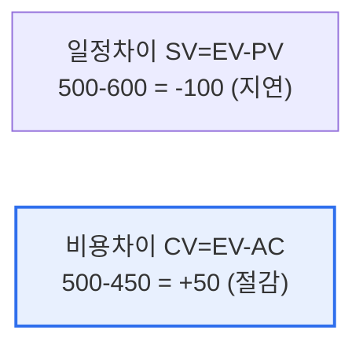

# 획득가치관리(EVM, Earned Value Management)

## 1. 개요

### 가. 정의
> **EVM**은 프로젝트의 **일정과 비용 성과를 '계획(PV)·실제 비용(AC)·획득 가치(EV)'라는 세 값으로 통합 측정**해, 진척 상황을 객관적으로 분석하고 완료 시점을 예측하는 성과관리 기법이다.

EVM이 강력한 근본 이유는 '**돈을 얼마 썼는가가 아니라, 쓴 만큼 성과를 냈는가를 본다**'는 데 있다. 단순히 "예산의 절반을 썼다"는 정보만으로는 프로젝트 상태를 알 수 없다. 절반을 쓰고 절반을 완성했으면 정상이지만, 절반을 쓰고 30%만 완성했다면 위기다. EVM은 이 '실제 성과'를 **획득 가치(EV)** 라는 개념으로 측정한다. EV는 '지금까지 실제로 완성한 작업의 계획상 가치'다. 이를 계획 가치(PV)·실제 원가(AC)와 비교하면 세 가지가 한눈에 보인다. 계획보다 덜 완성했는지(일정), 계획보다 더 썼는지(비용), 그리고 이 추세면 언제·얼마에 끝날지(예측)다. 즉 EVM은 일정과 비용을 분리해서 보던 전통 방식과 달리, 둘을 하나의 성과 지표로 통합해 프로젝트의 건강 상태를 조기에 진단한다. 그래서 문제를 늦기 전에 발견하고 대응할 수 있다.

### 나. 3대 기본 값
| 값 | 의미 |
|---|---|
| **PV(Planned Value)** | 계획된 작업의 예산(계획 가치) |
| **EV(Earned Value)** | 실제 완료한 작업의 계획상 가치 |
| **AC(Actual Cost)** | 실제 투입 비용 |

## 2. 분석 지표와 사례 계산

주어진 사례(EV=500, PV=600, AC=450)로 계산해 본다.

| 지표 | 계산 | 결과 | 해석 |
|---|---|---|---|
| **SV(일정차이)** | EV−PV = 500−600 | **−100** | 음수 → **일정 지연** |
| **CV(비용차이)** | EV−AC = 500−450 | **+50** | 양수 → **비용 절감** |
| **SPI(일정지수)** | EV/PV = 500/600 | **0.83** | <1 → 계획보다 느림 |
| **CPI(비용지수)** | EV/AC = 500/450 | **1.11** | >1 → 예산보다 효율적 |

**위험 요소 해석**: 이 프로젝트는 비용은 계획보다 아끼고 있으나(CV +50, CPI 1.11), **일정이 지연**되고 있다(SV −100, SPI 0.83). 즉 예산은 여유 있지만 진척이 느린 것이 주된 위험이다. 일정 지연이 계속되면 납기를 못 맞추고, 만회를 위해 자원을 추가 투입하면 비용 이점마저 사라질 수 있다.

## 3. 부정적 위험(위협) 대응 방안

일정 지연이라는 위협에 대해, 위험 대응 전략(회피·전가·완화·수용)을 적용할 수 있다. [[it-project-risk-response]]

| 전략 | 일정·비용 적용 예시 |
|---|---|
| **회피(Avoid)** | 지연 유발 작업·범위를 조정·제거해 지연 원인 자체 제거 |
| **전가(Transfer)** | 일부 작업을 전문 외주에 넘겨 일정 리스크 이전(단, 비용↑) |
| **완화(Mitigate)** | 공정 압축(Crashing: 자원 추가)·Fast Tracking(병행)으로 지연 축소 |
| **수용(Accept)** | 경미한 지연은 예비(버퍼) 일정으로 흡수 |

예를 들어 남은 비용 여유(CPI 1.11)를 활용해 인력을 추가 투입하는 **공정 압축(Crashing)** 으로 지연을 만회하거나, 선후행 작업을 병행하는 **Fast Tracking** 으로 일정을 단축하는 것이 현실적 완화책이다.

## 4. 고려사항 및 시사점

1. **조기 경보 도구로서의 가치**가 크다. EVM은 문제를 정량 지표로 조기에 드러내 늦기 전에 대응하게 하므로, 대규모·장기 프로젝트일수록 유용하다.
2. **EV 측정의 정확성이 전제**다. 진척률(EV) 산정이 부정확하면 모든 분석이 왜곡되므로, 명확한 완료 기준(WBS·마일스톤)과 객관적 진척 측정이 필수다.
3. **예측(EAC)으로 의사결정 지원**한다. CPI·SPI로 완료 시 총비용(EAC)·완료 예상 시점을 예측해, 계획 수정·자원 재배분 등 선제적 의사결정의 근거로 활용한다.

---

> **한 줄 요약**: EVM은 *PV·EV·AC로 일정·비용 성과를 통합 측정* 하는 기법으로, 사례(EV500·PV600·AC450)에서는 SV−100(일정 지연)·CV+50(비용 절감)으로 진단되며, 공정 압축·Fast Tracking 등 완화 전략으로 지연 위협에 대응한다.
