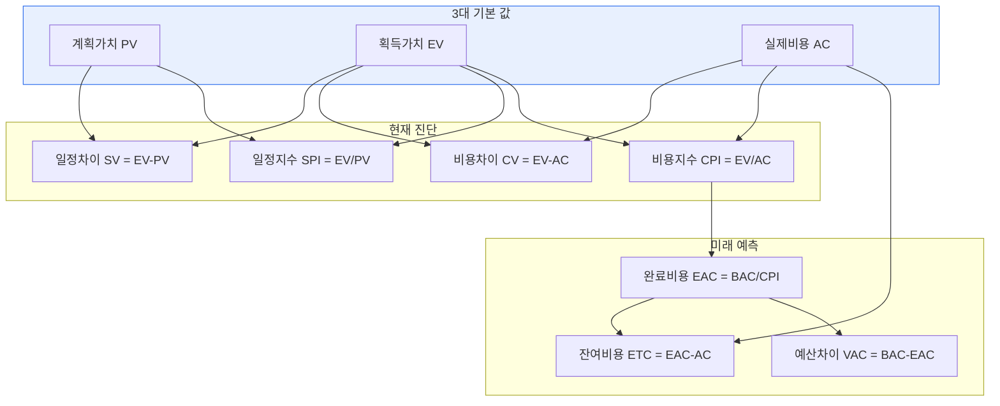
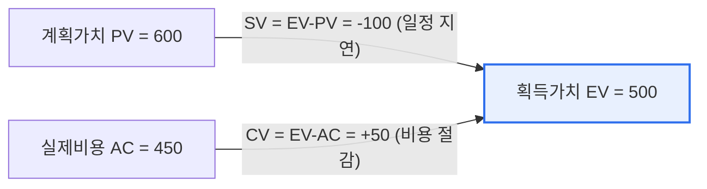

# 획득가치관리(EVM, Earned Value Management)

## 1. 개요

### 가. 정의

> **EVM(Earned Value Management)**은 프로젝트의 **일정과 비용 성과를 '계획가치(PV)·실제비용(AC)·획득가치(EV)'라는 세 개의 화폐 단위 값으로 통합 측정**하여, 진척 상황을 객관적으로 분석하고 완료 시점·완료 비용을 예측하는 정량적 성과관리 기법이다. PMBOK에서는 통합관리·일정관리·원가관리를 연결하는 핵심 기법으로 다룬다.

EVM이 강력한 근본 이유는 **'돈을 얼마 썼는가'가 아니라 '쓴 만큼 성과를 냈는가'를 본다**는 데 있다. 전통적 관리에서는 "예산의 50%를 집행했다"는 정보로 프로젝트를 판단했지만, 이 숫자만으로는 상태를 알 수 없다. 예산 절반을 쓰고 작업의 절반을 완성했다면 정상이지만, 절반을 쓰고 30%만 완성했다면 심각한 위기다. 즉 '지출액'과 '완성도'를 분리해서 보면 프로젝트의 진짜 건강 상태가 가려진다.

EVM은 이 '실제 성과'를 **획득가치(EV)**라는 개념으로 화폐화한다. EV는 '지금까지 실제로 완성한 작업을, 계획 당시의 예산으로 환산한 가치'다. 이 EV를 계획가치(PV)와 비교하면 일정을, 실제비용(AC)과 비교하면 비용을 알 수 있다. 핵심은 일정과 비용을 **동일한 화폐 단위로 환산**함으로써, 그동안 따로 관리되던 두 축을 하나의 좌표계 위에서 동시에 진단한다는 점이다. 그 결과 "일정은 늦었지만 비용은 아꼈다"거나 "비용은 예산 내지만 진척이 부진하다" 같은 복합적 상태를 하나의 그림으로 파악하고, 문제가 더 커지기 전에 조기 대응할 수 있다.

### 나. 등장 배경과 필요성

EVM의 뿌리는 1960년대 미국 국방부(DoD)의 대형 무기체계 획득 사업이다. 다년·다조직이 참여하는 초대형 사업에서 "예산은 계획대로 쓰고 있는가, 그런데 그만큼 만들어지고 있는가"를 통합 감독할 필요가 절실했고, 이것이 원가·일정 통제 기준(C/SCSC)으로 제도화되었다가 오늘날의 EVM(ANSI/EIA-748 표준)으로 발전했다. 즉 EVM은 '지출 추적'과 '진척 관리'가 따로 놀아 프로젝트가 후반에야 위기를 인지하던 문제를 해결하기 위해 태어난 기법이다.

이 필요성은 지금도 유효하다. 대규모·장기 프로젝트일수록 진척이 눈에 보이지 않아 '90% 완성 함정(마지막 10%가 전체의 절반 시간을 잡아먹는 현상)'에 빠지기 쉽다. EVM은 진척을 화폐 가치로 정량화하여 이런 착시를 걷어내고, 조기 경보(Early Warning) 신호를 제공한다는 점에서 필요성을 갖는다.

### 다. 3대 기본 값

EVM의 모든 분석은 세 개의 기본 값에서 출발한다. 이 세 값이 무엇을 의미하는지 정확히 구분하는 것이 EVM 이해의 첫걸음이다.

| 값 | 정식 명칭 | 의미 | 질문 |
|---|---|---|---|
| **PV(Planned Value)** | 계획가치(BCWS) | 특정 시점까지 **완료하기로 계획된** 작업의 예산 | "얼마어치를 하기로 했나?" |
| **EV(Earned Value)** | 획득가치(BCWP) | 특정 시점까지 **실제로 완료한** 작업의 계획상 가치 | "실제로 얼마어치를 했나?" |
| **AC(Actual Cost)** | 실제비용(ACWP) | 그 작업을 완료하기 위해 **실제로 투입한** 비용 | "그 일에 얼마를 썼나?" |

세 값의 관계를 직관적으로 이해하려면 '벽돌 쌓기'를 떠올리면 된다. 오늘까지 100개를 쌓기로 계획했고(각 1만 원 예산이면 PV=100만 원), 실제로 80개를 쌓았으며(EV=80만 원), 그 80개를 쌓는 데 90만 원을 썼다면(AC=90만 원), 이 프로젝트는 '계획보다 덜 쌓았고(일정 지연), 쓴 돈보다 덜 만들었다(비용 초과)'는 진단이 즉시 나온다. PV는 '계획선', EV는 '성과선', AC는 '지출선'이며, EVM은 이 세 선의 상대적 위치로 프로젝트를 읽는다.

아래는 세 기본 값에서 출발해 차이·지수·예측 지표가 파생되는 EVM의 전체 지표 체계를 나타낸 구조도다.

```mermaid
flowchart TD
  subgraph BASE["3대 기본 값"]
    PV["계획가치 PV"]
    EV["획득가치 EV"]
    AC["실제비용 AC"]
  end
  subgraph VAR["현재 진단"]
    SV["일정차이 SV = EV-PV"]
    CV["비용차이 CV = EV-AC"]
    SPI["일정지수 SPI = EV/PV"]
    CPI["비용지수 CPI = EV/AC"]
  end
  subgraph FCST["미래 예측"]
    EAC["완료비용 EAC = BAC/CPI"]
    ETC["잔여비용 ETC = EAC-AC"]
    VAC["예산차이 VAC = BAC-EAC"]
  end
  PV --> SV
  EV --> SV
  EV --> CV
  AC --> CV
  PV --> SPI
  EV --> SPI
  EV --> CPI
  AC --> CPI
  CPI --> EAC
  EAC --> ETC
  AC --> ETC
  EAC --> VAC
  style BASE fill:#e8f0fe,stroke:#2f6fed
```

## 2. 분석 지표와 사례 계산

### 가. 차이(Variance)와 지수(Index)

세 기본 값으로부터 네 개의 핵심 파생 지표가 나온다. **차이(Variance)**는 뺄셈으로 절대량(금액)의 벌어짐을, **지수(Index)**는 나눗셈으로 효율(비율)을 보여준다. 차이는 '얼마나 벌어졌나', 지수는 '얼마나 효율적인가'를 답하며, 이 둘을 함께 보아야 규모와 심각성을 동시에 판단할 수 있다.

- **SV(Schedule Variance, 일정차이) = EV − PV** : 음수면 계획보다 덜 완성(지연), 양수면 앞섬.
- **CV(Cost Variance, 비용차이) = EV − AC** : 음수면 예산 초과, 양수면 절감.
- **SPI(Schedule Performance Index, 일정효율지수) = EV ÷ PV** : 1 미만이면 계획보다 느림.
- **CPI(Cost Performance Index, 비용효율지수) = EV ÷ AC** : 1 미만이면 예산보다 비효율.

여기서 반드시 짚어야 할 실무적 함의는, **SV와 SPI는 시간이 아니라 '금액' 기준의 일정 지표**라는 점이다. 프로젝트가 종료 시점에 다다르면 PV와 EV가 결국 같아지므로 SV는 0으로 수렴한다. 즉 EVM의 일정 지표는 프로젝트 후반부로 갈수록 지연을 과소평가하는 한계가 있으며, 이를 보완하기 위해 실제 '시간' 기반의 일정 예측 기법인 획득일정(ES, Earned Schedule)이 함께 쓰이기도 한다.

### 나. 사례 계산 (EV=500, PV=600, AC=450)

주어진 사례로 실제 분석을 수행한다. 먼저 세 기본 값의 관계를 그림으로 본다.

```mermaid
flowchart LR
  PV["계획가치 PV = 600"]
  EV["획득가치 EV = 500"]
  AC["실제비용 AC = 450"]
  PV -- "SV = EV-PV = -100 (일정 지연)" --> EV
  AC -- "CV = EV-AC = +50 (비용 절감)" --> EV
  style EV fill:#e8f0fe,stroke:#2f6fed,stroke-width:2px
```

| 지표 | 계산 | 결과 | 해석 |
|---|---|---|---|
| **SV(일정차이)** | EV−PV = 500−600 | **−100** | 음수 → **일정 지연** |
| **CV(비용차이)** | EV−AC = 500−450 | **+50** | 양수 → **비용 절감** |
| **SPI(일정지수)** | EV/PV = 500/600 | **0.83** | <1 → 계획보다 17% 느림 |
| **CPI(비용지수)** | EV/AC = 500/450 | **1.11** | >1 → 예산 대비 11% 효율적 |

**종합 진단**: 이 프로젝트는 비용 측면에서는 계획보다 아끼고 있으나(CV +100의 부호는 +50, CPI 1.11), **일정이 지연**되고 있다(SV −100, SPI 0.83). 네 상태(정상/일정지연/비용초과/둘 다 문제) 중 '비용은 양호하나 일정이 지연된' 유형에 해당한다. 실무적으로 이는 흔히 '투입 인력이 계획보다 적어 비용은 덜 썼지만 그만큼 진척도 느린' 상황이거나, '숙련 인력이 효율적으로 일하나 절대 물량이 부족한' 상황을 시사한다. 방치하면 지연이 납기 미준수로 이어지고, 만회를 위해 자원을 급히 투입하면 확보해 둔 비용 이점(CV +50)마저 상쇄될 수 있으므로 선제적 개입이 필요하다.

### 다. 완료 예측 (EAC / ETC / VAC)

EVM의 진짜 가치는 현재 진단을 넘어 **미래를 예측**하는 데 있다. 총예산(BAC)을 안다면, 현재 효율(CPI)이 유지된다는 가정하에 다음과 같이 완료 시점의 총비용을 추정할 수 있다.

- **EAC(Estimate at Completion, 완료시점 총비용 예측) = BAC ÷ CPI** (현재 효율 지속 가정)
- **ETC(Estimate to Complete, 잔여 완료비용) = EAC − AC**
- **VAC(Variance at Completion, 완료시점 예산차이) = BAC − EAC**

예컨대 위 사례에서 총예산 BAC가 1,200이라면, CPI 1.11을 유지한다는 가정하에 EAC ≈ 1,200 ÷ 1.11 ≈ 1,081이 되어 약 119(VAC)의 예산 절감이 예상된다. 다만 일정 지연이 심각해 자원을 추가 투입해야 한다면 CPI가 하락하므로 이 예측은 낙관적일 수 있으며, 일정·비용을 함께 고려한 EAC = AC + (BAC−EV)/(CPI×SPI) 공식으로 보수적으로 추정하는 것이 실무적으로 타당한 경우가 많다.

## 3. 부정적 위험(위협) 대응 방안

일정 지연이라는 위협에 대해서는 위험 대응 전략(회피·전가·완화·수용)을 적용할 수 있다. [[it-project-risk-response]] 아래 표는 각 전략을 일정·비용 상황에 맞춰 구체화한 것이다.

| 전략 | 일정·비용 적용 예시 | 트레이드오프 |
|---|---|---|
| **회피(Avoid)** | 지연을 유발하는 저가치 작업·범위를 제거해 원인 자체 제거 | 범위 축소로 가치 감소 가능 |
| **전가(Transfer)** | 일부 작업을 전문 외주에 넘겨 일정 리스크 이전 | 외주 비용↑, 통제력↓ |
| **완화(Mitigate)** | 공정압축(Crashing)·Fast Tracking으로 지연 축소 | 비용↑ 또는 재작업 위험↑ |
| **수용(Accept)** | 경미한 지연은 예비(버퍼) 일정으로 흡수 | 버퍼 소진 시 대안 부재 |

이 사례에서 가장 현실적인 완화책은 확보된 비용 여유(CPI 1.11)를 활용하는 것이다. 첫째, **공정압축(Crashing)**은 임계경로(Critical Path) 작업에 인력·비용을 추가 투입해 기간을 단축하는 방법으로, 비용은 늘지만 절감분(CV +50) 범위 내에서라면 순비용 증가 없이 일정을 만회할 수 있다. 둘째, **Fast Tracking**은 원래 순차로 하던 선후행 작업을 병행하여 기간을 줄이는 방법으로, 추가 비용은 거의 없으나 병행에 따른 재작업(Rework) 위험이 커진다. 두 기법을 선택할 때는 반드시 임계경로를 기준으로 판단해야 하며, 임계경로 밖 작업을 압축하는 것은 총 일정에 영향을 주지 못한 채 비용만 낭비하는 결과가 된다는 점이 중요한 실무 함의다.

## 4. 비교: EVM과 전통적 진척관리

EVM이 왜 우월한지는 전통적 관리와의 대비에서 분명해진다. 전통 방식은 '예산 집행률'과 '일정 준수 여부'를 별개로 보고했다. 이때 "예산 50% 집행, 일정은 계획대로"라는 보고는 안심을 주지만, 실제로는 예산 50%로 작업 30%만 완성한 위기 상황을 감출 수 있다. 지출과 성과가 분리되어 있어 '착시'가 발생하는 것이다.

| 구분 | 전통적 진척관리 | EVM |
|---|---|---|
| **측정 대상** | 지출액·일정 각각 별도 | 성과(EV) 중심 통합 |
| **일정·비용 관계** | 분리 | 동일 화폐 단위로 통합 |
| **문제 인지 시점** | 후반(납기 임박) | 초기 조기경보 |
| **미래 예측** | 주관적·정성적 | CPI·SPI 기반 정량 예측(EAC) |

차이가 생기는 근본 이유는 EVM이 '완성된 작업의 가치(EV)'라는 제3의 축을 도입해 지출과 성과를 연결했기 때문이다. 이 하나의 변화가 조기 경보와 정량 예측이라는 실무적 이점을 만든다. 다만 EVM 도입에는 WBS 정의, 진척 측정 규칙(0/100, 50/50, % 완료 등) 수립, 원가 집계 체계 구축이라는 비용이 따르므로, 소규모·단기 프로젝트에는 과할 수 있다는 점도 균형 있게 인식해야 한다.

### 진척 측정 규칙(EV 산정 방법) 비교

EV의 신뢰성은 '완료를 어떻게 인정하느냐'는 측정 규칙에 달려 있다. 규칙 선택은 작업의 성격에 따라 달라지며, 잘못 고르면 진척이 부풀려지거나 지나치게 보수적으로 잡힌다.

| 규칙 | 인정 방식 | 적합한 작업 | 특징 |
|---|---|---|---|
| **0/100** | 완료 전 0%, 완료 시 100% | 짧은 단위 작업 | 가장 보수적, 조작 여지 적음 |
| **50/50** | 착수 시 50%, 완료 시 100% | 1~2 보고주기 작업 | 착수만으로 절반 인정 |
| **% 완료** | 담당자가 진척률 보고 | 장기·연속 작업 | 유연하나 주관 개입 위험 |
| **마일스톤 가중** | 중간 산출물마다 가중치 인정 | 다단계 산출물 작업 | 객관적, 설계 부담 큼 |

예를 들어 2주 스프린트에서 완료 기준이 명확한 작업에는 조작 여지가 적은 0/100을, 수개월에 걸친 설계 문서 작성에는 산출물 단위로 인정하는 마일스톤 가중 규칙을 적용하는 것이 합리적이다. 핵심은 **프로젝트 착수 전에 규칙을 합의·문서화**하는 것으로, '진척률을 담당자 재량으로 보고'하는 관행을 방치하면 EVM 전체가 '희망 섞인 숫자'로 전락한다.

## 5. 심화: 애자일 환경의 EVM (AgileEVM)과 실무 적용

전통적 EVM은 '범위가 고정된' 폭포수형 프로젝트를 전제로 설계되었다. 그러나 범위가 스프린트마다 유동적인 애자일 환경에서는 PV·EV의 정의가 흔들린다. 이를 보완하기 위해 등장한 것이 **AgileEVM**으로, 스토리 포인트(Story Point)나 완료된 백로그 항목을 EV의 측정 단위로 삼고, 릴리스 계획의 총 포인트를 BAC로, 스프린트별 계획 소화량을 PV로 환산한다. 예를 들어 총 500 스토리포인트 릴리스에서 3개 스프린트 후 200포인트를 완료했다면 진척(EV 상당)은 40%로 환산되며, 여기에 팀 속도(Velocity)를 결합해 완료 스프린트 수를 예측한다. 이는 애자일의 유연성과 EVM의 정량 예측을 결합하려는 시도다.

실무 적용 사례로는 미국 항공우주국(NASA)·국방부의 대형 시스템 획득 사업이 대표적이며, 이들은 ANSI/EIA-748 기준의 EVMS(Earned Value Management System) 인증을 협력업체에 요구할 만큼 EVM을 제도화하고 있다. 국내에서도 대형 SI·공공 정보화 사업의 사업관리(PMO)에서 월간 성과보고에 SPI·CPI를 활용하는 사례가 늘고 있다. 최근 동향으로는 프로젝트 관리 도구(예: MS Project, Jira 플러그인)가 EVM 지표를 자동 산출하고 대시보드로 시각화하여, 진척 데이터 입력만으로 실시간 조기경보를 제공하는 방향으로 발전하고 있다. 다만 자동화가 늘수록 'EV 측정 규칙의 신뢰성'이 더욱 중요해진다는 점은 변하지 않는다.

### TCPI로 보는 만회 가능성

EVM은 '앞으로 얼마나 잘해야 목표를 맞출 수 있는가'라는 질문에도 답한다. 이를 나타내는 지표가 **TCPI(To-Complete Performance Index, 완료성과지수)**로, 남은 예산으로 남은 작업을 끝내기 위해 앞으로 유지해야 할 원가 효율을 뜻한다. 공식은 TCPI = (BAC−EV) ÷ (BAC−AC)이다. 예컨대 앞 사례에서 BAC=1,200이라면 TCPI = (1,200−500) ÷ (1,200−450) = 700 ÷ 750 ≈ 0.93이 된다. 이는 '앞으로는 지금까지보다 다소 여유 있게(효율 0.93 수준으로) 일해도 예산 내 완료가 가능하다'는 의미로, 현재 CPI 1.11이 확보한 여유를 정량적으로 확인해 준다.

TCPI의 실무적 가치는 목표의 '현실성 판정'에 있다. 만약 TCPI가 1.2, 1.3처럼 현재 CPI보다 크게 높게 나온다면, 이는 '지금까지보다 훨씬 더 잘해야만 목표를 맞출 수 있다'는 뜻이며 대개 목표 자체가 비현실적임을 시사한다. 이 경우 프로젝트 관리자는 무리한 만회를 강요하기보다 예산·일정·범위 기준선(Baseline)의 재설정(Re-baselining)을 이해관계자와 협의하는 것이 옳다. 즉 TCPI는 '분발하면 되는 상황'과 '기준선을 고쳐야 하는 상황'을 가르는 객관적 신호로 기능한다.

## 6. 고려사항 및 시사점 (기술사 관점)

1. **조기 경보 도구로서의 전략적 가치.** EVM의 본질은 사후 정산이 아니라 '문제를 늦기 전에 정량 신호로 드러내는 것'이다. 따라서 대규모·장기·다조직 프로젝트일수록 도입 효과가 크며, 월간이 아닌 주간 단위 추적으로 신호 지연을 줄이는 운영이 바람직하다.

2. **EV 측정의 정확성이 모든 것의 전제.** 진척률(EV) 산정이 부정확하면 SV·CV·SPI·CPI·EAC가 모두 왜곡된다. 명확한 WBS 분해, 객관적 완료 기준(마일스톤·산출물), 일관된 진척 측정 규칙(0/100 등)을 사전에 합의해야 하며, '주관적 %완료' 보고는 EVM을 무력화하는 가장 흔한 실패 원인이다.

3. **예측(EAC) 기반의 선제적 의사결정.** CPI·SPI로 산출한 EAC·완료예상시점은 계획 수정, 자원 재배분, 범위 조정의 정량적 근거가 된다. 특히 CPI가 일정 기간 안정적이면 EAC 예측 신뢰도가 높아지므로, 단발 수치가 아니라 추세(Trend)로 판단하는 것이 중요하다.

4. **일정 지표의 한계 인식과 보완.** SV·SPI는 금액 기준이라 프로젝트 후반부에 지연을 과소평가한다. 시간 기반의 획득일정(ES) 기법이나 임계경로(CPM)·버퍼 관리(CCPM)와 병행하여, 일정 리스크를 다각도로 검증해야 한다.

5. **방법론·문화와의 정합성.** 애자일 조직에는 전통적 EVM을 그대로 강요하기보다 AgileEVM·번다운/번업 차트와 결합해야 저항 없이 작동한다. EVM은 통제 도구이기 이전에 '팀과 이해관계자가 상태를 공유하는 언어'라는 점을 잊지 말아야 한다.

## 참고자료
- PMI, PMBOK Guide — Earned Value Management 개요, https://www.pmi.org/
- ANSI/EIA-748 EVMS 표준(개요), https://www.ndia.org/
- Earned Schedule 커뮤니티, https://www.earnedschedule.com/

---

> **한 줄 요약**: EVM은 *PV·EV·AC로 일정·비용 성과를 하나의 화폐 좌표계에서 통합 측정* 하여 조기 경보와 정량 예측(EAC)을 제공하는 기법으로, 사례(EV500·PV600·AC450)에서는 SV−100·SPI0.83(일정 지연)과 CV+50·CPI1.11(비용 절감)으로 진단되며, 확보된 비용 여유로 임계경로 공정압축·Fast Tracking을 적용해 지연 위협에 대응한다.
