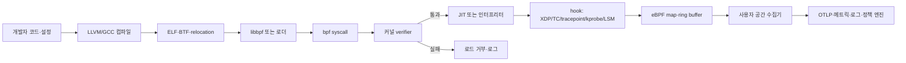
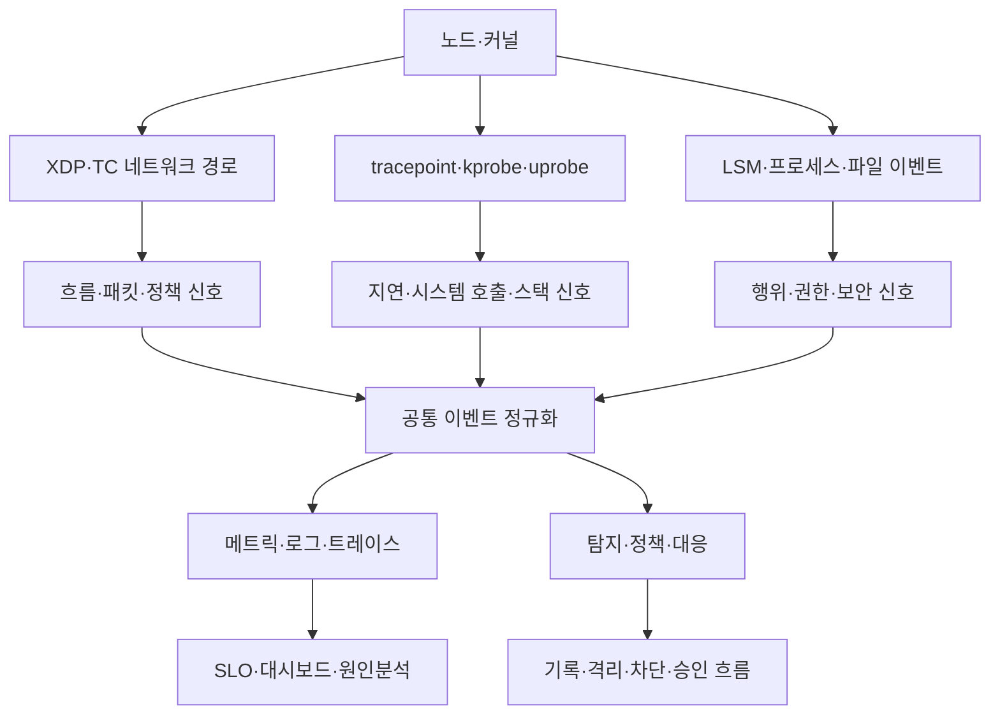

# eBPF 기반 커널 가시성·보안·네트워킹

## 1. 개요

> **정의**: eBPF(extended Berkeley Packet Filter)는 리눅스 커널의 정해진 훅(hook)에 검증 가능한 프로그램을 동적으로 연결하여, 커널 소스 변경이나 전통적인 커널 모듈 적재 없이 네트워킹·트레이싱·보안 기능을 확장하는 실행 기술이다.

eBPF는 원래 패킷을 효율적으로 필터링하던 BPF의 범위를 커널 전반으로 확장한 기술이다.
현재는 네트워크 패킷 처리뿐 아니라 시스템 호출 추적, 프로세스·파일 행위 감시, 컨테이너 네트워크 정책, 성능 분석과 스케줄링 등 다양한 운영 문제에 사용된다.
핵심은 애플리케이션을 다시 컴파일하거나 커널을 포크하지 않고도, 운영 중인 시스템의 커널 이벤트에 작은 프로그램을 연결한다는 점이다.

전통적인 모니터링은 애플리케이션 계측 라이브러리, 로그 에이전트, 패킷 미러링, 커널 모듈 중 하나를 추가하는 방식이었다.
이 방식은 애플리케이션 코드 수정, 사이드카 증가, 컨텍스트 스위칭, 높은 패킷 복사 비용, 커널 버전 종속성 중 하나를 부담할 수 있다.
eBPF는 커널 안에서 이벤트에 가까운 지점에 프로그램을 실행하고, 필요한 요약 정보만 사용자 공간으로 전달하여 관측 지연과 변경 범위를 줄이는 대안을 제공한다.

그러나 eBPF를 “커널에서 무엇이든 실행하는 만능 코드”로 이해해서는 안 된다.
프로그램은 커널의 verifier 검사를 통과해야 하며 허용된 프로그램 유형·헬퍼·메모리 접근·실행 경로라는 제약을 받는다.
또한 커널 버전과 배포판 설정, 권한, JIT 정책, 자료 전송량, 프로덕션 장애 시 복구 절차를 함께 설계해야 안전한 운영이 가능하다.

기술사 관점에서 eBPF는 단일 도구가 아니라 커널 확장 실행 모델과 플랫폼 운영 전략의 결합이다.
따라서 답안에서는 실행 모델, 훅과 자료구조, 네트워크·관측·보안 활용, 기존 방식과의 비교, 배포 및 통제 방안을 하나의 아키텍처로 연결해야 한다.

### 1.1 등장 배경과 필요성

첫째, 클라우드 네이티브 환경에서 장애의 경계가 애플리케이션에만 머물지 않기 때문이다.
하나의 요청이 여러 컨테이너와 노드, 가상 네트워크, 서비스 메시, 외부 API를 통과하면 애플리케이션 로그만으로 지연과 재전송의 원인을 찾기 어렵다.
커널이 관찰하는 소켓, 연결, 시스템 호출, 프로세스 이벤트를 함께 보면 코드 변경 없이 인프라 경로의 사실을 확보할 수 있다.

둘째, 보안과 성능의 실시간성이 요구되기 때문이다.
파일 접근·프로세스 실행·권한 상승 같은 행위를 사후 로그로 분석하면 공격이 이미 진행된 뒤일 수 있다.
커널 훅에서 행위를 탐지하고 정책에 따라 기록·차단하면 탐지 시간을 줄일 수 있지만, 차단은 업무 영향과 오탐 비용이 크므로 관찰과 집행을 분리한 단계적 도입이 필요하다.

셋째, 네트워크 데이터 경로의 효율을 높여야 하기 때문이다.
전통적 패킷 처리에서는 커널과 사용자 공간 사이의 복사 및 여러 계층의 처리가 병목이 될 수 있다.
XDP와 같은 이른 훅, TC, AF_XDP를 적절히 사용하면 패킷을 더 앞단에서 분류하거나 사용자 공간 고속 처리로 넘길 수 있지만, 성능만 보고 의미 검증과 운영성을 희생해서는 안 된다.

### 1.2 목표와 적용 범위

eBPF 적용의 목표는 보통 네 가지로 정리할 수 있다.
첫째는 시스템 호출·커널 함수·사용자 함수에 대한 동적 트레이싱이다.
둘째는 소켓과 패킷을 이용한 네트워크 가시성·정책·부하 처리다.
셋째는 프로세스·파일·권한 관련 행위의 보안 탐지와 제한이다.
넷째는 컨테이너와 노드의 성능 지표를 수집하여 서비스 수준 목표와 연결하는 것이다.

대상 범위가 넓기 때문에 먼저 의사결정 질문을 정해야 한다.
“어느 서비스의 p99 지연이 증가했는가”가 질문이면 네트워크 흐름과 스케줄링 지연을 요약하는 프로그램이 필요하다.
“비정상 바이너리가 실행되었는가”가 질문이면 프로세스 실행 이벤트와 파일 해시·부모 관계를 연결하는 보안 이벤트 모델이 필요하다.
질문 없이 모든 이벤트를 수집하면 커널 부담, 저장비용, 개인정보 노출, 경보 피로가 빠르게 커진다.

## 2. eBPF 실행 모델과 핵심 구성요소

### 2.1 전체 구조

eBPF 프로그램은 일반적으로 사용자 공간에서 작성·컴파일·로딩되지만, 이벤트가 발생했을 때의 핵심 실행은 커널 안에서 일어난다.
사용자 공간 로더는 프로그램, 맵, 링크와 필요한 메타데이터를 커널에 요청한다.
커널은 프로그램 유형과 연결 지점을 확인하고 verifier로 안전성을 검사한 뒤, 허용된 경우 해석기 또는 JIT 컴파일 경로로 실행한다.

이 구조에서 사용자 공간과 커널 공간의 책임을 분리하는 것이 중요하다.
커널 프로그램은 이벤트를 빠르게 필터링하고 최소한의 상태를 기록하는 역할을 담당한다.
복잡한 문자열 분석, 외부 API 호출, 장시간의 정책 판단은 사용자 공간에서 수행해야 커널 실행 경로가 예측 가능하고 verifier 제약도 관리하기 쉽다.

### 2.2 프로그램과 verifier

eBPF 프로그램은 특정 프로그램 유형과 훅에 맞는 제한된 실행 환경에서 동작한다.
예를 들어 네트워크 프로그램은 패킷 문맥에 접근하고, 트레이싱 프로그램은 이벤트 문맥이나 레지스터 정보에 접근하며, LSM 계열 프로그램은 보안 관련 결정 지점에 연결된다.
따라서 같은 소스라도 프로그램 유형에 따라 접근 가능한 문맥과 반환 의미가 달라진다.

verifier는 프로그램이 허용된 메모리만 읽고 쓰는지, 포인터의 유효성을 추적할 수 있는지, 사용할 헬퍼가 프로그램 유형에 허용되는지, 실행 경로가 종료 가능한지를 검사한다.
이 검사는 커널 안정성을 지키기 위한 핵심 통제이지만, verifier 통과가 업무 로직의 정확성이나 개인정보 적정성을 보증하는 것은 아니다.
예를 들어 안전하게 실행되는 프로그램이 과도한 이벤트를 생성하거나 잘못된 프로세스를 차단할 수 있으므로 별도의 기능 검증과 권한 검토가 필요하다.

검증 실패는 단순 문법 오류와 다르다.
자료형·포인터 상태를 verifier가 증명하지 못하거나, 지원되지 않는 헬퍼를 호출하거나, 특정 커널에서 제공되지 않는 문맥을 가정하면 로드 단계에서 거부될 수 있다.
운영팀은 검증 로그를 보존하고, 실패한 프로그램을 자동 롤백하며, 커널 버전별 회귀 테스트를 수행해야 한다.

### 2.3 JIT와 실행 효율

JIT(Just-In-Time) 컴파일은 검증된 eBPF 명령을 호스트 CPU의 네이티브 명령으로 변환하여 반복 실행 비용을 낮추는 방식이다.
JIT를 사용하더라도 verifier 검사를 우회하는 것은 아니며, 로드 단계의 안전성 검증과 실행 단계의 성능 최적화는 서로 다른 기능이다.
배포판이나 보안 기준에 따라 JIT 사용·하드닝·디버그 옵션이 달라질 수 있으므로 운영 표준에 명시해야 한다.

성능 평가는 단일 평균 CPU 사용률로 끝내지 않는다.
이벤트 발생률, 프로그램 실행 시간, 맵 경합, 링버퍼 손실률, 사용자 공간 소비 지연, 네트워크 패킷 드롭, 서비스 p99 지연을 함께 측정한다.
특히 모든 시스템 호출마다 큰 문자열이나 전체 패킷을 복사하면 “코드 수정 없음”의 장점이 자료 전송 비용으로 상쇄될 수 있다.

### 2.4 maps와 자료 전달

맵(map)은 커널 프로그램과 사용자 공간이 키·값 형태의 상태를 공유하는 자료구조다.
카운터, 해시, LRU, 배열, 스택 트레이스, 소켓 정보처럼 목적에 맞는 유형을 선택하고, 키의 카디널리티와 수명, 동시성, 메모리 한도를 설계한다.
맵을 사용하면 이벤트마다 사용자 공간 호출을 하지 않고 커널에서 집계한 뒤 주기적으로 읽을 수 있어 관측 비용을 줄일 수 있다.

다만 맵은 무제한 저장소가 아니다.
사용자·컨테이너·프로세스별 키를 무분별하게 만들면 메모리 사용량과 고유 시계열 수가 폭증하고, 공격자가 고카디널리티 값을 만들어 서비스 거부를 유도할 수 있다.
맵 크기, 키 정규화, 만료·축출 정책, 개인정보 필드의 해시·마스킹을 사전에 정하고 초과 시 샘플링이나 집계를 적용한다.

이벤트 전달에는 perf buffer, ring buffer, 맵 폴링 등 여러 선택지가 있다.
고정 카운터는 맵 조회로 충분할 수 있지만, 순서가 중요한 프로세스 실행 이벤트는 이벤트 버퍼가 적합할 수 있다.
어떤 방식을 선택하든 버퍼 포화 시 드롭 여부와 드롭된 자료의 의미를 모니터링해야 하며, 관측 데이터가 완전하다고 가정해서는 안 된다.

### 2.5 훅, 헬퍼와 BTF

훅은 프로그램이 실행되는 이벤트 지점이다.
XDP는 네트워크 장치의 이른 수신 경로에서 패킷을 처리하고, TC는 트래픽 제어 경로에 연결된다.
tracepoint는 커널이 제공하는 비교적 안정적인 추적 지점이며, kprobe는 커널 함수 진입을 동적으로 관찰할 때 유연하지만 커널 구현 변경의 영향을 더 받을 수 있다.
uprobe는 사용자 공간 함수에 연결하고, LSM 훅은 보안 정책 지점에 연결한다.

헬퍼 함수는 eBPF 프로그램이 커널 기능과 상호작용하는 제한된 호출 인터페이스다.
프로그램 유형마다 허용 헬퍼가 다르며, 헬퍼의 반환값과 실패 조건을 확인하지 않으면 누락 데이터나 잘못된 정책 판단이 생길 수 있다.
새로운 헬퍼나 훅에 의존하는 프로그램은 최소 지원 커널을 정하고, 기능 탐지 후 대체 경로를 제공해야 한다.

BTF(BPF Type Format)는 커널과 프로그램의 타입 정보를 표현하는 메타데이터다.
libbpf와 CO-RE(Compile Once, Run Everywhere) 방식은 BTF와 재배치 정보를 활용하여 커널 자료구조의 작은 차이에 대응하도록 돕는다.
이는 바이너리를 한 번 만들면 모든 리눅스에서 무조건 동작한다는 뜻이 아니라, 지원 범위와 BTF 품질·기능 가용성을 전제로 한 이식성 전략이다.

## 3. 네트워킹·관측성·보안 아키텍처

### 3.1 활용 영역 통합도

eBPF는 한 개의 제품명이 아니라 공통 실행 기반이다.
네트워크 데이터 경로에서는 패킷 필터링·로드밸런싱·정책 집행에 쓰이고, 관측성에서는 시스템 호출과 소켓을 서비스 단위 흐름으로 변환한다.
보안에서는 프로세스·파일·네트워크 행위를 탐지하거나 일부 지점에서 거부한다.

세 영역의 공통점은 커널 이벤트를 관찰한다는 것이지만, 정확도와 책임의 기준은 다르다.
성능 관측은 일부 샘플을 허용할 수 있어도 보안 감사 이벤트는 누락의 의미를 명시해야 한다.
패킷 처리 정책은 마이크로초 단위 효율이 중요할 수 있지만, 차단 규칙 변경에는 승인·롤백·비상 우회가 필요하다.

### 3.2 네트워크와 XDP

XDP는 패킷이 네트워크 스택의 더 뒤쪽으로 진행하기 전에 처리할 수 있는 지점을 제공한다.
따라서 DDoS 완화, 초기 필터링, 패킷 카운팅, 고속 포워딩처럼 빠른 판단이 필요한 업무에 적합할 수 있다.
다만 XDP에서 모든 프로토콜 해석과 업무 판단을 수행하려 하면 프로그램 복잡도와 유지보수 부담이 커지므로, 이른 드롭·분류와 후속 처리의 경계를 정한다.

TC는 트래픽 제어 경로에서 ingress·egress 정책과 패킷 처리를 다룰 때 활용할 수 있다.
컨테이너 네트워크에서는 인터페이스·네임스페이스·서비스 식별자를 패킷 흐름과 연결해야 하므로, 단순 5-튜플만 기록하면 실제 서비스 관계를 잃을 수 있다.
Kubernetes 적용 시에는 파드 재생성, 노드 이동, 네트워크 정책 변경을 고려해 식별자를 안정적으로 부여하고 계보를 관리한다.

AF_XDP는 XDP와 연계하여 패킷을 사용자 공간 소켓으로 전달하는 방식이다.
이는 고속 패킷 분석이나 특수 네트워크 애플리케이션에 유용할 수 있으나, 큐·메모리 영역·CPU 고정·드롭 처리와 같은 운영 설계가 필요하다.
일반적인 웹 서비스 관측에 무조건 AF_XDP를 적용하는 것은 복잡도 대비 이익이 작을 수 있으므로 트래픽량과 지연 목표로 판단한다.

### 3.3 관측성과 분산 추적

eBPF 관측성은 애플리케이션 계측을 완전히 대체하기보다 계층을 보완한다.
커널에서 연결 수립, DNS, TCP 재전송, 소켓 지연, 프로세스 스케줄링을 얻고, 애플리케이션 계측에서 비즈니스 함수·테넌트·논리적 작업을 얻으면 두 자료를 상관관계 ID로 결합할 수 있다.
이 결합이 없으면 “네트워크는 느리다”와 “결제 함수가 느리다”를 동일 요청의 원인 흐름으로 연결하기 어렵다.

제로 코드 또는 저코드 관측은 빠른 초기 가시성을 제공하지만 의미 정보가 제한될 수 있다.
예를 들어 HTTP 상태 코드와 소켓 지연은 얻어도 특정 상품 조회가 왜 느린지, 어떤 업무 규칙이 실패했는지는 알 수 없다.
따라서 핵심 서비스는 eBPF 기반 자동 관측과 선택적 애플리케이션 계측을 함께 사용하고, 중복 수집을 줄이는 통합 스키마를 정의한다.

### 3.4 보안 탐지와 집행

보안 활용은 실행 파일 생성·실행, 권한 변경, 파일 접근, 네트워크 연결과 같은 행위를 이벤트로 수집하는 것에서 시작한다.
부모 프로세스, 사용자·컨테이너·네임스페이스, 파일 경로, 목적지, 정책 버전을 함께 기록하면 단일 이벤트보다 공격 맥락을 분석하기 쉽다.
단, 커널에서 수집할 수 있는 사실과 사용자 공간에서 추론한 위험 점수를 별도 필드로 구분해야 감사와 재현이 가능하다.

탐지와 차단은 다른 운영 모드다.
초기에는 관찰 전용으로 기준선을 만들고 오탐을 분석한 다음, 특정 고신뢰 규칙만 경고·격리·차단으로 승격한다.
차단 프로그램이 오류를 일으키면 정상 배포나 장애 복구까지 막을 수 있으므로, 예외 목록·긴급 해제·마지막 정상 정책·관리자 승인 경로를 준비한다.

## 4. eBPF 구성 방식과 기존 기술 비교

### 4.1 주요 훅 비교

훅을 선택할 때는 원하는 이벤트의 의미뿐 아니라 안정성, 실행 시점, 오버헤드, 커널 지원 범위를 함께 평가해야 한다.
tracepoint는 커널이 공개적으로 제공하는 추적 지점이라는 장점이 있지만 세밀한 내부 함수 흐름은 부족할 수 있다.
kprobe는 유연하지만 내부 함수명과 인자 구조가 바뀌는 영향을 받기 쉽다.

|구분|주요 목적|장점|주의점|
|---|---|---|---|
|XDP|이른 패킷 처리|낮은 경로 지연, 초기 드롭·분류|장치 드라이버 모드와 프로그램 제약 확인|
|TC|ingress·egress 트래픽 제어|정책·포워딩·패킷 수정|경로와 네트워크 네임스페이스 분석 필요|
|tracepoint|안정적 커널 이벤트 추적|명시적 형식, 운영 관측에 유리|제공 이벤트의 의미와 세밀도 한계|
|kprobe|커널 함수 동적 추적|높은 유연성|커널 내부 변경·인자 해석 영향|
|uprobe|사용자 공간 함수 추적|애플리케이션 경계 보완|바이너리·심볼·빌드 변경 영향|
|LSM|보안 정책 지점|행위 탐지·일부 집행|권한·오탐·업무 중단 위험|

표의 차이는 단순한 기능 목록이 아니라 운영 선택의 이유를 보여 준다.
예를 들어 장애 원인 분석용 장기 운영 프로그램은 안정성이 높은 tracepoint를 우선하고, 특정 커널 함수의 짧은 진단에는 kprobe를 한시적으로 사용할 수 있다.
보안 차단은 가장 강한 통제처럼 보이지만 영향도가 크므로, 훅의 기술적 가능성보다 정책의 검증 가능성과 복구성이 우선이다.

### 4.2 기존 방식과의 비교

에이전트 기반 모니터링은 애플리케이션과 운영체제에서 폭넓은 자료를 수집하고 성숙한 관리 기능을 제공한다.
반면 모든 노드에 프로세스를 배치하고, 수집기와 애플리케이션 사이에 CPU·메모리·네트워크 비용이 발생한다.
서비스 메시 사이드카는 서비스 간 정책과 텔레메트리를 일관되게 만들 수 있지만, 프록시 홉과 인증서·설정 운영을 추가한다.

eBPF는 애플리케이션 변경을 줄이고 노드 단위 공통 관찰을 제공하지만, 커널과 권한에 의존하며 업무 의미를 자동으로 이해하지 못한다.
APM은 함수·트랜잭션 수준의 풍부한 맥락을 제공하지만 코드 계측과 런타임 오버헤드, 언어별 지원을 고려해야 한다.
따라서 세 방식은 대체 관계가 아니라 관찰 위치와 의미 수준을 분담하는 관계로 설계하는 것이 현실적이다.

|비교 축|eBPF|에이전트/APM|서비스 메시 사이드카|
|---|---|---|---|
|변경 위치|커널 훅·노드|애플리케이션·노드|서비스 간 프록시|
|코드 변경|대체로 없음 또는 적음|계측·설정 필요|애플리케이션 변경은 적으나 메시 설정 필요|
|강점|공통 인프라 가시성·동적 적용|업무·함수 맥락|통신 정책·mTLS·트래픽 관리|
|약점|커널 의존·업무 의미 부족|언어·라이브러리 의존|홉·리소스·운영 복잡도 증가|
|적합한 질문|노드·소켓·시스템 호출에서 무슨 일이 일어났나?|함수와 트랜잭션이 왜 느린가?|서비스 간 통신을 어떤 정책으로 통제할 것인가?|

예를 들어 결제 API의 p99 지연이 증가한 상황을 생각해 보자.
eBPF는 재전송과 소켓 대기, CPU 스케줄링 지연을 보여 줄 수 있고, APM은 결제 검증 함수와 데이터베이스 호출 시간을 보여 줄 수 있다.
서비스 메시는 특정 서비스 간 재시도와 타임아웃, 암호화 통신 상태를 보여 줄 수 있으므로, 원인 분석에는 세 계층의 신호를 상관시켜야 한다.

## 5. 도입·개발·운영 절차

### 5.1 요구사항과 위험 분류

첫 단계는 수집할 이벤트가 아니라 해결할 운영·보안 질문을 목록화하는 것이다.
질문마다 필요한 정확도, 허용 지연, 보존기간, 개인정보 포함 여부, 차단 필요성, 대상 노드와 커널 범위를 기록한다.
서비스 성능 분석, 보안 감사, 네트워크 정책, 고속 패킷 처리는 서로 다른 프로그램과 SLO를 요구하므로 한 프로그램에 모두 넣지 않는다.

다음으로 관찰 전용, 경고, 격리, 차단의 위험 등급을 분류한다.
관찰 전용은 누락·오탐을 파악하는 데 적합하고, 경고는 운영자가 대응할 수 있는 증거를 제공해야 한다.
격리·차단은 업무 영향 분석과 승인·롤백 계획을 통과한 고신뢰 정책에만 적용한다.

### 5.2 개발과 검증

개발자는 지원 커널과 프로그램 유형을 먼저 확인하고, 최소 기능의 프로그램부터 만든다.
커널 안에서는 패킷 헤더 파싱, 카운터 증가, 필수 필드 추출처럼 짧고 예측 가능한 작업을 수행하고, 복잡한 정규식·외부 통신·대규모 데이터 가공은 사용자 공간으로 이동한다.
프로그램 버전, 정책 버전, 빌드 도구, BTF·CO-RE 설정을 아티팩트와 함께 관리해야 장애 시 어떤 코드가 실행되었는지 재현할 수 있다.

검증은 세 층으로 나눈다.
첫째, verifier 로드 성공과 예상 훅 연결 여부를 확인한다.
둘째, 테스트 커널과 실제 배포판에서 이벤트 의미·맵 크기·버퍼 손실을 검증한다.
셋째, 부하·장애·롤백 시험으로 애플리케이션 SLO와 보안 정책의 부작용을 확인한다.
검증 데이터에 실제 개인정보를 사용하지 않고 합성·비식별 이벤트를 우선하는 것도 중요하다.

### 5.3 배포와 권한 통제

배포는 모든 노드에 동시에 적용하기보다 개발·스테이징·소수 카나리 노드·전체 확장 순서로 진행한다.
노드 이미지와 커널 업그레이드가 eBPF 프로그램의 로드 가능성에 영향을 줄 수 있으므로, 노드 풀별 기능 탐지와 호환성 매트릭스를 운영한다.
기능이 없는 노드에서는 안전한 수집 중단이나 기존 에이전트 경로로 전환하도록 설계한다.

권한은 최소 권한 원칙으로 분리한다.
프로그램 로더, 정책 변경자, 이벤트 조회자, 대시보드 사용자, 긴급 해제 승인자의 역할을 나누고 로드·attach·map 접근·정책 변경을 감사 로그에 남긴다.
컨테이너에 광범위한 커널 권한을 부여하는 방식은 편리하지만 호스트 공격면을 키울 수 있으므로, 권한 요구를 기능별로 검토하고 런타임 보안 경계와 함께 관리한다.

### 5.4 관측 데이터의 품질과 비용

수집기 자체를 관측하지 않으면 eBPF 대시보드의 빈 화면을 시스템 정상으로 오해할 수 있다.
프로그램 실행 횟수·실행 시간, 이벤트 생성량, 버퍼 드롭, 맵 사용량, 사용자 공간 소비 지연, 로더 오류를 메타 모니터링한다.
이상 발생 시 “이벤트가 없었다”와 “수집기가 고장 났다”를 구분할 수 있도록 헬스 이벤트를 별도로 보낸다.

데이터 비용은 카디널리티와 보존기간의 함수로 관리한다.
원시 이벤트를 장기 보존하기보다 노드·서비스·시간 창 단위로 집계하고, 조사 기간에만 상세 샘플을 일시적으로 높인다.
목적지 IP, 사용자 ID, 파일 경로처럼 민감하거나 고유한 값은 업무 목적에 맞게 마스킹·가명화하고, 검색 인덱스와 원본 보존의 접근권한을 분리한다.

## 6. 산업 적용 사례

### 6.1 Kubernetes 서비스 장애 분석

다수의 파드가 배포된 전자상거래 클러스터에서 결제 서비스의 지연이 증가했다고 가정한다.
eBPF 수집기는 노드별 TCP 재전송, 연결 수립 시간, 소켓 대기, 프로세스 CPU 스케줄링 지연을 집계하고, 파드·서비스·노드 메타데이터와 결합한다.
이 결과로 애플리케이션 코드 문제인지 특정 노드의 네트워크 경로 문제인지, 서비스 메시 재시도 폭증인지 탐색 범위를 줄일 수 있다.

다만 파드 이름은 재생성 때 바뀔 수 있으므로 배포·서비스·워크로드 단위 식별자를 함께 기록한다.
네임스페이스와 테넌트 정보가 이벤트에 포함되면 권한 있는 사용자만 조회하도록 접근통제를 적용한다.
장애 분석용 상세 데이터를 무기한 저장하지 않고 조사 종료 후 보존기간에 따라 파기하는 것이 개인정보와 비용 측면에서 바람직하다.

### 6.2 금융 서비스의 행위 탐지

금융 서비스는 승인 서버에서 비정상 프로세스가 실행되거나 민감한 설정 파일이 읽히는 행위를 빠르게 파악해야 한다.
프로세스 실행 이벤트, 부모-자식 관계, 실행 파일 식별자, 사용자·컨테이너 문맥, 파일 접근을 연결하면 단순 로그인 로그보다 행위 사슬을 풍부하게 볼 수 있다.
위험도가 높은 규칙은 먼저 관찰 모드로 운영하여 정상 배치·백업·보안 도구의 예외 패턴을 학습한 뒤 경고 정책으로 승격한다.

차단은 변경관리와 분리하지 않는다.
예를 들어 승인 시스템의 스크립트 실행을 일괄 차단하면 비상 복구 절차까지 중단될 수 있다.
운영자는 정책에 만료시각·예외 사유·승인자·롤백 명령을 포함하고, 차단 전에 영향받는 업무와 대체 채널을 확인해야 한다.

### 6.3 고속 네트워크 엣지

콘텐츠 전송이나 DDoS 방어 엣지에서는 패킷이 애플리케이션까지 도달하기 전에 출처·프로토콜·속도 기준으로 분류할 수 있다.
XDP 기반 초기 필터는 정상 경로의 패킷을 빠르게 통과시키고, 의심 트래픽은 카운터와 샘플을 남긴 후 후단 분석기로 전달하는 구조가 가능하다.
이때 필터 규칙의 변경 지연, 정상 패킷 오차율, NIC·드라이버 지원, CPU 코어 분산과 긴급 해제 경로를 함께 검증한다.

초기 단계에서 모든 트래픽을 사용자 공간으로 넘기면 AF_XDP의 이점보다 큐와 메모리 운영 부담이 커질 수 있다.
따라서 단순 드롭·카운팅은 XDP에 두고, 프로토콜 심층 분석은 적절한 후단으로 위임하는 계층화가 필요하다.
성능 수치도 이상적인 벤치마크가 아니라 실제 패킷 크기·규칙 수·동시 흐름·장애 조건에서 측정해야 한다.

## 7. 심화: CO-RE·플랫폼 표준화와 운영 진화

커널 버전이 다양한 대규모 환경에서는 프로그램을 노드마다 다시 빌드하는 방식이 운영 부담을 만든다.
BTF와 CO-RE는 커널 타입 정보와 재배치 메타데이터를 이용해 배포 가능한 바이너리의 이식성을 높이는 방향을 제시한다.
그러나 CO-RE가 모든 커널 차이를 해결하지는 않으므로, 기능 탐지·최소 커널 버전·대체 프로그램·배포 전 호환성 시험을 함께 운영해야 한다.

eBPF 생태계는 libbpf, bpftool, 컴파일러, 언어별 바인딩, 관측·네트워크·보안 도구가 결합하는 플랫폼 형태로 발전하고 있다.
플랫폼 팀은 도구별 이벤트 형식을 그대로 수집하기보다 공통 서비스·노드·프로세스·네트워크 식별자와 시간 기준을 정해 상관분석을 가능하게 해야 한다.
OpenTelemetry와 같은 상위 텔레메트리 체계로 내보낼 때도 eBPF가 직접 관찰한 사실, 애플리케이션이 계측한 의미, 후단에서 계산한 추론을 구분한다.

최근 운영의 핵심은 “무엇이든 수집”에서 “목적에 맞는 커널 신호를 최소 비용으로 수집”하는 방향으로 이동한다.
관측성·보안·네트워크 팀이 같은 노드에서 서로 다른 프로그램을 실행하면 훅 중복, 맵 메모리 경쟁, 이벤트 중복과 정책 충돌이 발생할 수 있다.
공통 로더와 프로그램 생명주기, 자원 예산, 소유권, 충돌 조정, 긴급 비활성화 절차를 플랫폼 거버넌스로 관리해야 한다.

기술사 답안에서는 eBPF를 서비스 메시·OpenTelemetry·제로 트러스트·DevSecOps·SRE와 연결할 수 있다.
다만 각 기술의 역할을 혼동하지 않아야 한다.
eBPF는 커널 가까이에서 신호와 정책 집행 지점을 제공하고, 서비스 메시는 서비스 통신 제어를, OpenTelemetry는 텔레메트리 교환을, 제로 트러스트는 접근 결정 원칙을 제공한다.

## 8. 고려사항 및 시사점

### 8.1 안정성과 호환성

커널·배포판·드라이버·아키텍처별 기능 차이를 사전에 목록화하고 지원 매트릭스를 유지해야 한다.
업그레이드 전에 verifier, BTF, 훅, 헬퍼, JIT, 네트워크 모드의 회귀 테스트를 수행하고, 실패 시 관측 공백을 알리는 대체 경로를 준비한다.

### 8.2 보안과 권한

eBPF 로딩 권한은 강력한 커널 기능에 접근하는 권한이므로 일반 애플리케이션 권한과 분리한다.
서명된 아티팩트, 허용된 저장소, 코드 리뷰, 로드 감사, 만료 가능한 정책과 긴급 차단을 운영해 공급망과 내부 오남용 위험을 줄인다.

### 8.3 성능과 자원

프로그램 실행 시간, 맵 메모리, 이벤트 버퍼, CPU 고정, 패킷 드롭을 서비스 SLO와 함께 측정한다.
샘플링·집계·키 제한을 기본값으로 두고, 성능 개선을 주장할 때는 비교 기준과 부하 조건을 명시해야 한다.

### 8.4 데이터 보호

파일 경로, 명령줄, 사용자 식별자, 목적지 주소는 개인정보 또는 민감한 운영정보가 될 수 있다.
수집 목적·최소수집·마스킹·접근통제·보존기간·파기·감사 로그를 데이터 거버넌스에 포함하고, 조사용 원본과 장기 지표를 분리한다.

### 8.5 탐지와 집행의 분리

관찰 결과를 곧바로 차단 규칙으로 전환하지 말고 기준선·오탐·예외·업무 영향을 검증한다.
정책 승격에는 승인자와 만료시각을 두고, 롤백과 비상 우회가 정상적으로 동작하는지 정기적으로 훈련한다.

### 8.6 운영 책임과 중복

동일한 시스템 호출과 네트워크 흐름을 여러 팀이 중복 수집하면 비용과 해석 불일치가 커진다.
공통 이벤트 스키마, 프로그램 소유자, 맵·버퍼 예산, 변경관리와 장애 대응 RACI를 정해 플랫폼 자산으로 관리한다.

### 8.7 답안 작성과 미래 전망

답안은 정의→실행 모델→훅·맵·verifier→활용 아키텍처→기존 방식 비교→도입 절차→사례→위험 통제 순으로 전개하면 논리성이 높다.
미래 전망은 커널 기능의 확장만 강조하기보다 이식성, 표준 텔레메트리, 안전한 권한 위임, 자동화된 정책 검증, AI 인프라의 관측 요구와 연계해 서술한다.

## 참고자료

- Linux Kernel Documentation, eBPF Userspace API: https://docs.kernel.org/userspace-api/ebpf/index.html
- Linux Kernel Documentation, BPF: https://docs.kernel.org/bpf/
- eBPF Foundation, Core Infrastructure Landscape: https://ebpf.io/infrastructure/
- eBPF Foundation, What is eBPF?: https://ebpf.io/what-is-ebpf/
- eBPF Docs, Linux concepts and reference: https://docs.ebpf.io/linux/
- Kubernetes Blog, Using eBPF in Kubernetes: https://kubernetes.io/blog/2017/12/using-ebpf-in-kubernetes/
- Red Hat Documentation, Getting started with XDP and eBPF: https://docs.redhat.com/en/documentation/red_hat_enterprise_linux/10/html/configuring_firewalls_and_packet_filters/getting-started-with-xdp-and-ebpf

---

> **한 줄 요약**: eBPF는 verifier로 안전성을 확인한 커널 프로그램을 훅에 연결해 네트워크·관측성·보안을 저변에서 확장하는 기술이며, 성공적인 도입은 CO-RE 호환성·최소 권한·비용·데이터 보호·롤백까지 포함한 플랫폼 운영으로 완성된다.
