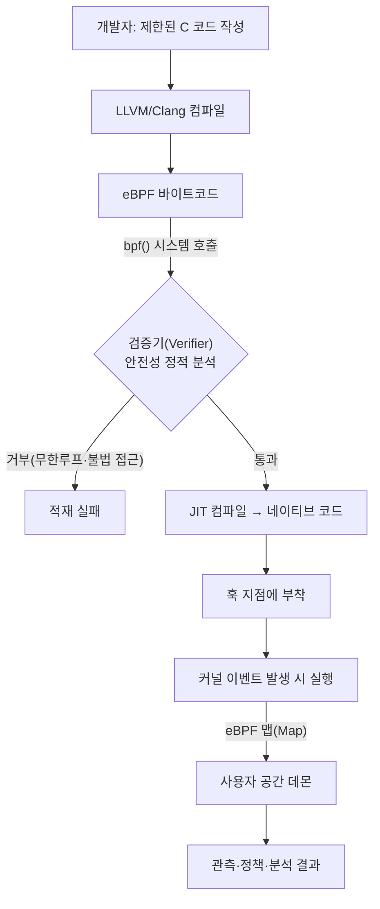
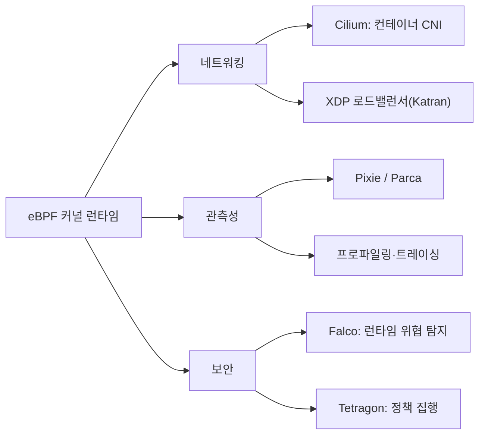

# eBPF(extended Berkeley Packet Filter)

## 1. 개요

> **정의**: eBPF는 운영체제 커널을 재컴파일하거나 커널 모듈을 새로 적재하지 않고도, 검증(Verifier)을 통과한 사용자 정의 프로그램을 커널 내부의 특정 이벤트(시스템 호출·네트워크 패킷·함수 진입 등)에 안전하게 붙여 실행하는 커널 내 경량 실행 기술이다.

eBPF의 뿌리는 1992년 패킷 필터링을 위해 등장한 BPF(Berkeley Packet Filter, 이하 cBPF)에 있다.
cBPF는 `tcpdump`가 관심 있는 패킷만 커널에서 걸러 사용자 공간으로 올리기 위한 작은 가상머신이었으나, 레지스터가 2개뿐이고 패킷 필터링 외에는 쓸 수 없는 제한적 구조였다.
2014년 리눅스 커널 3.15에 도입된 eBPF는 이 아이디어를 대폭 확장하여, 64비트 레지스터 11개와 자료구조(맵), 헬퍼 함수 호출을 갖춘 **커널 내 범용 실행 환경**으로 재탄생시켰다.
그 결과 오늘날 eBPF는 단순 패킷 필터를 넘어 네트워킹·관측성(Observability)·보안·성능 분석 전반을 아우르는 기반 기술로 자리 잡았다.

eBPF가 기술사 관점에서 중요한 이유는, 그것이 "커널을 바꾸지 않고 커널의 행동을 바꾸는" 새로운 확장 패러다임을 열었기 때문이다.
전통적으로 커널의 동작을 바꾸려면 커널 소스를 수정해 배포 주기를 기다리거나, 위험을 감수하고 커널 모듈을 적재해야 했다.
전자는 수년이 걸리고 후자는 잘못하면 커널 패닉으로 시스템 전체를 멈춘다.
eBPF는 이 두 선택지 사이에서 **검증기가 안전을 보장하는 샌드박스 프로그램**이라는 제3의 길을 제시했으며, 이 점이 리눅스를 "프로그래밍 가능한 커널"로 진화시킨 핵심이다.

### 1.1 등장 배경과 필요성

첫째, 클라우드 네이티브 환경의 폭증하는 계측 요구 때문이다.
컨테이너·마이크로서비스가 확산되면서 하나의 노드에서 수백 개 프로세스가 명멸하고, 이들이 커널을 통해 주고받는 시스템 호출·네트워크 흐름을 애플리케이션 코드 수정 없이 관측해야 할 필요가 커졌다.
애플리케이션마다 에이전트를 심고 코드를 계측하는 방식은 언어·프레임워크가 제각각이어서 확장성이 떨어지지만, 모든 프로세스가 반드시 거치는 커널에 한 번 계측하면 언어에 무관하게 전체를 관측할 수 있다.

둘째, 커널 모듈의 위험성과 유지보수 부담 때문이다.
커널 모듈은 커널과 같은 주소 공간에서 무제한 권한으로 실행되므로 버그 하나가 시스템 전체를 무너뜨리고, 커널 버전이 오를 때마다 재작성·재검증해야 한다.
eBPF 프로그램은 적재 시점에 검증기가 무한 루프·잘못된 메모리 접근을 사전에 차단하므로, 상대적으로 안전하게 커널 수준 기능을 배포할 수 있다.

셋째, 성능 오버헤드 최소화 요구 때문이다.
관측이나 정책 집행을 위해 패킷을 사용자 공간으로 복사해 처리하면 컨텍스트 스위칭·복사 비용이 누적된다.
eBPF는 커널 내부, 심지어 네트워크 드라이버 계층(XDP)에서 처리를 끝낼 수 있어 지연과 CPU 소모를 크게 줄인다.

### 1.2 핵심 특징

eBPF의 성격은 네 가지 특징으로 요약된다.
**안전성**은 검증기가 프로그램의 종료성과 메모리 안전을 정적으로 보장한다는 점이고, **성능**은 JIT 컴파일을 통해 바이트코드가 네이티브 기계어로 변환되어 실행된다는 점이다.
**동적 확장성**은 시스템을 재부팅하지 않고 프로그램을 붙였다 떼며 커널 행동을 바꿀 수 있다는 점이며, **프로그래밍 가능성**은 사용자가 원하는 로직을 커널 이벤트에 자유롭게 연결할 수 있다는 점이다.
이 네 가지가 결합되어 eBPF는 "안전하면서도 빠른 커널 확장"이라는, 종래에는 양립하기 어려웠던 목표를 달성한다.

## 2. 실행 구조와 동작 원리

eBPF 프로그램의 생애주기는 작성-컴파일-적재-검증-실행-데이터 교환의 흐름으로 이어진다.
개발자는 제한된 C 문법으로 프로그램을 작성하고, LLVM/Clang이 이를 eBPF 바이트코드로 컴파일한다.
이 바이트코드는 `bpf()` 시스템 호출로 커널에 적재되며, 이 순간 **검증기**가 프로그램의 모든 실행 경로를 탐색해 안전성을 확인한다.
검증을 통과한 프로그램만이 **JIT 컴파일러**에 의해 해당 CPU 아키텍처의 네이티브 코드로 변환되어, 지정한 훅(Hook) 지점에 부착된다.

동작 원리에서 가장 중요한 두 축은 **검증기**와 **맵(Map)**이다.
검증기는 프로그램이 반드시 유한 시간에 종료함을 보장하기 위해 과거에는 후방 점프(루프)를 금지했고, 현재는 검증 가능한 경계 루프(bounded loop)만 허용한다.
또한 포인터 연산의 범위를 추적해 커널 메모리의 임의 영역 접근을 차단하며, 접근 가능한 헬퍼 함수와 인자 타입까지 검사한다.
이 정적 분석 덕분에 잘못 작성된 프로그램은 실행되기 전에 적재 단계에서 거부되므로, 운영 중 커널 패닉 위험이 크게 낮아진다.

**맵**은 커널 내 eBPF 프로그램과 사용자 공간 프로그램, 그리고 여러 eBPF 프로그램 사이에서 상태를 공유하는 키-값 자료구조다.
eBPF 프로그램은 이벤트가 발생할 때마다 짧게 실행되고 종료되므로 자체적으로 상태를 오래 유지할 수 없는데, 맵이 이 상태를 커널에 영속시켜 준다.
예컨대 시스템 호출 횟수를 세는 프로그램은 카운터를 해시 맵에 누적하고, 사용자 공간 데몬이 주기적으로 이 맵을 읽어 지표로 변환한다.
해시 맵·배열·링 버퍼·LRU 맵 등 다양한 유형이 있어, 고빈도 이벤트 스트리밍부터 정책 테이블 조회까지 폭넓게 대응한다.

### 2.1 훅(Hook) 지점의 종류

eBPF의 활용 범위는 프로그램을 어디에 붙일 수 있는가, 즉 훅 지점에 따라 결정된다.
훅은 크게 네트워크 계열과 추적(tracing) 계열로 나뉜다.
네트워크 계열에서 **XDP(eXpress Data Path)**는 네트워크 드라이버가 패킷을 받자마자, 즉 커널 네트워크 스택에 진입하기 전에 실행되어 가장 빠르게 패킷을 통과·폐기·리다이렉트할 수 있다.
반면 **TC(Traffic Control)** 훅은 스택 진입 이후 지점이라 XDP보다 풍부한 메타데이터를 다루며 송신 방향도 제어한다.
추적 계열에서 **kprobe/kretprobe**는 커널 함수의 진입·반환에, **uprobe**는 사용자 프로그램 함수에, **tracepoint**는 커널이 안정적으로 노출한 정적 이벤트 지점에 붙는다.

| 구분 | 훅 지점 | 위치 | 주요 용도 |
|------|---------|------|-----------|
| 네트워크 | XDP | 드라이버 수신 직후 | 초고속 필터·DDoS 방어·로드밸런싱 |
| 네트워크 | TC | 네트워크 스택 | 송·수신 정책, 트래픽 제어 |
| 추적 | kprobe | 임의 커널 함수 | 커널 동작 동적 계측 |
| 추적 | tracepoint | 정적 이벤트 | 안정적 커널 이벤트 관측 |
| 추적 | uprobe | 사용자 함수 | 애플리케이션 내부 추적 |
| 보안 | LSM BPF | 보안 훅 | 접근 통제 정책 집행 |

이처럼 훅 지점이 다양하다는 것은 곧 하나의 기술로 네트워크·관측성·보안을 통합적으로 다룰 수 있음을 의미한다.
XDP가 성능을, tracepoint가 안정성을, LSM BPF가 보안 정책 집행을 담당하는 식으로 각 훅의 성격을 이해하고 목적에 맞게 선택하는 것이 설계의 핵심이다.

## 3. 주요 활용 분야

eBPF의 응용은 크게 세 갈래로 전개되며, 각각에서 사실상의 표준 프로젝트가 형성되어 있다.

**네트워킹**에서 가장 대표적인 프로젝트는 쿠버네티스 CNI(Container Network Interface)인 **Cilium**이다.
전통적 CNI는 리눅스의 `iptables`에 서비스·정책 규칙을 선형 리스트로 쌓아, 서비스 수가 늘어날수록 패킷당 규칙 탐색 비용이 선형으로 증가하는 확장성 한계를 안고 있었다.
Cilium은 이 규칙 처리를 eBPF 맵 기반의 해시 조회로 대체해 대규모 클러스터에서도 일정한 성능을 유지하고, 서비스 메시의 사이드카 프록시 없이도 L3~L7 정책과 로드밸런싱을 커널에서 처리한다.
페이스북(메타)의 XDP 기반 로드밸런서 Katran은 단일 서버에서 초당 수백만 패킷을 처리하는 사례로 인용된다.

**관측성**에서는 애플리케이션 코드를 전혀 수정하지 않고도 서비스 간 호출·지연·시스템 호출을 자동으로 계측할 수 있다는 점이 강점이다.
사이드카나 SDK를 각 서비스에 심는 대신, 노드에 하나의 eBPF 에이전트를 두어 커널을 통과하는 모든 트래픽과 함수 호출을 관측하므로 언어 중립적이고 계측 누락이 적다.
CPU 프로파일링을 상시 수행하는 continuous profiling(예: Parca), 자동 서비스 맵 생성(예: Pixie) 등이 이 범주에 속한다.

**보안**에서는 시스템 호출과 커널 이벤트를 실시간으로 감시해 런타임 위협을 탐지하고 차단한다.
Falco는 의심스러운 시스템 호출 패턴(예: 컨테이너 내에서 셸 실행, 민감 파일 접근)을 규칙으로 정의해 침해를 탐지하고, Tetragon은 탐지에 그치지 않고 정책 위반 프로세스를 커널 수준에서 즉시 차단한다.
LSM(Linux Security Module) BPF 훅을 이용하면 SELinux·AppArmor처럼 접근 통제 정책을 eBPF로 유연하게 구현할 수도 있다.

## 4. 커널 모듈 및 사용자 공간 방식과의 비교

eBPF의 위상을 정확히 이해하려면 기존의 두 가지 대안, 즉 커널 모듈 방식과 사용자 공간 에이전트 방식과 비교해야 한다.
세 방식은 "어디에서 실행되는가"와 "얼마나 안전한가"의 트레이드오프 위에 놓여 있다.

| 비교 항목 | 커널 모듈 | eBPF | 사용자 공간 에이전트 |
|-----------|-----------|------|----------------------|
| 실행 위치 | 커널 | 커널(샌드박스) | 사용자 공간 |
| 안전성 | 낮음(패닉 위험) | 높음(검증기 보장) | 높음(프로세스 격리) |
| 성능 | 매우 높음 | 높음 | 상대적으로 낮음 |
| 배포 유연성 | 낮음(재적재·재부팅) | 높음(동적 부착) | 높음 |
| 커널 이벤트 접근 | 전면 | 훅 한정 | 제한적(간접) |

커널 모듈은 성능과 접근 범위 면에서 가장 강력하지만, 안전성과 유지보수성이 취약해 프로덕션 도입에 부담이 크다.
사용자 공간 에이전트는 안전하고 개발이 쉬우나, 커널 이벤트를 직접 볼 수 없어 관측 깊이가 얕고 컨텍스트 스위칭 비용이 든다.
eBPF는 이 둘의 장점을 절충하여 **커널 모듈에 준하는 성능과 접근성**을, **사용자 공간에 준하는 안전성**과 함께 제공한다는 데 본질적 차별성이 있다.
차이가 생기는 근본 이유는 eBPF가 실행 전 검증이라는 정적 안전장치와 JIT라는 성능 장치를 동시에 갖췄기 때문이다.
다만 훅 지점과 헬퍼 함수가 커널이 노출한 범위로 한정되므로, 커널 전면을 자유롭게 다루는 유연성은 커널 모듈에 미치지 못한다는 점은 인정해야 한다.

## 5. 심화: 표준화 동향과 확장

eBPF는 리눅스 고유 기술로 출발했으나, 생태계가 성숙하면서 이식성과 표준화가 핵심 과제로 부상했다.
초기에는 실행 노드마다 커널 헤더에 맞춰 프로그램을 컴파일해야 해서 배포가 번거로웠는데, **CO-RE(Compile Once – Run Everywhere)** 기법과 BTF(BPF Type Format) 메타데이터가 등장하면서 한 번 컴파일한 바이너리를 서로 다른 커널 버전에서 재사용할 수 있게 되었다.
이는 대규모 인프라에 eBPF를 실용적으로 배포하는 전환점이 되었다.

거버넌스 측면에서는 리눅스 재단 산하에 **eBPF Foundation**이 설립되어 구글·메타·마이크로소프트·아이소밸런트 등이 참여하고 있으며, 이는 특정 벤더 종속을 완화하는 중립적 발전 기반이 된다.
플랫폼 확장으로는 **eBPF for Windows** 프로젝트가 진행되어, eBPF가 리눅스를 넘어 멀티 OS 계측·정책 프레임워크로 확장될 가능성을 보여준다.
서비스 메시 영역에서는 사이드카 프록시를 제거하고 eBPF로 상당 부분을 커널에서 처리하는 **사이드카리스(sidecarless)** 아키텍처가 부상하여, 데이터 플레인의 자원 소모와 지연을 줄이는 방향으로 논의가 이어지고 있다.

다만 이러한 동향을 단정적으로 서술하기보다는, 기술이 빠르게 진화 중이며 세부 성능·성숙도는 워크로드와 커널 버전에 따라 달라질 수 있다는 점을 함께 밝히는 것이 정확한 답안 태도다.

## 6. 고려사항 및 시사점

첫째, **보안 양면성에 대한 통제**가 필요하다.
eBPF는 강력한 보안 관측·집행 수단인 동시에, 잘못 부여된 권한으로 악용되면 커널 수준의 루트킷·데이터 탈취 도구가 될 수 있다.
따라서 eBPF 프로그램 적재 권한(CAP_BPF 등)을 최소 권한 원칙에 따라 엄격히 통제하고, 부착된 프로그램의 목록과 무결성을 상시 감사하는 거버넌스가 병행되어야 한다.

둘째, **검증기의 제약과 개발 복잡성**을 감안한 도입 전략이 요구된다.
검증기는 안전을 보장하는 대신 프로그램 크기·복잡도·루프에 제약을 두므로, 복잡한 로직은 여러 프로그램으로 분할하거나 사용자 공간과 역할을 나눠야 한다.
저수준 개발이 어려운 만큼, 직접 개발보다 Cilium·Falco 같은 검증된 상위 프레임워크를 활용하고 조직 역량이 성숙한 뒤 자체 개발로 확장하는 단계적 접근이 현실적이다.

셋째, **커널 버전 의존성과 이식성 관리** 전략이 중요하다.
훅 지점과 헬퍼 함수는 커널 버전에 따라 가용성이 다르므로, CO-RE/BTF를 전제로 지원 커널 범위를 명확히 정의하고, 노후 커널이 혼재된 환경에서는 대체 계측 경로를 마련해 두어야 한다.

넷째, **관측성·네트워킹·보안의 통합 아키텍처 관점**에서 접근해야 한다.
과거 각기 다른 도구로 분리 운영하던 세 영역을 eBPF라는 단일 커널 기반 위에 통합하면 운영 복잡도와 자원 소모를 줄일 수 있다.
기술사로서는 개별 도구 도입이 아니라, eBPF를 데이터 플레인의 공통 기반으로 삼아 관측·정책·보안을 일관되게 설계하는 플랫폼 전략의 관점에서 그 가치를 평가해야 한다.

## 참고자료

- eBPF 공식 사이트, https://ebpf.io/
- Cilium 프로젝트 문서, https://docs.cilium.io/
- Linux Foundation, eBPF Foundation, https://ebpf.foundation/

---

> **한 줄 요약**: eBPF는 검증기가 안전을 보장하는 샌드박스 프로그램을 커널 이벤트에 동적으로 부착해, 재부팅·모듈 없이 네트워킹·관측성·보안을 커널 수준에서 고성능으로 통합 처리하는 "프로그래밍 가능한 커널" 기반 기술이다.
