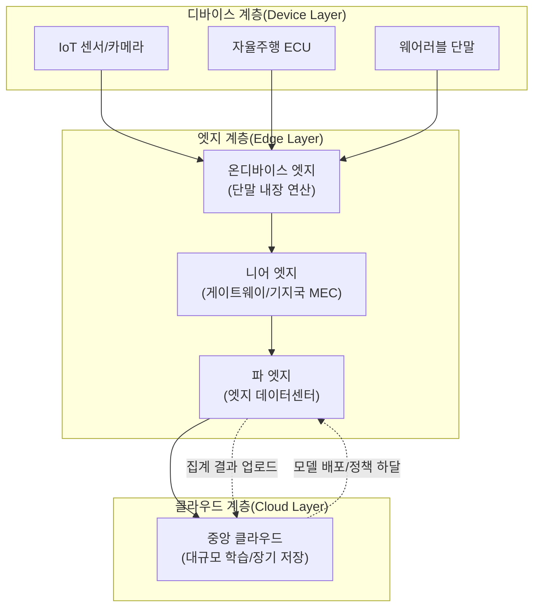
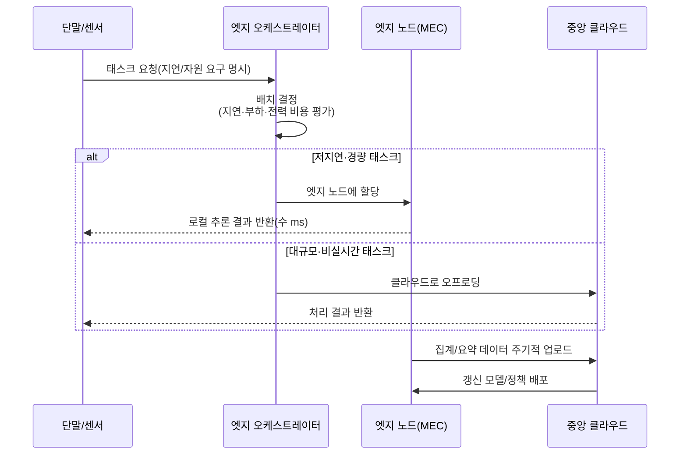

# 엣지 컴퓨팅(Edge Computing)

## 1. 개요

> **정의**: 엣지 컴퓨팅(Edge Computing)이란 데이터가 생성되는 현장(단말·센서·게이트웨이) 또는 그 인근의 소규모 분산 컴퓨팅 자원에서 연산·저장·분석을 수행하여, 중앙 클라우드로의 전송을 최소화하고 지연(Latency)·대역폭·프라이버시 문제를 해소하는 분산 컴퓨팅 패러다임이다.

엣지 컴퓨팅이 등장한 배경에는 "데이터의 폭증"과 "중앙집중형 클라우드의 물리적 한계"라는 두 가지 구조적 변화가 있다. IoT 센서, 자율주행차, 스마트 팩토리의 산업용 카메라 등은 초당 수 기가바이트(GB) 규모의 데이터를 쏟아내는데, 이를 모두 원거리의 중앙 클라우드로 전송해 처리하면 왕복 지연(RTT)이 수십~수백 밀리초에 달하고 백본 대역폭 비용이 폭증한다. 자율주행의 긴급 제동이나 스마트 팩토리의 로봇 제어처럼 수 밀리초(ms) 내 반응이 필요한 실시간 서비스에서는 이 지연이 곧 안전사고로 직결된다. 즉, 광속이라는 물리 법칙상 "데이터를 먼 곳으로 보냈다 돌아오는" 왕복 시간을 줄이는 유일한 방법은 연산을 데이터 발생 지점 가까이 옮기는 것이다.

또 다른 배경은 프라이버시·주권 규제의 강화다. 병원 영상, 공장 공정 데이터, 개인 생체정보 등 민감 데이터를 원본 그대로 클라우드에 올리는 것 자체가 개인정보보호법·GDPR 위반 소지가 있으며, 데이터 주권(Data Sovereignty) 관점에서도 국경을 넘기는 것이 곤란하다. 엣지에서 1차 가공·비식별화·요약을 수행한 뒤 필요한 결과만 중앙으로 올리면 이 문제를 상당 부분 완화할 수 있다. 이런 맥락에서 엣지 컴퓨팅은 클라우드를 대체하는 것이 아니라, 중앙 클라우드-엣지-단말로 이어지는 **연속체(Cloud-to-Edge Continuum)**를 형성하며 상호 보완한다.

엣지 컴퓨팅의 핵심 특징은 (1) **근접성(Proximity)** — 데이터 발생지 인접 처리, (2) **저지연(Low Latency)** — 실시간 응답, (3) **분산성(Distribution)** — 다수 엣지 노드에 부하 분산, (4) **자율성(Autonomy)** — 네트워크 단절 시에도 로컬 판단 지속으로 요약된다. 이는 초저지연·초연결·초신뢰를 요구하는 5G/6G, 자율주행, 산업 IoT, 실감형 미디어 서비스의 공통 인프라로 자리잡고 있다.

용어상 유사 개념과의 구분도 필요하다. 통신망 관점에서 사용자 인접 지점에 컴퓨팅을 두는 것을 강조하면 **MEC(Multi-access Edge Computing)**, 콘텐츠 캐싱에 초점을 두면 **CDN**, 클라우드 사업자가 자사 리전을 사용자 인근으로 확장하는 형태는 **엣지 존/로컬 존**이라 부르지만, 이들은 모두 "중앙집중에서 분산으로"라는 엣지 컴퓨팅의 큰 흐름 안에 놓인다. 과거 유행한 **포그 컴퓨팅(Fog Computing)**은 엣지와 클라우드 사이의 중간 계층을 강조한 개념으로, 오늘날에는 엣지 컴퓨팅의 파 엣지 계층에 사실상 흡수되어 이해된다.

## 2. 엣지 컴퓨팅 계층 구조와 아키텍처

엣지 컴퓨팅은 단일 장비가 아니라 단말에서 클라우드까지 이어지는 다계층 구조로 이해해야 한다. 아래 개념도는 데이터가 발생하는 디바이스 계층부터 중앙 클라우드까지의 전체 구조를 나타낸다.

**가. 디바이스 계층(Device Layer)**은 데이터의 원천이다. 센서, 카메라, 액추에이터, 차량 ECU 등이 물리 세계의 상태를 디지털 신호로 변환한다. 이 계층은 연산 자원이 극도로 제약되므로(수 밀리와트 전력, 수 KB 메모리) 원시 데이터를 그대로 상위로 흘려보내거나 극히 단순한 필터링만 수행한다. 최근에는 이 계층 자체에 초경량 추론 엔진을 얹는 온디바이스 AI가 결합되며 경계가 흐려지고 있다. 이러한 극저전력 상시 동작을 위해 마이크로컨트롤러급 하드웨어에서 신경망을 돌리는 TinyML, 이벤트가 발생할 때만 깨어나는 인터미턴트 컴퓨팅, 그리고 뉴로모픽 칩 같은 저전력 연산 소자가 이 계층의 확장 기술로 주목받는다. 다만 자원 제약이 큰 만큼 모델 갱신·보안 패치를 원격으로 안전하게 배포하는 OTA(Over-the-Air) 관리와 경량 인증 체계가 반드시 병행되어야 한다.

**나. 엣지 계층(Edge Layer)**은 엣지 컴퓨팅의 심장부로, 다시 세 단계로 세분된다. **온디바이스 엣지**는 단말 내부에서 직접 연산하는 형태(예: 스마트폰 NPU의 얼굴인식)이고, **니어 엣지(Near Edge)**는 공장 게이트웨이나 통신사 기지국의 MEC(Multi-access Edge Computing) 서버처럼 단말에서 한 홉(hop) 떨어진 지점이며, **파 엣지(Far Edge)**는 지역 거점에 배치된 소규모 엣지 데이터센터(수십 kW급)로 다수 니어 엣지를 아우르는 중간 집계·조정 역할을 한다. 응답 지연은 온디바이스(<1ms) → 니어 엣지(1~10ms) → 파 엣지(10~30ms) → 클라우드(50ms 이상) 순으로 커지므로, 서비스의 지연 요구에 따라 적절한 계층에 워크로드를 배치(Placement)하는 것이 설계의 핵심이다.

특히 이 계층 구분을 관통하는 개념이 **데이터 중력(Data Gravity)**이다. 데이터는 규모가 커질수록 그 자리에 서비스와 연산을 끌어당기는 성질이 있어, 대용량 데이터를 옮기는 것보다 연산을 데이터 쪽으로 이동시키는 편이 훨씬 경제적이다. 엣지 컴퓨팅은 바로 이 원리를 구조화한 것으로, "데이터가 무거운 곳(현장)에 가벼운 연산을 붙이고, 가벼운 요약만 중력이 약한 상위로 올린다"는 설계 철학을 계층 배치에 반영한다.

**다. 클라우드 계층(Cloud Layer)**은 대규모 모델 학습, 장기 데이터 보관, 전역 정책 수립 등 지연에 둔감하지만 대규모 자원이 필요한 작업을 담당한다. 엣지에서 추론(Inference)하고 클라우드에서 학습(Training)한 뒤 갱신된 모델을 다시 엣지로 배포하는 "학습-추론 분리" 구조가 대표적이며, 이는 후술할 연합학습(Federated Learning)과 결합해 프라이버시를 보존한 채 모델을 진화시킨다.

핵심 통신 표준으로는 유럽전기통신표준협회(ETSI)가 정의한 **MEC(Multi-access Edge Computing)** 아키텍처가 있으며, 5G 코어망의 UPF(User Plane Function)를 사용자 인근으로 분산 배치하는 **로컬 브레이크아웃(Local Breakout)**을 통해 트래픽이 중앙망을 거치지 않고 엣지에서 곧바로 처리되도록 한다.

## 3. 동작 프로세스와 워크로드 오케스트레이션

엣지 환경은 수백~수천 개의 이기종 노드가 지리적으로 분산되어 있어, 어떤 연산을 어느 노드에서 실행할지 동적으로 결정하는 오케스트레이션이 성패를 가른다. 아래 다이어그램은 요청이 들어왔을 때 오프로딩(Offloading) 판단과 처리 흐름을 나타낸다.

**가. 태스크 오프로딩(Task Offloading) 결정**은 "이 연산을 로컬에서 할까, 상위로 넘길까"를 판단하는 과정이다. 판단 기준은 태스크의 지연 허용치(Latency budget), 필요한 연산량·메모리, 현재 노드의 부하와 배터리 잔량, 전송해야 할 데이터 크기 등이다. 예컨대 배터리 구동 단말에서는 연산에 드는 에너지와 전송에 드는 에너지를 비교해 더 적은 쪽을 택하는 에너지-지연 트레이드오프 최적화가 핵심이며, 이를 정수계획법이나 강화학습으로 실시간 결정한다.

**나. 컨테이너 기반 배포와 경량 오케스트레이션**이 실행을 뒷받침한다. 중앙 클라우드가 Kubernetes로 컨테이너를 관리하듯, 엣지에서는 자원이 제약된 노드를 위해 K3s, KubeEdge, OpenYurt 같은 경량 쿠버네티스 배포판이 사용된다. 이들은 마스터-워커 간 네트워크가 불안정하거나 단절되어도 엣지 노드가 마지막으로 받은 명세대로 자율 동작(Autonomy)을 유지하고, 연결이 복구되면 상태를 재동기화하는 "네트워크 단절 내성(Disconnected Operation)"을 제공한다. 실제 통신사 MEC 플랫폼은 이런 경량 오케스트레이터 위에 CDN 캐시, AI 추론 서버, 로컬 UPF를 컨테이너로 배포한다.

**다. 데이터 수명주기 관리와 계층적 집계**도 중요하다. 엣지에서 발생하는 데이터를 모두 저장하면 저장소가 순식간에 포화되므로, 엣지 노드는 이상치·이벤트만 선별 저장하고 정상 데이터는 통계 요약(평균·분산·히스토그램)만 상위로 올리는 계층적 집계(Hierarchical Aggregation)를 수행한다. 예를 들어 스마트 팩토리에서 진동 센서 1kHz 원신호는 엣지에서 실시간 FFT 분석 후 "이상 주파수 검출 여부"라는 결과만 클라우드로 전송함으로써 대역폭을 수백 배 절감한다.

**라. 복원력(Resilience)과 무정지 운영**은 엣지 설계의 마지막 관문이다. 엣지 노드는 현장 정전, 통신 두절, 하드웨어 고장 등 데이터센터보다 훨씬 열악한 환경에서 동작하므로, 상위 연결이 끊겨도 마지막으로 수신한 정책·모델로 핵심 판단을 지속하고(Degraded Mode), 로컬 큐에 데이터를 버퍼링했다가 연결 복구 시 재전송(Store-and-Forward)하는 설계가 필수다. 또한 특정 노드가 죽으면 인접 노드가 워크로드를 이어받는 페일오버(Failover)와, 동일 서비스를 복수 노드에 분산 배치하는 이중화가 서비스 연속성을 보장한다. 이처럼 엣지의 자율성은 곧 장애 내성(Fault Tolerance)과 직결되며, 카오스 엔지니어링으로 단절 상황을 사전 검증하는 것이 권장된다.

## 4. 클라우드 컴퓨팅과의 비교

엣지와 클라우드는 대립 관계가 아니라 역할 분담 관계지만, 시험 답안에서는 차이가 왜 생기는지를 물리적·경제적 이유와 함께 설명해야 한다. 아래 표는 주요 차원의 비교다.

| 구분 | 중앙 클라우드 컴퓨팅 | 엣지 컴퓨팅 |
|------|--------------------|-----------|
| 처리 위치 | 원거리 대규모 데이터센터 | 데이터 발생지 인근 분산 노드 |
| 지연(Latency) | 수십~수백 ms | 1~30 ms (계층별) |
| 자원 규모 | 사실상 무한 확장 | 소규모·제약적(전력·공간) |
| 대역폭 비용 | 원본 전송으로 높음 | 로컬 처리로 대폭 절감 |
| 데이터 프라이버시 | 원본 이동에 따른 노출 위험 | 현장 처리로 노출 최소화 |
| 네트워크 의존성 | 연결 단절 시 서비스 중단 | 단절 시에도 로컬 자율 동작 |
| 관리 복잡도 | 중앙 집중으로 상대적 단순 | 다수 이기종 노드로 높음 |

엣지와 클라우드의 관계는 대체가 아니라 **역할 특화에 따른 워크로드 분업**으로 이해해야 한다. 실시간 판단·1차 가공은 엣지가, 대규모 학습·전역 통합·장기 보관은 클라우드가 맡되, 둘을 잇는 제어·데이터 파이프라인을 하나의 연속체로 설계하는 것이 관건이다. 이 관점을 놓치고 "엣지 대 클라우드"의 양자택일로 접근하면, 엣지의 관리 부담만 떠안거나 클라우드의 지연 한계에 갇히는 실패로 이어진다.

두 방식의 지연 차이는 근본적으로 물리적 거리에서 비롯된다. 서울의 단말이 미국 서부 리전 클라우드와 통신하면 광케이블 왕복만으로도 130ms 이상이 소요되는데, 이는 소프트웨어 최적화로는 결코 줄일 수 없는 광속의 한계다. 반면 대역폭 비용의 차이는 경제적 이유다. 4K 카메라 100대의 영상을 원본으로 클라우드에 올리면 월 수천만 원의 전송비가 발생하지만, 엣지에서 객체 검출 후 "침입 발생" 이벤트만 올리면 비용이 수백분의 일로 줄어든다.

다만 엣지가 만능은 아니다. 대규모 언어모델 학습이나 전사 데이터 웨어하우스처럼 방대한 자원과 전역적 데이터 통합이 필요한 작업은 여전히 클라우드가 압도적으로 유리하다. 또한 수천 개 엣지 노드를 일관되게 관리·보안 패치·모니터링하는 운영 복잡도(Operational Overhead)는 엣지의 최대 약점으로, 이를 낮추기 위해 GitOps 기반 선언적 배포와 옵저버빌리티(Observability) 체계가 필수적으로 결합된다.

또한 상태(State) 관리의 난이도가 다르다. 중앙 클라우드는 단일 데이터 저장소를 기준으로 강한 일관성(Strong Consistency)을 비교적 쉽게 확보하지만, 지리적으로 흩어진 엣지 노드 간에는 CAP 정리상 네트워크 분할을 전제로 가용성과 일관성을 저울질해야 한다. 따라서 엣지에서는 최종 일관성(Eventual Consistency)과 충돌 없는 복제 데이터 타입(CRDT), 로컬 우선(Local-first) 설계가 자주 채택된다. 결국 엣지와 클라우드의 선택은 "어디가 더 빠른가"만이 아니라 "일관성·내구성·비용·프라이버시를 어떻게 배분할 것인가"라는 종합적 아키텍처 의사결정이다.

## 5. 산업 적용 사례

**가. 스마트 팩토리 예지정비.** 국내외 제조사들은 설비 진동·온도·전류 센서 데이터를 엣지에서 실시간 분석해 고장을 사전 예측한다. 클라우드 왕복 없이 엣지 노드가 수 ms 내 이상을 감지하므로, 설비 정지 전 즉시 알람·자동 감속이 가능하다. 이 방식으로 계획외 정지(Unplanned Downtime)를 20~50% 줄인 사례가 보고된다.

이 사례에서 주목할 점은 엣지가 단순 비용 절감을 넘어 안전·품질 지표를 직접 개선한다는 것이다. 불량 검출 카메라를 예로 들면, 클라우드 왕복 시 컨베이어가 이미 다음 공정으로 넘어간 뒤에야 불량 판정이 도착하지만, 엣지 추론은 해당 제품이 현장에 있을 때 즉시 배출(Reject)할 수 있어 후공정 불량 유출을 원천 차단한다.

**나. 자율주행과 V2X.** 자율주행차는 카메라·라이다(LiDAR) 데이터를 차량 내 온디바이스 엣지(고성능 SoC)에서 처리하되, 교차로 신호·주변 차량 정보는 도로변 기지국 MEC와 V2X(Vehicle-to-Everything)로 교환한다. 긴급 제동 판단에 요구되는 종단간(End-to-End) 지연은 통상 수 ms 수준이어야 하므로, 중앙 클라우드 처리는 원천적으로 불가능하고 엣지가 필수다.

**다. 실감 미디어·클라우드 게이밍.** 통신사들은 기지국 인근 MEC에 렌더링 서버를 배치해, VR/AR 및 클라우드 게이밍의 모션-포토전(Motion-to-Photon) 지연을 20ms 이하로 낮춘다. 지연이 크면 어지럼증(Cybersickness)이 발생하므로 엣지 렌더링이 사용자 경험의 핵심 요소가 된다.

**라. 스마트 시티·영상 관제.** 도심의 수천 대 CCTV 영상을 모두 중앙 관제센터로 보내면 대역폭과 저장비용이 감당 불가능하다. 각 교차로·건물의 엣지 노드에서 객체 검출·번호판 인식·이상행동 탐지를 수행하고 "차량 정체", "쓰러진 보행자" 같은 이벤트 메타데이터만 중앙으로 전송하면, 원본 영상 대비 대역폭을 수백 배 절감하면서도 실시간 대응이 가능해진다. 개인 영상 원본이 현장을 벗어나지 않으므로 프라이버시 측면에서도 유리하다.

## 6. 심화 — 엣지 AI, 연합학습, 6G 연계와 최신 동향

엣지 컴퓨팅의 최근 기술 발전은 AI와의 융합에서 두드러진다. **엣지 AI(Edge AI)**는 경량화된 신경망을 엣지에서 직접 추론하는 것으로, 모델 경량화 기법인 양자화(Quantization), 가지치기(Pruning), 지식 증류(Knowledge Distillation)를 통해 클라우드에서 학습된 대형 모델을 엣지 하드웨어(NPU, TPU Edge, Jetson 등)에서 실행 가능한 크기로 줄인다. 이는 별도로 정리된 온디바이스 AI 주제와 밀접히 연계된다.

엣지 AI가 확산되면서 하드웨어 가속기 경쟁도 치열하다. 저전력·소형 폼팩터에서 높은 추론 성능을 내기 위해 NPU·엣지 TPU·FPGA가 활용되며, 연산량 대비 전력(TOPS/W) 효율이 엣지 하드웨어 선택의 핵심 지표가 된다. 또한 하나의 엣지 노드가 여러 서비스의 모델을 동시에 서빙해야 하므로, 모델 버전 관리·A/B 배포·자동 롤백을 지원하는 엣지 특화 MLOps(때로 Edge MLOps로 구분) 파이프라인의 중요성이 커지고 있다.

프라이버시를 보존하면서 엣지 모델을 지속 개선하는 핵심 기법이 **연합학습(Federated Learning)**이다. 각 엣지 노드가 로컬 데이터로 모델을 학습한 뒤 원본 데이터가 아닌 모델 가중치(또는 그래디언트)만 중앙으로 전송하면, 중앙은 이를 집계(FedAvg 등)해 전역 모델을 갱신하고 다시 배포한다. 이로써 민감 데이터가 현장을 떠나지 않으면서도 전체 성능이 향상된다. 다만 가중치 전송만으로도 원본이 일부 복원될 수 있어 차등 프라이버시(Differential Privacy)·동형암호가 함께 적용되는 추세다.

네트워크 측면에서는 **5G 어드밴스드와 6G**가 엣지 컴퓨팅을 한층 강화한다. 6G는 초저지연(0.1ms급)·초정밀 측위·통신-컴퓨팅 통합(ICC, Integrated Communication and Computation)을 지향하며, 위성-공중-지상 통합망(SATIN)과 결합해 엣지 노드를 지상뿐 아니라 저궤도 위성까지 확장하려 한다. 표준화 관점에서는 ETSI MEC, 3GPP의 5G 엣지 컴퓨팅 규격, 그리고 리눅스 재단의 LF Edge(EdgeX Foundry, Akraino) 등이 상호운용성을 주도하고 있다. 최근에는 서버리스 개념을 엣지로 확장한 **엣지 서버리스(Edge Functions)**가 CDN 사업자를 중심으로 확산되어, 개발자가 인프라를 의식하지 않고 전 세계 엣지에 함수를 배포하는 형태로 진화 중이다.

보안 관점에서 엣지는 물리적 통제가 약한 현장에 노드가 노출되므로 전통적 데이터센터 보안 모델이 그대로 적용되지 않는다. 노드가 물리적으로 탈취·복제될 수 있다는 전제 아래, 하드웨어 신뢰기반(TPM/TEE)에 저장된 키로 부팅 무결성을 검증하는 원격 증명(Remote Attestation)과, 모든 노드·워크로드 간 통신을 상호 인증하는 제로 트러스트가 결합된다. 또한 신뢰실행환경(TEE) 기반의 기밀 컴퓨팅(Confidential Computing)을 엣지에 적용하면, 노드 운영자조차 처리 중 데이터를 열람할 수 없어 멀티테넌트 엣지 환경의 데이터 보호를 강화할 수 있다.

## 7. 고려사항 및 시사점

첫째(적용 전략), 엣지 도입은 전면 이관이 아니라 **워크로드 특성 기반의 선별적 배치**로 접근해야 한다. 지연 민감도, 데이터 크기, 프라이버시 등급을 축으로 워크로드를 분류해 실시간·민감 워크로드만 엣지로 내리고, 학습·분석은 클라우드에 남기는 하이브리드 배치가 최적이다. 처음부터 모든 것을 엣지화하면 관리 복잡도와 비용만 급증한다.

둘째(트레이드오프), 엣지는 **지연·대역폭 이득과 운영 복잡도·보안 노출 사이의 균형**이다. 노드 수가 늘수록 물리적 접근이 가능한 공격면(Attack Surface)이 커지므로, 하드웨어 신뢰기반(TPM), 보안 부팅(Secure Boot), 제로 트러스트 접근제어, 노드 인증·원격 증명(Remote Attestation)을 설계 초기부터 내재화해야 한다. 분산된 수천 노드의 취약점을 일괄 패치하는 자동화 파이프라인 부재는 곧 대규모 침해로 이어진다.

셋째(전망), 엣지-클라우드 연속체는 **통합 제어 평면(Unified Control Plane)**으로 수렴할 것이다. GitOps·플랫폼 엔지니어링·옵저버빌리티를 결합해 중앙에서 선언적으로 정책을 정의하면 엣지까지 자동 전파·검증되는 체계가 표준이 되며, AIOps가 이기종 엣지의 이상을 자율 탐지·복구하는 방향으로 발전한다.

넷째(연계 기술), 엣지 컴퓨팅은 단독 기술이 아니라 5G/6G, 온디바이스 AI, 연합학습, IoT, MEC, 서버리스, CDN, 제로 트러스트가 교차하는 융합 지점이다. 기술사 관점에서는 특정 요소기술의 깊이보다, 이들을 서비스 요구(지연·비용·프라이버시·신뢰성)에 맞게 조합하는 **아키텍처 통찰과 트레이드오프 판단력**이 평가의 핵심이 된다.

다섯째(도입 로드맵), 조직 차원의 엣지 전환은 단계적 성숙도 모델로 접근하는 것이 바람직하다. 초기에는 특정 라인·지점에 파일럿 엣지를 구축해 지연·비용 효과를 정량 검증(PoC)하고, 이후 표준 엣지 플랫폼(경량 K8s·GitOps·관측성)을 정의해 다수 거점으로 수평 확장하며, 최종적으로 클라우드-엣지 통합 운영 조직(플랫폼 엔지니어링 팀)과 SLO 기반 신뢰성 관리 체계를 갖추는 순서다. 기술 도입만 앞세우고 운영 표준·거버넌스를 뒤로 미루면, 관리되지 않는 엣지 노드가 곧 섀도 IT이자 보안 취약점으로 전락한다는 점을 유의해야 한다.

## 참고자료

- ETSI, "Multi-access Edge Computing (MEC)", https://www.etsi.org/technologies/multi-access-edge-computing
- LF Edge, "EdgeX Foundry / Akraino", https://www.lfedge.org/
- Gartner, "Edge Computing" (용어 및 시장 전망), https://www.gartner.com/en/information-technology/glossary/edge-computing

---

> **한 줄 요약**: 엣지 컴퓨팅은 데이터 발생지 인근에서 연산을 수행해 지연·대역폭·프라이버시 문제를 해소하는 분산 패러다임으로, 디바이스-엣지(온/니어/파)-클라우드 연속체와 MEC·경량 오케스트레이션·엣지 AI를 통해 자율주행·스마트팩토리·실감미디어의 실시간 서비스를 구현하며, 클라우드와의 선별적 워크로드 배치와 보안·운영 복잡도 관리가 성공의 관건이다.
