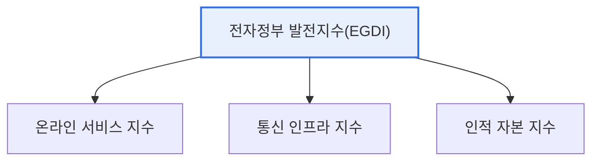

# UN 전자정부 평가

## 1. 개요

### 가. 개념과 평가지수의 종류
> **UN 전자정부 평가**는 국제연합(UN)이 2년마다 전 회원국을 대상으로 **전자정부의 발전 수준과 온라인 시민 참여를 측정·비교**하는 국제 평가다. 각국 전자정부의 현주소를 진단하고 발전을 촉진하는 기준이 된다.

UN 전자정부 평가가 중요한 이유는 '**전자정부의 수준을 국제적으로 표준화된 잣대로 비교**'하기 때문이다. 나라마다 전자정부를 다르게 발전시키므로, 공통 기준 없이는 어느 나라가 얼마나 앞서 있는지, 무엇을 개선해야 하는지 알 수 없다. UN 평가는 온라인 서비스·통신 인프라·인적 자본이라는 공통 축으로 각국을 측정해 순위를 매기고, 이를 통해 각국이 강점·약점을 파악하고 발전 방향을 잡게 한다. 우리나라는 이 평가에서 최상위권을 유지해온 전자정부 선도국으로, 평가 결과가 국가 디지털 경쟁력의 지표로 활용된다. 평가는 크게 정부 서비스의 발전 정도를 보는 발전지수와, 시민 참여를 보는 참여지수로 구성된다.

### 나. 평가지수의 종류
| 지수 | 내용 |
|---|---|
| **전자정부 발전지수(EGDI)** | 전자정부의 종합 발전 수준 |
| **온라인 참여지수(EPI)** | 시민의 온라인 참여·소통 수준 |

## 2. 전자정부 발전지수(EGDI)의 개념과 평가 방법

**EGDI(E-Government Development Index)** 는 전자정부 발전을 세 하위 지수의 가중 평균으로 산출한다. 정부가 제공하는 온라인 서비스의 수준(OSI), 이를 뒷받침하는 통신 인프라(TII), 그리고 이를 활용할 국민의 역량(HCI)을 종합한다. 즉 서비스·인프라·사람이라는 세 축이 균형을 이뤄야 높은 점수를 받는다.

| 하위 지수 | 측정 내용 |
|---|---|
| **온라인 서비스 지수(OSI)** | 정부 온라인 서비스의 범위·품질 |
| **통신 인프라 지수(TII)** | 인터넷·이동통신·초고속망 보급 |
| **인적 자본 지수(HCI)** | 교육 수준·문해율(활용 역량) |

EGDI는 세 지수를 정규화해 가중 평균한 0~1 사이 값으로, 값이 클수록 전자정부가 발전한 것이다.

## 3. 고려사항 및 시사점

1. **세 축의 균형이 핵심**이다. 아무리 좋은 온라인 서비스를 만들어도 인프라가 부족하거나 국민이 활용하지 못하면 점수가 낮으므로, 서비스·인프라·인적 역량을 함께 발전시켜야 한다.
2. **참여(EPI)로 무게중심 이동**이 나타난다. 단순히 서비스를 제공하는 것을 넘어, 시민이 정책 결정에 참여·소통하는 '열린 정부'가 강조되며 온라인 참여지수의 중요성이 커지고 있다.
3. **디지털 플랫폼 정부와 연계**된다. 데이터 개방·맞춤형 서비스·시민 참여를 지향하는 디지털 플랫폼 정부가 UN 평가의 발전 방향과 맞닿아 있어, 평가 대응이 곧 전자정부 고도화 전략이 된다.

---

> **한 줄 요약**: UN 전자정부 평가는 *발전지수(EGDI)와 온라인 참여지수(EPI)* 로 각국을 측정하며, EGDI는 *온라인 서비스·통신 인프라·인적 자본* 세 축의 가중 평균으로 산출되어 서비스·인프라·역량의 균형 발전을 요구한다.
