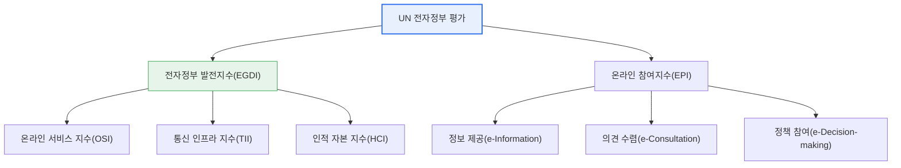
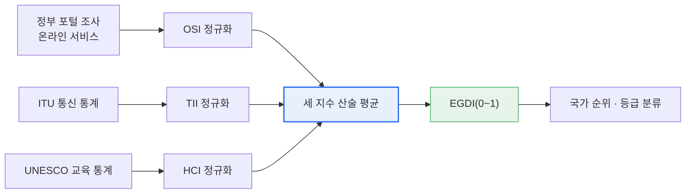

# UN 전자정부 평가

## 1. 개요

### 가. 정의
> **UN 전자정부 평가(UN E-Government Survey)** 는 국제연합 경제사회국(UN DESA)이 **2년마다 전 회원국을 대상으로 전자정부의 발전 수준과 온라인 시민 참여를 측정·비교**하여 국가별 순위를 발표하는 국제 평가다. 각국 전자정부의 현주소를 진단하고 개선 방향을 제시하는 세계적 기준선(benchmark) 역할을 한다.

UN 전자정부 평가가 중요한 이유는 '**전자정부의 수준을 국제적으로 표준화된 잣대로 비교**'한다는 점에 있다. 나라마다 정치·경제·행정 환경이 다르고 전자정부를 발전시켜 온 경로도 제각각이므로, 공통된 측정 기준이 없다면 어느 나라가 얼마나 앞서 있는지, 자국이 무엇을 보완해야 하는지를 객관적으로 판단하기 어렵다. UN 평가는 온라인 서비스·통신 인프라·인적 자본이라는 공통의 세 축으로 모든 회원국을 동일한 방법론으로 측정해 상대적 위치를 드러내고, 이를 통해 각국이 강점·약점을 파악하고 국가 정보화 전략의 방향을 잡도록 돕는다.

우리나라는 이 평가에서 오랜 기간 최상위권을 유지해온 전자정부 선도국이며, 평가 결과는 국가 디지털 경쟁력을 대외적으로 보여주는 지표이자 정부 정보화 정책의 성과를 점검하는 거울로 활용된다. 평가는 크게 정부가 제공하는 서비스와 그 기반의 발전 정도를 보는 **발전지수(EGDI)** 와, 정부–시민 간 상호작용·참여 수준을 보는 **온라인 참여지수(EPI)** 의 두 축으로 구성된다. 즉 '정부가 얼마나 잘 갖췄는가'와 '시민이 얼마나 참여하는가'를 함께 본다는 점이 이 평가의 근본 설계 철학이다.

### 나. 등장 배경과 필요성
UN이 전자정부 평가를 시작한 배경에는 2000년대 초 전 세계적으로 확산된 전자정부 구축 흐름이 있다. 각국이 앞다투어 정부 서비스를 온라인화했지만, 그 성과를 비교·공유할 공통 틀이 없었다. UN은 개발도상국을 포함한 모든 회원국이 자국 수준을 진단하고 선진 사례를 벤치마킹할 수 있도록, 그리고 정보 격차(digital divide) 해소와 지속가능발전목표(SDGs) 달성을 위한 디지털 정부의 역할을 촉진하기 위해 정기 평가를 제도화했다.

필요성은 세 가지로 정리된다. 첫째, **진단과 벤치마킹**이다. 표준화된 지수로 자국의 위치와 취약 영역을 파악하고 선도국 사례를 학습한다. 둘째, **정책 동인(driver)** 이다. 국제 순위는 각국 정부가 전자정부 투자를 지속하도록 만드는 강력한 정치적 동기가 된다. 셋째, **포용성 촉진**이다. 인적 자본·인프라 지수를 통해 단순 서비스 구축을 넘어 국민 누구나 활용할 수 있는 전자정부를 지향하도록 유도한다.

## 2. 평가 지수 체계와 전체 구조

UN 전자정부 평가는 발전지수(EGDI)와 온라인 참여지수(EPI)의 두 지수로 구성되며, EGDI는 다시 세 하위 지수의 가중 평균으로 산출된다. 아래 구조도는 평가 지수 전체의 계층 관계를 보여준다.

```mermaid
flowchart TB
  UN["UN 전자정부 평가"] --> EGDI["전자정부 발전지수(EGDI)"]
  UN --> EPI["온라인 참여지수(EPI)"]
  EGDI --> OSI["온라인 서비스 지수(OSI)"]
  EGDI --> TII["통신 인프라 지수(TII)"]
  EGDI --> HCI["인적 자본 지수(HCI)"]
  EPI --> P1["정보 제공(e-Information)"]
  EPI --> P2["의견 수렴(e-Consultation)"]
  EPI --> P3["정책 참여(e-Decision-making)"]
  style UN fill:#e8f0fe,stroke:#2f6fed,stroke-width:2px
  style EGDI fill:#e6f4ea,stroke:#34a853,stroke-width:1px
```

**발전지수(EGDI)** 는 전자정부의 종합적 발전 수준을 나타내며, 뒤에서 상술할 세 하위 지수의 산술 평균으로 계산된다. **온라인 참여지수(EPI)** 는 정부가 시민에게 정보를 제공하고(정보 제공), 정책 형성 과정에서 의견을 듣고(의견 수렴), 나아가 시민을 실제 의사결정에 참여시키는(정책 참여) 수준을 단계적으로 평가한다. 이 두 지수를 함께 보는 이유는, 아무리 발전지수가 높아도 시민 참여가 뒷받침되지 않으면 '일방적 서비스 제공'에 머물러 민주적 거버넌스로서의 전자정부가 완성되지 않기 때문이다.

| 지수 | 측정 대상 | 성격 |
|---|---|---|
| **전자정부 발전지수(EGDI)** | 서비스·인프라·인적 역량의 종합 수준 | 공급·기반 중심(0~1) |
| **온라인 참여지수(EPI)** | 정보 제공·의견 수렴·정책 참여 | 상호작용·참여 중심 |

## 3. 전자정부 발전지수(EGDI)의 구성과 산출

EGDI(E-Government Development Index)는 세 하위 지수를 각각 정규화한 뒤 평균하여 0에서 1 사이의 값으로 산출하며, 값이 클수록 전자정부가 발전한 것으로 본다. 아래 다이어그램은 원자료가 정규화·평균을 거쳐 최종 지수와 순위로 이어지는 산출 프로세스를 나타낸다.

```mermaid
flowchart LR
  D1["정부 포털 조사<br/>온라인 서비스"] --> N1["OSI 정규화"]
  D2["ITU 통신 통계"] --> N2["TII 정규화"]
  D3["UNESCO 교육 통계"] --> N3["HCI 정규화"]
  N1 --> AVG["세 지수 산술 평균"]
  N2 --> AVG
  N3 --> AVG
  AVG --> EGDI["EGDI(0~1)"]
  EGDI --> RANK["국가 순위 · 등급 분류"]
  style AVG fill:#e8f0fe,stroke:#2f6fed,stroke-width:2px
  style EGDI fill:#e6f4ea,stroke:#34a853,stroke-width:1px
```

### 가. 온라인 서비스 지수(OSI)
**OSI(Online Service Index)** 는 정부가 온라인으로 제공하는 서비스의 범위와 품질을 평가한다. 단순 정보 게시에 그치는지, 민원 신청·처리·결제까지 완결되는지, 나아가 여러 기관의 서비스를 하나의 창구에서 끊김 없이 제공하는지(원스톱·통합 서비스)를 본다. 최근 평가에서는 데이터 개방, 모바일 서비스, 취약계층 대상 포용적 서비스 제공 여부까지 조사 항목이 확장되어, 서비스의 '양'보다 '질과 포용성'을 중시하는 방향으로 진화하고 있다. OSI는 UN 조사팀이 각국 정부 포털을 직접 조사·채점하는 방식이라는 점에서 다른 지수와 성격이 다르며, 정부의 직접적 노력이 가장 크게 반영되는 지수다.

### 나. 통신 인프라 지수(TII)
**TII(Telecommunication Infrastructure Index)** 는 전자정부 서비스를 국민이 실제로 이용할 수 있는 물리적 기반을 평가한다. 인터넷 이용자 비율, 이동통신 가입, 초고속 유·무선 브로드밴드 보급 수준 등을 지표로 삼으며, 주로 국제전기통신연합(ITU)의 통계를 활용한다. 아무리 우수한 온라인 서비스를 구축해도 이를 이용할 통신망이 없으면 무용지물이므로, TII는 전자정부의 접근성을 결정하는 하부 구조에 해당한다. 브로드밴드와 모바일 보급률이 높은 국가일수록 이 지수에서 유리하다.

### 다. 인적 자본 지수(HCI)
**HCI(Human Capital Index)** 는 국민이 전자정부 서비스를 이해하고 활용할 수 있는 역량을 평가한다. 성인 문해율, 취학률, 기대 교육연수 등 교육 관련 지표를 활용하며, 주로 UNESCO 통계에 기반한다. 이 지수가 지수 체계에 포함된 이유는, 전자정부의 궁극적 목적이 '국민의 이용'에 있기 때문이다. 디지털 리터러시가 낮으면 서비스와 인프라가 갖춰져 있어도 실제 활용으로 이어지지 못한다. 따라서 HCI는 서비스·인프라라는 공급 측면을 국민의 활용 역량이라는 수요 측면과 연결하는 지수다.

세 지수를 평균한다는 설계는, 서비스·인프라·사람 중 어느 하나라도 뒤처지면 전체 EGDI가 낮아지도록 하여 **균형 발전을 강제**하는 효과를 낳는다. 예를 들어 온라인 서비스(OSI)가 만점에 가깝더라도 통신 인프라(TII)나 인적 자본(HCI)이 낮은 개발도상국은 EGDI 상위권에 진입하기 어렵다. 이는 전자정부가 정부의 노력만으로 완성되는 것이 아니라 사회 전반의 디지털 기반 위에서만 실효를 가진다는 점을 지수 구조 자체가 반영한 것이다.

또 한 가지 유의할 점은 각 하위 지수의 **자료 출처가 서로 다르다**는 것이다. OSI는 UN 조사팀의 직접 포털 조사로, TII는 ITU 통신 통계로, HCI는 UNESCO 교육 통계로 산출된다. 따라서 특정 국가가 순위를 올리려면 정부 포털 개선(OSI)만으로는 부족하고, 통신 정책·교육 정책 등 범정부적 협력이 함께 이뤄져야 한다. 이 점이 UN 평가를 단순한 IT 부처의 과제가 아니라 국가 차원의 종합 정책 과제로 만드는 이유다.

## 4. 참여지수(EPI)와 사례·비교

**온라인 참여지수(EPI)** 는 정부와 시민의 상호작용을 세 단계로 본다. 첫 단계인 **정보 제공(e-Information)** 은 정책·예산·법령 등 정부 정보를 시민이 쉽게 접근하도록 공개하는 수준이다. 두 번째 **의견 수렴(e-Consultation)** 은 정책 형성 과정에서 온라인으로 시민 의견을 수렴하는 활동이다. 세 번째 **정책 참여(e-Decision-making)** 는 수렴한 의견을 실제 정책 결정에 반영하는, 가장 성숙한 참여 단계다. 이 세 단계는 낮은 단계에서 높은 단계로 갈수록 시민이 거버넌스의 주체가 되는 방향을 나타낸다.

참여의 세 단계는 아래와 같이 정리할 수 있다.

| 참여 단계 | 정부의 활동 | 시민의 역할 |
|---|---|---|
| **정보 제공(e-Information)** | 정책·예산·법령 등 정보 공개 | 정보 열람·활용 |
| **의견 수렴(e-Consultation)** | 온라인 의견 수렴·공청회 | 의견 제출·토론 |
| **정책 참여(e-Decision-making)** | 수렴 의견의 정책 반영·환류 | 정책 결정에 실질 참여 |

EGDI와 EPI를 함께 보면 국가별 전자정부의 성격 차이가 드러난다. 예컨대 인프라·서비스는 우수하나 참여가 낮은 국가는 '효율적이지만 일방적인 전자정부'로, 반대로 참여가 활발한 국가는 '민주적·개방적 전자정부'로 특징지어진다. 이 차이가 생기는 근본 이유는 전자정부를 '행정 효율화 수단'으로 보느냐 '민주적 거버넌스 혁신'으로 보느냐 하는 정책 지향의 차이에 있다. 우리나라의 경우 정부24·홈택스 같은 통합 서비스로 OSI에서 강점을 보여 왔고, 정부 포털에 온라인 참여·국민청원 성격의 창구를 운영해 참여 측면도 함께 발전시켜 왔다. 다만 국가별 순위와 세부 점수는 평가 회차마다 방법론 개정과 타국의 약진에 따라 변동하므로, 특정 회차의 순위를 단정적으로 언급하기보다 '최상위권을 지속 유지해온 선도국'이라는 추세로 이해하는 것이 정확하다.

## 5. 심화: 방법론 진화와 디지털 플랫폼 정부 연계

UN 전자정부 평가의 방법론은 고정된 것이 아니라 시대 흐름에 맞춰 지속적으로 확장되어 왔다. 초기에는 정부 웹사이트의 존재와 서비스 제공 여부에 초점을 두었으나, 점차 데이터 개방(open government data), 모바일·챗봇 등 지능형 서비스, 취약계층 포용(leaving no one behind), 그리고 지역 단위 전자정부를 별도로 평가하는 **지방정부 온라인 서비스 지수(LOSI)** 등으로 조사 범위를 넓혀 왔다. 이는 전자정부의 관심이 '얼마나 많은 서비스를 온라인화했는가'에서 '누구도 소외되지 않고 참여하는 지능형·포용형 디지털 정부인가'로 이동하고 있음을 반영한다.

특히 지방정부 온라인 서비스 지수(LOSI)의 도입은 시사하는 바가 크다. 국가 대표 포털의 완성도가 높아도 실제 국민이 일상에서 접하는 것은 상당 부분 지방자치단체의 서비스이므로, 중앙과 지방 사이의 서비스 격차를 함께 평가함으로써 전자정부의 '체감 품질'을 더 정밀하게 진단하려는 의도다. 이는 평가의 초점이 대표 지표 하나에서 국민이 실제로 마주하는 서비스의 총합으로 넓어지고 있음을 보여준다.

우리나라의 **디지털 플랫폼 정부** 전략은 이러한 UN 평가의 발전 방향과 밀접히 맞닿아 있다. 데이터를 개방·연계해 부처 간 칸막이를 없애고, 인공지능 기반 맞춤형 서비스를 제공하며, 시민을 정책 결정에 참여시키는 지향은 곧 OSI·EPI가 요구하는 고도화 방향과 일치한다. 따라서 UN 평가 대응은 단순한 순위 관리가 아니라 국가 전자정부 고도화 전략 그 자체와 연결된다. 다만 평가 지표에 대한 과도한 최적화가 실제 국민 체감 서비스 품질과 괴리될 수 있다는 점은 경계해야 하며, 지표 대응과 실질적 서비스 혁신을 함께 추구하는 균형이 필요하다.

아울러 UN 평가는 국가 간 비교라는 특성상 방법론이 회차마다 정교화되고, 새로운 항목(데이터 개방·AI 서비스·지방정부 평가 등)이 추가되는 만큼, 특정 시점의 순위나 절대 점수보다 **어떤 영역에서 강점·약점이 나타나는가**라는 구조적 진단으로 활용하는 것이 바람직하다. 예컨대 인프라·서비스 점수는 높은데 참여 점수가 상대적으로 낮게 나온다면, 이는 서비스 완성도 대비 시민 참여 채널이 형식적이라는 신호로 읽고 개방형 정책 결정 플랫폼을 강화하는 식으로 정책에 환류할 수 있다. 이렇게 평가를 진단 도구로 삼는 태도가 순위 자체를 좇는 것보다 전자정부 고도화에 실질적으로 기여한다.

## 6. 고려사항 및 시사점 (기술사 관점)

1. **세 축의 균형 발전이 핵심이다.** EGDI가 OSI·TII·HCI의 평균으로 산출되므로, 우수한 온라인 서비스를 구축해도 통신 인프라나 국민의 활용 역량이 뒤처지면 전체 점수가 낮아진다. 서비스·인프라·인적 역량을 함께 끌어올리는 통합 전략이 요구된다.

2. **공급에서 참여로 무게중심이 이동한다.** 단순 서비스 제공을 넘어 시민이 정책 결정에 참여하는 '열린 정부(open government)'가 강조되며 EPI의 중요성이 커지고 있다. 향후 전자정부는 e-Decision-making 단계의 실질적 참여를 얼마나 구현하느냐가 성숙도를 가른다.

3. **디지털 플랫폼 정부·데이터 개방과 연계한다.** UN 평가의 발전 방향(데이터 개방·맞춤형 서비스·시민 참여)이 국내 디지털 플랫폼 정부 전략과 일치하므로, 평가 대응을 국가 전자정부 고도화 전략과 통합적으로 추진해야 시너지가 난다.

4. **포용성과 정보 격차 해소를 병행한다.** 인적 자본 지수와 'leaving no one behind' 기조가 보여주듯, 고령층·장애인·저소득층 등 디지털 취약계층의 접근성을 확보하지 못하면 전자정부의 진정한 성과로 인정받기 어렵다. 접근성·디지털 포용 정책을 함께 설계해야 한다.

5. **지표 최적화와 실질 혁신의 균형을 유지한다.** 순위 상승만을 목표로 지표에 과최적화하면 국민 체감 품질과 괴리될 수 있으므로, 평가 지표는 방향 등대로 활용하되 실제 서비스 혁신과 사용자 경험 개선을 궁극의 목표로 삼아야 한다.

6. **중앙–지방의 격차 해소가 다음 과제다.** LOSI 도입이 시사하듯, 국민이 일상에서 접하는 서비스의 상당수는 지방정부가 제공하므로, 중앙 포털의 완성도만으로는 진정한 전자정부 성숙을 담보할 수 없다. 지방정부 서비스의 표준화·상향 평준화를 함께 추진해야 국가 전체의 체감 품질이 올라간다.

종합하면 UN 전자정부 평가는 서비스·인프라·인적 자본의 균형(EGDI)과 정보 제공에서 정책 참여로 이어지는 시민 참여의 성숙(EPI)을 두 축으로, 전자정부를 '효율적 행정'과 '민주적 거버넌스'의 결합체로 조망한다. 기술사 관점에서는 이 지수 구조를 국가 정보화·디지털 플랫폼 정부 전략과 정렬해, 순위 관리가 아니라 국민 체감 서비스와 포용성 제고라는 실질 목표로 환류시키는 설계 역량이 관건이다.

## 참고자료
- UN DESA, UN E-Government Survey (방법론·EGDI/EPI 개요): https://publicadministration.un.org/egovkb/en-us/
- ITU, ICT 통계(통신 인프라 지수 원자료): https://www.itu.int/en/ITU-D/Statistics/
- 대한민국 디지털플랫폼정부위원회: https://www.dpg.go.kr/

---

> **한 줄 요약**: UN 전자정부 평가는 *발전지수(EGDI)와 온라인 참여지수(EPI)* 로 각국을 측정하며, EGDI는 *온라인 서비스(OSI)·통신 인프라(TII)·인적 자본(HCI)* 세 축의 평균으로 산출되어 **서비스·인프라·역량의 균형과 공급에서 참여로의 이동**을 요구한다.
