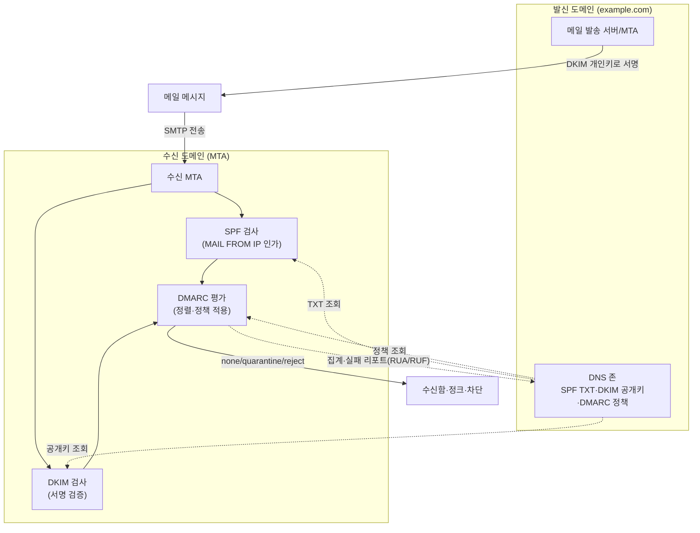
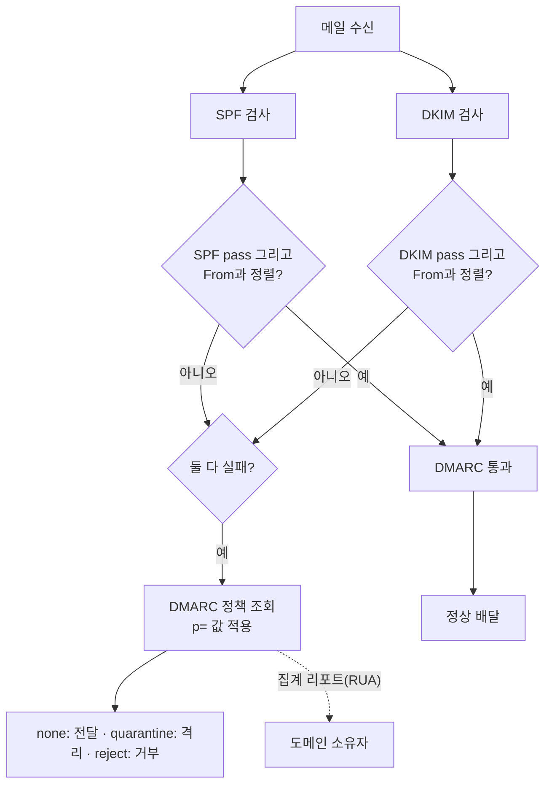

# 이메일 인증 체계(SPF·DKIM·DMARC)

## 1. 개요

> **이메일 인증 체계**란 발신 도메인의 정당성을 검증해 위조된 발신자(spoofing)의 메일을 걸러내기 위한 표준 기술의 집합으로, 발신 IP를 인가하는 **SPF(Sender Policy Framework, RFC 7208)**, 메시지에 전자서명을 붙이는 **DKIM(DomainKeys Identified Mail, RFC 6376)**, 이 둘의 검증 결과를 발신 도메인(From)과 정렬(alignment)해 정책과 리포트로 묶는 **DMARC(Domain-based Message Authentication, Reporting and Conformance, RFC 7489)**로 구성된다.

이메일 인증 체계가 필요해진 근본 배경은 **SMTP(Simple Mail Transfer Protocol) 자체가 발신자를 검증하지 않는다**는 태생적 한계에 있다. 1982년 RFC 821로 정의된 SMTP는 신뢰 가능한 소규모 네트워크를 전제로 설계되어, 발신자가 `MAIL FROM`과 헤더 `From`에 임의의 주소를 넣어도 이를 확인하지 않는다. 그 결과 누구나 `From: ceo@mybank.com`처럼 남의 도메인을 사칭한 메일을 손쉽게 보낼 수 있고, 이는 피싱(phishing)·스피어피싱·**비즈니스 이메일 침해(BEC, Business Email Compromise)**의 기술적 토대가 되었다.

BEC로 인한 피해는 이미 산업 전반에서 심각한 수준이다. 미국 FBI IC3의 연례 보고서는 BEC 손실을 매년 수십억 달러 규모로 집계하고 있으며, 국내에서도 무역대금을 가로채는 사칭 메일 사고가 반복적으로 발생한다. 이러한 위협은 스팸 필터의 통계적 판정만으로는 막기 어렵다. 사칭 메일은 문법·서식이 정상 메일과 동일하고 악성 첨부 없이 계좌 변경만 요청하기도 하기 때문이다. 따라서 "**이 메일이 정말 그 도메인에서 발송되었는가**"를 도메인 소유자가 공표한 정책과 암호학적 증거로 검증하는 발신 도메인 인증이 필수가 되었다. SPF·DKIM·DMARC는 각각 IP 인가, 무결성·서명, 정책·정렬·리포트라는 상호 보완적 역할을 맡아 하나의 신뢰 체계를 구성한다.

## 2. 전체 인증 흐름과 구조

이메일 인증은 발신 측이 DNS에 정책·공개키를 공표하고, 수신 측 메일 서버가 메일 수신 시점에 이를 조회·검증하는 **분산 신뢰 모델**로 동작한다. 아래 개념도는 발신부터 수신·검증·리포트까지의 전체 구조를 보여준다.

이 흐름에서 발신 측과 수신 측의 역할은 명확히 분리된다. 발신 측은 자신이 통제하는 발송 서버의 IP·서명키·처리 정책을 DNS로 '선언'하는 책임을, 수신 측은 그 선언을 표준에 따라 '검증·집행'하는 책임을 진다. 어느 한쪽만 준비되어서는 효과가 없다. 발신 도메인이 정책을 아무리 엄격하게 게시해도 수신 서버가 이를 해석·집행하지 않으면 사칭이 그대로 배달되고, 반대로 수신 서버가 검증을 시도해도 발신 도메인에 레코드가 없으면 판단 근거가 없다. 이 때문에 이메일 인증은 전 세계 메일 사업자와 도메인 소유자가 공통 표준을 채택할 때 비로소 생태계 차원의 방어력을 갖는 **집단적 보안(collective security)** 성격을 띤다.

이 구조의 핵심은 **도메인 소유자가 통제권을 갖는다**는 점이다. 발신 측은 자신의 DNS에만 정책을 게시하면 되고, 전 세계 수신 서버는 표준에 따라 이를 해석한다. 별도의 중앙 인증기관(CA)이 없어도 DNS라는 기존 인프라 위에서 신뢰가 형성되므로 확장성이 뛰어나다. 다만 DNS 관리가 곧 보안 관리가 되므로, DNS 레코드의 정확성과 개인키 보관의 안전성이 체계 전체의 신뢰를 좌우한다.

세 기술은 검증 대상과 방식이 서로 다르다. SPF는 "어느 서버(IP)가 이 도메인을 대신해 보낼 수 있는가"를, DKIM은 "메시지가 위·변조 없이 그 도메인의 키로 서명되었는가"를 본다. 그러나 두 기술 모두 사용자가 실제로 보는 **헤더 From 주소**를 직접 검증하지는 않는다는 공백이 있었고, DMARC가 바로 이 공백을 메우기 위해 등장했다.

## 3. 구성요소별 상세

### 가. SPF — 발신 IP 인가

SPF는 도메인 소유자가 "내 도메인을 대신해 메일을 보낼 수 있는 서버의 IP 목록"을 DNS TXT 레코드로 공표하는 방식이다. 수신 서버는 SMTP 세션의 **봉투 발신자(envelope sender, `MAIL FROM`)** 도메인의 SPF 레코드를 조회하고, 실제 접속한 발신 IP가 인가 목록에 있는지 대조한다. 예를 들어 `v=spf1 include:_spf.google.com ip4:203.0.113.10 -all`은 구글 워크스페이스의 발송 서버군과 특정 IP를 허용하고, 그 외는 모두 거부(`-all`, hard fail)한다는 의미다. `~all`(soft fail)은 "의심스럽지만 통과"를, `?all`(neutral)은 판단 유보를 뜻한다.

SPF의 강점은 구현이 단순하고 발송 서버 인프라를 명시적으로 통제할 수 있다는 점이다. 그러나 두 가지 근본적 한계가 있다. 첫째, **전달(forwarding) 시 깨진다.** 사용자가 메일을 다른 주소로 자동 전달하면 발신 IP가 전달 서버의 것으로 바뀌어 원 도메인의 SPF에 어긋난다. 둘째, SPF가 검증하는 것은 봉투 발신자이지 **사용자가 화면에서 보는 헤더 From이 아니다.** 공격자는 자신이 통제하는 도메인으로 SPF를 통과시키면서 헤더 From만 사칭할 수 있다. 또한 SPF에는 **DNS 조회 10회 제한**이 있어, `include`를 남용하면 `permerror`로 인증이 실패한다. 실무에서는 SaaS 메일 서비스(마케팅 툴·CRM 등)를 추가할 때마다 이 한도를 초과하지 않도록 레코드를 평탄화(flattening)하거나 정리해야 한다.

SPF 판정 결과는 단독으로 메일을 차단하기보다 DMARC 정렬의 입력값으로 쓰일 때 의미가 커진다. 예컨대 봉투 발신자 도메인과 헤더 From 도메인이 다른 메일이 SPF를 통과하더라도, DMARC의 SPF 정렬(`aspf`) 기준에서 어긋나면 인증 성공으로 인정되지 않는다. 따라서 SPF는 "발송 인프라를 명시적으로 선언하는 기초 공사"로 보고, 실제 사칭 차단의 최종 판단은 DMARC에 위임하는 설계가 바람직하다. 이 관점이 세 기술을 개별 기능이 아니라 하나의 체계로 운영하는 출발점이다.

### 나. DKIM — 전자서명 기반 무결성

DKIM은 발송 서버가 메시지의 주요 헤더와 본문을 **개인키로 서명**하고, 대응하는 공개키를 DNS에 게시해 수신 측이 서명을 검증하도록 한다. 서명 정보는 `DKIM-Signature` 헤더에 담기며, 셀렉터(selector)를 이용해 `셀렉터._domainkey.도메인` 위치의 공개키(TXT)를 찾는다. 서명 대상 헤더 목록(`h=`), 본문 해시(`bh=`), 서명값(`b=`) 등이 포함되어, 전송 중 본문이나 서명된 헤더가 한 글자라도 바뀌면 검증이 실패한다. 즉 DKIM은 발신 도메인 확인과 **메시지 무결성**을 동시에 제공한다.

서명·검증의 안정성을 좌우하는 세부 요소가 **정규화(canonicalization)**다. 메일은 중계 과정에서 공백·줄바꿈·헤더 접힘(folding) 등이 미세하게 바뀔 수 있는데, 정규화 방식(`c=` 파라미터)은 이런 사소한 변형을 서명 검증에서 허용할지를 정한다. `simple`은 어떤 변형도 불허해 엄격하지만 중계 변형에 취약하고, `relaxed`는 공백 정규화 등 무해한 변화를 흡수해 실무에서 널리 쓰인다. 통상 헤더는 `relaxed`, 본문도 `relaxed`를 택해 정당한 중계 변형으로 인한 오탐을 줄이되, 본문 실질 내용의 변경은 여전히 탐지되도록 한다. 이처럼 DKIM은 '무결성'과 '중계 내성' 사이에서 정규화로 균형을 잡는다.

DKIM은 전달에 상대적으로 강하다. IP가 아니라 메시지 자체에 서명이 붙으므로, 본문·서명 헤더가 유지되는 한 여러 서버를 경유해도 검증이 유지된다. 다만 메일링 리스트가 제목에 `[list]` 태그를 붙이거나 푸터를 추가하면 서명이 깨질 수 있다. 운영 관점에서 중요한 것은 **키 관리**다. 키 길이는 최소 2048비트를 권장하며(1024비트는 취약), 침해 대비를 위해 셀렉터를 이용한 **주기적 키 로테이션**이 바람직하다. 서명 개인키가 유출되면 공격자가 정당한 서명을 위조할 수 있으므로, 개인키는 HSM이나 비밀관리 시스템으로 보호해야 한다.

### 다. DMARC — 정렬·정책·리포트

DMARC는 SPF·DKIM의 결과를 **헤더 From 도메인과 정렬(alignment)**시키고, 실패 시 처리 정책과 리포트 수신 주소를 도메인 소유자가 지정하도록 하는 상위 계층이다. 정렬은 "인증에 사용된 도메인과 사용자가 보는 From 도메인이 일치하는가"를 확인하는 개념으로, 이로써 SPF·DKIM이 남긴 '헤더 From 미검증' 공백을 메운다. 정렬 모드는 완전 일치를 요구하는 **엄격(strict)**과 조직 도메인 수준 일치를 허용하는 **완화(relaxed)**로 나뉜다.

DMARC 레코드 예시는 `v=DMARC1; p=reject; rua=mailto:agg@example.com; ruf=mailto:forensic@example.com; pct=100; adkim=s; aspf=r` 형태다. 정책 `p`는 정렬된 인증이 하나도 성공하지 못한 메일의 처리를 지시하며 세 단계를 갖는다. **none**은 조치 없이 모니터링만 하고(도입 초기 관찰용), **quarantine**은 정크·격리로 보내며, **reject**는 아예 거부한다. `rua`로 지정한 주소로는 수신 서버가 하루 단위로 **집계 리포트(aggregate report, XML)**를 보내, 어떤 IP가 우리 도메인 이름으로 얼마나 메일을 보냈고 인증 결과가 어땠는지를 알려준다. 이 리포트가 DMARC의 실질적 가치다. 도메인 소유자는 이를 통해 미처 파악하지 못한 정당한 발송원(shadow IT)과 사칭 시도를 모두 가시화할 수 있다.

DMARC 도입은 반드시 **단계적으로** 진행해야 한다. `p=none`으로 시작해 집계 리포트로 모든 정당한 발송원을 SPF·DKIM에 반영한 뒤, `pct`(적용 비율)를 점진적으로 높이고 `quarantine`을 거쳐 최종적으로 `p=reject`에 도달하는 것이 정석이다. 성급하게 `reject`로 시작하면 미처 등록하지 못한 정당한 시스템(급여·알림·마케팅 메일 등)이 대량으로 차단되는 사고가 발생한다.

아래는 수신 서버의 DMARC 평가 절차를 나타낸 흐름도다.

## 4. 비교와 상호 보완 관계

세 기술은 대체재가 아니라 **계층적 보완재**다. SPF만 쓰면 전달과 헤더 사칭에 취약하고, DKIM만 쓰면 어떤 발송원이 정당한지 정책으로 강제할 수 없으며, DMARC는 SPF·DKIM 없이는 판단 근거가 없다. 세 가지를 함께 배치해야 비로소 "정당한 도메인 발송은 통과, 사칭은 차단, 미상 발송원은 리포트로 가시화"라는 목표가 달성된다.

| 구분 | SPF | DKIM | DMARC |
|------|-----|------|-------|
| 검증 대상 | 봉투 발신자(MAIL FROM) IP | 메시지 서명·무결성 | 헤더 From 정렬·정책 |
| 방식 | DNS TXT의 인가 IP 목록 | 공개키 전자서명 | SPF/DKIM 결과의 정렬 판정 |
| 전달 내성 | 약함(IP 변경 시 실패) | 강함(서명 유지 시 통과) | 하위 결과에 의존 |
| 사칭 방어 | 봉투 도메인만 | 서명 도메인만 | 사용자가 보는 From 방어 |
| 리포트 | 없음 | 없음 | 집계·실패 리포트 제공 |
| 주요 한계 | DNS 10회 조회 제한 | 리스트 변형 시 깨짐 | 하위 두 기술 선행 필요 |

구체적인 상황으로 이해하면 세 기술의 분담이 명확해진다. 공격자가 자신이 통제하는 도메인 `evil.example`로 SPF·DKIM을 정상 구성한 뒤, 헤더만 `From: ceo@mybank.com`으로 위조해 메일을 보낸다고 하자. 이 경우 SPF·DKIM은 `evil.example` 기준으로는 모두 통과(pass)한다. 그러나 DMARC는 인증에 사용된 도메인(`evil.example`)과 사용자가 보는 From 도메인(`mybank.com`)이 정렬되지 않았음을 포착하고, `mybank.com`의 DMARC 정책(`p=reject`)에 따라 이 메일을 거부한다. 반대로 정당한 발송에서는 인증 도메인과 From 도메인이 일치하므로 정렬이 성립해 정상 배달된다. 이처럼 DMARC의 정렬 검사가 있어야 비로소 '사용자가 실제로 보는 발신자'에 대한 방어가 완성된다.

전달로 인한 인증 실패 문제를 보완하기 위해 **ARC(Authenticated Received Chain, RFC 8617)**가 제안되었다. ARC는 메일이 중간 서버(메일링 리스트·전달기)를 거칠 때 각 중계 지점이 원래의 인증 결과를 서명해 보존하는 방식으로, 최종 수신자가 "이 메일은 전달 과정에서 SPF가 깨졌지만 원래는 정당했다"는 사슬을 신뢰할 수 있게 한다. 대형 메일 서비스는 이미 ARC를 반영해 전달 메일의 오탐을 줄이고 있다.

## 5. 심화 — 최신 동향과 실무 적용

### 가. 대량 발송자 인증 의무화(2024~)

이메일 인증은 2024년을 기점으로 '권고'에서 사실상 '의무'로 전환되었다. 구글과 야후는 2024년 2월부터 **하루 5,000통 이상을 발송하는 대량 발송자**에게 SPF·DKIM·DMARC를 모두 요구하고, 원클릭 수신거부(one-click unsubscribe, RFC 8058) 제공과 스팸 신고율 0.3% 미만 유지를 강제하기 시작했다. 마이크로소프트도 유사한 요건을 순차 적용하고 있다. 이는 마케팅·거래 알림 메일을 다루는 모든 기업이 발송원별 인증 구성을 재정비해야 함을 의미하며, 미이행 시 도달률(deliverability) 급락이라는 직접적 사업 손실로 이어진다. 실제로 다수의 커머스·금융 기업이 이 시점을 계기로 CRM·마케팅 툴별 서브도메인 분리와 DKIM 서명 위임을 정비했다.

### 나. BIMI — 브랜드 로고와 신뢰의 시각화

**BIMI(Brand Indicators for Message Identification)**는 DMARC를 `quarantine` 이상으로 강제하는 도메인이 발송한 메일에 대해, 수신함에 **검증된 브랜드 로고**를 표시하도록 하는 사양이다. 로고의 정당성은 **VMC(Verified Mark Certificate)**라는 인증서로 보증되며, 최근에는 상표 등록 없이도 발급 가능한 CMC(Common Mark Certificate)도 도입되고 있다. BIMI는 그 자체가 인증 기술이라기보다 DMARC 강제를 유도하는 **비즈니스 인센티브**로 작동한다. 즉 "로고를 노출하려면 먼저 DMARC를 제대로 하라"는 구조로, 브랜드 마케팅과 이메일 보안을 연결한 점이 특징이다.

### 다. 도입 사례와 흔한 오구성

실무에서 DMARC 도입의 성패는 대개 '정당한 발송원을 얼마나 빠짐없이 식별했는가'에서 갈린다. 대규모 조직은 본사 메일 서버 외에도 급여·인사 알림 시스템, 마케팅 자동화 툴, 헬프데스크 티켓 시스템, 결제 영수증 발송기 등 수십 개의 발송원을 도메인 이름으로 사용하는 경우가 많다. 한 글로벌 기업이 `p=none`으로 3개월간 집계 리포트를 수집한 결과 사내에서 파악하지 못했던 발송 시스템이 20여 개 발견되었다는 사례처럼, 리포트 기반의 발송원 인벤토리 작업이 선행되지 않으면 `reject` 전환 시 정당한 업무 메일이 대량 차단된다. 통상 도입 완료까지 수개월~1년이 소요되며, 이는 기술 구성보다 '누가 우리 도메인으로 메일을 보내는가'를 조직적으로 정리하는 데 시간이 걸리기 때문이다.

대표적 오구성으로는 ① SPF `include` 남용으로 DNS 조회 10회 한도를 초과해 `permerror`가 발생하는 경우, ② 여러 개의 SPF TXT 레코드를 중복 등록해(하나만 허용됨) 검증이 무효화되는 경우, ③ DMARC를 `reject`로 두었으나 서브도메인 정책(`sp=`)을 지정하지 않아 서브도메인이 무방비로 남는 경우, ④ 리포트 주소(`rua`)를 지정하지 않아 사칭 시도를 전혀 관측하지 못하는 경우 등이 있다. 이런 오구성은 겉으로는 정상 동작하는 것처럼 보여 진단이 어렵고, 정기적인 인증 상태 점검과 리포트 모니터링으로만 발견된다.

### 라. 국내 적용과 기출 연계

국내 공공·금융 부문에서도 사칭 메일 대응을 위해 DMARC 도입을 확대하는 추세이며, 개인정보보호·정보보호관리체계(ISMS-P) 관점에서 메일 보안은 관리적·기술적 통제 항목과 맞닿아 있다. 기술사 시험에서는 SPF·DKIM·DMARC의 개별 원리, 세 기술의 상호 보완 관계, 도입 단계 전략(none→reject), BEC·피싱 대응 방안을 묻는 형태로 출제되기 쉽다. 답안 작성 시에는 단순 나열이 아니라 "SMTP의 구조적 한계 → 각 기술의 역할 분담 → 정렬로 완성되는 신뢰 체계 → 단계적 도입 전략"이라는 인과의 흐름으로 구성하는 것이 고득점에 유리하다.

## 6. 고려사항 및 시사점

- **단계적 도입과 리포트 활용(적용 전략):** DMARC는 반드시 `p=none`으로 시작해 집계 리포트로 정당한 발송원을 모두 식별·등록한 뒤 `quarantine`·`reject`로 상향해야 한다. 리포트 분석은 수작업이 어려우므로 전용 분석 도구·서비스를 활용해 발송원 인벤토리를 지속 관리하는 운영 체계가 관건이다.

- **가용성과 보안의 트레이드오프:** `p=reject`와 엄격 정렬(strict)은 사칭 차단 효과가 크지만, 등록되지 않은 정당한 시스템의 메일까지 차단해 업무 중단을 유발할 수 있다. 반대로 완화 설정은 안전하지만 방어력이 약하다. 조직의 위험 수용 수준과 발송 인프라의 성숙도에 맞춰 균형점을 잡아야 한다.

- **키·DNS 관리의 중요성:** DKIM 개인키 유출과 DNS 레코드 오류는 각각 서명 위조와 대량 오탐으로 직결된다. 2048비트 이상 키, 주기적 셀렉터 로테이션, DNS 변경 형상관리, DNSSEC 병행을 통해 신뢰의 뿌리를 견고히 해야 한다.

- **전달·리스트 환경 대응(연계 기술):** 메일링 리스트·자동 전달 환경에서는 SPF가 쉽게 깨지므로 DKIM과 ARC를 함께 활용하고, 필요 시 발송 전용 서브도메인을 분리해 평판(reputation)을 격리·관리하는 것이 바람직하다.

- **거버넌스와 조직적 관리:** 이메일 인증은 특정 부서의 기술 설정이 아니라, 마케팅·인사·IT·보안 등 도메인으로 메일을 보내는 모든 주체가 관여하는 전사적 자산 관리 문제다. 발송원 등록·변경을 통제하는 프로세스와 책임(RACI)을 정의하지 않으면 새로운 SaaS 도입 시마다 인증 공백이 재발한다.

- **전망:** 대량 발송자 인증 의무화와 BIMI 확산으로 이메일 인증은 선택이 아닌 필수 인프라가 되고 있으며, 향후 AI 기반 피싱 정교화에 대응해 발송 도메인 인증과 콘텐츠·행위 기반 분석(위협 인텔리전스·XDR)을 결합한 다계층 방어로 발전할 전망이다.

## 참고자료

- RFC 7208, Sender Policy Framework (SPF): https://datatracker.ietf.org/doc/html/rfc7208
- RFC 6376, DomainKeys Identified Mail (DKIM) Signatures: https://datatracker.ietf.org/doc/html/rfc6376
- RFC 7489, Domain-based Message Authentication, Reporting, and Conformance (DMARC): https://datatracker.ietf.org/doc/html/rfc7489
- RFC 8617, The Authenticated Received Chain (ARC) Protocol: https://datatracker.ietf.org/doc/html/rfc8617
- Google, Email sender guidelines: https://support.google.com/a/answer/81126
- BIMI Group: https://bimigroup.org/

---

> **한 줄 요약**: SPF(발신 IP 인가)·DKIM(전자서명 무결성)·DMARC(헤더 From 정렬·정책·리포트)는 SMTP의 발신자 미검증 한계를 계층적으로 보완해 사칭·피싱·BEC를 차단하는 상호 보완적 이메일 인증 체계이며, `p=none`에서 `reject`로의 단계적 도입과 리포트 기반 발송원 관리가 성공의 핵심이다.
