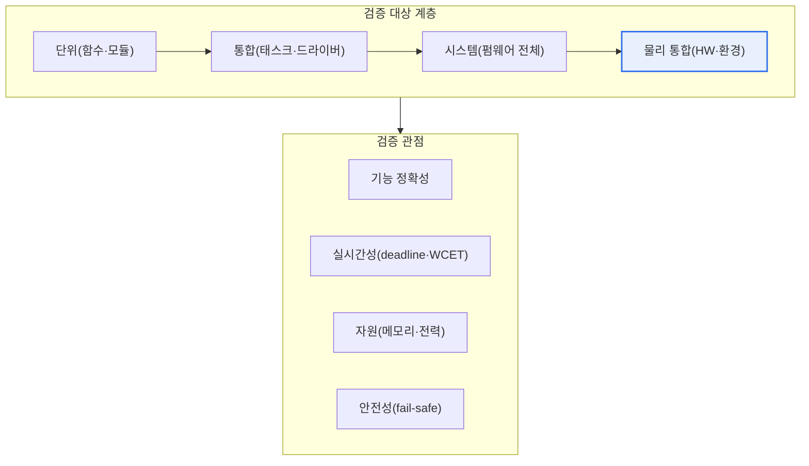

# 임베디드 소프트웨어 테스트(Embedded Software Test)

## 1. 개요

### 가. 정의
> **임베디드 소프트웨어 테스트**는 특정 하드웨어에 내장되어 실시간·자원제약 환경에서 동작하는 임베디드 SW의 **기능·성능·안전성을 하드웨어와의 상호작용(센서·액추에이터·통신·타이밍)까지 포함해 검증**하는 활동이다.

임베디드 SW 테스트가 일반 SW 테스트와 근본적으로 다른 이유는 '**소프트웨어가 하드웨어와 물리 세계에 묶여 있다**'는 데 있다. 일반 애플리케이션은 PC·서버라는 풍부한 환경(수 GB 메모리, 멀티코어 CPU, 완전한 OS, 디버거·프로파일러)에서 실행되지만, 임베디드 SW는 수십 KB~수 MB 메모리와 수십~수백 MHz급 MCU를 가진 특정 하드웨어(자동차 ECU·의료기기·산업 PLC·가전)에 내장되어, 센서·액추에이터와 실시간으로 상호작용한다. 따라서 테스트도 소프트웨어의 논리만 확인해서는 충분하지 않다.

임베디드 테스트에서 반드시 확인해야 하는 축은 크게 네 가지다. 첫째는 **실시간성**으로, 정해진 마감시간(deadline) 안에 응답하는지, 최악실행시간(WCET, Worst-Case Execution Time)이 주기 안에 들어오는지를 본다. 둘째는 **자원 제약**으로, 제한된 메모리·스택·전력 예산 안에서 동작하는지, 스택 오버플로·힙 단편화가 없는지를 확인한다. 셋째는 **하드웨어 의존성**으로, 인터럽트·DMA·타이머·통신 버스(CAN·SPI·I2C 등)와의 연동이 정확한지를 검증한다. 넷째는 **안전성**으로, 오동작이 곧 물리적 사고(차량 제동 실패·의료기기 오작동·산업 설비 폭주)로 이어지므로 고장 시 안전 상태로 수렴(fail-safe)하는지를 확인한다.

또한 대상 하드웨어에서 직접 테스트하기 어렵고 관찰·디버깅 수단이 제한적(핀 몇 개, JTAG, 로그 출력 여유 부족)이라는 실무적 제약이 있다. 이 때문에 임베디드 테스트는 모델·시뮬레이션에서 시작해 점차 실제 프로세서·하드웨어로 접근하는 단계적 전략(MIL→SIL→PIL→HIL)을 쓴다. 개발 초기에는 값싸고 빠르며 위험이 없는 가상 환경에서 대량으로 검증하고, 실제 물리 조건과의 정합은 최종 단계에서 실장비로 확인해 비용과 품질을 균형 잡는다.

### 나. 특수성
실시간성, 자원 제약, 하드웨어 의존성, 높은 안전·신뢰 요구, 그리고 제한된 관찰·디버깅 수단이라는 다섯 가지가 임베디드 테스트의 난도를 결정한다. 특히 '재현하기 어려운 결함(타이밍·경합·인터럽트 순서에 의존하는 heisenbug)'과 '관찰이 대상 동작을 바꾸는 관측 간섭(probe effect)'은 임베디드 특유의 어려움이다.

## 2. 전체 구조 — 테스트 대상과 관점

임베디드 테스트의 전체 구조는 '검증 대상(SW·연동·물리환경)'과 '검증 관점(기능·실시간·자원·안전)'을 교차한 매트릭스로 이해하면 좋다. 아래 구조도는 임베디드 SW 테스트가 소프트웨어 단위에서 시작해 하드웨어·물리환경으로 확장되며, 각 계층마다 서로 다른 관점을 요구함을 보여준다.

**단위·통합 테스트**는 함수·드라이버 단위의 논리와 경계값을 확인하며, 하드웨어를 가상화한 스텁/목(mock)이나 호스트 컴파일로 수행하는 경우가 많다. **시스템 테스트**는 펌웨어 전체를 대상으로 시나리오·상태전이·예외처리를 확인한다. **물리 통합 테스트**는 실제 센서·액추에이터·전원·통신을 연결해 온도·전압·노이즈 같은 물리 조건까지 검증한다. 관점 축의 네 항목은 모든 계층에서 반복적으로 적용되지만, 특히 실시간성과 안전성은 물리 통합 단계에서 결정적으로 드러난다.

이 구조가 중요한 이유는, 결함이 발견되는 시점이 늦어질수록 수정 비용이 급격히 증가하기 때문이다. 물리 통합(HIL)이나 실차 단계에서 논리 결함을 발견하면, 이미 하드웨어 배선·시험 셋업이 얽혀 있어 원인 격리에 큰 비용이 든다. 그래서 값싼 SIL 단계에서 최대한 많은 기능·경계 결함을 걸러내고, HIL은 '가상에서 재현 불가능한 물리·타이밍 문제'에 집중시키는 것이 정석이다.

## 3. 테스트 단계 — X-in-the-Loop

임베디드 검증의 핵심 방법론인 X-in-the-Loop은 개발 단계에 맞춰 검증 환경을 점진적으로 실제에 가깝게 만든다. 초기에는 모델·시뮬레이션으로 검증하고, 점차 실제 코드→목표 프로세서→실제 하드웨어를 결합해 최종적으로 실장비에서 실시간 통합 검증한다. 아래 세부 아키텍처는 각 단계에서 '무엇이 실물이고 무엇이 시뮬레이션인지'를 나타낸다.

**MIL(Model-in-the-Loop)** 단계는 제어 알고리즘을 아직 코드로 만들기 전, 모델(예: Simulink 블록다이어그램) 수준에서 제어 대상 모델(plant model)과 함께 시뮬레이션한다. 이 단계의 목적은 '설계 개념이 요구를 만족하는가'를 값싸게 확인하는 것이다. 예컨대 차량 크루즈컨트롤 로직을 실제 ECU 없이 노트북에서 수천 번의 주행 시나리오로 돌려 안정성·응답성을 조기에 검증할 수 있다.

**SIL(Software-in-the-Loop)** 단계는 모델에서 생성했거나 직접 작성한 **실제 C 코드**를 호스트 PC에서 컴파일해, 가상 플랜트 모델과 함께 실행한다. 여기서는 코드가 모델과 동일하게 동작하는지(코드-모델 동등성), 부동소수점을 고정소수점으로 바꿨을 때 오차가 허용범위인지 등을 확인한다. SIL은 실행 속도가 빠르고 커버리지 측정·디버깅이 쉬워, 회귀 테스트를 대량 자동화하기에 가장 적합하다.

**PIL(Processor-in-the-Loop)** 단계는 코드를 **실제 목표 프로세서(또는 사이클 정확 명령어 세트 시뮬레이터)**에 올려 실행한다. 컴파일러 최적화·타깃 아키텍처 특성 때문에 호스트와 결과가 달라질 수 있으므로, 이 단계에서 타깃 상의 수치 정확성과 실행시간(사이클 수)을 확인한다. WCET 측정과 스택 사용량 확인이 여기서 이뤄지는 경우가 많다.

**HIL(Hardware-in-the-Loop)** 단계는 **실제 ECU(제어기)**를 실시간 플랜트 시뮬레이터에 연결해, 센서 신호를 가짜로 주입하고 액추에이터 출력을 받아 폐루프로 검증한다. HIL은 실차·실설비 없이도 위험한 고장 시나리오(센서 단선, 급격한 부하 변동, 통신 오류)를 안전하고 반복적으로 재현할 수 있어, 자동차·항공·발전 분야에서 필수 장비가 되었다. 마지막 **실차·실장비** 단계에서 모든 요소가 실물로 통합되어 최종 검증된다.

| 단계 | 검증 대상(실물) | 주 목적 | 대표 도구·환경 |
|---|---|---|---|
| **MIL** | 없음(모델만) | 설계 개념 검증 | Simulink 등 모델 시뮬레이션 |
| **SIL** | 실제 코드(호스트) | 코드-모델 동등성, 회귀 자동화 | 호스트 컴파일 + 가상 플랜트 |
| **PIL** | 코드 + 타깃 프로세서 | 타깃 정확성·실행시간 | 평가보드·ISS |
| **HIL** | 실제 ECU + 실시간 | 폐루프·고장주입 검증 | 실시간 시뮬레이터(HIL rig) |

## 4. 주요 테스트 관점과 기법 — 세부

임베디드 테스트에서 각 관점은 고유한 기법을 요구한다. 아래에서 항목별로 원리와 실무 함의를 서술한다.

**실시간성 검증**은 '평균'이 아니라 '최악'을 본다는 점이 일반 성능 테스트와 다르다. 하드 리얼타임 시스템에서는 단 한 번이라도 마감시간을 넘기면 사고가 될 수 있으므로, 통계적 응답시간이 아니라 WCET와 스케줄 가능성(RMA·응답시간 분석 등)을 근거로 판단한다. 예컨대 에어백 전개 로직이 충돌 감지 후 수 ms 안에 반드시 점화 신호를 내야 한다면, 평균 지연이 아무리 좋아도 최악 경로의 지연이 마감시간을 넘지 않음을 증명해야 한다.

**자원 제약 검증**은 정상 동작뿐 아니라 장시간 운전에서의 누수·단편화까지 본다. 스택 사용량은 인터럽트 중첩까지 고려한 최악값을 측정하고, 동적 메모리를 쓰는 경우 단편화로 인한 할당 실패 가능성을 점검한다. 많은 안전필수 코딩 표준(예: MISRA C)이 동적 메모리 사용을 제한하는 이유가 여기에 있다.

**하드웨어 연동 검증**은 센서 값 범위·노이즈, 인터럽트 지연·중첩, 통신 프레임 정확성과 오류 처리를 다룬다. 이 영역의 결함은 특정 타이밍에서만 재현되는 경우가 많아, 실제 신호를 재생하거나 고장을 주입하는 HIL 환경에서 걸러낸다. 예를 들어 CAN 버스가 순간적으로 오프-버스가 되는 상황에서 제어기가 안전 상태로 복귀하는지를 시험한다.

**안전성·신뢰성 검증**은 커버리지와 고장 대응을 함께 본다. 특히 안전무결성이 높은 코드에는 **MC/DC(Modified Condition/Decision Coverage)**가 요구된다. 이는 각 조건이 독립적으로 결정 결과에 영향을 미침을 보이는 강한 커버리지 기준으로, 항공(DO-178C)의 최고 등급(DAL A)과 자동차(ISO 26262)의 높은 ASIL 등급에서 요구된다. 단순 문장 커버리지(statement)나 분기 커버리지(branch)보다 훨씬 엄격하며, 조건 조합의 일부만으로 완전성을 증명한다는 점이 실무적 이점이다.

| 관점 | 핵심 질문 | 대표 기법 |
|---|---|---|
| **실시간성** | 최악에도 마감을 지키는가 | WCET 분석, 스케줄 가능성 분석 |
| **자원 제약** | 예산 안에서 안정적인가 | 스택 최고수위 측정, 정적 분석 |
| **하드웨어 연동** | 신호·통신·인터럽트가 정확한가 | 고장주입, 신호 재생, HIL |
| **안전성** | 고장 시 안전한가, 커버리지는 충분한가 | fail-safe 시험, MC/DC 커버리지 |
| **환경 시험** | 물리 조건에서 견디는가 | 온도·전압·EMC 시험 |

### 일반 SW 테스트와의 결정적 차이

임베디드 테스트가 일반 SW 테스트와 벌어지는 지점을 정리하면 실무 함의가 분명해진다. 일반 애플리케이션 테스트는 '기능이 맞는가'와 '평균 성능이 충분한가'에 집중하고, 결함이 나면 대개 재시작·롤백으로 복구할 수 있다. 반면 임베디드 테스트는 '최악의 순간에도 안전한가'를 증명해야 하며, 결함이 물리적 사고로 이어지면 복구가 불가능하다.

또한 관찰 가능성의 차이가 크다. 일반 환경에서는 로그·디버거·프로파일러를 풍부하게 쓸 수 있지만, 임베디드에서는 로그 출력조차 타이밍을 바꿔 결함을 숨기는 관측 간섭(probe effect)이 생긴다. 이 때문에 비침습 트레이스 하드웨어, 실시간 폐루프 시뮬레이터(HIL), 고장 주입 같은 임베디드 특유의 검증 수단이 발전했다. 결국 '언제·어디서·무엇을 실물로 두고 검증하는가'라는 전략적 판단이 임베디드 테스트의 성패를 가른다.

## 5. 심화 — 표준·산업 사례와 최신 동향

임베디드 테스트는 도메인별 **기능안전 표준**과 떼어 생각할 수 없다. 자동차는 ISO 26262가 ASIL(A~D) 등급에 따라 요구 커버리지와 검증 절차를 규정하고, 상위 개념으로 의도된 기능의 안전(SOTIF, ISO 21448)이 자율주행처럼 '고장이 없어도 성능 한계로 위험할 수 있는' 상황을 다룬다. 항공은 DO-178C가 소프트웨어 수준(DAL A~E)별로 검증 목표를 정하며, 최고 등급에서 MC/DC를 요구한다. 산업 일반은 IEC 61508이 SIL(1~4)로 안전무결성 수준을 정의한다. 이런 표준들은 '테스트를 얼마나, 어떤 방식으로' 해야 하는지를 계약 수준에서 강제하므로, 임베디드 테스트 전략 자체가 표준 준수 증거(evidence)를 만들어내는 과정으로 설계된다.

산업 현장의 구체적 사례를 보면, 대형 완성차·부품사는 수백 개 ECU에 대한 회귀 검증을 수십 대의 HIL rig와 SIL 팜(farm)에서 야간에 자동으로 돌린다. 코드 변경이 커밋될 때마다 SIL로 수천 개 시나리오를 빠르게 확인하고, 통과한 빌드만 HIL로 넘겨 실시간·물리 결함을 잡는 파이프라인이 일반화되고 있다. 이는 임베디드에서도 지속통합(CI)과 테스트 자동화가 표준 관행이 되었음을 보여준다.

최신 동향으로는 세 가지가 두드러진다. 첫째, **가상 ECU·디지털 트윈** 확산이다. 클라우드에서 대량의 가상 플랜트·가상 ECU를 병렬로 돌려, 실장비 부족 없이 수만 시나리오를 검증하는 방식이 늘고 있다. 둘째, **SDV(Software-Defined Vehicle)와 OTA** 흐름이다. 차량 SW가 출고 후에도 무선 갱신되면서, 갱신 전후의 회귀 검증과 안전 논증을 자동화·지속화하는 요구가 커졌다. 셋째, **AI·데이터 기반 시스템의 검증**이다. 딥러닝 인지 모듈은 전통적 커버리지로 충분치 않아, 시나리오 커버리지·데이터 분포 기반 검증과 SOTIF 관점이 결합되고 있다. 이런 동향은 임베디드 테스트가 '실장비 중심'에서 '가상·데이터 중심의 지속 검증'으로 무게중심을 옮기고 있음을 시사한다.

## 6. 고려사항 및 시사점

1. **안전 표준 준수를 테스트 전략의 출발점으로 삼는다.** ISO 26262·DO-178C·IEC 61508 등 도메인 표준이 요구하는 커버리지(MC/DC 등)와 검증 절차·추적성 증거를 처음부터 계획에 반영해야, 인증 단계에서 재작업을 피할 수 있다. 테스트는 결함 발견뿐 아니라 '안전 논증의 근거 생성' 활동임을 인식해야 한다. [[software-safety-analysis]]
2. **시뮬레이션과 실장비의 역할을 명확히 분담한다.** 값싸고 빠른 SIL·MIL로 기능·경계 결함을 대량으로 조기 제거하고, HIL·실차는 가상에서 재현 불가능한 실시간·물리·고장 시나리오에 집중시켜야 비용·품질을 동시에 최적화한다. 단계별로 '무엇을 걸러낼지'를 설계하는 것이 핵심이다.
3. **자동화·CI를 임베디드에 맞게 확립한다.** HIL 자동화 장비와 SIL 팜을 CI 파이프라인에 결합해, 잦은 변경에도 회귀 검증을 야간에 반복 수행하는 체계를 갖춘다. 다만 실시간·물리 의존 테스트는 재현성 확보(신호 재생, 시드 고정)가 관건이며, 불안정 테스트(flaky test) 관리가 신뢰의 전제다.
4. **관측 간섭과 재현성을 관리한다.** 디버깅용 로그·프로브가 타이밍을 바꿔 결함을 숨기거나 새 결함을 만드는 probe effect를 고려해, 비침습적 추적(trace) 하드웨어와 결정적 재현 환경을 마련해야 한다.
5. **SDV·OTA·AI 시대의 지속 검증 체계로 전환한다.** 출고 후 갱신·자율 기능 확대에 대비해, 가상 ECU·디지털 트윈 기반의 대규모 병렬 검증과 SOTIF·시나리오 커버리지를 결합한 지속 검증(continuous verification) 역량을 확보하는 것이 향후 경쟁력이 된다.

## 참고자료
- ISO 26262 Road vehicles — Functional safety, https://www.iso.org/standard/68383.html
- ISO 21448 Road vehicles — Safety of the intended functionality (SOTIF), https://www.iso.org/standard/77490.html
- RTCA DO-178C / MC/DC 개요(NASA Technical Reports), https://ntrs.nasa.gov/citations/20010057789
- IEC 61508 Functional safety of E/E/PE safety-related systems, https://www.iec.ch/functional-safety

---

> **한 줄 요약**: 임베디드 SW 테스트는 *하드웨어·실시간·자원제약·안전성까지 폐루프로 검증* 하는 활동으로, MIL→SIL→PIL→HIL로 점진적으로 실제 환경에 접근하며 ISO 26262·DO-178C 등 기능안전 표준의 커버리지(MC/DC)·추적성 요구를 만족시키고, SDV·디지털 트윈 기반 지속 검증으로 진화하고 있다.
