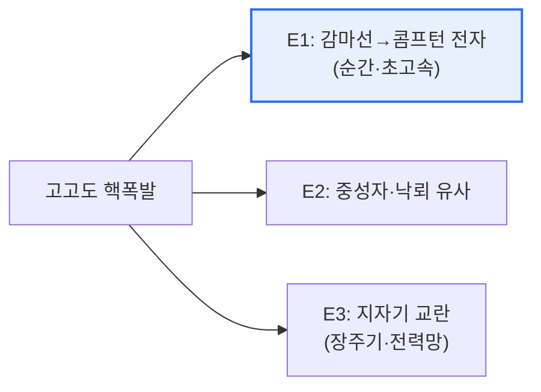

# EMP 공격(ElectroMagnetic Pulse Attack)

## 1. 개요

### 가. 정의와 구분
> **EMP 공격**은 순간적으로 발생시킨 **강력한 전자기 펄스(EMP)로 전자·전력·통신 장비를 파괴·마비**시키는 공격이다. 물리적 폭발 없이도 넓은 지역의 전자 시스템을 무력화할 수 있다.

EMP 공격이 특별한 위협인 근본 이유는 '**총알 한 발 없이도 사회의 전자 신경망을 마비시킨다**'는 데 있다. 현대 사회는 전력망·통신·금융·교통·국방이 모두 전자 시스템에 의존한다. EMP는 강력한 전자기 펄스를 순간적으로 방출해, 이 전자 회로에 과전류·과전압을 유도한다. 그 결과 반도체·회로가 타버리고, 넓은 지역의 전자 장비가 동시에 먹통이 된다. 폭발이나 물리적 파괴 없이도 사회 인프라 전체를 마비시킬 수 있어, '전자적 대량파괴'로 불린다. EMP는 발생 원인에 따라 구분된다. 고고도 핵폭발로 발생하는 **HEMP**(핵 EMP), 핵 없이 전자기 무기로 만드는 **비핵 EMP**(NNEMP), 그리고 태양 폭발로 자연 발생하는 지자기 폭풍이 있다. 특히 HEMP는 단 한 번의 고고도 폭발로 대륙 규모의 피해를 줄 수 있어 국가 안보 차원의 위협으로 다뤄진다. 그래서 주요 국가 시설은 EMP 방호(차폐)를 갖춘다.

### 나. 구분
| 구분 | 내용 |
|---|---|
| **HEMP(핵 EMP)** | 고고도 핵폭발로 발생, 광역 피해 |
| **비핵 EMP(NNEMP)** | 전자기 무기(HPM 등), 국지적 |
| **자연 EMP** | 태양 폭발·지자기 폭풍(낙뢰 포함) |

## 2. HEMP의 원리

HEMP는 고고도(수십~수백 km) 핵폭발 시 방출된 감마선이 대기 분자와 충돌해 **콤프턴 전자**를 만들고, 이 전자들이 지구 자기장에 휘며 강력한 전자기파를 지상으로 쏟아내는 원리다. 시간 특성에 따라 세 성분으로 나뉜다.

| 성분 | 특징·영향 |
|---|---|
| **E1** | 나노초 단위 초고속 펄스, 반도체·전자기기 즉시 파괴 |
| **E2** | 낙뢰와 유사, 기존 낙뢰 방호로 일부 대응 |
| **E3** | 장주기 성분, 전력망·장거리 케이블에 유도전류(변압기 손상) |

가장 위협적인 것은 **E1**으로, 너무 빨라 일반 서지 보호기로 막기 어렵고 전자 회로를 순식간에 태운다.

## 3. 위협과 방호 방안

| 위협 | 방호 방안 |
|---|---|
| **전자기기 파괴** | 전자기 차폐(패러데이 케이지), 차폐실 |
| **전력망 마비** | 서지 보호기, 접지, 필터, 변압기 보호 |
| **통신·케이블 유도전류** | 케이블 차폐, 광케이블 사용 |
| **시스템 정지** | 이중화·백업 시스템, 격리 보관 예비장비 |

핵심 방호는 **차폐(Shielding)·접지(Grounding)·필터링**이다. 중요 시설을 전자기 차폐(패러데이 케이지)로 감싸 펄스를 막고, 유도된 과전류를 접지로 흘려보내며, 전원·신호선에 필터·서지 보호기를 두어 침투를 차단한다.

## 4. 고려사항 및 시사점

1. **국가 핵심기반시설의 방호가 우선**이다. 전력·통신·금융·국방 등 마비 시 파급이 큰 시설부터 EMP 방호 기준을 적용하고, 방호 시설을 구축·인증해야 한다.
2. **다층 방어와 이중화**가 필요하다. 완벽한 차폐는 어려우므로, 차폐·접지·필터의 다층 방호에 더해 예비 장비 격리 보관·시스템 이중화로 복원력을 확보한다.
3. **자연 EMP(우주기상) 대비**도 중요하다. 태양 폭발에 의한 지자기 폭풍도 전력망을 위협하므로(과거 대규모 정전 사례), 우주기상 감시·경보와 전력망 보호를 함께 준비해야 한다.

---

> **한 줄 요약**: EMP 공격은 *강력한 전자기 펄스로 전자·전력·통신을 파괴* 하는 위협으로, 고고도 핵폭발의 HEMP(E1·E2·E3 성분)가 대표적이며, 차폐·접지·필터링과 이중화로 국가 핵심기반시설을 방호해야 한다.
