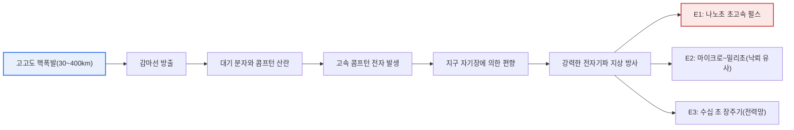
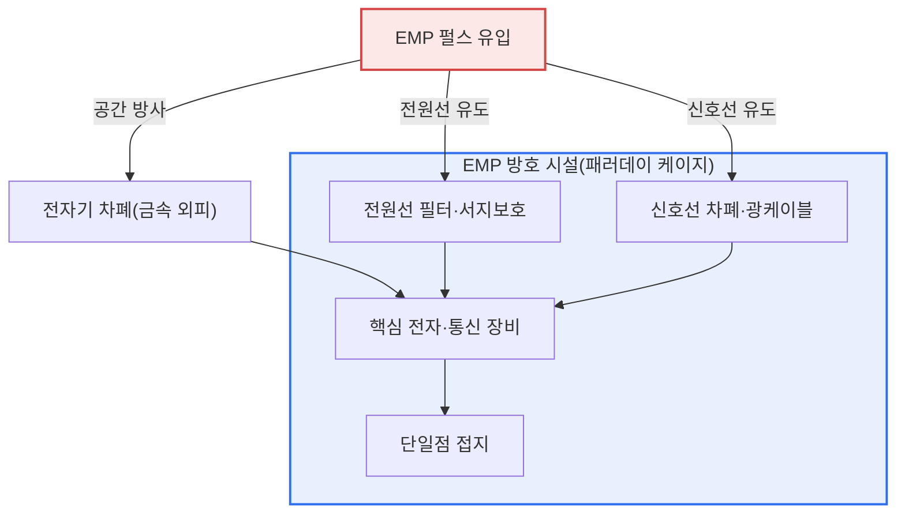

# EMP 공격(ElectroMagnetic Pulse Attack)

## 1. 개요

### 가. 정의와 문제의식
> **EMP 공격**은 순간적으로 발생시킨 **강력한 전자기 펄스(Electromagnetic Pulse)로 전자·전력·통신 장비의 반도체 회로에 과전류·과전압을 유도하여 파괴·마비**시키는 공격이다. 물리적 폭발이나 인명 살상 없이도 넓은 지역의 전자 시스템을 동시에 무력화할 수 있다는 점에서 '전자적 대량살상무기(e-WMD)'로 분류된다.

EMP 공격이 다른 물리적·사이버 위협과 근본적으로 다른 이유는 '**총알 한 발, 악성코드 한 줄 없이도 사회의 전자 신경망 전체를 동시에 마비시킨다**'는 데 있다. 현대 사회는 전력망·통신·금융·교통·의료·국방이 모두 반도체 기반 전자 시스템에 의존한다. 그런데 반도체 소자는 정격 전압을 크게 초과하는 순간 전류가 흐르면 접합부가 녹아 영구 손상된다. EMP는 바로 이 물리적 취약점을 노린다. 강력한 전자기 펄스를 순간적으로 방출하면, 도체(전선·기판 배선·안테나)에 전압이 유도되고, 이 유도 전압이 소자의 내압을 초과하면 회로가 타버린다. 결과적으로 넓은 지역의 전자 장비가 **동시에, 소프트웨어적 복구가 불가능한 형태로** 먹통이 된다.

특히 문제가 되는 것은 현대 인프라가 상호 의존적이라는 점이다. 전력망이 멈추면 통신·상수도·냉방·금융 전산이 연쇄적으로 멈추고, 백업 발전기의 제어 회로마저 EMP로 손상되면 복구 자체가 불가능해진다. 사이버 공격은 백업·패치·격리로 대응할 수 있지만, EMP는 물리 계층(하드웨어)을 직접 파괴하므로 재부팅이나 소프트웨어 복구로는 되돌릴 수 없다. 이 때문에 주요국은 EMP를 재래식·핵·사이버와 구분되는 독립 위협 범주로 다루고, 핵심 국가시설에 EMP 방호(차폐) 기준을 별도로 적용한다.

### 나. 발생 원인에 따른 구분
EMP는 어떻게 발생했느냐에 따라 위협의 규모와 대응 방식이 크게 달라진다. 고고도 핵폭발로 발생하는 **HEMP**는 단 한 번으로 대륙 규모의 피해를 줄 수 있어 국가 안보 위협으로 다뤄지고, 핵 없이 전자기 무기로 만드는 **비핵 EMP(NNEMP)** 는 국지적이지만 테러·전장에서 현실적 위협이며, 태양 폭발이 일으키는 **자연 EMP(우주기상)** 는 인위적 공격이 아니지만 전력망에 실제 대규모 정전을 일으킨 전례가 있다.

| 구분 | 발생 원인 | 피해 범위 | 특징 |
|---|---|---|---|
| **HEMP(핵 EMP)** | 고고도(30~400km) 핵폭발 | 광역(대륙 규모 가능) | E1·E2·E3 성분, 최대 위협 |
| **비핵 EMP(NNEMP)** | 전자기 무기(HPM, EMP탄, 폭발식 자속압축발생기) | 국지적(수백 m~수 km) | 재래식·테러 활용 현실성 |
| **자연 EMP** | 태양 코로나질량방출(CME)·지자기 폭풍, 낙뢰 | 광역(전력망 중심) | E3 유사, 우주기상 감시 필요 |

## 2. HEMP의 발생 원리와 시간 성분

HEMP는 EMP 위협의 정점에 있다. 고고도에서 핵이 폭발하면 강력한 감마선이 방출되는데, 이 감마선이 대기의 산소·질소 분자와 충돌하면서 전자를 튕겨낸다(콤프턴 산란). 이렇게 생성된 고속 전자('콤프턴 전자')가 지구 자기장에 의해 휘어지면서 강력한 전자기파를 지상으로 쏟아낸다. 폭발 고도가 높을수록 감마선이 도달하는 지표 면적이 넓어지므로, 400km 고도의 단발 폭발이 한 국가 전체를 덮을 수 있다는 것이 안보상 핵심이다.

```mermaid
flowchart LR
  N["고고도 핵폭발(30~400km)"] --> G["감마선 방출"]
  G --> C["대기 분자와 콤프턴 산란"]
  C --> CE["고속 콤프턴 전자 발생"]
  CE --> B["지구 자기장에 의한 편향"]
  B --> EM["강력한 전자기파 지상 방사"]
  EM --> E1["E1: 나노초 초고속 펄스"]
  EM --> E2["E2: 마이크로~밀리초(낙뢰 유사)"]
  EM --> E3["E3: 수십 초 장주기(전력망)"]
  style N fill:#e8f0fe,stroke:#2f6fed,stroke-width:2px
  style E1 fill:#fde8e8,stroke:#d64545,stroke-width:2px
```

HEMP가 특히 위험한 이유는 하나의 폭발이 시간 특성이 전혀 다른 세 성분을 순차적으로 발생시켜, 서로 다른 방호 수단을 무력화한다는 점이다. E1은 너무 빨라 기존 서지 보호기가 반응하기 전에 소자를 태우고, E1이 방호 소자를 먼저 파괴한 뒤 E3가 전력망을 공격하는 식으로 복합 피해를 준다.

| 성분 | 지속 시간 | 주요 위협 대상 | 방호 난이도 |
|---|---|---|---|
| **E1** | 수 나노초(ns) | 반도체·전자기기(IC, 통신장비) | 매우 높음(일반 서지보호기가 못 따라감) |
| **E2** | 수 μs~ms | 낙뢰와 유사, 케이블 | 낮음(기존 낙뢰 방호로 일부 대응) |
| **E3** | 수십 초 | 전력망 변압기·장거리 케이블 | 높음(유도전류로 대형 변압기 소손) |

### 가. E1 — 가장 치명적인 초고속 펄스
E1은 나노초 단위로 상승하는 극초단 펄스로, 전기장 강도가 수만 V/m에 이른다. 이렇게 빠른 펄스는 일반 서지 보호기(MOV, 가스방전관)가 반응하는 데 필요한 시간(수십 ns~μs)보다 빨리 지나가버려, 보호 소자가 동작하기도 전에 뒤에 있는 반도체를 태운다. 짧은 안테나·배선에도 효과적으로 결합하므로 노트북·통신 단말·산업 제어기(PLC) 같은 소형 전자기기가 특히 취약하다. E1 방호는 결국 펄스를 회로에 도달시키지 않는 **차폐**와 초고속 서지 억제 소자(TVS 다이오드)의 조합에 의존한다.

### 나. E2 — 낙뢰와 유사한 중간 성분
E2는 낙뢰와 시간 특성이 비슷해 상대적으로 대응이 쉽다. 다만 E1이 이미 낙뢰 방호 소자를 파괴한 뒤라면 E2가 그 틈으로 침투할 수 있어, 단독이 아니라 E1과의 복합 작용으로 평가해야 한다는 점이 실무적 함의다.

### 다. E3 — 전력망을 노리는 장주기 성분
E3는 수십 초에 걸친 느린 자기장 변동으로, 장거리 송전선·통신 케이블에 지자기유도전류(GIC)를 흐르게 한다. 이 전류가 대형 전력 변압기의 철심을 포화시켜 과열·소손을 일으킨다. 대형 변압기는 제작·교체에 수개월~1년 이상 걸리고 재고도 적어, E3 피해는 장기 대규모 정전으로 이어질 수 있다. E3는 태양 지자기 폭풍과 물리적으로 유사하며, 실제로 1989년 캐나다 퀘벡의 대정전(약 600만 명, 9시간)이 지자기 폭풍에 의한 GIC로 발생한 대표 사례다.

## 3. 위협 유형과 방호 방안

방호의 기본 원리는 세 가지 — **차폐(Shielding)·접지(Grounding)·필터링(Filtering)** — 로 요약된다. 차폐로 펄스가 회로에 도달하는 것을 막고, 유도된 과전류는 접지로 안전하게 흘려보내며, 전원·신호선으로 침투하는 성분은 필터·서지 보호기로 차단한다. 어느 하나만으로는 부족하며, 침투 경로(공간 방사·전원선·신호선·접지선)마다 대응 수단을 겹겹이 배치하는 다층 방어가 핵심이다.

```mermaid
flowchart TB
  subgraph FC["EMP 방호 시설(패러데이 케이지)"]
    EQ["핵심 전자·통신 장비"]
    F1["전원선 필터·서지보호"]
    F2["신호선 차폐·광케이블"]
    GND["단일점 접지"]
  end
  EMP["EMP 펄스 유입"] -->|"공간 방사"| SH["전자기 차폐(금속 외피)"]
  EMP -->|"전원선 유도"| F1
  EMP -->|"신호선 유도"| F2
  SH --> EQ
  F1 --> EQ
  F2 --> EQ
  EQ --> GND
  style FC fill:#e8f0fe,stroke:#2f6fed,stroke-width:2px
  style EMP fill:#fde8e8,stroke:#d64545,stroke-width:2px
```

| 위협 | 침투 경로 | 방호 방안 |
|---|---|---|
| **전자기기 즉시 파괴(E1)** | 공간 방사·짧은 배선 | 전자기 차폐(패러데이 케이지), 차폐실, TVS 다이오드 |
| **전력망 마비(E3)** | 장거리 송전선 GIC | 서지 보호기, 접지, GIC 차단장치, 변압기 보호 |
| **통신·케이블 유도전류** | 신호선·데이터선 | 케이블 차폐·본딩, 금속선 대신 광케이블 사용 |
| **시스템 정지·복구 불능** | 복합 | 예비장비 격리 보관(off-site), 시스템 이중화, 복구 절차 |

차폐 성능은 감쇠량(dB)으로 규정한다. 국내외 군·핵심시설 기준에서는 통상 **80dB 이상**(주파수 대역별)의 차폐 성능을 요구하며, 미국은 MIL-STD-188-125, IEC는 61000 시리즈 등으로 시험·평가 기준을 규정한다. 실제 구축 시에는 출입문·환기구·케이블 관통부 같은 개구부가 차폐의 약점(누설 경로)이 되므로, 도파관 감쇠기·EMI 개스킷·허니컴 벤트로 개구부를 처리하는 설계가 성능을 좌우한다.

## 4. 비교 — EMP·사이버·낙뢰 위협의 차이와 함의

세 위협은 모두 전자 시스템을 노리지만 발생 메커니즘과 대응 전략이 근본적으로 다르다. 그 차이를 이해해야 방호 투자의 우선순위를 잡을 수 있다.

| 구분 | EMP 공격 | 사이버 공격 | 낙뢰(자연) |
|---|---|---|---|
| 공격 계층 | 물리(하드웨어 파괴) | 논리(SW·데이터) | 물리(전기적 서지) |
| 피해 범위 | 광역 동시(HEMP) | 표적·확산형 | 국지적 |
| 복구 | 하드웨어 교체 필요(장기) | 백업·패치로 복구 | 소자 교체 |
| 핵심 대응 | 차폐·접지·필터 | 접근통제·탐지·백업 | 피뢰·서지보호 |

가장 중요한 실무적 함의는 **EMP는 소프트웨어로 복구할 수 없다**는 점이다. 사이버 공격은 아무리 심각해도 백업에서 복원하고 시스템을 재구성하면 되지만, EMP로 반도체가 물리적으로 소손되면 부품을 교체해야만 한다. 따라서 EMP 대비의 핵심은 '방어'와 함께 '**예비 장비의 격리 보관(EMP 차폐된 곳에 별도 보관)**'이라는 복원력(Resilience) 전략이다. 또한 낙뢰 방호(피뢰·서지보호)가 이미 갖춰진 시설이라도 E1의 초고속 성분에는 무력할 수 있어, 기존 방호를 EMP 대응으로 오해하지 않도록 주의해야 한다.

## 5. 심화 — 최신 동향과 국가 대응

EMP 위협은 냉전기 핵 시나리오에서 출발했지만, 최근에는 두 방향으로 현실성이 커지고 있다. 첫째, **비핵 EMP(NNEMP) 무기의 소형화**다. 고출력 마이크로파(HPM) 장비와 폭발식 자속압축발생기(FCG)는 핵 없이도 국지적으로 강한 펄스를 만들 수 있어, 드론 탑재형·차량 탑재형 형태로 전장·테러 위협이 되고 있다. 실제로 대드론 방어 수단으로 HPM 기반 요격 시스템이 연구·시연되고 있으며, 이는 EMP 원리가 공격뿐 아니라 방어 자산으로도 활용됨을 보여준다.

둘째, **우주기상(자연 EMP)에 대한 경각심**이 커졌다. 1859년 캐링턴 이벤트급 태양 폭발이 현대에 재현되면 전 지구적 전력망·위성 피해가 우려되며, 앞서 언급한 1989년 퀘벡 정전은 그 가능성을 실제로 보여준 사례다. 이에 따라 각국은 우주기상 감시·경보 체계(예: 태양 관측 위성, 지자기 관측)와 전력망의 GIC 차단장치 도입을 추진하고 있다.

정책 측면에서 미국은 EMP를 국가 안보 의제로 다뤄 관련 행정명령(2019년 'EMP 위협에 대한 국가 복원력 강화' 행정명령)과 표준(MIL-STD-188-125)을 정비했고, 국내에서도 국가 주요시설에 대한 EMP 방호 기준과 방호시설 인증 제도를 운영하며 통신·전력 등 기반시설의 방호를 단계적으로 확대하고 있다. 기술사 관점에서는 정확한 최신 정책 수치·연도는 변동될 수 있으므로 단정보다 '방호 기준화·인증 제도화가 확대되는 추세'로 서술하는 것이 안전하다.

## 6. 고려사항 및 시사점(기술사 관점)

1. **국가 핵심기반시설 우선 방호와 위험 기반 투자.** 완전 방호는 비용상 비현실적이므로, 마비 시 파급이 큰 전력·통신·금융·국방·의료 시설부터 위험도를 평가해 방호 기준을 차등 적용해야 한다. 전 시설을 동일하게 방호하기보다, 대체 불가능성과 복구 소요 시간을 기준으로 우선순위를 정하는 리스크 기반 접근이 현실적이다.
2. **차폐·접지·필터의 다층 방어와 개구부 관리.** 방호 성능은 가장 약한 침투 경로(출입문·환기구·케이블 관통부)에서 결정된다. 80dB급 차폐를 설계해도 개구부 처리가 부실하면 전체 성능이 무너지므로, 도파관 감쇠기·EMI 개스킷 등 개구부 설계와 정기 차폐 성능 시험(누설 점검)이 필수다.
3. **복원력(Resilience) 중심의 이중화·예비장비 전략.** EMP는 하드웨어를 물리 파괴하므로 사후 복구가 어렵다. 따라서 방어 일변도가 아니라, 핵심 예비 장비를 EMP 차폐 공간에 격리 보관하고 시스템을 지리적으로 분산·이중화하여 '피해를 전제한 신속 복구'를 설계해야 한다.
4. **자연 EMP(우주기상)와의 통합 대비.** 인위적 HEMP뿐 아니라 태양 폭발에 의한 지자기 폭풍도 E3 유사 위협으로 전력망을 마비시킬 수 있다. 우주기상 감시·경보, GIC 차단장치, 대형 변압기 예비 확보를 전력 안정성 정책과 통합해 추진해야 한다.
5. **표준·인증 체계와 실측 검증.** MIL-STD-188-125, IEC 61000 등 국제 표준에 따른 설계·시공과 준공 후 실측 검증(차폐 감쇠량 측정)을 제도화해야 하며, 신규·비핵 EMP 무기 위협을 반영해 기준을 주기적으로 갱신해야 한다.

## 참고자료
- CISA(미국 사이버·인프라 보안국), Electromagnetic Pulse(EMP) Protection Guidelines: https://www.cisa.gov/topics/critical-infrastructure-security-and-resilience/electromagnetic-pulse-emp
- U.S. EMP Commission Reports(전자기펄스 공격 위협 평가 위원회): https://www.firstempcommission.org/
- IEC 61000-2-9(HEMP environment) 및 MIL-STD-188-125 개요: https://www.iec.ch/
- NASA/NOAA 우주기상(Space Weather) 및 1989 Quebec Blackout: https://www.swpc.noaa.gov/

---

> **한 줄 요약**: EMP 공격은 *강력한 전자기 펄스로 전자·전력·통신 하드웨어를 물리적으로 파괴* 하는 전자적 대량살상형 위협으로, 고고도 핵폭발의 HEMP(초고속 E1·낙뢰형 E2·전력망 공격형 E3)가 대표적이며, 소프트웨어 복구가 불가능하다는 특성 때문에 차폐·접지·필터링의 다층 방어와 예비장비 격리·이중화라는 복원력 전략으로 국가 핵심기반시설을 방호해야 한다.
