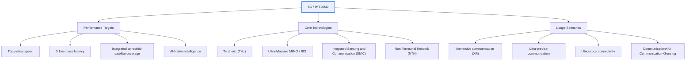
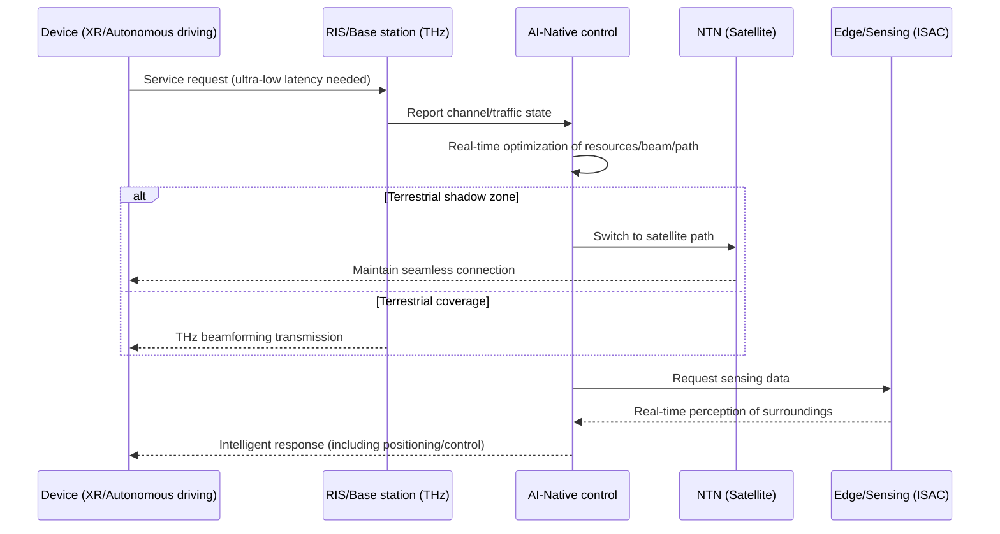

# 6G Mobile Communication

## 1. Overview

### A. Definition
> 6G (6th Generation Mobile Communication) is the next-generation mobile communication system succeeding 5G, targeting **terabit-per-second (Tbps) transmission speeds, ultra-low latency (tens of μs), integrated coverage spanning terrestrial, aerial, and satellite domains, and an infrastructure in which communication, sensing, computation, and intelligence are fused into one**, with commercialization aimed at around 2030.

The direction of 6G lies not in a simple extension of 5G but in a qualitative leap toward the "**complete fusion of the physical and digital worlds**." Although 5G championed ultra-high speed (eMBB), ultra-low latency (URLLC), and massive connectivity (mMTC), its bandwidth and latency remain insufficient to fully realize services such as holographic communication, real-time digital twins, fully autonomous driving (Level 5), and immersive extended reality (XR) that even conveys the sense of touch. To overcome these limits, 6G pioneers the much higher **terahertz (THz) band** and adopts an **AI-Native** architecture in which the network optimizes its own resources and quality. In other words, it aims beyond communication where people look at screens, toward an infrastructure that replicates and controls physical space in the digital domain in real time.

Notably, 6G is not a generation defined by a "speed race" alone. It is true that peak speed has improved roughly 10–100 times each generation, but the more essential change in 6G is the **redefinition of the network's role**. Moving beyond being a mere pipe that carries data, the communication network evolves into an "intelligent platform" that senses its surroundings via radio waves, performs computation at the edge, and makes its own decisions through AI. The ITU-R formalized this future vision in the **IMT-2030 framework recommendation (Recommendation ITU-R M.2160)** approved in November 2023, which set out six usage scenarios and 15 capabilities for 6G.

### B. Background and Necessity
The first driver that triggered 6G research is the **exponential growth of data traffic**. Global mobile traffic has grown around 30–40% annually, and once generative AI, 8K streaming, cloud gaming, and XR become mainstream, per-cell 5G capacity will struggle to cope. Not only the volume of traffic but also its "quality" changes. Traffic that is extremely latency-sensitive, such as holograms and digital twins, cannot be resolved by simply expanding bandwidth.

The second driver is the **emergence of ultra-realistic and ultra-precise services**. Autonomous vehicles must exchange state information with surrounding vehicles and infrastructure on a millisecond scale, remote robotic surgery must deliver even tactile feedback in real time, and collaborative robots in smart factories tolerate no latency variation beyond tens of μs. Because such services demand not "average performance" but "bounded worst-case" performance, a deterministic network is required.

The third driver is the **geographic limit of coverage**. The terrestrial base-station-centric architecture up to 5G still leaves substantial portions of the earth's surface—oceans, deserts, mountains, the air—as shadow zones. The rapid growth of low-earth-orbit (LEO) satellite internet, represented by Starlink, demonstrated the feasibility of a Non-Terrestrial Network (NTN) that "dissolves the boundary between terrestrial and satellite networks," and 6G seeks to absorb this into the standard. Finally, there is the demand for **sustainability (carbon neutrality)**. As the power consumption of ICT becomes a social issue, 6G sets as a design goal a **green network** that dramatically lowers energy consumption per bit, not just performance.

## 2. Target Performance and Overall Architecture of 6G

The performance targets set out by 6G represent a leap over 5G across all metrics. Transmission speed reaches up to 1 Tbps (with user-experienced rates of hundreds of Mbps to Gbps), latency reaches around 0.1 ms on the wireless segment, connection density reaches 10 million devices per km², and mobility support extends up to 1,000 km/h (aircraft). Note, however, that these figures are "theoretical upper bounds," and an actual commercial service does not satisfy all metrics simultaneously. The capabilities emphasized differ for each usage scenario.

As the diagram above shows, 6G is layered into performance targets, the core technologies that underpin them, and the usage scenarios implemented on top. ITU-R M.2160 organizes the usage scenarios broadly into six: **Immersive Communication, ultra-reliable and ultra-low-latency communication, Massive Communication, Ubiquitous Connectivity, Integrated AI and Communication, and Integrated Sensing and Communication**. The first three extend 5G's eMBB/URLLC/mMTC, while the latter three are axes newly added in 6G. In other words, "ubiquitous (satellite integration)," "AI fusion," and "sensing fusion" are the identity that distinguishes 6G from previous generations.

## 3. Core Enabling Technologies in Detail

### A. Terahertz (THz) Band and Ultra-Massive MIMO
The physical basis for 6G's pursuit of Tbps-class speeds is **wide frequency bandwidth**. In the Shannon capacity formula (C = B·log₂(1+SNR)), capacity is linearly proportional to bandwidth B, so the 0.1–10 THz band, which can secure a wide band of tens to hundreds of GHz, becomes a strong candidate. This band, one step higher than 5G's mmWave (24–52 GHz), can theoretically provide continuous bands of over 100 GHz, forming the foundation for ultra-wideband transmission.

However, THz is a "double-edged sword." The higher the frequency, the shorter the wavelength, so directionality becomes extremely strong, absorption loss by water vapor and oxygen molecules in the atmosphere grows, and it cannot even penetrate obstacles such as walls or leaves. As a result, the reach shortens to the order of tens of meters and the link breaks easily. What compensates for this is **Ultra-Massive MIMO**, which integrates hundreds to thousands of ultra-small antennas to perform beamforming that concentrates energy narrowly in a specific direction. The fact that shorter wavelengths allow denser antenna integration is a design point that turns THz's disadvantage to advantage.

Added to this is the **Reconfigurable Intelligent Surface (RIS)**. A RIS is a flat panel composed of numerous fine elements that electronically controls the phase of each element to reflect or refract incident radio waves in a desired direction. For THz signals that are highly directional and thus vulnerable to obstacles, RIS attached to building exteriors or indoor walls creates a "detour path" to eliminate shadow zones. Because RIS programs the radio propagation environment itself without active elements, it is drawing attention as the core of a "Smart Radio Environment."

### B. AI-Native Network
Although AI was used partially in 5G for operational automation (SON) and the like, AI in 6G is **AI-Native**, embedded into the network from the design stage. This means that AI becomes the primary control entity across all layers—physical layer, MAC, resource management, security. For example, AI predicts channel conditions to adjust modulation and coding in real time, learns traffic patterns to allocate resources proactively, and detects abnormal traffic to respond to security threats.

Of particular note is the **AI-ification of the air interface**. Traditionally, the transmitter/receiver's channel estimation, equalization, and demodulation were designed as algorithms based on mathematical models, but in 6G there is active research to replace these with end-to-end learned neural networks. 3GPP has also begun reflecting AI/ML in standards from Release 18 (5G-Advanced), and is progressing work to apply AI to channel state information (CSI) feedback, beam management, and positioning. This trend is expected to accelerate in earnest in 6G.

Another axis of AI-Native is **the network becoming infrastructure for AI services (AI as a Service)**. Using distributed edge resources, it performs federated learning or distributed inference, leveraging the entire network as one giant AI computation and data platform. In other words, the completed form of 6G AI-Native is a bidirectional fusion that "operates the network with AI" while simultaneously "serving AI through the network."

### C. Non-Terrestrial Network (NTN) and Integrated Sensing and Communication (ISAC)
The **Non-Terrestrial Network (NTN)** integrates low-earth-orbit (LEO), medium-earth-orbit (MEO), and geostationary-orbit (GEO) satellites and high-altitude platforms (HAPS) with the terrestrial mobile network into a single system. 3GPP began NTN standardization from Release 17, and since 2022, direct satellite communication (D2D, Direct-to-Device) for smartphones has entered the commercialization stage. In 6G, the goal is full integration that exchanges even broadband data via satellite, beyond simple emergency messages, realizing "ubiquitous coverage" in which users are seamlessly connected anywhere without being aware of terrestrial or satellite networks.

**Integrated Sensing and Communication (ISAC)** is one of the most innovative concepts in 6G. By using wireless signals used for communication like radar to detect the distance, speed, and shape of surrounding objects, the base station performs communication and sensing simultaneously without a separate sensor. THz's short wavelength enables mm-level ultra-precise positioning and imaging, and can be used for detecting blind spots of autonomous vehicles, indoor human detection, gesture recognition, and environment mapping. Since the communication infrastructure itself becomes the sensing infrastructure, "real-time digitization of the physical world" becomes possible without separate investment.

Added to this, an **ultra-low-power, green network** underpins sustainability. Because the THz band and ultra-massive antennas can consume enormous power, AI-based energy savings, cell sleeping, and low-power semiconductor design are essential. 6G bears the challenge of simultaneously achieving "performance improvement" and "energy savings per bit."

## 4. Generational Evolution and In-Depth Comparison with 5G

Viewing the generational comparison only as a plain list of specifications misses the essence. What matters is seeing what each generation added as a "new axis." If 3G added data (packets), 4G added mobile broadband (all-IP), and 5G added industrial low latency and massive connectivity, then **6G adds satellite integration, AI, and sensing**. The processing flow below shows how a single service request is intelligently handled in 6G.

| Category | 4G (LTE) | 5G | 6G (Target/IMT-2030) |
|---|---|---|---|
| **Peak speed** | 1Gbps | 20Gbps | Tbps-class |
| **Experienced latency** | 10ms | 1ms | ~0.1ms |
| **Frequency** | ~6GHz | mmWave (~52GHz) | THz (0.1–10THz) |
| **Coverage** | Terrestrial | Terrestrial-centric | Integrated terrestrial-aerial-satellite |
| **Intelligence** | None | Partial (SON) | AI-Native (all layers) |
| **Sensing** | None | Experimental | Integrated Sensing and Communication (ISAC) |
| **Representative services** | Mobile video | Smart factory, V2X | Hologram, digital twin, full autonomy |

The fundamental reason for the differences in this comparison is that "the required services become more tightly coupled with the physical world." Up to 4G, content consumed by people on screens was central, so it was relatively tolerant of latency. From 5G, as machines and industry became the users, latency and reliability became decisive metrics, and in 6G "real-time perception and control of physical space" is added, making sensing, AI, and satellites essential. The practical implication is clear. 6G investment becomes a converged investment spanning not only communication equipment but also AI computation infrastructure, satellites, and semiconductors, and carriers' business models shift from "selling connectivity" to "intelligence, sensing, and platform services."

## 5. In Depth: Latest Standardization Trends and Industry Cases

Although 6G is still pre-commercialization, the standardization roadmap is taking concrete shape. The **ITU-R** approved the IMT-2030 framework (M.2160) in November 2023, finalizing the vision and capabilities of 6G, and plans to complete the standard around 2030 after finalizing technical performance requirements (TPR) around 2027. **3GPP** is laying groundwork for AI/ML-, NTN-, and ISAC-based technologies in 5G-Advanced (Releases 18–20), and the 6G specification is expected to begin in earnest **from Release 21**. 3GPP is discussing a schedule to begin 6G studies around 2025 and complete the first 6G specification around 2028–2029.

Industry preparation is also active. Domestically, Samsung Electronics published a "6G White Paper" in 2020 presenting its THz and AI vision, and SK Telecom, KT, LG Uplus, and ETRI are conducting research on THz devices, NTN, and AI-Native. Europe is defining 6G architecture and use cases through the **Hexa-X and Hexa-X-II** projects, while the United States is pursuing a 6G roadmap and technology leadership through the NextG Alliance (led by ATIS). Nokia and Ericsson are leading RIS and ISAC demonstrations, and China is leading satellite-terrestrial integration test networks.

As a notable case, the already-commercialized **satellite D2D** has the character of a precursor to 6G NTN. Services in which smartphones directly exchange text and low-speed data with satellites without a separate antenna have spread since 2022, and this is a realistic starting point for the full terrestrial-satellite integration that 6G aims for. In addition, in the field of "**metaverse and digital-twin manufacturing**," demonstrations that replicate an entire factory in real-time 3D for remote control are underway; this is a representative application that becomes complete only when 6G's ultra-low latency and ISAC mature.

## 6. Considerations and Implications (Professional Engineer's Perspective)

1. **Overcoming THz propagation characteristics is the greatest technical challenge, and it must be solved not by a single technology but by a combination.** The reach, directionality, and absorption-loss problems must be compensated by Ultra-Massive MIMO, RIS, and cell ultra-densification, which directly leads to economic issues of rising CAPEX and backhaul burden from increased base-station density. Therefore, a realistic **frequency layering strategy** is to apply THz first to localized areas such as hotspots and indoors, while sub-7GHz and NTN handle wide-area coverage.

2. **Preemption of standards and spectrum determines industrial competitiveness.** 6G is both a standard-essential-patent (SEP) competition and a national technology-sovereignty issue, so securing leadership in the ITU and 3GPP and the international allocation of the THz band (WRC) are key. From our perspective, securing original technology in materials, parts, and devices (THz semiconductors, RIS materials) is directly linked to standard adoption, so a national response linking standardization activities with R&D is required.

3. **Security and privacy threats expand qualitatively.** The attack surface widens due to massive connectivity, and because ISAC means the communication network constantly senses people and the environment, the potential for privacy infringement is high. Applying **post-quantum cryptography (PQC)** in preparation for the commercialization of quantum computers, AI-based real-time threat detection, and privacy-protection governance for sensing data must be built in from the design stage (security/privacy by design).

4. **Energy efficiency and sustainability are preconditions for commercialization.** THz, ultra-massive antennas, and AI computation increase power consumption, so unless energy per bit is dramatically lowered, they will conflict with carbon-neutrality policy. A green 6G design combining AI-based energy optimization, low-power semiconductors, and cell sleeping is essential.

5. **Strategic judgment on investment and business-model transformation is needed.** Because 6G is a large-scale investment fusing communication, AI, satellites, and semiconductors, timing and scope choices are important for carriers that have not yet recouped their 5G investment. Redesigning the business model in a direction that expands revenue sources into value-added platforms such as sensing, AI, and digital twins—beyond "selling connectivity"—is the core of the trade-off.

## References
- ITU-R, "Framework and overall objectives of the future development of IMT for 2030 and beyond (Recommendation ITU-R M.2160)": https://www.itu.int/rec/R-REC-M.2160/en
- 3GPP, "Releases" (5G-Advanced/6G roadmap): https://www.3gpp.org/specifications-technologies/releases
- Samsung, "6G: The Next Hyper-Connected Experience for All": https://www.samsung.com/global/business/networks/insights/6g/
- Hexa-X (EU 6G Flagship): https://hexa-x.eu/

---

> **In one line**: 6G is a next-generation mobile communication system (ITU-R IMT-2030) targeting *Tbps ultra-high speed, 0.1ms-class ultra-low latency, integrated terrestrial-satellite (NTN), AI-Native, and integrated sensing and communication (ISAC)*, realizing ultra-realistic services such as holograms and digital twins through the THz band and Ultra-Massive MIMO/RIS, while overcoming THz propagation limits, preempting standards, and ensuring security/privacy and energy efficiency are the core challenges for commercialization.
