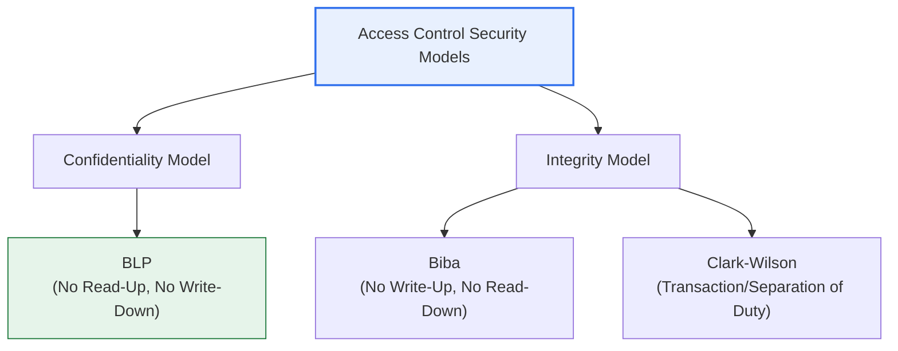
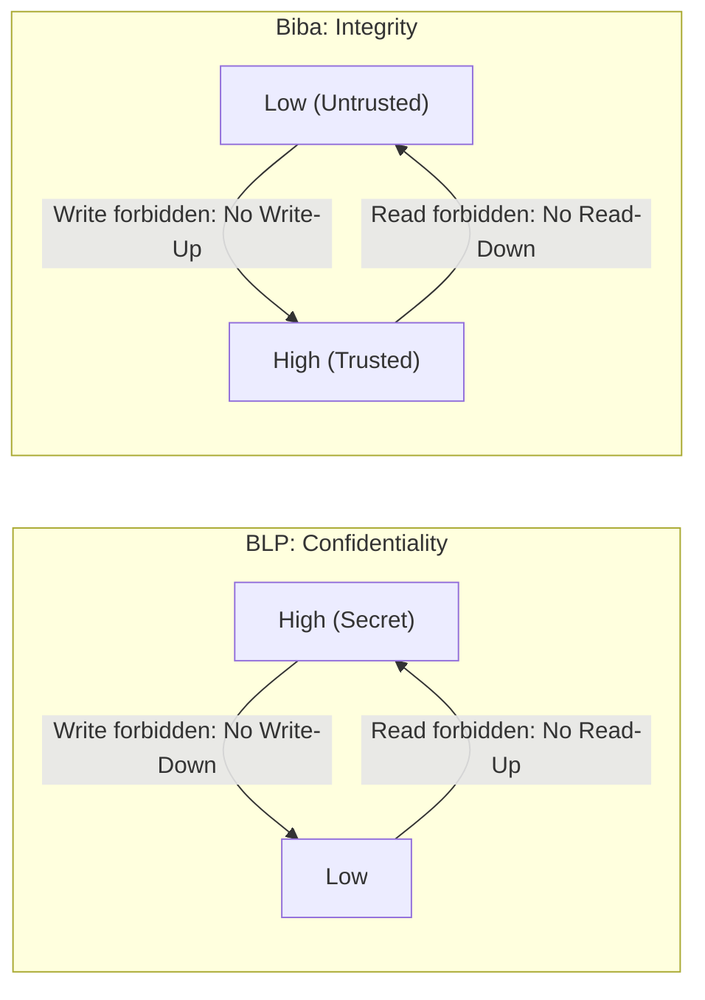

# Access Control Security Models — BLP · Biba · Clark-Wilson

## 1. Overview

### A. Definition
> An **Access Control Security Model** mathematically and formally defines the rules a subject (Subject: user, process) must follow when accessing an object (Object: file, resource), and is divided into **confidentiality (BLP)** and **integrity (Biba, Clark-Wilson)** models depending on what is being protected.

The key to understanding these three models together lies in the fact that '**each model achieves a different security goal with exactly opposite rules**.' BLP, which seeks to protect confidentiality, prevents "secret information from leaking to a lower level," while Biba, which seeks to protect integrity, prevents "untrusted data from contaminating important resources." Interestingly, the rules of the two models are exactly symmetric in direction. The confidentiality model 'writes up and reads down (Write-Up, Read-Down),' while the integrity model 'cannot read down and cannot write up (No Read-Down, No Write-Up).' Because the goals are opposite, the rules become opposite.

Clark-Wilson goes one step further. Whereas BLP and Biba presuppose a military security 'Label,' Clark-Wilson achieves integrity through **Well-formed Transactions** and **Separation of Duty** in a commercial environment where the concept of levels is unfamiliar. In summary, the three models are distinguished along two axes: "what is being protected (confidentiality vs. integrity)" and "what environment it is (military vs. commercial)."

### B. Background and Necessity
In the 1970s, the U.S. Department of Defense needed to prevent information leakage through **rules enforced by the system**, rather than human judgment, in a multilevel security (MLS) environment handling multiple classification levels on a single system. This need gave birth to BLP, the first formal security model. However, BLP handled only confidentiality and could not prevent data from being improperly 'tampered with,' and to fill this gap, Biba, focused on integrity, and then Clark-Wilson, for corporate accounting and transaction environments without a classification system, were proposed in turn. In other words, the three models should be understood not as competing but as a lineage that has sequentially complemented the different real-world security needs.

These classic models remain important in that, rather than being implemented directly today, they are inherited as **design principles** of modern access control such as RBAC, ABAC, and Zero Trust. The roots of the concepts of least privilege, separation of duties, and mandatory rules lie here.

## 2. BLP (Bell-LaPadula) Model — Confidentiality

> A representative **Confidentiality Model** proposed to protect the military secrets of the U.S. Department of Defense, it mandatorily blocks information from leaking from a higher level to a lower level. It is often summarized as "**Write-Up, Read-Down**."

BLP's two core rules both implement the single goal of 'blocking the downward leakage of secret information.' The first rule, the **Simple Security Property (ss-property, No Read-Up)**, prevents a subject from reading an object at a level higher than its own clearance. Preventing a Secret-level user from viewing a Top Secret document, it is an intuitive and natural rule.

The second rule, the **Star Property (\*-property, No Write-Down)**, seems counterintuitive but is the core of BLP. It blocks a high-level subject from writing to a low-level object. This is because if a user who knows Top Secret information copies its contents—whether by mistake or maliciously—into an Unclassified document, even a lower-level person would see the secret, causing a leak. In particular, this rule fundamentally blocks attacks in which a Trojan horse uses the user's privileges to leak secrets to a lower level.

BLP has a premise called the **Tranquility Principle** that guarantees the stability of the rules. Strong tranquility means the security levels of subjects and objects never change during system operation, while weak tranquility means levels do not change in a direction that violates the security policy. If levels could change arbitrarily, the No Write-Down rule could be bypassed, so this principle is a hidden pillar supporting the model's integrity. Its limits are also clear. BLP guarantees only confidentiality and does not control data tampering; rather, because it permits a low-level user to write to a high-level object (Write-Up), it can be risky from an integrity standpoint.

| Rule | Formal Name | Content |
|---|---|---|
| **No Read-Up** | Simple Security Property (ss) | Cannot read information at a level higher than one's own |
| **No Write-Down** | Star Property (\*) | Cannot write to a level lower than one's own (prevents downward secret leakage) |
| **Discretionary Rule** | ds-property | Additional fine-grained control via the access control matrix (DAC) |

## 3. Biba Model — Integrity

> A model for **protecting data Integrity**, it prevents information of low trustworthiness from contaminating resources of high integrity. Because its rule directions are exactly opposite to BLP, it is summarized as "**No Read-Down, No Write-Up**."

What Biba deals with is not 'secrecy' but 'contamination.' For example, if unverified external input or a low-trust process arbitrarily modifies a high-integrity resource such as the system's core configuration file or an accounting ledger, the accuracy and reliability of the data collapse. Biba blocks this with two rules.

The **Integrity Star Property (No Write-Up)** prevents a subject from writing to an object of higher integrity level than its own. It is a rule preventing a low-trust subject from altering and contaminating important data, and its direction is opposite to BLP's No Write-Down. The **Simple Integrity Property (No Read-Down)** prevents a subject from reading an object of lower integrity level than its own. This is to prevent a high-trust process from becoming contaminated itself by reading in contaminated (low-trust) data.

A practical implication is that fully applying both BLP and Biba simultaneously in one system causes the rules to conflict, so access becomes excessively restricted. This is because from a confidentiality standpoint one must read down (Read-Down), while from an integrity standpoint one must not read down (No Read-Down). Therefore, real systems mainly adopt one side according to protection priority, or compromise by separating the classification systems. Also, since Biba handles only integrity, confidentiality requires separate control.

| Rule | Content | Contrast with BLP |
|---|---|---|
| **No Write-Up** | Cannot write to a higher integrity level (prevents contamination) | BLP is No Write-Down |
| **No Read-Down** | Cannot read a lower integrity level | BLP permits Read-Down |

## 4. Clark-Wilson Model — Commercial Integrity

> A model for integrity in commercial environments such as banking and accounting, it ensures that data is changed only through legitimate procedures, using **well-formed transactions and separation of duty** instead of military levels.

The starting point of Clark-Wilson is the question, "what is integrity in a corporate environment?" What matters in a bank is not 'who knows how much secret information' but 'whether transactions are processed accurately, consistently, and only through authorized procedures.' To this end, this model defines the data to be protected as a **CDI (Constrained Data Item)**, prevents users from touching the data directly, and enforces that it be changed only through **TP (Transformation Procedure)**, an authenticated program.

A **well-formed transaction** refers to this TP concept. Rather than a user arbitrarily modifying an account balance, they must go through verified programs such as 'deposit' and 'withdrawal,' so that data always transitions only from a consistent state to a consistent state. An **Integrity Verification Procedure (IVP)** periodically checks whether the CDI is in a valid state, verifying consistency such as, for example, whether debit and credit totals match.

**Separation of Duty** is an organizational control that prevents fraud. Because embezzlement or manipulation becomes easy if one person alone performs the entire process of requesting, approving, and recording a transaction, it is divided into multiple roles. For example, separating the requester and the approver in a payment means that committing fraud requires the collusion of at least two people, greatly raising the strength of control. Such commercial integrity principles are today directly linked to internal accounting control requirements such as the SOX (Sarbanes-Oxley) Act, and have become a basic principle of ERP and accounting-system design.

| Element | Content |
|---|---|
| **CDI/UDI** | Distinguishes protected data (CDI) from unconstrained data (UDI) |
| **Well-formed Transaction (TP)** | Change CDI only through authorized procedures (programs) |
| **Separation of Duty (SoD)** | Separate request, approval, and recording to prevent solo fraud |
| **Integrity Verification (IVP)** | Periodically verify CDI consistency and validity |

## 5. Comparison and Implications

At a glance, the three models are clearly divided by two criteria: the protection goal (confidentiality/integrity) and the application environment (military/commercial). The diagram below visualizes this classification.

The process-oriented diagram below contrasts in which direction each of the three models permits or blocks 'read/write.' One can confirm that the directionality of the rules is inevitably derived from the goal.

| Model | Protection Goal | Environment | Core Rule |
|---|---|---|---|
| **BLP** | Confidentiality | Military/Intelligence agency | No Read-Up, No Write-Down |
| **Biba** | Integrity | Systems requiring trust control | No Write-Up, No Read-Down |
| **Clark-Wilson** | Commercial integrity | Finance/Accounting | Transaction/Separation of duty/Integrity verification |

The fundamental reason for the differences is that the directions of the threats 'leakage' and 'contamination' are exactly opposite. Secrets leak from top to bottom, so downward writing is blocked; contamination seeps from bottom to top, so upward writing is blocked. Understanding this symmetry allows one to reconstruct the rules without memorizing them.

Let us contrast the uses of the three models with concrete cases. First, in a military command-and-control system, if an officer handling a Top Secret operational plan tries to post a summary on a general-level bulletin board, BLP's No Write-Down blocks it. Second, in a server operating environment, if a low-trust user-uploaded script tries to modify a core system configuration file, Biba's No Write-Up prevents the contamination. Third, in a bank's account system, if an employee tries to request a transfer to their own account and approve it themselves, Clark-Wilson's separation of duty disallows this and enforces a separate approver. All three cases share the common trait of preventing incidents through 'rules enforced by the system' rather than 'human goodwill,' and this is the essential value of formal security models.

One thing to note is that, in reality, these models are combined complementarily rather than implemented in pure form. For example, a multilevel operating system (such as SELinux) implements the mandatory rules of BLP and Biba at the kernel level, but for operational convenience also uses role- and type-based policies (RBAC/TE) together. Therefore, from a professional engineer's perspective, an eye for designing how to combine and compromise these according to goal and environment is required, beyond memorizing individual model rules.

## 6. Considerations and Implications (Professional Engineer's Perspective)

1. **Selecting a model that fits the protection goal comes first.** If confidentiality is the top priority, as in military and intelligence agencies, design based on BLP; if data accuracy is the top priority, as in finance, manufacturing, and accounting, design based on Biba and Clark-Wilson. The starting point is first defining whether the system's core asset is 'secrecy' or 'accuracy.'
2. **The conflict between confidentiality and integrity rules must be compromised.** Because BLP and Biba have opposite Read/Write directions, fully applying both simultaneously severely degrades availability. In practice, one takes the higher-priority goal as the main model and combines them by separating the classification systems or minimizing exceptions.
3. **Consider the limits and operational burden of mandatory control (MAC).** These models are powerful but costly to assign and maintain levels and low in flexibility. Therefore, today, rather than pure implementation, a hybrid that adds role-based management convenience with RBAC and combines context (attribute)-based fine-grained control with ABAC is common.
4. **Recognize the inheritance into modern architectures.** The classic principles of least privilege, separation of duties, and mandatory rules directly connect to Zero Trust (never trust, always verify), least-privilege access, and the policy-based control of cloud IAM. Because classic models are the 'design language' of modern control, understanding the principles is directly linked to practical design capability.
5. **Reflect the linkage with Compliance in the design.** Because Clark-Wilson's separation-of-duty and integrity-verification principles are directly linked to internal control requirements such as SOX and electronic financial supervision regulations, considering audit trails and evidence collection together during access-control design is essential for effectiveness.

## References
- Bell–LaPadula model (Wikipedia): https://en.wikipedia.org/wiki/Bell%E2%80%93LaPadula_model
- Formal Security Models Explained: Bell-LaPadula, Biba, Clark-Wilson: https://inventivehq.com/blog/formal-security-models-bell-lapadula-biba-clark-wilson

---

> **In one line**: Access control models are divided into *BLP (confidentiality: No Read-Up, No Write-Down), Biba (integrity: No Write-Up, No Read-Down), and Clark-Wilson (commercial integrity: transaction, separation of duty)*; the rules are derived from the symmetry of threat direction—'leakage goes down, contamination goes up'—and are selected and combined to fit the protection goal and environment, inherited and extended into RBAC, ABAC, and Zero Trust.
