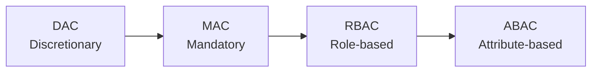

# Access Control

## 1. Overview

### A. Definition
> An information-protection mechanism that controls an authenticated **Subject** so that it accesses an **Object** only **to the extent of its granted rights (Right)**.

Information protection is broadly divided into **encryption**, which makes data itself unreadable, and **access control**, which blocks the act of approaching the data. If encryption is a defense that makes data "unreadable even if stolen," access control is a defense that "prevents it from being touched in the first place." The two lines of defense are complementary, and access control is the basic framework of security that, by permitting or denying access to system resources (files, DBs, functions) according to policy, jointly upholds **confidentiality, integrity, and availability**.

### B. The Three Core Elements and Necessity
Access control operates through three stages often summarized as AAA. First, **identification and authentication (Authentication)** verifies "who you are," next, **authorization (Authorization)** determines "what you may do," and finally, **accountability (Accounting)** records "what you did." It is important that these three stages mesh in sequence. Authorization without authentication invites impersonation, authentication without authorization loses control, and access without auditing cannot assign responsibility in the event of an incident. In a reality where insider threats and account takeovers account for a large share of security incidents, access control—which governs "who can access what"—is effectively the starting point of all system security.

## 2. Access Control Policies (Policy)

Policies are divided according to "who grants rights and by what criteria." As one moves from DAC to ABAC, the controlling entity shifts from the individual to the system, the basis for judgment shifts from static identity to dynamic context, and while **security strength and flexibility increase together, policy complexity also grows**.

**DAC** is a method in which the object owner grants rights at their own discretion (Unix file permissions being the representative example); it is flexible but **vulnerable to Trojan horses** in which a program that has received rights secretly leaks information. **MAC** is enforced by the system comparing security levels and labels regardless of the owner's intent (the BLP model of military/classified systems), which is very strong but low in flexibility. **RBAC** is a method that grants rights to **Roles** rather than individuals and assigns roles to users; since one need only change the role during personnel transfers, its management efficiency in large organizations is high, making it the corporate standard. **ABAC** dynamically determines access by combining the **attributes and context** of subject, object, and environment (department, time, connection location, etc.), making it the most fine-grained.

| Policy | Principle | Pros & Cons |
|---|---|---|
| **DAC (Discretionary)** | Object owner grants rights | Flexible / weak control, vulnerable to Trojan horses |
| **MAC (Mandatory)** | System enforces via security levels/labels | Strong security (military/classified) / low flexibility |
| **RBAC (Role-based)** | Grant rights to roles, assign roles to users | Management efficiency, corporate standard |
| **ABAC (Attribute-based)** | Dynamic decision via subject/object/environment attributes | Fine-grained, flexible / complex policy |

## 3. Access Control Procedure

The flow in which access control actually operates extends from identity verification to auditing. In this flow, the decisive role is played by the **Reference Monitor**, which forces every access request to pass through it.

Each stage is as follows. In identification and authentication, identity is verified via knowledge (password), possession (token), and biometric factors; in authorization, rights are judged according to policy; and the reference monitor **mediates and enforces every access without exception**. Control is trusted only when the three conditions the reference monitor must satisfy are upheld—non-bypassable (every access must pass through it), tamper-proof, and verifiable (small and analyzable).

| Stage | Content |
|---|---|
| **Identification & Authentication** | Present and verify identity (knowledge/possession/biometric) |
| **Authorization** | Judge rights according to access policy |
| **Mediation & Enforcement** | Reference monitor forcibly controls all access |
| **Auditing** | Record and monitor access history (accountability) |

## 4. Implementation Mechanisms

The conceptual archetype for embedding a policy into an actual system is the **Access Control Matrix (ACM)**, which fills in the rights of subjects × objects. However, this matrix is mostly empty, so storing it whole is inefficient; in practice, it is implemented split into an **ACL** cut column-wise and a **Capability** cut row-wise. An ACL, from the object's standpoint, attaches to each file "who can access me," making it convenient for object-centric management, while a Capability is a method in which the subject carries a rights token, making it advantageous for subject-centric and distributed environments.

| Mechanism | Description |
|---|---|
| **Access Control Matrix (ACM)** | Table of subject × object rights (conceptual model) |
| **ACL** | List of access rights per object (column-wise) |
| **Capability List** | Rights token per subject (row-wise) |
| **Security Label** | Judged by comparing levels (MAC) |
| **Reference Monitor** | Mediates and enforces all access (TCB), non-bypassable, verifiable |

## 5. Considerations and Implications
From a professional engineer's perspective, the two great principles of access control design are **Least Privilege** and **Separation of Duties (SoD)**. Granting each subject only the minimum rights strictly needed for their work reduces damage in the event of account takeover, and having request, approval, and execution handled by different people fundamentally blocks solo fraud. Recently, the perimeter is fundamentally shifting. As cloud and remote work expand and the premise that "the internal network is trusted" collapses, the paradigm moves toward **Zero Trust (ZTNA)**, which verifies every access each time. This trend demands **ABAC and continuous authentication** that reflect context (device state, location, behavior), and it develops into integrated access governance combining **IAM**, which manages the full account lifecycle, and **PAM (Privileged Access Management)**, which specially controls administrator and server accounts.

---

> **In one line**: Access control governs a subject's access to objects through the procedure of *identification/authentication → authorization → reference-monitor mediation → auditing*, implements the DAC, MAC, RBAC, and ABAC policies via ACL, Capability, and the reference monitor, and evolves toward Zero Trust and ABAC on the foundation of least privilege and separation of duties.
