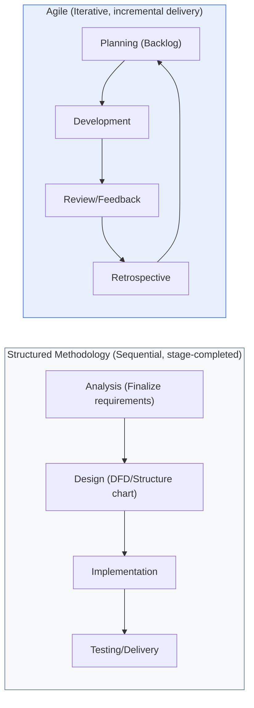
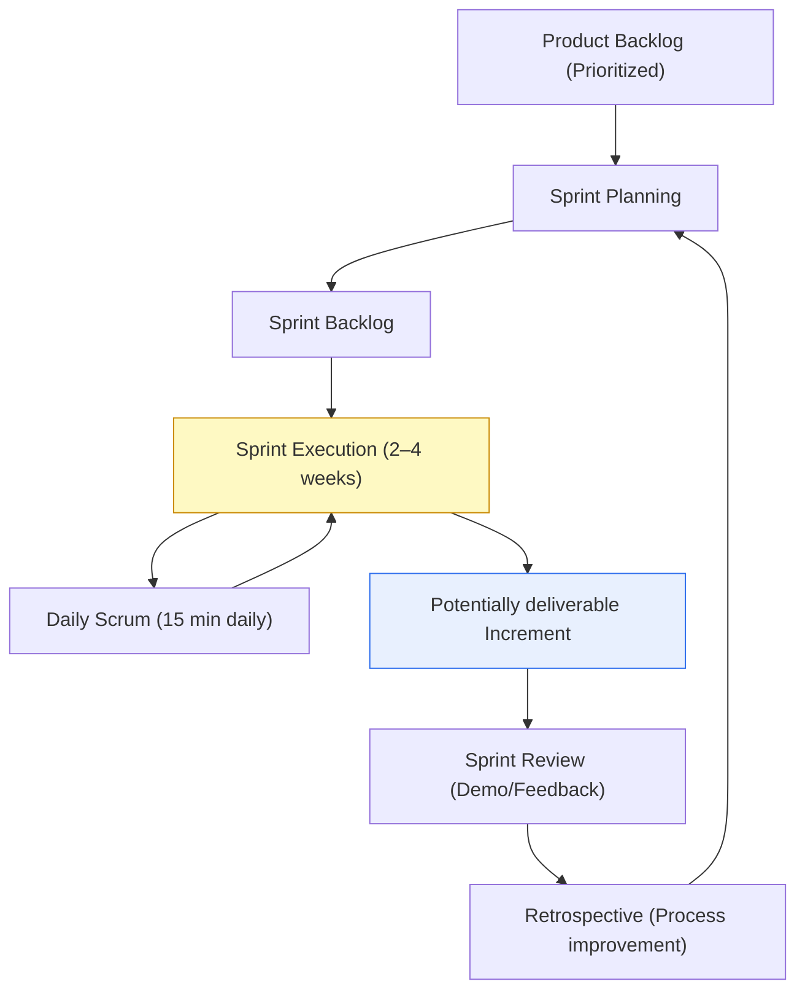

# Structured Methodology and Agile Methodology (Scrum · Kanban)

## 1. Overview

### A. Definition

> A **Structured Methodology** is a traditional development methodology that decomposes and defines a system top-down around functions and proceeds sequentially through analysis → design → implementation → testing, while an **Agile Methodology** is a lightweight methodology that incrementally delivers working software through short iterations and responds flexibly to changing requirements.

The fundamental difference between the two methodologies lies in a difference of attitude in development philosophy: "**follow the plan, or respond to change**." The structured methodology seeks to secure **predictability** by finalizing requirements at the front stage and controlling deliverables through detailed documents. It decomposes system functions top-down using tools such as the Data Flow Diagram (DFD), Data Dictionary (DD), Mini-spec, and Structure Chart, and is based on a Waterfall lifecycle in which each stage must be completed before moving to the next. This approach has clear reviews and approvals (Gates) at each stage, making auditing and tracing easy, and still holds strengths in regulated industries such as public, financial, and defense sectors, where requirements are stable and deliverable responsibility must be defined by contract.

Agile, on the other hand, delivers actually working results (Working Software) every 2–4-week iteration under the premise that "requirements change throughout the project," and adjusts the next direction with customer feedback. The **Agile Manifesto**, published in 2001, presented four values and 12 principles that value ① individuals and interactions over processes and tools, ② working software over comprehensive documentation, ③ customer collaboration over contract negotiation, and ④ responding to change over following a plan. In other words, Agile is not a specific procedure but a **set of values and principles**, and representative frameworks that practice these are Scrum (team collaboration, time-boxing), Kanban (flow optimization), and XP (technical practices).

The criterion of choice is that when requirements are clear and stable and large-scale, high-reliability is needed, the structured methodology is advantageous, whereas when requirements are uncertain and speed of market response is important, Agile is advantageous. In practice, a **hybrid** form that controls high-level planning and architecture in a structured manner while iterating development execution with Agile is increasing in large-enterprise SI and public projects.

### B. Adoption Background and Necessity

The traditional methodology revealed three limits in the modern software environment where requirements change frequently. First, the assumption that all requirements are finalized at the front stage is unrealistic, so when the market or business changes, the finalized design soon becomes outdated. Second, defects are discovered all at once at the later testing stage, so the cost of correction grows exponentially (at the level of 1 at the requirements stage versus 100 at the operations stage). Third, although there are many interim deliverables, "something working" appears only late in the project, so customers confirm value late.

As a response to these limits, Agile takes the approach of **breaking things into small pieces, delivering quickly, and correcting direction with feedback**. As the spread of cloud, DevOps, and CI/CD made short-cycle builds and deployments technically feasible, Agile combined with the business demand for "fast time-to-market and responsiveness to change" and became effectively the mainstream of software development.

## 2. Conceptual Comparison of Structured Methodology and Agile

As shown in the diagram above, the structured methodology has stages that **flow in one direction and complete**, whereas Agile forms a **closed loop** of planning-development-review-retrospective. This structural difference produces differences in requirement-change response, deliverable form, and risk management approach.

The biggest difference is the **attitude toward requirement change**. The structured methodology views change as a "target to control and minimize," strictly suppressing it through a Change Control Board (CCB) and configuration management. This is because a change shakes the entire deliverable of the front stage. Agile views change as a "source of competitive advantage," re-prioritizing the backlog at every iteration boundary. However, this does not mean allowing indiscriminate change "during" a sprint, but rather that **the point of accepting change is regularized at the iteration boundary**.

The second difference is the **point at which risk surfaces**. In the structured methodology, large risks such as integration and load problems cluster at the later testing stage (lagging risk), so they are discovered late and cost much to correct. Agile creates working software every iteration, exposing integration and performance problems early, thereby managing risk ahead of time.

| Category | Structured Methodology | Agile Methodology |
|---|---|---|
| **Progress mode** | Sequential, stage-completed (Waterfall) | Iterative, incremental |
| **Requirement change** | Control/minimize (CCB) | Actively accept at iteration boundary |
| **Core value** | Detailed documents, planning, predictability | Working SW, customer collaboration, responding to change |
| **Main tools** | DFD, data dictionary, structure chart | Backlog, sprint, board, burndown |
| **Risk exposure** | Concentrated at the end (lagging) | Early exposure every iteration |
| **Suitable situation** | Stable requirements, large-scale, regulated industry | Uncertain requirements, fast market response |

## 3. Agile Implementation Frameworks: Scrum and Kanban

The two representative frameworks that implement Agile values as actual development procedures are Scrum and Kanban. Both share the principle of "small, frequent, transparent," but their approaches differ in that Scrum is a method that **creates rhythm through time-boxes, roles, and events**, while Kanban is a method that **visualizes and optimizes the work flow itself**.

### A. Scrum — Time-box-based Iteration

Scrum is a framework whose unit is the **Sprint**, a fixed period of 2–4 weeks, with the goal of completing (Done) the planned work within that period. Its core consists of three roles, five events, and three artifacts. The roles are divided into the **Product Owner**, who is responsible for product value and backlog priority; the **Scrum Master**, who facilitates the process and removes obstacles; and the **Dev Team**, which self-organizes to actually build.

This separation of roles is important because it separates the responsibilities of "what to build (PO)," "how to build it well (team)," and "keeping the process running well (SM)," preventing power from being concentrated in one person. In particular, the Scrum Master is not a director but a **Servant Leader** who acts as a facilitator, helping the team solve problems on its own.

The events consist of the **Sprint Planning**, which sets the sprint goal and work; the **Daily Scrum**, a daily 15-minute sharing of progress and obstacles; the **Sprint Review**, which demonstrates the results to stakeholders and receives feedback; and the **Retrospective**, which improves the process. The artifacts are the Product Backlog, the Sprint Backlog, and the actually deliverable **Increment**. Progress status is shared transparently through the **Burndown Chart**, which visualizes the remaining amount of work.

### B. Kanban — Flow-based Continuous Processing

Kanban is a method that, without a fixed iteration cycle, visualizes work as cards on a board (To Do → In Progress → Done) and **limits the number of concurrent work items (WIP, Work In Progress)** at each stage to optimize flow. The reason WIP limiting is the core device is that if one person holds multiple tasks at once, context-switching costs and waiting time increase, actually lowering overall throughput. Limiting WIP makes bottleneck stages visibly apparent, and the team focuses on "finishing accumulated work" rather than starting new work.

Kanban does not enforce formalized roles or events, so there is little resistance to adoption, and it has the advantage of being layered directly onto an ongoing process. Thus it fits especially well with **operations, maintenance, and technical support** work where requirements come in constantly. Flow performance is measured by **Lead Time**, the time one item takes from start to completion; **Throughput**, the amount completed per unit time; and the **Cumulative Flow Diagram (CFD)**, which shows the distribution of work over time.

### C. Comparison of Scrum and Kanban

| Category | Scrum | Kanban |
|---|---|---|
| **Cycle** | Fixed sprint (time-box) | Continuous flow (no cycle) |
| **Roles** | PO/SM/Dev Team (formal) | No separate definition (flexible) |
| **Work control** | Commit per sprint | Control flow via WIP limits |
| **Core metrics** | Velocity/Burndown | Lead time/Throughput/CFD |
| **Change acceptance** | Avoid change during sprint | Re-prioritize anytime |
| **Suitable situation** | Feature development/Clear iterations | Operations/Support/Continuous processing |

The two frameworks are not mutually exclusive. **Scrumban**, which combines Scrum's rhythm (sprints, retrospectives) with Kanban's flow management (WIP limits, board), is widely used in practice, and many organizations run development with Scrum and operations/bug response with Kanban. The criterion of choice is "whether work comes in as plannable Batches, or comes in continuously like a flow."

## 4. Methods for Effective Agile Execution and Application Cases

Merely imitating the form of Agile ends up as "Agile in name only (Cargo-cult Agile)." To produce real results, the following must go together.

First, **incremental adoption and cultural establishment**. Rather than a full-scale conversion, start with a pilot team, spread the success experience throughout the organization, and jointly foster a culture of continuous improvement through autonomy, transparency, and retrospectives. Because Agile presupposes self-organizing teams, if a command-and-control management culture remains, only the form is left.

Second, **combination with DevOps and CI/CD**. The "fast value delivery" of short iterations is actually realized only when build, test, and deployment automation supports it. Without an automated pipeline, the burden of manual deployment and regression testing accumulates each iteration, so iteration actually exhausts the team. For example, Netflix and Amazon deploy thousands of times a day on top of automated deployment pipelines, which shows that Agile iteration must combine with DevOps to achieve speed at scale.

Third, **use of large-scale scaling frameworks**. When teams grow to dozens, inter-team dependency and alignment problems arise, so one compromises with scaling systems that coordinate multiple agile teams, such as **SAFe (Scaled Agile Framework)**, **LeSS (Large-Scale Scrum)**, and the **Spotify model (Squad, Tribe, Chapter, Guild)**. Domestically as well, cases are increasing where large financial and telecom companies adopt SAFe for next-generation and digital-transformation projects, aligning high-level planning while leaving team execution to autonomy.

Fourth, **drive improvement with appropriate metrics**. Scrum manages predictability with velocity and burndown, and Kanban manages flow with lead time and throughput, but metrics must be used as material for retrospectives rather than as means to control the team. Using velocity for inter-team comparison or competition produces adverse effects such as estimate inflation.

## 5. In Depth: Latest Trends and Expected Exam Directions

Recent Agile discussion is expanding beyond "team-level practice" to organization-wide **Business Agility**. Because even if only the development team iterates quickly, if planning, budgeting, and procurement remain annual-cycle Waterfall, overall lead time increases, **Beyond Budgeting**, which aligns even budgeting and governance with the flow, and **Value Stream Management (VSM)**, which manages the entire value flow, are drawing attention. Also, as AI coding assistants (Copilot-type) spread and development speed within iterations increases, backlog management, acceptance-criteria (AC) definition, and automated-test quality are emerging as bottlenecks.

From a professional engineer's perspective, this topic is likely to be set as an exam question in the form of ① comparing structured vs. Agile by "requirement stability and the point of risk exposure," ② distinguishing Scrum and Kanban along the axes of "cycle, roles, metrics," or ③ discussing methods of spreading Agile in large organizations (SAFe, DevOps combination). It is advantageous to conclude the answer with the balanced statement that "a methodology is not an end but a means, and must be selected and mixed to fit project characteristics (requirement uncertainty, scale, regulation)."

## 6. Considerations and Implications

1. **Team capability and culture, more than methodology, determine success.** Without an autonomous, collaborative team culture, Agile degenerates into formalism where only events remain. Changes in organizational culture and leadership must accompany the adoption of the methodology.
2. **Minimizing documents is not abolishing them.** The minimum documents needed for traceability, maintenance, and auditing (architecture decision records, acceptance criteria, release notes) must be maintained, and especially in regulated industries, essential deliverables must be defined even within Agile.
3. **The hybrid is the realistic solution.** A mix that controls high-level planning, budget, and architecture in a structured manner while iterating development execution with Agile is the practical compromise for large-scale public and SI projects where requirement stability and responsiveness to change coexist.
4. **Agile without automation (DevOps, CI/CD) is unsustainable.** The shorter the iteration cycle, the more the burden of manual testing and deployment accumulates, so one must recognize that pipeline automation is a precondition of Agile and invest accordingly.
5. **Use metrics as material for improvement, not for control.** Using velocity and lead time for inter-team comparison or evaluation invites estimate distortion and burnout. Metrics should be tools for the team to reflect on itself and find bottlenecks.

## References

- Agile Manifesto, https://agilemanifesto.org/
- Scrum Guide (Schwaber·Sutherland), https://scrumguides.org/
- Kanban University, https://kanban.university/
- Scaled Agile Framework (SAFe), https://scaledagileframework.com/

---

> **In one line**: The structured methodology provides *sequential, plan-centric predictability*, while Agile provides *iterative, change-responsive flexibility*; its implementations Scrum (time-box, roles, events) and Kanban (WIP limits, flow optimization) are selected and mixed to fit project characteristics, and team culture, combination with DevOps/CI/CD, and correct use of metrics determine success.
