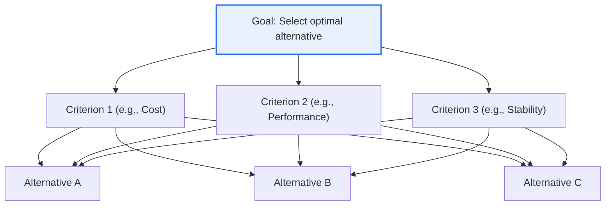
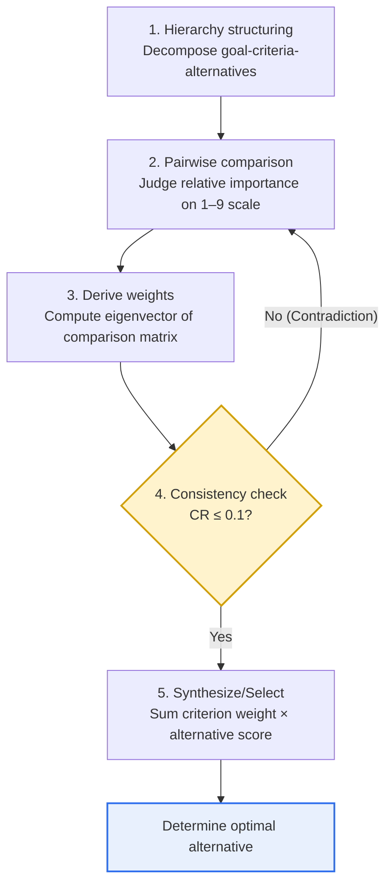

# AHP (Analytic Hierarchy Process)

## 1. Overview

### A. Definition

> A **Multi-Criteria Decision Making (MCDM)** technique proposed by Thomas Saaty in the 1970s, it decomposes a complex decision problem into a **Hierarchy** of 'goal–criteria–alternatives,' derives relative weights through **Pairwise Comparison** among the elements of each hierarchy level, and selects the optimal alternative.

The essential strength of AHP lies in '**converting qualitative, subjective judgment into quantitative priorities**.' Human cognition is very poor at weighing multiple criteria (price, performance, design, brand, maintenance cost, etc.) all at once. As the psychology research on the 'magic number 7±2' suggests, there is a limit to the number of items a person can compare and process stably at the same time. However, judging "how much more important is A than B" by placing two at a time is relatively easy and can be done consistently. AHP synthesizes these pairwise comparison results into a matrix and calculates the eigenvector to derive the weight of each element, thereby giving logic and reproducible objectivity to a decision-making process that had relied only on intuition and experience.

Another decisive differentiator is that the logical consistency of judgment can be quantitatively verified with the **Consistency Ratio (CR)**. For example, it catches, via the CR value, cyclic contradictions (intransitivity) such as "price is more important than performance (A>B), performance is more important than design (B>C), yet design is more important than price (C>A)," or inconsistencies in intensity. Unlike a simple weighted sum or scoring model that lets a respondent's logical contradictions pass through as is, AHP embeds this verification step to guarantee the reliability of the decision on its own.

### B. Background and Necessity

Decisions that must synthesize several heterogeneous criteria—such as determining investment priorities, selecting suppliers and solutions, evaluating policy alternatives, and reviewing the feasibility of informatization projects—sharply lose persuasiveness and organizational acceptance if made without explicit grounds. Especially in situations where hard-to-quantify factors (brand trust, policy ripple effects, user satisfaction) and quantitative factors (cost, processing speed) are mixed, a decision relying on the person in charge's gut feeling later invites backlash and audit findings.

AHP transparently structures such a judgment process into a hierarchy, so that one can explain in numbers what weight was placed on which criterion and why that alternative was chosen. This 'explainability (traceability)' leads to consensus among stakeholders and, in public projects, becomes the basis for securing the legitimacy of policy decisions. Indeed, this is why AHP or its variants have been used as standard tools domestically in the comprehensive evaluation (AHP) of preliminary feasibility studies, informatization-project prioritization, and proposal evaluation for negotiated contracts.

## 2. Hierarchy and Components

AHP models a problem into a hierarchy flowing from top to bottom: the topmost Goal, the middle Criteria and Sub-criteria, and the bottommost Alternatives. This structure itself forces one to separate and think about "for what (goal), by what standard (criteria), and choosing from among what (alternatives)," reducing ambiguity in problem definition.

The **Goal** at the topmost level defines in one sentence what the decision ultimately seeks to achieve. The more concrete it is—like "selection of a contractor for building the next-generation system"—the clearer the derivation of sub-criteria becomes. If the goal is ambiguous, all subsequent comparisons waver, so the operational definition of the goal is the starting point of AHP quality.

The **Criteria** at the middle level set the perspectives that influence goal achievement so that they are mutually exclusive yet collectively cover the whole (close to MECE). Because the number of pairwise comparisons—discussed later—soars as criteria increase, it is common practice to group up to seven per level and, if necessary, subdivide into sub-criteria. For example, one might place 'architecture suitability, scalability, and security' as sub-criteria under 'technical merit.'

The **Alternatives** at the bottommost level are the actual candidates for selection. Alternatives are evaluated against all criteria, and from the perspective of each criterion the alternatives are again pairwise-compared. When an alternative has a quantitative indicator (such as price), one may normalize the measured value to substitute for pairwise comparison; this flexibility of integrating qualitative and quantitative factors into a single priority system is the practical appeal of AHP.

## 3. AHP Execution Procedure

The overall flow proceeds through five stages: hierarchy structuring → constructing the pairwise comparison matrix → deriving weights (eigenvector) → consistency verification → synthesis and selection of the optimal alternative, with a feedback loop returning to pairwise comparison if consistency verification is failed.

### A. Hierarchy Structuring and the Pairwise Comparison Scale

In the first stage, after decomposing the problem into the hierarchy explained earlier, one pairs elements two at a time within each level and judges their relative importance. Here, Saaty's proposed **Fundamental Scale of 1–9** is used. 1 means the two elements are equally important, 3 means one is weakly more important, 5 means strongly more important, 7 means very strongly, and 9 means absolutely more important, with 2, 4, 6, and 8 being intermediate values. The comparison in the opposite direction is automatically filled with the reciprocal (e.g., if A is 5 over B, then B is 1/5 over A).

The key is that this scale is not merely an ordinal scale that only ranks, but one that also captures 'intensity.' Because it expresses not just "A is more important than B" but "strongly more important by a factor of 5," one can extract weights at the level of a ratio scale in the subsequent eigenvector calculation. However, there is an upper bound of the scale in that it is hard to express extreme differences beyond 9, which can cause distortion when comparing alternatives with large gaps within one group, so it is mitigated by subdividing criteria into a hierarchy.

### B. Deriving Weights (Eigenvector)

The pairwise comparison results for n elements are organized into an n×n **comparison matrix A**. The priority vector (weights) from this matrix is found by normalizing the eigenvector corresponding to the largest eigenvalue (λmax). In practice, an approximation method (geometric-mean or arithmetic-mean method) that normalizes each column by dividing by the sum and then takes the row-wise average is commonly used, and the result almost matches the formal eigenvector method.

For example, if for the three criteria 'cost, performance, stability' a respondent viewed cost as 3 times more important than performance and stability as 2 times more important than cost, the calculation yields a weight vector such as stability ≈ 0.54, cost ≈ 0.30, performance ≈ 0.16. The values so derived are normalized to sum to 1, so they can be immediately multiplied by alternative scores and synthesized. Under each criterion, the alternatives are also compared in the same way to obtain the per-criterion alternative weights.

### C. Consistency Verification

Whether the derived judgments are logically consistent is verified with the **Consistency Index (CI)** and the **Consistency Ratio (CR)**. CI is defined as CI = (λmax − n) / (n − 1), and for a perfectly consistent judgment λmax = n, so CI = 0. CR is this CI divided by the **Random Index (RI)**, the average consistency index of a randomly filled comparison matrix—that is, CR = CI / RI. RI is a constant determined by the number of elements n, and is known to be 0.58 for n=3, 0.90 for n=4, 1.12 for n=5, 1.24 for n=6, 1.32 for n=7, and so on.

By convention, if **CR ≤ 0.1 (10%)**, the judgment is considered consistent at an acceptable level. If CR exceeds 0.1, it signals a large logical contradiction in the responses, so one revisits which comparison conflicts with the others and re-answers. This threshold (0.1) is not an absolute truth but a conventional criterion based on Saaty's rule of thumb, so it is desirable to interpret it more or less strictly according to the subject and field. What matters is that the device called CR makes it possible to quantitatively audit the 'quality of judgment' after the fact.

### D. Synthesis and Selection of the Optimal Alternative

Finally, one performs a **weighted-sum synthesis** that multiplies each criterion's weight by the per-alternative score evaluated under that criterion and sums them. The composite score of alternative i = Σ(weight of criterion j × score of alternative i under criterion j), and the alternative with the highest composite score is finally selected. For example, if the stability weight is a dominant 0.54, an alternative superior in stability can be ranked first overall even if it lags somewhat in other criteria. Performing a **Sensitivity Analysis** at this stage, which examines how sensitively the ranking changes with changes in weights, is a great help in checking the robustness of the conclusion and persuading stakeholders.

## 4. Characteristics, Pros and Cons, and Comparison with Similar Techniques

AHP has the strengths of integrating qualitative and quantitative factors into a single priority system, systematically structuring the judgment process, being able to verify consistency, and inducing stakeholder consensus through level-by-level comparison. On the other hand, as criteria and alternatives increase, the number of pairwise comparisons soars to n(n−1)/2, inviting respondent fatigue and lowered consistency; subjectivity intervenes in assigning the scale; and **Rank Reversal**, in which the existing ranking is overturned when a new alternative is added, can occur.

| Category | Pros | Cons |
|---|---|---|
| **Judgment integration** | Integrate qualitative/quantitative factors on a ratio scale | Subjectivity intervenes in scale assignment |
| **Logic** | Can quantitatively verify consistency via CR | Debate over the theoretical basis of the CR threshold (0.1) |
| **Scalability** | Handle complex problems via hierarchy subdivision | Explosion of comparisons as elements increase (fatigue) |
| **Stability** | Check robustness via sensitivity analysis | Rank reversal possible when adding alternatives |

The number of comparisons by the number of criteria n increases to 6 for n=4, 21 for n=7, and 45 for n=10. For this reason, in practice one limits the elements per level to seven or fewer and, if exceeded, divides into lower levels to manage the number of comparisons in each group.

Representative MCDM techniques frequently compared with AHP are TOPSIS and ANP. **TOPSIS** is a technique that ranks by calculating the distance from the ideal solution; it is fast to compute and easy to handle even with many alternatives, but it requires the criterion weights to be given separately and has no consistency-verification device. In practice, the **AHP-TOPSIS combination**, which extracts criterion weights with AHP and ranks alternatives with TOPSIS, is widely used. **ANP (Analytic Network Process)** is an extension that relaxes AHP's assumption of a hierarchy (one-way top-to-bottom) to express interdependence and feedback among criteria as a network; it reflects the complex interactions of reality but is far more complex to model and compute.

### Real Application Cases

First, in **public preliminary feasibility studies**, AHP-based comprehensive evaluation is used to synthesize disparate evaluation items such as economic feasibility (B/C ratio), policy merit, and balanced regional development, converting policy values that are hard to quantify into quantitative scores to decide whether to proceed with a project. Second, in **selecting a contractor for a next-generation information system**, placing technical merit, project-execution capability, and price as top-level criteria, hierarchizing down to sub-criteria, and synthesizing the pairwise comparisons of the evaluation committee members allows the influence of a particular member's bias on the overall result to be checked via weights and consistency indicators. Third, in **selecting IT solutions and suppliers**, when comparing multiple vendors using criteria such as total cost of ownership (TCO), performance, security, and maintenance support, it is used to bundle quantitative indicators (price) and qualitative indicators (support quality) into a single scoring system and document the basis of the decision.

## 5. In Depth: Extension Techniques and Expected Exam Directions

Extension lineages to complement the assumptions of pure AHP (criterion independence, clarity of judgment) are being steadily researched and applied. **ANP** handles interdependence among criteria as explained above, and **Fuzzy AHP** expresses judgments that a respondent feels uncertainly and vaguely—like "around 3 to 5"—as fuzzy sets such as triangular fuzzy numbers (TFN) to reflect the ambiguity of human judgment in the model. Also, **Group AHP** supports collective decision-making by synthesizing multiple evaluators' individual comparison values with the geometric mean (AIJ, Aggregation of Individual Judgments) or synthesizing individual priorities (AIP). Recently, hybrid models combining AHP-derived weights with TOPSIS, VIKOR, DEMATEL, and the like are used almost as a standard in papers and practical evaluation systems.

From a professional engineer's perspective, this topic tends to be set as an exam question in the context of 'multi-criteria decision-making' or 'informatization-project evaluation and prioritization.' When composing an answer, one can secure depth of discussion by developing step by step ① the definition and hierarchy, ② the five-stage procedure (especially pairwise comparison → eigenvector → consistency verification), ③ the formulas of CI/CR/RI and the CR ≤ 0.1 criterion, ④ limits such as rank reversal and comparison explosion and their complementation via ANP, Fuzzy AHP, and the AHP-TOPSIS combination, and finally adding practical implications with concrete cases such as public preliminary feasibility studies or contractor selection.

## 6. Considerations and Implications

1. **The Consistency Ratio (CR) is the core device guaranteeing AHP's reliability.** The criterion CR ≤ 0.1 makes it possible to audit judgment quality after the fact, and this verification function fundamentally distinguishes AHP from simple weighted-sum or scoring models. However, since the threshold of 0.1 is a rule of thumb, one should allow flexibility of interpretation according to the characteristics of the target domain.

2. **The quality of problem structuring governs the quality of the result.** If the operational definition of the goal, the MECE design of criteria, and the limit on the number of elements per level (seven or fewer recommended) are not upheld, even the most precise calculation yields distorted conclusions. In other words, one must remember that AHP is a 'problem-definition technique' before it is a 'calculation technique.'

3. **The limits of rank reversal and comparison explosion must be managed by design.** Since the ranking can be overturned when adding alternatives, check robustness using the absolute-measurement (rating) mode or sensitivity analysis, and when there are many elements, adopt a strategy of subdividing the hierarchy or combining with TOPSIS and the like to reduce the comparison burden.

4. **The value as a group decision-making tool should be leveraged.** Group AHP raises the legitimacy and organizational acceptance of a decision by transparently revealing and synthesizing each stakeholder's judgment. Especially in public projects and procurement evaluation, one must recognize that AHP's real utility lies in 'consensus formation and explainability' rather than 'producing the right answer,' and take the stance of using the resulting figures as grounds for decision-making communication rather than treating them as absolute.

## References

- Saaty, T. L., "Decision making with the analytic hierarchy process", International Journal of Services Sciences, 2008. https://www.rafikulislam.com/uploads/resources/187224511185ad17066bdb.pdf
- Wikipedia, "Analytic hierarchy process". https://en.wikipedia.org/wiki/Analytic_hierarchy_process
- Wikipedia, "Analytic hierarchy process – car example (consistency, RI)". https://en.wikipedia.org/wiki/Analytic_hierarchy_process_%E2%80%93_car_example

---

> **In one line**: AHP is a multi-criteria decision-making technique that *decomposes a problem into a goal–criteria–alternatives hierarchy* and derives weights from the eigenvector of pairwise comparisons (1–9 scale) to select the optimal alternative; it guarantees the logic of judgment through CI/CR/RI-based consistency verification (CR ≤ 0.1), and complements limits such as rank reversal and comparison explosion with ANP, Fuzzy AHP, and the AHP-TOPSIS combination.
