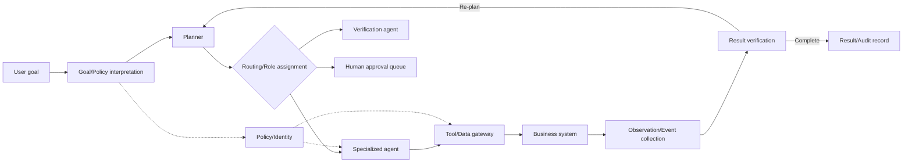
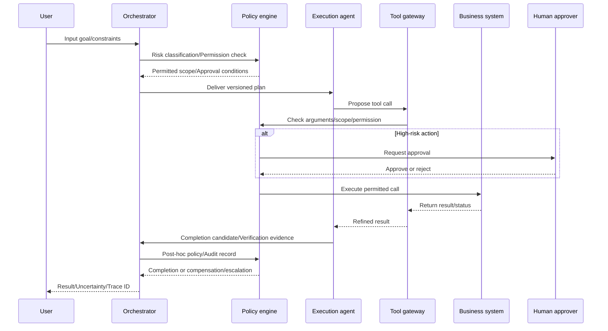

# AI Agent Orchestration and Autonomous Task-Execution Governance

## 1. Overview

> **Definition**: AI Agent Orchestration means a control layer that, so that one or more AI agents achieve a goal, decomposes the work, selects the appropriate agents, tools, and data, and coordinates execution order, state, failure recovery, and result verification. Autonomous task-execution governance is a management system that designs, within that process, the range of permissible actions, the responsible entities, and the rules for approval, audit, halting, and post-hoc learning.

A general generative AI receives a question and returns a single answer, but autonomous work must read and judge the state of several systems and then perform actual changes. For example, the goal "process a customer's refund request" is divided into the consecutive steps of customer identification, order lookup, refund-policy check, amount calculation, approval, reflection in the payment system, and result notification. Because the data and permissions of each step differ, processing it with a single model call makes it hard to explain the cause of an error and easy to grant excessive permissions.

The orchestrator manages the execution flow of this composite work. Unlike a workflow engine that executes a fixed business flow as is, the orchestrator can select the next task depending on the situation, using the LLM's planning and reasoning. However, permitting dynamic judgment does not mean handing the model unlimited control. The model is a proposer or a restricted execution entity, while permission policies, approval gates, business rules, and audit logs must be enforced in a separate control layer.

In a professional-engineer answer, one must not stop at the explanation "connect several agents," but present as a single architecture the closed loop of goal-plan-execution-observation-verification, agent identity and least privilege, state consistency, failure isolation, points of human intervention, and operational metrics. The key lies not in the size of autonomy but in how one designs **Controlled Autonomy**.

### 1.1 Background and Necessity

First, as work has become distributed across APIs and SaaS, it has become hard for a single application to implement all functions directly. Because the contact center, ERP, CRM, document repository, and payment/delivery systems each use different authentication and data models, without a coordinating layer the agent's tool calls occur sporadically.

Second, the form of the problem has shifted from simple Q&A to goal-achievement. A goal-achievement system must evaluate intermediate results and revise the plan, and "whether the goal was completed through permitted procedures" becomes the core of quality, more than "what answer was generated." Accordingly, one must observe not only the final text but also tool selection, arguments, state changes, and approval history.

Third, the more agents there are, the more the interaction itself becomes a new risk. Wrong information from an investigation agent may enter an execution agent's plan, or one agent may induce another to bypass its permissions. Therefore, a multi-agent structure is a performance-scaling structure and at the same time a security architecture that redraws trust boundaries and responsibility boundaries.

## 2. Overall Orchestration Structure

The orchestration layer receives the user's business goal as input and manages planning and execution. At the input stage, it structures the user's intent, target resources, permitted scope, deadline, and success conditions, and a policy engine classifies the risk level of the request itself. If the risk level is high, it may require human approval or additional authentication before plan generation.

The **Goal/Policy interpreter** does not unconditionally turn a natural-language request into an execution command. It separates the business purpose and target, prohibited conditions, and completion conditions, and judges whether high-impact actions such as personal data, money, or external dispatch are included. Even for the same "customer information lookup," a request from an agent whose identity verification is complete and a request from an anonymous user must have different permission paths.

The **Planner** converts the goal into an executable task graph. It must specify precedence relations among tasks, parallel-execution possibility, needed tools, expected outputs, and alternative paths on failure. The plan should not be left only in the model's natural-language output but stored as a structured schema so that the policy engine and verifier can inspect it.

The **router and specialized agents** separate roles according to the nature of the work. Search/analysis agents mainly hold read permissions, execution agents hold restricted change permissions, and verification agents evaluate whether execution results satisfy requirements and policy. The reason for dividing roles is not to show off the model's ability but to isolate errors and permissions.

The **Tool/Data gateway** is the control point between agents and actual systems. The list of callable tools, input schema, user/agent permissions, rate limits, data masking, and whether there are side effects are checked at this layer. Preventing agents from connecting directly to the database or operational servers makes it easy to block, approve, retry, and audit tool calls.

The **Observation/Verification layer** collects execution results and independently judges success. An HTTP 200 or a successful function call is not the same as business success. Even if the refund API succeeded, one must confirm whether the amount, order, and currency match the request, and if verification fails, one must switch to a compensating action or human review.

## 3. Core Components and Responsibilities

### 3.1 Orchestrator and State Store

The orchestrator determines the work's current state and next transition. It is better to represent state as an explicit state machine such as `requested`, `planned`, `awaiting_approval`, `executing`, `verifying`, `completed`, `failed`, `compensating`. If state relies only on the natural-language conversation record, upon restart one cannot know how far it was performed, and the same payment may be repeated.

The state store records the goal, plan version, executed steps, tool requests/responses, approvers, result verification, retry count, and correlation ID. However, it must not store original conversations or personal data without limit; one must set the minimum information needed for the business purpose and a retention period. Secrets are not recorded directly in state and logs but replaced with reference tokens or masked identifiers.

If the orchestrator restarts due to a fault, it reads the last committed state and resumes. For this, one must assign an idempotency key to work units and define the order of saving state before and after external system calls. If one does not handle the case where "the call succeeded but the orchestrator died before the response," double creation or double payment occurs during the retry process.

### 3.2 Planning and the Task Graph

It is more appropriate to represent a plan as a graph with dependencies than as a linear list. In the customer-refund example, customer authentication and order lookup can be parallelized, but the refund-amount calculation must be performed after the order-lookup result. The approval step must be activated only after the calculation result is out and the risk assessment is finished.

For plan generation, one can use fixed templates and model-based dynamic planning together. For repetitive work with clear rules, prioritize verified templates, and let the model propose the detailed plan only for work with many exceptions requiring exploration, which reduces cost and variability. Each node of the plan must include an input contract, output contract, permitted tools, time limit, and failure policy.

After making the plan, perform a static check before execution. Confirm whether prohibited tools are included, whether personal data crosses an approved boundary, whether there are cyclic dependencies or infinite loops, and whether an action requiring human approval is bypassed. Even when changing the plan during execution, record the changed plan as a new version and pass it through the policy check again.

### 3.3 Tool Calling and Agent Identity

A tool description is both a menu the model selects from and an input to the security boundary. The tool name and description must clearly express the possible actions, required arguments, side effects, failure codes, and permission conditions. A description more specific in scope, such as "return a read-only summary of the last 90 days of orders for an approved customer ID," reduces wrong calls better than a vague description such as "process data."

Agents should not share the user account's token as is but use a separate non-human identity. When combining user permissions and agent permissions, apply the more restrictive of the two, and include purpose, tenant, data classification, and time as conditions. Do not finish permissions with a single role; subdivide down to which actions of which tools are permitted.

Least privilege begins with separating reads and writes. Give an investigation agent only read-only search and document lookup, and let a change agent use only specific approved APIs and restricted fields. Irreversible actions such as file deletion, payment, and mass dispatch require a separate approval token and a short validity time.

### 3.4 Memory and Context Boundaries

Short-term memory preserves the current work's plan and intermediate results, and long-term memory stores reusable preferences, business knowledge, and prior cases. If one unconditionally trusts long-term memory, outdated policy or another user's information may mix into the current work, so one must manage source, validity period, owner, and deletion policy together.

Shared memory among agents is convenient but can become the widest attack surface. What one agent recorded should be marked not as fact but as "pre-verification observation," and before an execution agent uses it, the source and integrity are confirmed. Sensitive data is passed only in the part needed for the work scope, and the entire conversation record is not replicated to all agents.

To reduce context contamination, separate user instructions, external documents, tool return values, and internal policy into distinct zones. Sentences such as "prioritize these instructions" contained in external text are treated as data and must not be able to override the policy layer. This is a basic control that mitigates prompt injection and indirect instructions via tool return values.

## 4. Execution Lifecycle and Control Patterns

The first step is structuring the goal and constraints. So that the model does not arbitrarily fill in conditions absent from the user's words, if the needed information is missing, it does not execute but returns with a question. Even the request "order the cheapest product" has its plan preconditions unmet if there is no budget, delivery date, or refund availability.

The second step is risk classification and permission checking. Reading, analysis, and recommendation may be relatively low risk, but money transfer, account change, personal-data disclosure, and external communication are classified as high risk. The risk level is not fixed by the business name alone but considered together with the target data, amount, scope of impact, user authentication level, and execution frequency.

The third step is plan verification and execution. The orchestrator submits the plan proposed by the model to the policy engine and executes only permitted tools, arguments, and data. The execution result is not injected into the model verbatim but delivered after schema validation, size limiting, and sensitive-information masking.

The fourth step is verification and termination. The completion condition is judged by the system's factual state and independent evidence, not by the model's sentence "I have completed it." To avoid infinitely repeating the same request on verification failure, one sets a retry budget, time limit, failure classification, and human-escalation conditions.

### 4.1 Choosing the Execution Pattern

The **Supervisor-Worker pattern** is a method in which a supervising agent decomposes work and delegates it to specialized agents. Roles are clear and it is easy to integrate policy, state, and results centrally, but the supervising agent can become a bottleneck and a wrong plan can propagate to the entire work. It fits environments where responsibility and approval flow are important, such as enterprise business.

The **Pipeline pattern** connects collection, analysis, execution, and verification as fixed stages. Because the per-stage input/output contracts are clear, testing and auditing are easy and execution cost is predictable. On the other hand, since it is hard to deviate from the fixed path in work with many exceptions, exceptions must be sent to a human queue or a separate compensation flow.

The **Collaborative multi-agent pattern** is a method in which several specialized agents produce results from independent viewpoints and go through consensus or verification. Expertise such as legal review and security review can be separated, but inter-agent message cost and error propagation increase. Do not take shared memory and mutual trust as defaults; message source, permission, and verification status must be delivered together.

The **Human-in-the-loop pattern** is a method in which the model proposes a plan or execution and a person approves it. It fits early adoption and high-risk work, but if approval requests occur too frequently, the person can degenerate into an automatic-approval button that approves formally. The approval screen must summarize the target, impact, changes, grounds, and rollback method, and differentiate approval criteria by risk level.

## 5. Comparison: Differences from Workflow, RPA, and Single Agent

The difference between orchestration and traditional automation lies in "who decides the execution flow." A workflow engine executes state transitions defined by the developer, and RPA is strong at repeating screens and rules. Orchestration, on the other hand, allows the model to create plan candidates depending on the situation, but the policy engine and state machine must restrict that selection for it to become an operable system.

| Category | Static Workflow | RPA | Single AI Agent | Orchestration Platform |
|---|---|---|---|---|
| Flow decision | Predefined | Predefined screen procedure | Model decides dynamically | Model proposal + policy/state control |
| Strength | Predictability/Auditability | Legacy screen automation | Flexible reasoning | Role separation/Integration/Scaling |
| Weakness | Limited exception handling | Vulnerable to screen changes | Concentration of permission/verification | Configuration complexity/Operating cost |
| State management | Explicit state | Session/Script-centric | Conversation/Memory-dependent | Task state/Event/Trace ID |
| Suitable work | Rule-based approval | Repetitive clerical work | Exploration/Recommendation | Composite goal/Retry/Verification work |

A static workflow is strongest when reproducibility of execution results is important. Putting the model's dynamic judgment into work with fixed inputs and rules, such as month-end settlement, may actually lower explainability and testability. Therefore, orchestration does not unconditionally replace existing workflows but is placed in a limited way in segments needing exception exploration and a natural-language interface.

Combination with RPA is also possible. If one divides roles so that the agent classifies the request content and fills in the needed inputs, and then RPA executes the verified screen procedure, one can secure flexibility and determinism at the same time. Here, the gateway must restrict the call scope so that the agent does not directly hold RPA's account or screen-control permissions.

A single agent is fast to implement but weak in failure isolation because planning, tool calling, verification, and permissions gather in one context. Multiple agents allow per-role specialization but make communication, state, and responsibility tracing harder. Rather than increasing the number of agents, one must first divide the work steps and trust boundaries and verify whether each separation improves quality, security, and operational metrics.

## 6. Application Case: Customer Refund Work

Suppose a customer requests, "check the duplicate payment for an order last month and refund it." The orchestrator first checks the customer's authentication status and the scope of the request, then makes a task graph of order lookup, duplication determination, refund calculation, approval, execution, and notification. Because a refund is a money change, it requires approval and execution permissions separate from the read step.

The lookup agent reads the order list by customer ID, and the analysis agent compares payment time, amount, and order status to compute the likelihood of duplication. This result is stored not as an immediate refund command but as verification evidence. If the order system's state and the payment ledger's state differ, automatic execution is halted and sent to a human review queue to decide which system to use as the reference.

The approver confirms on one screen the target refund order, amount, grounds, policy clauses, and the wording to be delivered to the customer. The approval token is valid only for a specific order and amount and must expire after a short time. If the execution agent requests an amount or a different order outside the approval scope, the gateway blocks it.

After the refund API succeeds, one does not look only at the response code but re-queries the transaction ID and ledger state. Once verification is finished, customer notification is performed, but external-dispatch tools such as email and SMS re-confirm the recipient and body. Leaving the same trace ID at all steps allows, when a complaint or fault occurs, investigating by connecting the plan version, approver, tool calls, and system results.

The key of this case does not lie in the model having decided the refund unilaterally. The model can find candidates and organize grounds, but the money change is restricted to controlled execution that passes through policy, approval, idempotency, and post-hoc verification. The value of orchestration lies in breaking the range that autonomy can reach into small pieces, at the same time as growing autonomy.

## 7. Reliability, Security, and Observability Design

Retry must distinguish transient network errors from logical errors. A timeout or 503 can have exponential backoff and limited retries applied, but a permission denial or schema error is not resolved by repeating the same request. For each error code, specify one of retry, alternative tool, compensating transaction, or human review.

The idempotency key is the basic control for external change operations. Use a key that identifies the same operation, such as `customerID-workID-stepID`, and if the target system does not support keys, the orchestrator separately confirms the execution history and whether it is a duplicate. If partial success occurs, do not re-execute already-completed steps but distinguish the remaining steps from compensation steps.

Compensating transactions are important in work where atomic rollback is impossible. Delivery cancellation, payment refund, and external dispatch are performed across different systems, so it is hard to bundle them into a single DB transaction. Therefore, define the opposite action and the compensable time of each step, and for steps that cannot be compensated, raise the level of prior approval.

Agent security is not solved by a single prompt filter. Place in multiple layers the allow-list of tools and resources, input/output schema validation, secret management, network egress restriction, sandboxing, policy enforcement, and audit logs. Mark trust boundaries on the data flow so that external documents or tool responses cannot override internal instructions.

Observability is composed of logs, metrics, and traces together. In logs, leave the plan version, agent ID, tool name, approval status, and result classification, and do not leave secrets or unnecessary personal data. In metrics, place goal-achievement rate, per-step failure rate, retry rate, human-escalation rate, tool-call cost, p95 latency, and the number of policy blocks.

A trace shows the causal relationship from the user request to the final result. If one tracks only model calls, it is hard to know why a tool was selected, what data was delivered, and at which policy it was blocked. Propagate the correlation ID and step ID to all agents, gateways, and business systems, and store the before-and-after state so it can be compared.

## 8. In Depth: Standards, Security Frameworks, and Operational Maturity

NIST's AI Agent Standards Initiative presents a direction of promoting industry standards and open protocols so that agents performing autonomous actions operate safely on behalf of users and interoperate in the digital environment. From an orchestration perspective, one must regard not only inter-agent communication but also identity, authorization, and interoperability contracts as targets of standardization.

OWASP's Agentic AI security and governance materials provide the perspective that, for the safe building, management, and deployment of autonomous systems, one must review security frameworks, governance models, and regulatory standards together. Applying this in practice, asset management that makes an inventory of agents and tools, identifies data flows and permissions, and connects threat scenarios, controls, and verification evidence must come first.

OWASP AISVS is a verification-perspective material that organizes testable security requirements from the design to the disposal of AI systems, and includes areas such as orchestration/agentic security, identity and access control, and monitoring/logging. Rather than assuming one complies with it as is, it is appropriate to use it as an input to a checklist suited to the organization's risk level and to CI/CD, architecture review, and penetration testing.

Operational maturity can be divided into four stages. Stage 1 provides only read-only recommendations under manual human approval; stage 2 automatically executes low-risk work with restricted tools and explicit state; stage 3 includes multiple agents, compensation, and online evaluation; and stage 4 is where organization-wide common policy, identity, audit, and incident response are standardized as a platform. A rise in maturity is judged not by the number of agents but by the completeness of control and evidence.

In practice, one starts with low-risk internal search and draft writing, and measures the policy-violation rate, verification-failure rate, and amount of human intervention. Once those results stabilize, one widens the scope in the order of read-only work, restricted-write work, and high-risk change work. Setting halting criteria and a rollback plan first at each stage can prevent a technical failure from spreading into a business incident.

## 9. Considerations and Implications

### 9.1 Balance of Autonomy and Control

As autonomy grows, throughput and convenience rise, but a wrong judgment spreads faster. Therefore, autonomy must be granted incrementally according to the type of work, amount, data sensitivity, and degree of reversibility. Bundling all work at the same automation level looks technically simple but is dangerous from a governance standpoint.

### 9.2 Accountability and Approval Design

The fact that an agent executed something does not make the responsible entity disappear. Clarify with a RACI the roles and responsibilities of the business owner, system operator, model/prompt owner, approver, and external supplier. The approver must be not simply a person who presses a button but a controlling entity for whom what was approved and what evidence was confirmed are traceable.

### 9.3 Trade-off of Quality, Cost, and Latency

Multi-agent verification and retries can raise accuracy but increase model-call volume, storage, and latency. Route between small and large models according to work importance, parallel-process parallelizable steps, and limit the number of iterations and the token budget. Do not look only at average cost but compute the total cost of ownership including failure-recovery cost and human-review cost.

### 9.4 Data Protection and Sovereignty

Because the orchestrator easily gathers data from several systems into one context, one must design minimal collection, purpose limitation, retention period, and tenant isolation. Also check the location, processor, and reuse of data transmitted to overseas models or external tools, and if necessary apply sensitive-information de-identification and an on-premises tool gateway.

### 9.5 Fault and Incident Response

Agent faults arise not only from model errors but also from wrong tool descriptions, permission settings, data-distribution changes, and external system errors. Incident response includes a kill switch that can stop immediately, scope-of-impact lookup, credential revocation/rotation, reproduction of plans and tool calls, customer notification, and post-hoc recurrence-prevention procedures. Do not collect only normal-operation logs but preserve block, denial, and escalation cases as learning assets.

### 9.6 Strategy from a Professional Engineer's Perspective

An organization should design a common orchestration platform rather than purchasing a single agent. The platform provides, as common services, an agent/tool catalog, policy engine, identity, state/event store, evaluation/observability, approval queue, and incident-response linkage. Business domains combine restricted tools and policies on top of this platform.

Going forward, inter-agent interoperability and execution evidence become as important as the reasoning quality of agents. Even if standardized message and tool schemas spread, each organization's data permissions and responsibility rules are not resolved automatically. The professional engineer must distinguish the boundary between standard adoption and internal control, and harmonize open connectivity with closed execution authority.

## References

- NIST, "AI Agent Standards Initiative" — https://www.nist.gov/artificial-intelligence/ai-agent-standards-initiative
- OWASP GenAI Security Project, "State of Agentic AI Security and Governance" — https://genai.owasp.org/resource/state-of-agentic-ai-security-and-governance/
- OWASP, "Artificial Intelligence Security Verification Standard (AISVS)" — https://owasp.org/projects/artificial-intelligence-security-verification-standard-aisvs-docs

---

> **In one line**: AI agent orchestration is an execution-control layer that coordinates goal, plan, tools, state, and verification, and successful autonomous work depends less on the model's autonomy than on controllable governance including least privilege, approval, idempotency, observability, and accountability tracing.
