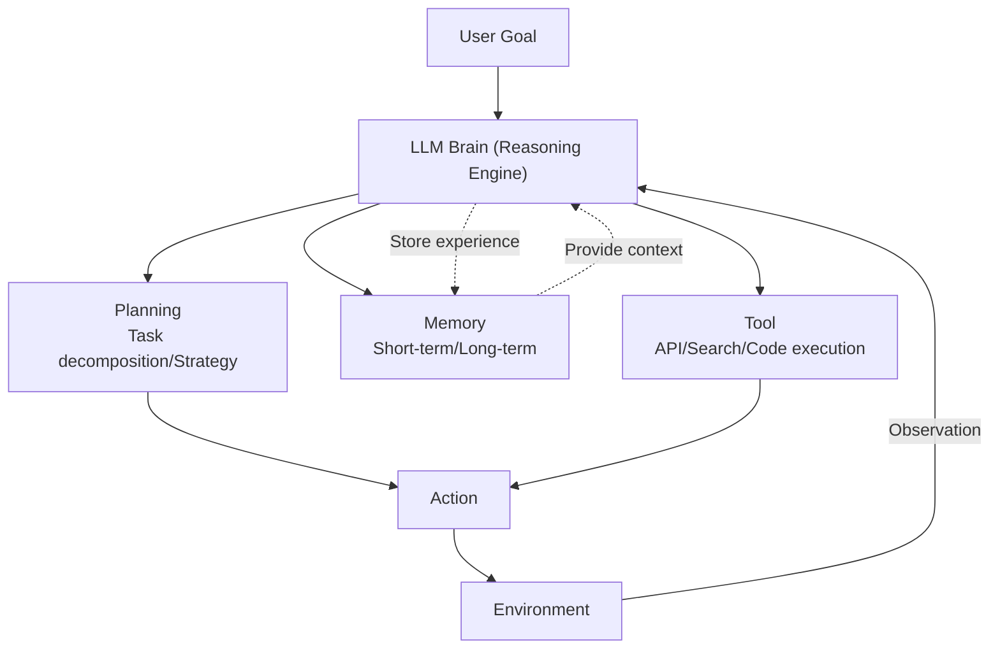
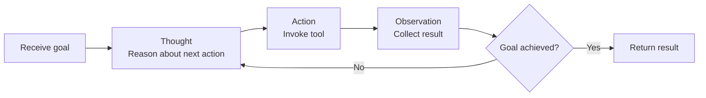

# AI Agents and Agentic AI

## 1. Overview

> An **AI Agent** refers to an intelligent software system that, using a foundation model such as a large language model (LLM) as its reasoning engine, **autonomously loops through establishing plans (Planning) on its own, invoking tools (Tool), and interacting with the environment** in order to achieve a given Goal. A paradigm oriented toward autonomous execution in which multiple agents collaborate or human intervention is minimized is called **Agentic AI** in particular.

Conventional use of LLMs remained at the **Q&A type (Chatbot)**, in which the model generates one-shot text when a user enters a prompt. However, this approach carried three fundamental limits. First, the model cannot access the latest information after its training point or an enterprise's internal data, making it vulnerable to **Knowledge Cutoff** and hallucination. Second, it can only generate text and cannot perform actual **Actions** such as lookup, reservation, payment, or code execution. Third, the **Multi-step Reasoning** ability to break a complex problem into multiple steps and solve them sequentially is insufficient in a single prompt response.

The AI agent emerged precisely to overcome these limits. It redefines the LLM not as a mere "generator" but as a "**Reasoning Engine**," attaches to that brain the limbs of memory (Memory), tools (Tool), and planning (Planning), and makes it repeat observation-thought-action on its own until the goal is achieved. For example, given the goal "book a flight and accommodation for a business trip to Seoul next week within a budget of 1 million won," the agent decomposes subtasks on its own, invokes search, comparison, and booking APIs, and repeats until the constraints are satisfied. The concept became popular with the appearance of AutoGPT in 2023, and in 2024–2025, practical application has begun in earnest with the refinement of **Function Calling**, standardized tool-connection conventions such as **MCP (Model Context Protocol)**, and the maturation of multi-agent frameworks.

## 2. Core Components and Operating Structure of an AI Agent

An AI agent has a structure in which the **planning, memory, tool, and action** modules are organically combined around the LLM brain. Each component is a software formalization of the way a human solves a problem—dividing the goal, recalling what is known, using needed tools, and judging again upon seeing the results.

**Planning** is the ability to decompose a complex goal into executable subtasks and determine their order. Instead of simply producing an answer at once, it develops "what to do first and what to do next depending on the result" as a Chain-of-Thought. The representative technique **ReAct (Reasoning + Acting)** alternates and repeats "Thought → Action → Observation," reflecting each step's tool-execution result in the next reasoning to reduce hallucination and induce grounded action. When **Reflexion (self-reflection)**, which self-critiques and corrects its own execution results, is combined with this, error resilience improves greatly.

**Memory** is the store where the agent maintains context and accumulates experience. It is divided into **Short-term memory (the context window)**, which holds ongoing conversations and intermediate results, and **Long-term memory (a vector DB)**, which stores past interactions and knowledge as vector embeddings and retrieves them when needed (RAG). Thanks to long-term memory, the agent can remember user preferences across sessions and reference a vast knowledge base to generate grounded responses.

**Tools** are the means by which the agent actually interacts with the external world. The LLM outputs "which tool to call with which arguments" in a structured format (JSON, etc.) (**Function Calling**), the runtime executes it, and the result is returned to the model. Web search, database lookups, in-house APIs, code interpreters, file systems, and the like become tools, and recently **MCP (Model Context Protocol)**, which standardizes this connection, has spread and is establishing itself as the de facto standard for loosely coupling tools and data sources with agents.

| Component | Role | Representative Technology | Problem If Absent |
|---|---|---|---|
| Planning | Goal decomposition/Strategy | ReAct, ToT, Reflexion | Failure to solve complex tasks |
| Memory | Maintain context/Accumulate experience | Context window, Vector DB | Loss of consistency across sessions |
| Tool | Act on the external world | Function Calling, MCP | Cannot execute/Access latest info |
| Action | Actual execution/Iteration | Agent Loop, Orchestrator | Remains a one-shot response |

## 3. Agent Reasoning/Control Techniques and Levels of Autonomy

An agent's intelligence depends on "how well it plans and how well it recovers from failure," and what governs this is the reasoning/control technique. Representatively, **ReAct** alternates reasoning and action, **ToT (Tree of Thoughts)** searches multiple thought paths as a tree to choose the best, and **Plan-and-Execute** first establishes the entire plan and then executes subtasks sequentially. What these have in common is that they introduced a **repeating structure of search, evaluation, and correction** rather than linear generation.

The level of autonomy is graded by the degree of human intervention. The lowest stage is **Human-in-the-loop**, where a person approves each step; the middle is **Human-on-the-loop**, where a person supervises but intervenes only in exceptions; and the highest stage is **Full Autonomy**, which runs to the goal without human intervention. The higher the autonomy, the greater the productivity, but the risk that a wrong action is immediately reflected in the real world also grows, so it is a practical principle to always place an **Approval Gate** on irreversible actions such as payment, deletion, and external dispatch.

Meanwhile, complex work that a single agent cannot handle is divided among a **Multi-Agent System**. In a structure where a supervising manager (Orchestrator/Supervisor) agent divides work, delegates it to specialized agents (e.g., researcher, coder, verifier), and integrates the results, it raises accuracy and scalability through role specialization. However, there is a risk of inter-agent communication overhead and error propagation (one agent's mistake cascading), so clear interfaces and the placement of a verification agent are important.

## 4. Comparison with RAG and Workflow Automation

An AI agent is easily confused with RAG or conventional workflow automation (RPA), but it is essentially different in terms of **autonomous decision-making and iterative execution**. The reason for the difference lies in "who decides the execution flow (Control Flow)." Traditional automation and RAG follow a fixed path predefined by the developer, whereas the agent has the LLM look at the situation at each moment and **dynamically decide** the next action.

| Category | Simple LLM Chatbot | RAG | AI Agent |
|---|---|---|---|
| Execution-flow decision | None (one-shot response) | Fixed (search → generate) | LLM decides dynamically |
| External tool use | Not possible | Search only | Various tools/APIs |
| Multi-step iteration | None | None | Repeats until goal |
| State/Memory | None/Short-term | None | Short-term + Long-term |
| Representative use | Q&A | Grounded answers | Autonomous task performance |

RAG solves "knowledge access" but still ends in a single fixed search-and-generation and does not act on its own. Conversely, RPA merely repeats fixed screens and rules and cannot respond flexibly to exceptions. The agent encompasses both—it fetches knowledge with RAG when needed, invokes APIs when needed, and corrects its plan if the result differs from expectations. In fact, looking at a **concrete case**, a software-development assistant agent receives a bug report, searches the relevant code on its own (RAG), generates a fix, runs tests (tool) and repeats until they pass, and finally creates a PR (action). Unlike a one-shot code-generation tool that typically cannot produce the right answer at once, this iterative loop is reported to significantly improve the actual problem-resolution rate.

## 5. In Depth: Practical Application Trends and Standardization

Agent technology is moving from "experiment" to "operation" through 2024–2025. In the field, pilots and commercialization are spreading in customer service (inquiry classification → internal system lookup → answer/action), software engineering (issue resolution, code review), data analysis (natural-language query → SQL generation/execution/visualization), and back-office automation (document processing, approval workflows). In this process, two standardization trends stand out.

First, **standardization of tool connection**. **MCP (Model Context Protocol)**, released by Anthropic in late 2024, is an open convention that connects agents with external data and tools; it reduces the burden of writing separate integration code for each tool and is forming an ecosystem of reusable connectors. Second, **inter-agent interoperability standards**. Discussion of A2A (Agent-to-Agent)-family protocols that let agents from different vendors collaborate is underway, and this is expected to become the foundation of an "Agentic Web" in which heterogeneous agents cooperate toward a single goal in the future. However, since such latest conventions and versions change rapidly, it is advisable to check the latest specification and maturity of each convention upon adoption.

Apart from technical maturity, **governance** challenges are also emerging. Because actual harm can occur if an autonomous agent invokes a wrong tool or is hijacked by a malicious Prompt Injection, safeguards such as scope-of-action restriction (least privilege), audit logs (Observability), approval gates, and sandbox execution are required as essential elements of the architecture. In regulatory environments such as the EU AI Act, the trend is that the higher the autonomy of a system, the more transparency and controllability requirements are strengthened.

## 6. Considerations and Implications

The adoption of an AI agent is not a simple model adoption but an **architectural decision that designs the balance between autonomy and control**. From a professional engineer's perspective, the following must be considered comprehensively.

- **Autonomy-safety trade-off**: Raising autonomy raises productivity but also raises the risk of malfunction. Apply an approval gate to irreversible actions (payment, deletion, external dispatch) and the least-privilege principle to tool permissions, confining risk to a controllable range.
- **Reliability and verification systems**: Due to the probabilistic nature of LLMs, agents behave non-deterministically. It is essential to place self-critique, verification agents, and human review hierarchically, and to have a system that continuously measures quality with a reproducible evaluation (Eval) pipeline.
- **Optimization of cost, performance, and latency**: Iterative loops and multiple agents sharply increase token cost and response latency. A design is needed that mixes large and small models (routing) according to task complexity, limits unnecessary iterations (a step cap), and secures efficiency through caching and parallelization.
- **Built-in security and governance**: To guard against prompt injection, tool misuse, and data leakage, input validation, sandboxing, audit logs (Observability), and access control must be built in from the architecture stage (Security by Design), and regulatory requirements (transparency, explainability, accountability) must be met.
- **Incremental adoption strategy**: Rather than pursuing full autonomy from the start, a maturity-based approach that starts with Human-in-the-loop and incrementally expands autonomy from areas where trust has been verified lowers the risk of failure.

Looking ahead, AI agents will evolve beyond assisting individual tasks into a **Digital Workforce** that reconfigures organizational workflows, moving toward cooperating with one another on top of a standardized tool and agent ecosystem. Amid this trend, the professional engineer must maintain a balanced perspective that leverages the value of autonomy while jointly designing for control, trust, and safety.

## References

- Anthropic, "Model Context Protocol" — https://modelcontextprotocol.io/
- Yao et al., "ReAct: Synergizing Reasoning and Acting in Language Models" — https://arxiv.org/abs/2210.03629
- Shinn et al., "Reflexion: Language Agents with Verbal Reinforcement Learning" — https://arxiv.org/abs/2303.11366

---

> **In one line**: An AI agent is a system that combines planning, memory, tools, and action with an LLM brain to autonomously repeat observation-thought-action until the goal is achieved; it spreads around ReAct, multi-agent systems, and the MCP standard, and the balanced design of autonomy versus control and safety is the core challenge.
