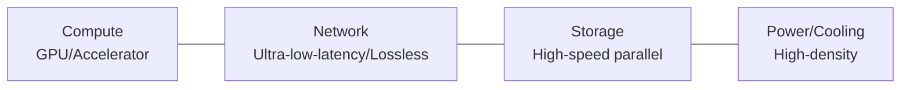

# Data Center Construction Technology for Large-Scale AI Services

## 1. Overview

### A. Definition
> An AI-specialized data center that, for the training and inference of hyperscale AI (LLMs), **connects thousands to tens of thousands of GPUs/accelerators over an ultra-low-latency, high-bandwidth network** and is equipped with high-density power and cooling; it is often also called an **AI Factory**.

### B. Background and Necessity
As LLM parameters and training data have exploded, models can no longer fit on a single GPU, let alone a single server. Thousands of GPUs must **train a single model in a divided manner (distributed training)**, and here the GPUs exchange gradients at every step, so **the communication speed among GPUs governs the overall training speed**. In other words, the core challenge of an AI data center is not computation but "**communication bottleneck, power, and heat**." A general IDC cannot handle the GPU density (tens of kW per rack), heat, and ultra-high-speed communication, so a separate AI-dedicated infrastructure design was required.

## 2. Core Requirements

An AI data center must have four elements in balance, and if any one is a bottleneck, expensive GPUs sit idle. The **network** in particular is decisive, because if the time GPUs wait for communication is long during distributed training, the utilization of compute units (MFU) plummets.

| Requirement | Content |
|---|---|
| Compute | GPU/NPU/TPU clusters, high-density integration |
| Network | Ultra-low-latency/lossless — communication governs training performance |
| Storage | Large-capacity, high-speed parallel file system (checkpoints) |
| Power/Cooling | Tens of kW per rack, immersion/liquid cooling |

Because a single checkpoint reaches several TB and must be saved and recovered frequently, high-speed parallel storage (e.g., Lustre, GPFS) is also essential.

## 3. Low-Latency and Scaling Technologies (A)

GPU-to-GPU communication is optimized at two layers. **Within a node**, GPUs are directly connected by a dedicated link far faster than PCIe, and **between nodes**, an ultra-low-latency network that bypasses the CPU is used. Because going through the CPU increases latency, the core principle is **RDMA (Remote Direct Memory Access)**, which directly accesses remote GPU memory without CPU intervention.

| Technology | Principle/Description |
|---|---|
| **RDMA (RoCE)** | Low latency via direct memory transfer without CPU intervention |
| **InfiniBand** | Lossless, ultra-low-latency interconnect (HPC standard) |
| **NVLink/NVSwitch** | Ultra-high-bandwidth direct connection among GPUs within a node |
| **GPUDirect** | GPU communicates directly with the network and storage |
| **Collective communication (NCCL)** | Optimizes distributed-training communication patterns such as All-Reduce |

Distributed training combines three parallelisms (3D parallelism) depending on how the model and data are split. Each solves a different problem.

| Parallelism | Principle | Problem Solved |
|---|---|---|
| **Data parallelism** | Split the batch, each GPU processes then All-Reduce gradients | Improve training speed |
| **Model/Tensor parallelism** | Split layers and matrix operations across GPUs | Model exceeds GPU memory |
| **Pipeline parallelism** | Pipeline layers stage by stage | Memory/efficiency of deep models |

For example, a GPT-class model splits one layer across multiple GPUs with tensor parallelism, places groups of layers on nodes with pipeline parallelism, and layers data parallelism on top to run thousands of GPUs simultaneously. The communication volume here is enormous, so without InfiniBand and NVLink, scaling is impossible.

## 4. DCI (Data Center Interconnect) Technology (B)

> Technology that connects geographically distributed data centers with **ultra-high-speed, low-latency optical transmission** to realize capacity expansion, disaster recovery, and load balancing.

Because a single data center's power and space have limits, DCI, which bundles several DCs as if they were one, is needed. Because one must send as much data as possible over a single strand of optical fiber, **DWDM**, which loads data onto different wavelengths (colors) and transmits them simultaneously, is the foundational technology.

| Technology | Principle/Description |
|---|---|
| **DWDM** | Large-capacity transmission over a single optical fiber via wavelength-division multiplexing |
| **OTN** | Optical transport network standard, large-capacity/low-latency backbone |
| **Coherent optical transmission** | 400G/800G long-distance high-speed transmission via phase/amplitude modulation |
| **Uses** | Data replication between DCs, disaster recovery (DR), workload distribution, cluster expansion |

## 5. Considerations and Implications
- **Network bottleneck is performance**: Because GPU utilization and training speed are governed by the network, design a non-blocking topology such as **Fat-Tree (leaf-spine)** so that any two nodes have equal bandwidth.
- **Power and carbon**: Because rack density is high, aim for a green data center with **PUE improvement** along with renewable power (RE100) and **immersion cooling**. Power procurement itself becomes a constraint on siting.
- **Next-generation technologies**: Expansion is underway with **CXL and PIM**, which ease the memory bottleneck, and with distributed training spanning multiple DCs.
- **National strategy**: The AI data center is core infrastructure for **Sovereign AI**, and large-scale investment and integration are accelerating from the standpoint of national competitiveness.

---

> **In one line**: A large-scale AI data center *connects GPU clusters with RDMA, InfiniBand, and NVLink at ultra-low latency*, performs distributed training with data, tensor, and pipeline parallelism, and underpins hyperscale AI with DWDM/OTN-based DCI and high-density power and immersion cooling as Sovereign AI infrastructure.
