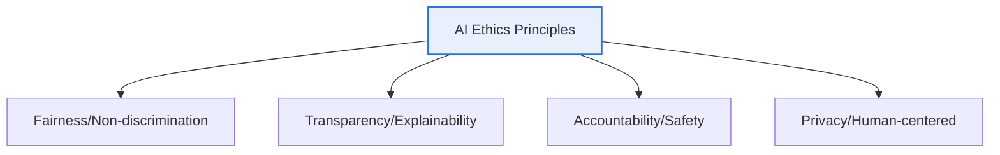
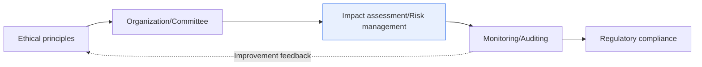

# AI Ethics and Governance Models

## 1. Overview

### A. Definition
> The **ethical principles** to be observed in the process of developing and applying AI, and the **governance system (model)** for effectively managing and regulating AI. Its purpose is the realization of Trustworthy AI.

The reason AI ethics has become especially important is that AI's decisions no longer stay in trivial areas such as recommendation ads but have entered **areas that govern people's lives, such as hiring, lending, healthcare, and criminal justice**. Past the era when good performance was enough, "whether this AI does not discriminate against a particular group (fairness), whether it can explain why it made that decision (transparency), and who is responsible when it goes wrong (accountability)" have become preconditions for adopting AI. Here, if ethical principles define 'what must be observed,' the governance model provides an execution system for 'how the organization and society enforce and manage those principles.' Principles without governance remain a declaration, and governance without principles loses direction.

### B. Background
With the popularization of generative AI, powerful AI became usable by anyone, and problems of bias, misinformation, copyright, and privacy surfaced socially; as regulations such as the EU AI Act and the domestic AI Basic Act strengthened, the preemptive management of AI issues became directly linked to corporate survival.

## 2. Major AI Ethics Principles

The core principles of AI ethics are intertwined. **Fairness** is removing bias in data and algorithms to prevent discrimination; because bias is usually the result of social prejudice already present in the training data being reflected and amplified in the model, it must be checked from the data stage. **Transparency and explainability** is presenting the grounds for why the AI made that judgment (XAI), which becomes a premise for verifying fairness. **Accountability** is clarifying the entity responsible for the result, **safety** is preventing malfunction and misuse, and **privacy and human-centeredness** is protecting personal data and ensuring that a human intervenes in the final decision (Human-in-the-loop).

| Principle | Content |
|---|---|
| **Fairness** | Remove data/algorithm bias, prevent discrimination |
| **Transparency/Explainability** | Disclose judgment grounds (XAI), comprehensibility |
| **Accountability** | Clarify the entity responsible for results |
| **Safety/Robustness** | Prevent malfunction and adversarial attacks |
| **Privacy/Human-centered** | Protect personal data, maintain human oversight |

## 3. AI Governance Models

The governance model is a layered structure that moves ethical principles into actual organizational operation. At the top are **principles and policies** (AI ethics standards, internal guidelines), and to execute these an **organization and system** (AI ethics committee, responsible officer) is formed. Below that, **processes** (AI impact assessment, risk classification/management, auditing) run, and **technology and operations** (XAI, MLOps monitoring, bias/drift surveillance) support them, with the whole aligned to **regulatory response** (EU AI Act, NIST AI RMF, ISO/IEC 42001).

| Layer | Composition |
|---|---|
| **Principles/Policies** | AI ethics standards, internal policies |
| **Organization/System** | AI ethics committee, responsible officer (CAIO) |
| **Processes** | AI impact assessment, risk classification/management, auditing |
| **Technology/Operations** | XAI, MLOps monitoring, bias surveillance |
| **Regulatory response** | EU AI Act (risk-based), NIST AI RMF, ISO 42001 |

## 4. Considerations and Implications

1. **Built-in from the design stage (Responsible AI by Design)** is key. Because the cost of restoring trust is far greater if one responds after a problem erupts, put bias, explainability, and safety into the requirements from the early development stage.
2. **A balance of self-regulation (ethics) and external regulation (law)** is needed. A risk-based approach that strongly regulates high-risk uses (high-risk AI) and leaves low-risk uses to autonomy harmonizes innovation and safety.
3. **Maintaining human oversight (Human-in-the-loop)** is the last safeguard. Especially in high-risk areas, design it so that AI does not monopolize the final decision but a human reviews and takes responsibility.

---

> **In one line**: AI ethics deals with the principles of *fairness, transparency, accountability, privacy, and human-centeredness*, and the governance model executes these through the layers of *principles → organization → impact assessment → monitoring → regulatory compliance*, realizing trustworthy AI through built-in design and human oversight.
