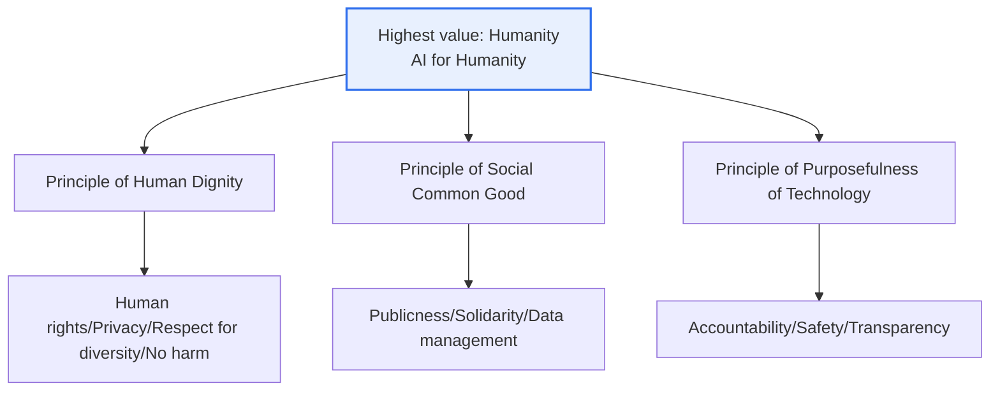
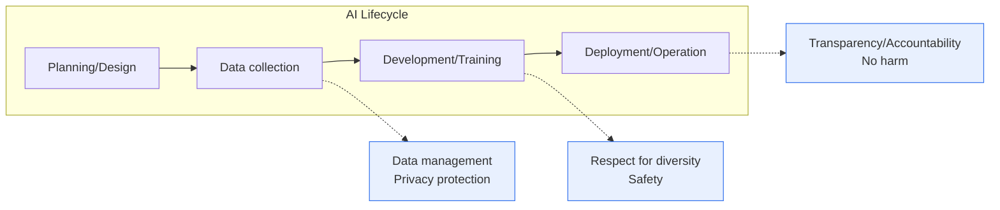

# Artificial Intelligence (AI) Ethics Standards — Three Basic Principles and Ten Core Requirements

## 1. Overview

### A. Definition
> The **National Artificial Intelligence Ethics Standards** were announced (December 2020) by the Ministry of Science and ICT together with the Korea Information Society Development Institute (KISDI). They are a self-regulatory norm presenting the **three basic principles and ten core requirements** for realizing '**Humanity**,' the highest value to be observed throughout the entire process of AI development and use.

The core orientation of these ethics standards is '**AI for Humanity**.' That is, under the grand principle that AI should be not something that replaces or threatens humans but a tool that enhances human dignity and quality of life, the three basic principles and ten requirements are arranged. What is easy to miss in understanding this document is its **normative character**. This is not a mandatory regulation carrying sanctions upon violation, but a soft-law norm that presents a direction for developers, operators, and users to voluntarily practice. Thus it has the character of a **compass** containing the values AI should aim for and the requirements it should observe, rather than a prohibition list of "do not do this."

Also, this standard is designed as a **general principle** not bound to a specific technology or industry. Whether facial recognition, autonomous driving, or generative AI, the level of abstraction was set high so that it can be applied in common regardless of the type of technology. This is a deliberate design intended to avoid the problem, in the AI field where the pace of technological advance outstrips the pace of regulation, of a regulation that pins down a specific technology quickly becoming outdated. Instead, the more abstract it is, the more how it is made concrete in the actual field becomes the key, and this point becomes the background that leads to subsequent guidelines, self-checklists, and the AI Basic Act.

### B. Background
As AI seeped into decision-making across society such as hiring, lending, healthcare, and criminal justice, cases followed in which the **bias** inherent in training data was amplified into discrimination against particular groups, **privacy** was infringed by large-scale personal-data collection, or **safety** was threatened by malfunction of autonomous systems. Representatively, the controversy over overseas hiring and recidivism-prediction algorithms that, trained on biased data, operated unfavorably toward particular races or genders, shattered the conventional belief that 'AI is neutral.' Accordingly, a common national standard was needed to foster a trustworthy AI ecosystem, and in step with the international community's flow of AI ethics discussion in the EU, OECD, and elsewhere, our government also established the National AI Ethics Standards in December 2020.

### C. Status and Scope of Application
This standard applies across the AI lifecycle (planning → data collection → development → deployment → operation → disposal) and broadly posits the applicable entities as **developers and operators (suppliers)** and **users (demanders)**. Because it is not reduced to the responsibility of any single entity but is a social consensus that everyone who makes, serves, and uses AI must observe together, it differs in character from other technical standards.

## 2. The Highest Value and Three Basic Principles — Overall Structure

The three basic principles concretize the grand principle of 'Humanity' from three different directions. Rather than being independent, each is one of three pillars supporting Humanity, holding full meaning only when they work together.

The **Principle of Human Dignity** is that AI must not infringe human life, bodily safety, and fundamental rights, and must treat humans as **ends in themselves**, not as means. Projecting a Kantian view of humanity onto AI, it draws a limit line that no matter how great AI's efficiency, it cannot be used in a direction that instrumentalizes human dignity. For example, indiscriminate facial recognition for social control and surveillance, or automating decisions concerning life while completely excluding human judgment, run counter to this principle.

The **Principle of Social Common Good** is that AI must ensure benefits are evenly distributed to **all members of society**, including minorities and vulnerable groups, and must contribute to the public interest and sustainability. It guards against AI's benefits concentrating in a few and widening the digital divide, or externalizing environmental and social costs. This contains the question of distributive justice: 'for whom is the technology.'

The **Principle of Purposefulness of Technology** is that AI technology must be developed and used for purposes beneficial to humanity, and that the **process and means** of achieving that purpose must also be ethical. It means that unjust data collection or opaque methods cannot be justified merely because the purpose is good. This principle directly connects to the later requirements of accountability and transparency.

| Basic Principle | Core Content | Corresponding Concept |
|---|---|---|
| **Human Dignity** | Protect life/safety/fundamental rights, treat humans as ends | Human rights/Dignity |
| **Social Common Good** | Care for vulnerable groups, public interest/sustainability/closing divides | Distributive justice |
| **Purposefulness of Technology** | Purpose beneficial to humanity + ethical process/means | Legitimacy of purpose/means |

## 3. Ten Core Requirements — Practice Items of the Principles

The ten core requirements are **practice checkpoints** for observing the abstract three principles in the actual development and operation field. As seen in the diagram above, each requirement is rooted in a particular basic principle but actually operates across several principles.

Elaborating each requirement a little further: **human-rights guarantee, privacy protection, and respect for diversity** are the practice of the human-dignity principle, requiring AI to protect human rights and freedoms, protect personal data and private life, and operate fairly without bias. In particular, respect for diversity contains the most practical issue of AI ethics—removing bias in training data and algorithms to prevent discrimination by gender, age, disability, race, and the like. **Prohibition of harm, publicness, and solidarity** are requirements that AI must not cause direct or indirect harm to humans, must orient toward the public interest and social benefit, and must pursue cooperation and coexistence among stakeholders. **Data management, accountability, safety, and transparency** are technical and governance requirements, meaning that data must be managed with quality within its purpose, the entity responsible for results must be clarified, malfunction and risk must be controlled, and the grounds for judgment must be explainable and disclosable.

| Core Requirement | Gist | Related Concept |
|---|---|---|
| **Human-rights guarantee** | Protect human rights and freedoms | Fundamental rights |
| **Privacy protection** | Protect personal data and private life | Personal Information Protection Act |
| **Respect for diversity** | Remove bias/Fairness/Care for diversity | Algorithmic fairness |
| **Prohibition of harm** | Prohibit direct/indirect harm to humans | Safety/Accountability |
| **Publicness** | Pursue public interest/social benefit | Common good |
| **Solidarity** | Stakeholder cooperation/coexistence/intergenerational care | Sustainability |
| **Data management** | Data quality/use within purpose | Data governance |
| **Accountability** | Clarify the entity responsible for results | AI governance |
| **Safety** | Control malfunction/risk, robustness | AI reliability |
| **Transparency** | Explainability/Information disclosure | XAI |

## 4. Comparison and Positioning — Relationship with International Norms

Our National AI Ethics Standards are in line with the international community's flow while differing in emphasis. The **OECD AI Principles (2019)** present inclusive growth, human-centered values, transparency, robustness, and accountability, and the **EU's Ethics Guidelines for Trustworthy AI (2019)** list seven requirements: human oversight, technical robustness, privacy, transparency, diversity, societal well-being, and accountability. All three norms share the common skeleton of 'human-centeredness, transparency, accountability, and fairness.' However, our standard is characterized by placing the single highest value of '**Humanity**' at the apex and hierarchizing it into three principles and ten requirements, and by making it clear from the outset that it is a self-regulatory norm.

The reason for this difference and its practical implications are as follows. The EU moved early toward mandatory regulation (risk-based differentiated regulation) called the **AI Act**, imposing fines upon violation, whereas we chose a strategy of starting with a self-regulatory norm to minimize industry contraction and gradually taking legislative steps. As a result, the point was repeatedly made domestically that a self-regulatory norm alone lacks effectiveness, and this led to the enactment of the AI Basic Act discussed below. In other words, one should understand the ethics standards as 'a declaration of values' and the AI Basic Act as 'the enforcement of implementation,' in a complementary relationship.

## 5. In Depth — From Self-Regulatory Norm to the AI Basic Act

The most important subsequent flow of the National AI Ethics Standards (2020) is **legislation**. Amid a consensus that voluntary practice alone makes it hard to effectively address problems of bias, safety, and transparency, the "**Framework Act on the Development of Artificial Intelligence and Establishment of a Foundation for Trust**" (abbreviated **AI Basic Act**) was enacted and is set to **take effect in January 2026**. This law inherits the values of the 2020 ethics standards while regulating the obligations of businesses (risk management, explanation, labeling, ensuring safety, etc.) for '**high-impact AI**' that critically affects citizens' life, safety, and fundamental rights, and for generative AI, thereby having the character of an implementation norm going beyond a self-regulatory norm. It is being made concrete through opinion-gathering procedures for its subordinate norms—the enforcement decree and guidelines (securing transparency and safety, obligations of high-impact AI businesses, etc.).

Meanwhile, the government is also pursuing a revision of the 2020 ethics standards themselves to match the changes of the times. New AI ethics principles are being prepared that reflect new technological trends such as agentic AI (autonomous agents that plan and act on their own) and physical AI (combined with the physical world, such as robots and autonomous driving), as well as the changed policy conditions after the AI Basic Act takes effect. This shows that an ethics norm must be **continuously updated** in step with technological advance rather than being 'made once and done.' From a professional engineer's perspective, when composing an answer on this topic, one can differentiate it by drawing the evolution axis of "2020 self-regulatory norm (declaration of values) → self-checklists and guidelines (concretization) → AI Basic Act (enforcement of implementation, effective 2026) → revision of ethics principles (reflecting new technologies)," connecting up to the latest trends. It is effective to study this bundled with related topics: AI reliability ([[ai-trustworthiness]]), AI governance ([[ai-ethics-governance]]), the AI privacy self-checklist ([[ai-privacy-checklist]]), and the ISO/IEC 42001 AI management system ([[iso-42001-ai-management-system]]).

## 6. Considerations and Implications

1. **The flow from self-regulatory norm to legislation must be understood integratively.** The National AI Ethics Standards (2020) orient toward voluntary practice, but with the EU AI Act and the domestic AI Basic Act (effective January 2026), an implementation norm has been prepared and effectiveness is being strengthened. One should grasp the ethics standards as a declaration of values and the Basic Act as enforced implementation, in a complementary relationship.
2. **Built-in from the design stage (Ethics by Design) is key.** Substantive compliance is possible only when transparency, fairness, safety, and privacy are reflected as requirements from the early development stage rather than checked after the fact. This follows the same principle as PbD in personal data protection ([[privacy-by-design]]), because the cost of adding on later is far greater than the cost of designing from the start.
3. **Abstract principles must be made concrete into executable procedures.** Because the ten requirements are abstract in themselves, they must be translated into concrete controls such as the organization's AI governance system, AI impact assessment, self-checklists, model documentation (model card), and bias testing. In particular, respect for diversity and transparency become verifiable only when supported by bias-measurement metrics and explainable AI (XAI) techniques.
4. **The responsible entity and governance system must be clarified.** If it is unclear who among developers, operators, and users bears what responsibility when harm from AI malfunction or discrimination occurs, the requirements become hollow. It is required to institutionalize the accountability requirement into intra-organizational decision authority, an oversight structure, and incident-response procedures.
5. **Outlook: continuous updating responding to new technologies is needed.** Because the aspects of risk change with the emergence of generative AI, agentic AI, and physical AI, the ethics norm must also be revised repeatedly to reflect them. The professional engineer must possess not the ability to memorize a specific point's provisions but the ability to interpret and apply the changing regulatory landscape around the invariant value of Humanity.

## References
- Ministry of Science and ICT, "National Artificial Intelligence Ethics Standards" (December 2020) press release and full text: https://www.msit.go.kr
- "AI Ethics to Observe When Making and Using AI... Self-Regulatory Norm, Not Regulation" (Financial News, 2026): https://www.fnnews.com/news/202608141218124650
- "AI Basic Act, Effective 2026... Obligations for High-Impact AI/Generative AI" (Peekaboo Labs): https://peekaboolabs.ai/blog/ai-basic-law-guide
- Legislative notice of the AI Basic Act enforcement decree (Lexology): https://www.lexology.com/library/detail.aspx?g=790de95e-d2c2-4504-ab14-4d399c8f69c9

---

> **In one line**: The National AI Ethics Standards (December 2020) are a self-regulatory norm that, with 'Humanity (AI for Humanity)' as the highest value, present the three basic principles of *human dignity, social common good, and purposefulness of technology* and ten core requirements such as human-rights guarantee, privacy, respect for diversity, and transparency; they are practiced through built-in design (Ethics by Design) and linkage with AI governance, and the implementation norm is strengthened by the AI Basic Act (effective January 2026) and continuously updated to match new technologies.
