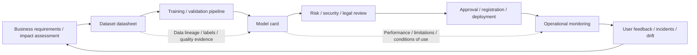
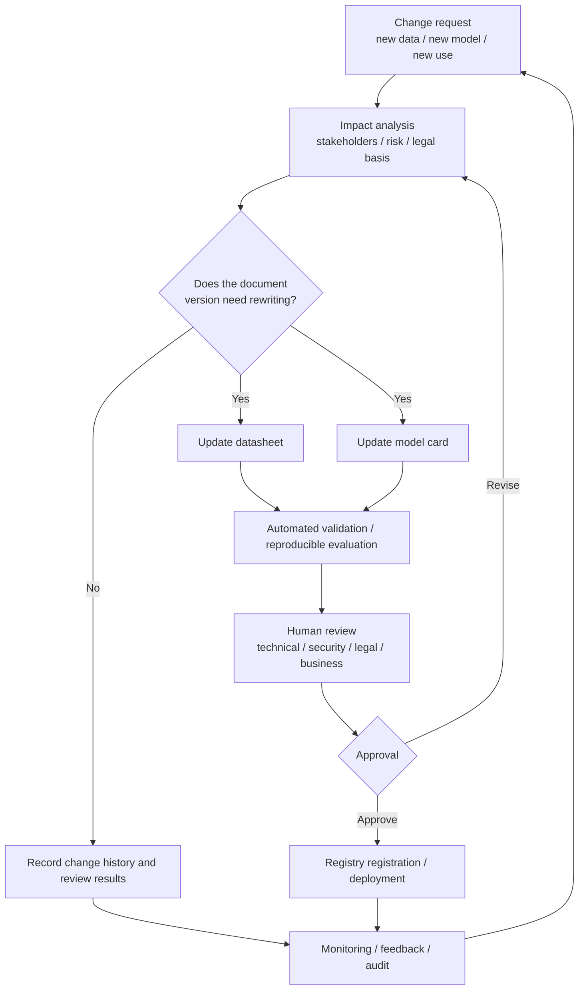

# AI Transparency Based on Model Cards and Dataset Datasheets

## 1. Overview

> **Definition**: An AI model card is a document that records the purpose, performance, scope of application, limitations, risks, and evaluation conditions of a trained and deployed model, while a dataset datasheet is a document that records the creation, collection, composition, intended use, quality, bias, and constraints of a dataset.

The reason it is difficult to explain the quality of an AI system with accuracy alone is that a model's behavior is determined by the combination of data, training procedures, evaluation environment, and operational context. Even the same model can perform differently across populations, languages, lighting conditions, or business processes that differ from its training data. Therefore, a single number such as "we achieved a certain percentage of accuracy" cannot determine usability or risk.

Model cards and datasheets convert this black-box problem into a problem of documentation and accountability. A model card helps model consumers decide in which situations the model should be used and in which situations it should not. A datasheet allows data producers and consumers to jointly review the source and composition of the data, any omissions, the labeling method, and the social impact.

The core of these documents is not in producing them as a formality. To have real value, the items in the document must be linked to data lineage, experiment records, the model registry, approval procedures, and monitoring results. A hand-written declaration tends to become outdated by the time of deployment, but a bundle of evidence that is automatically generated in the pipeline and reviewed by an accountable party becomes part of operational control.

Google Research's model card proposal presented the direction of disclosing both the intended use of a model and its performance under diverse conditions and subgroups. Research on dataset datasheets raised the need for standardized questions that describe how a dataset was created and what characteristics and potential distortions it has. The two documents are not substitutes for each other but complements that describe both the data side and the model side.

A professional engineer should not view model cards and datasheets merely as supplementary documents of AI governance, but should design them as control points across the AI system lifecycle that runs from requirements analysis to decommissioning. The operating model must include who authors the documents, the approval criteria, the conditions for re-review upon change, the scope of external disclosure, and the level of privacy protection.

## 2. Overall Structure of Transparency Documents

AI transparency is neither an activity of disclosing only the data source nor an activity of disclosing only the model architecture. It is an activity of providing the information necessary and fit for purpose so that affected stakeholders can understand risks, raise objections, and judge whether use is appropriate. Researchers, developers, procurement officers, business users, auditors, regulators, and affected citizens each require different levels of information.

Instead of delivering the same text to all these stakeholders, model cards and datasheets design role-specific expressions and disclosure scopes around common facts. Detailed dataset versions, experiment logs, security vulnerabilities, and the legal basis for personal data processing can be kept internally, while safe summaries and conditions of use are provided externally. However, public documents must not contradict internal documents, and the reasons for non-disclosure and the responsibility for review must also be recorded.

In the flow above, the datasheet is not a document written only once before model training. When a dataset is added, a labeling policy changes, or the collection region expands, a new version must be created. Likewise, a model card must be updated after impact analysis not only when model parameters change but also when the inference prompt, preprocessing, thresholds, safeguards, or intended audience change.

To link documents and systems, each document is assigned a unique identifier and version. Making `dataset_id`, `dataset_version`, `model_id`, `model_version`, evaluation run IDs, and approval tickets reference one another makes it possible to reproduce which model was based on which data and experiment results. Managing versions by filename alone weakens audit evidence, because a file with the same name can be overwritten.

Transparency is evaluated not by the volume of disclosure but by the fitness of information for decision-making. Even without disclosing all trade secrets, one can clearly present the prohibited use areas of a model, known errors, methods of oversight, and channels for objection. Conversely, disclosing dozens of pages of tables while failing to explain the cases that are dangerous to actual users amounts to nothing more than formal transparency.

## 3. Structure and Authoring Principles of a Model Card

### a. Model Identification and Intended Use

The starting point of a model card is the model name, version, owning organization, responsible person, release date, base model, and license. Identifying only the model parameters is not sufficient; the tokenizer, preprocessing, postprocessing, prompt templates, search index, and safety filters—components that affect the result—must also be included in scope. This is because an operational model is not a single training artifact but a deployment unit that includes the surrounding components.

Intended use is not written abstractly, as in "a classification model." One describes concretely the input target, the users, the position of the output in decision-making, the level of automation allowed, and the conditions under which a human must review. For example, an assistive model that classifies customer inquiries by priority and a model that automatically decides loan approvals are the same classification problem, yet the acceptable errors and level of control differ.

Prohibited or non-recommended uses are recorded with the same importance. If the training data is skewed toward a particular language and region, the model should not be used for the automatic adjudication of legal documents in another language. In high-risk areas related to human safety, employment, credit, and welfare, the principle that model output does not replace the final decision, along with the exception approval procedure, must be specified.

### b. Performance and Evaluation Conditions

The performance table records, together, the metric names, evaluation data version, sampling method, baseline, confidence interval or variability, and evaluation period. Unless it is explained in a business context what accuracy, precision, recall, F1, and AUROC mean, comparing numbers creates misunderstanding. Presenting only accuracy on imbalanced data can hide errors in minority classes.

The overall average is separated from subgroup performance. Axes where differences in results are a concern—such as gender, age, region, language, disability, device, and channel—are defined in advance, and evaluation is done at an aggregation level that does not re-identify individuals. When additionally disclosing subgroups, one confirms that the sample size is not so small that individuals could be inferred, and also displays the statistical uncertainty.

Scores on offline benchmarks and actual operational performance can differ. The input from real users has a different distribution from the training and evaluation data, and the way users report model errors also affects the results. Therefore, the model card distinguishes offline performance from operational monitoring metrics, and sets a re-evaluation cycle and a suspension criterion after deployment.

### c. Limitations, Risks, and Safeguards

Limitations are written as failure conditions and impacts rather than the sweeping sentence "may not be perfect." One presents observable situations such as an image model's errors in dark environments, a speech model's degraded recognition of dialects, a generative model's unfounded responses, and a classification model's failure to detect new types. Where possible, representative error cases and their reproduction conditions are linked to internal evidence.

Risk arises not only from errors of the model itself but also from the way the model is inserted into business processes. There are cases where business users misinterpret a probability score as a definitive judgment, where an organization mass-automates a model's recommendations without review, or where an attacker manipulates input to bypass safeguards. A model card must be read together with operational procedures, separation of privileges, human review, logging, and objection handling.

Safeguards must be verifiable controls, not declarations in a model card. One defines who operates each of the following: input validation, masking of sensitive information, prompt/output filters, uncertainty thresholds, refusal responses, human approval, audit logs, and rollback models. The conditions for switching to deployment suspension and incident response when a control fails must also be specified.

| Area | Key questions to record in the model card | Operational evidence |
|---|---|---|
| Purpose | Whose work, and to what level, does it support? | Requirements / approval scope / user guidance |
| Data | With what data and preprocessing was it trained and validated? | Datasheet / lineage / quality report |
| Performance | Under what conditions does what degree of error occur? | Reproducible evaluation runs / subgroup metrics |
| Safety | What misuse and attacks were considered? | Red team / security testing / control logs |
| Operations | When to re-evaluate, suspend, or roll back? | Monitoring dashboards / incident tickets |

The items in the table are both a document table of contents and approval checkpoints. Do not regard a model card as complete just because the performance values are filled in; one must link the location of evidence that can be verified in actual operation. In particular, a model whose risk and operations sections are empty may be kept for research, but must not be auto-approved for business services.

## 4. Structure and Authoring Principles of a Dataset Datasheet

### a. Motivation, Composition, and Collection Process

A datasheet first explains why the dataset was created, before its name and size. It records whether the original purpose was research or a commercial service, which users it was intended for, and which uses were not considered. When the purpose changes, one should not treat it as simple reuse of the same dataset, but re-examine fitness for purpose along with rights and risks.

Composition items include the number of records, file format, definitions of variables and labels, missing values, duplicates, time range, regional coverage, language, and domain. Beyond simple statistics, one also describes the groups the data does not represent and situations that were not observed. Because the absence of data leads to a model's limitations, "unknown" is also important metadata.

The collection process traces the source, time of collection, collection tools, consent or basis for use, filtering rules, labelers, and quality control methods. If a public dataset was reprocessed, one records the original version, transformation code, items removed or added, and license conditions. When a vendor provides data, the contractual possibilities for reuse, audit, and deletion are also within the scope of the datasheet.

### b. Labels, Quality, and Bias

A label may not be an objective ground truth but an observation with its own definition and judgment process. One records the labeling guide, labeler qualifications, handling of disagreements among multiple labelers, treatment of ambiguous cases, and results of quality sample inspection. If automatically generated labels or weak supervision were used, the possibility of error propagation and the refinement method are also disclosed.

Quality is examined from the perspectives of completeness, accuracy, consistency, timeliness, uniqueness, and representativeness. Even if the missing-value rate is low, a fairness problem remains if the missingness is concentrated in a particular group. Even if the deduplication rate is high, incorrectly removing time-ordered or source-specific duplicates can eliminate important events.

Bias analysis is not a matter of declaring that a dataset is "free of bias." It is a process of recording by what criteria representativeness was evaluated, which groups and situations could not be included, and how those limitations are reflected in the conditions of model use. In public documents, one handles sensitive attributes carefully, but strikes a balance between aggregation/de-identification and explanation so that privacy protection is not used as grounds for hiding risk.

### c. Rights, Security, and Retention

A datasheet includes copyright, personal data, trade secrets, likeness/voice/location information, and contractual use restrictions. Legal usability does not mean technical accessibility. Being downloadable does not by itself permit training or redistribution, so one records the basis confirmed by legal counsel and the data protection officer.

On the security side, one considers malicious files, prompt-injection data, data poisoning, hijacking of vendor accounts, and leakage of training data. One verifies versions with hashes and signatures, separates access privileges for originals and refined copies, and applies least privilege and retention periods to data containing sensitive information. If there is a public release and an internal original of a dataset, one explains their relationship and differences.

Retention and deletion continue even after model training. When a request to delete original data arrives, one must decide whether model retraining is needed, how to handle derived features and caches, and when it disappears from backups. Recording these procedures in the datasheet makes it possible to reconcile the conflict between the rights of data subjects and the reproducibility needs of the model operator.

## 5. Authoring, Validation, and Deployment Process

Document authoring is not deferred to a report task at the end of the project. In the requirements phase, one defines the intended and prohibited uses; in the data preparation phase, one drafts the datasheet. In the training phase, one records experiment IDs and model versions, and in the evaluation phase, one jointly verifies performance, fairness, robustness, and security.

Automated validation must go beyond checking whether a link exists. One checks whether the model version in the document matches the version in the registry, whether the evaluation data version matches the run record, and whether the prohibited-use areas are reflected in the service configuration. If the label schema recorded in the datasheet differs from the schema of the actual training pipeline, one makes it fail before approval.

Human review is not a procedure to polish the document's wording but a procedure to distribute responsibility. The data owner reviews source and quality, the model developer reviews performance and limitations, the security officer reviews attacks and controls, the legal/privacy officer reviews rights and disclosure, and the business owner reviews actual impact and objection handling. Each reviewer must record the scope and conditions of their approval.

After deployment, one confirms whether the assumptions recorded in the documents still hold. One monitors data distribution, error rates, subgroup gaps, refusal rates, the human override rate, user reports, and security events. If thresholds are exceeded, one decides in advance which response to take—re-evaluation, alert, partial suspension, or full rollback.

## 6. Comparison and Linkage of Model Cards and Datasheets

A model card explains a model's behavior and conditions of use, while a datasheet explains the source, composition, and creation context of the data. The former is closer to the model consumer and the latter closer to data producers/managers and model developers, but to explain actual risk one must read both documents together.

For example, if a model card records low performance for a particular language and the datasheet shows that training samples for that language are insufficient, one can connect the cause and the direction of mitigation. Conversely, even if the performance in the model card is high, if the datasheet shows an unclear scope of consent or records social bias in the labels, it is not sufficient grounds to approve commercial deployment.

| Category | Model card | Dataset datasheet | Linking question |
|---|---|---|---|
| Primary target | Trained / deployed model | Training / evaluation dataset | On what data is this model based? |
| Core focus | Performance / limits / use / risk | Source / composition / labels / rights | Are data characteristics connected to model errors? |
| Key versions | Model / pipeline version | Data / schema / label version | Can the combination of the two versions be reproduced? |
| Accountable party | Model / service owner | Data owner / collector / manager | Who approves changes? |
| Update conditions | Model / config / use change | Data / purpose / rights change | Has the impact of the change been re-evaluated? |

Merging the two documents may look concise, but it easily loses the fact that the details of data sources and the details of model deployment controls have different readers. It is practically advantageous to link them in a single portal while keeping the documents separate, and to express the relationship with common IDs and links. For sensitive source information, one provides different views according to permissions, while making non-disclosure decisions and public summaries auditable.

## 7. Application Case: A Financial Advisory Assistant Model

Assume that a financial institution introduces a generative model that summarizes customer consultation content and recommends explanations of related products. This model does not decide loan approvals itself but assists the work of consultants; however, if it outputs incorrect interest rates, eligibility conditions, or customer personal information, it can cause customer harm and regulatory risk. The model card's intended use permits only consultation summaries and internal search assistance, and excludes the use of providing definitive financial advice directly to customers.

The datasheet records the period, channel, and language of consultation records, the anonymization method, the labelers' summary criteria, and the validity period of product documents. Because including outdated product terms in the training data can cause the model to state past conditions as if they were current, the data version and document validity period must be verified in the retrieval step. If personal-data masking is applied only to resident registration numbers and misses account numbers, addresses, and descriptions of rare incidents, re-identification risk remains.

The model card's evaluation includes summary faithfulness, omission rate, sensitive-information exposure rate, accuracy of product-condition retrieval, appropriateness of refusal responses, and the consultant's revision rate. Beyond the overall average, results for elderly customers, atypical utterances, dialects, and each consultation channel are analyzed separately. If the rate at which consultants copy the model output verbatim rises, human review has become a formality, so training and screen design must be changed together.

In operation, a retrieval-augmented architecture is used so that answers are based on the latest product documents, and the version and citation location of the source documents are displayed on the screen. If the model cannot find supporting evidence, it does not give a speculative answer but asks the consultant to verify. For items highly likely to change, such as interest rates and eligibility, the business boundary is set so that the result of a rules/lookup API takes precedence over the model's free generation.

In this case, the success of the documents is evaluated not by the number of sentences in the card and datasheet but by incident response capability. When a wrong recommendation is reported, one must be able to reproduce which data, model, prompt, and product document were used, estimate the affected customers, and suspend that version. If the document IDs are not linked to logs, root-cause analysis and responsible notification are delayed.

## 8. Quality Metrics and Control Design

Document quality can be evaluated along five axes: completeness, accuracy, timeliness, traceability, and understandability. Completeness means whether the required items are filled in; accuracy means whether the values in the document match the actual system; timeliness means whether it is updated within a set deadline after a change; traceability means whether one can move to the supporting evidence and run records; and understandability means whether even a non-expert can judge the risk.

An organization can operate the following metrics on a dashboard. First, the proportion of approved models that have the latest card linked. Second, the linkage rate of operational models to their datasheets and evaluation runs. Third, the proportion of re-evaluations completed within the deadline after a change. Fourth, the number of discrepancies between the declarations in the documents and the actual monitoring metrics. Fifth, the time taken to reproduce the causing model and dataset in a model-related incident.

Auto-generating documents to raise metrics improves formal completeness but does not guarantee meaningful explanation. One distinguishes auto-generated items from items that require human judgment. Training-data hashes, evaluation figures, and run timestamps are automatically extracted, while the intended use, prohibited use, social impact, and residual risk must be described and approved by the accountable party.

Access privileges are also differentiated. A public document may contain the safety information users need, an internal document the operational/security/contractual details, and a restricted document personal data and vulnerability evidence. However, access restriction must not become a way to hide the very existence of a document, and one preserves metadata on who restricted it, when, and for what reason.

## 9. Deep Dive: Linking to AI Governance and Professional Engineer Answers

The NIST AI RMF presents the characteristics of trustworthy AI as valid and reliable, safe, secure and resilient, accountable and transparent, explainable and interpretable, privacy-enhanced, and fair with harmful bias managed. Model cards and datasheets are not a single solution that implements these characteristics, but they can be practical means of connecting the assumptions, evidence, and accountable party for each risk.

The transparency and responsible disclosure direction of the OECD AI Principles should be understood as providing meaningful information appropriate to the situation, rather than as a mandate to disclose all internal information. In high-risk systems, affected people must know the reasons for outcomes and the channels for objection, and organizations must be able to track changes and incidents. Therefore, one designs the purpose and scope of public documents, internal audit documents, and documents submitted to regulators.

In a professional engineer exam answer, writing about model cards and datasheets only as "AI ethics documents" lacks depth. One should expand the problem into a linked problem across data governance, MLOps, quality management, privacy protection, security, and IT service operations. Presenting data lineage and the model registry, CI/CD gates, bias/robustness evaluation, and monitoring and incident response as a single lifecycle architecture allows one to explain both technical feasibility and managerial accountability.

Likely points of discussion include the conditions of use for generative AI and foundation models, the supply chain of external models and data, the reliability of automated document generation, re-approval upon model updates, personal-data deletion requests and retraining, and the balance between explainability and trade secrets. For each, one constructs the answer centered on "what risk judgment does it enable and with what evidence is it verified" rather than "what to disclose."

## 10. Considerations and Implications

### a. Documentation Centered on Purpose and Impact

Rather than distributing document templates first, one first identifies the decisions and stakeholders that the AI affects. Even for the same model, the level of control applied to internal search assistance and to adjudicating welfare recipients must differ. The purpose of use, prohibited purposes, and points of human intervention must be included in the approval criteria.

### b. Balance Between Automation and Human Review

Repetitive items such as metrics and versions are auto-generated in the pipeline to reduce omissions and typos. On the other hand, the social impact of bias, residual risk, and prohibited uses are not approved by automatic sentence generation alone. To prevent document automation from becoming a means of evading responsibility, one separates the author from the approver.

### c. Traceability of Data, Model, and Service

One links model cards and datasheets to the model registry, data catalog, experiment tracking, deployment pipeline, and logs. When a problem occurs, one must be able to reproduce not only the model version but also the input schema, prompts, retrieved documents, and policy version. Common identifiers and lineage for change-impact analysis are the core.

### d. Harmonizing Privacy and Disclosure

Disclosing original data to increase transparency can heighten privacy and security risks. Instead of the original, one provides aggregation/de-identification/samples/statistical summaries, and reviews re-identification possibility and small-sample problems. For information that is not disclosed, one records the reason, protection period, and review responsibility to manage the gaps in transparency.

### e. Supply Chain and External Model Control

When adopting external datasets and pre-trained models, one does not trust the vendor's explanation alone but verifies the contract, versions, license, reproducibility of evaluation, and vulnerability notification. If an external model has no card or its content is insufficient, one supplements the risk through in-house evaluation and use restrictions. When a supply chain change occurs, the internal model card and the service impact assessment are also updated.

### f. Continuous Re-evaluation and Accountability

A model card is both a document for release approval and a criterion for deciding operational suspension and retraining. One registers distribution change, performance degradation, subgroup gaps, security incidents, and changes in laws/policies as re-evaluation triggers. An organization does not stop at archiving documents but must audit whether the documents' warnings are reflected in actual deployment, use, and incident response.

## References

1. Google Research, "Model Cards for Model Reporting", https://research.google/pubs/model-cards-for-model-reporting/
2. Timnit Gebru et al., "Datasheets for Datasets", Stanford AI Lab PDF, https://ai.stanford.edu/~tgebru/papers/datasheets.pdf
3. NIST, "Artificial Intelligence Risk Management Framework (AI RMF 1.0)", https://nvlpubs.nist.gov/nistpubs/ai/NIST.AI.100-1.pdf
4. NIST AI Resource Center, "AI Risks and Trustworthiness", https://airc.nist.gov/airmf-resources/airmf/3-sec-characteristics/
5. OECD, "AI Principles", https://www.oecd.org/en/topics/ai-principles.html

---

> **In one line**: A model card explains a model's use, performance, and risks, while a datasheet explains the source, quality, and rights of the data; when the two documents are linked to the lifecycle, lineage, and monitoring, AI transparency turns into real accountability and control.
