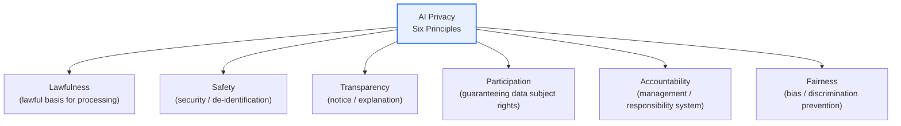
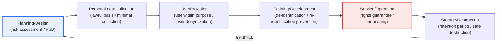

# AI Privacy Self-Assessment Checklist

## 1. Overview

### a. Concept

> The **AI Privacy Self-Assessment Checklist** is a guideline prepared by the Personal Information Protection Commission (PIPC). It is a self-regulatory norm that enables businesses to **check for themselves whether they process personal data lawfully and safely throughout the entire process of planning, developing, and operating AI services**. The PIPC established and published it in May 2021, rearranging the key obligations and recommendations under the Personal Information Protection Act to match the business-processing stages of AI so that businesses can voluntarily confirm their compliance.

The fundamental reason this checklist is needed lies in the fact that "**AI learns from and utilizes vast amounts of personal data, and it is difficult to capture new risks with existing rules alone**." AI achieves performance by learning from enormous amounts of data. That data readily contains large amounts of personal information, and during training and inference, information may be processed in ways the data subject did not anticipate (use beyond purpose), individuals may be re-identified from training data, or biased outcomes may create discrimination. For example, in 2020 a domestic conversational AI service failed to sufficiently pseudonymize/de-identify the conversations and personal information of actual users that were included in the training data, which led to a PIPC investigation and the imposition of penalty surcharges and fines. This case revealed that when the lawfulness at the data collection stage and the de-identification at the training stage are inadequate, it can escalate into a large-scale breach immediately after service launch. Such privacy risks specific to AI are hard to prevent through after-the-fact regulation alone.

Therefore, rather than dampening AI innovation with mandatory regulation, the purpose of the self-assessment checklist is to encourage businesses to check and manage privacy risks on their own from the development stage. The law sets minimal mandatory norms, but AI technology evolves faster than the pace of legal amendment. Accordingly, for detailed technologies, "what needs to be checked" is provided in checklist form, allowing businesses to implement it flexibly according to the characteristics of their own services. It is an approach that seeks to harmonize innovation and protection by having businesses check for themselves whether they are upholding privacy principles (lawfulness, transparency, safety, etc.) at each stage of the AI lifecycle (planning → data collection → training → service → management).

This is also a practice of "Privacy by Design," which embeds privacy protection principles into the design. In other words, it is a philosophy of shifting privacy protection from after-the-fact response (measures after a problem erupts) to prior design (embedding it into the architecture and processes so problems do not arise), and the self-assessment checklist concretizes that practical tool into stage-by-stage checkpoints. [[privacy-by-design]]

### b. Background and Purpose

Three currents overlap in the background of the self-assessment checklist's emergence. First, with the amendment of the "Three Data Acts" (2020), the concept of pseudonymized information was introduced and the legal basis for utilizing AI training data was arranged, but in practice there was great confusion among businesses over "how far is lawful." Second, as conversational and recommendation AI rapidly spread into real services, new types of risk such as re-identification of training data and use beyond purpose materialized. Third, as the EU and the international community prepared AI regulations (such as the EU AI Act discussed later), the need for preemptive guidelines was also raised domestically. In this context, the PIPC issued the self-assessment checklist as a soft-law norm at the pre-mandatory-regulation stage.

The purpose is clear. It is to **harmonize AI innovation and privacy protection by having businesses preemptively diagnose and prevent the risk of privacy breaches during the AI development and operation process**. The ultimate aim is to secure the trust of data subjects while minimizing the compliance burden, thereby ultimately enhancing the sustainability of AI services.

## 2. Basic Principles (Six Principles)

The self-assessment checklist presents privacy protection principles as six, tailored to the AI context. Each principle is not independent but works in interlock with the others. The table below is an auxiliary aid for comparison and organization, and "why" each principle is needed is explained in the paragraphs that follow.

| Principle | Content | AI-specific implication |
|---|---|---|
| **Lawfulness** | Securing a lawful basis for collecting and using personal data | Legitimacy of the basis for crawling / public-data training |
| **Safety** | Safety measures such as pseudonymization/anonymization and access control | Preventing re-identification of training data |
| **Transparency** | Notice of processing facts and purpose, explanation of automated decisions | Algorithmic explainability (XAI) |
| **Participation** | Guaranteeing data subject rights such as access, correction, and deletion | Right to demand deletion of training data (right to be forgotten) |
| **Accountability** | A management and responsibility system for the entire processing process | AI governance / DPO designation |
| **Fairness** | Processing free of bias and discrimination | Mitigating data and model bias |

**Lawfulness** is the starting point of all processing. What is especially at issue in AI training is the use of web crawling and public data; the mere fact that something is "publicly available" does not justify unlimited training. If it goes beyond the purpose for which the data subject made it public and the range reasonably foreseeable, it can be unlawful, so the basis for collection (consent, statute, legitimate interest, etc.) must be managed at the level of individual training-data units.

**Safety** takes concrete form in AI as preventing re-identification. Even if pseudonymization is done, an individual may be identified when combined with other information (linkage attack), and the phenomenon of a model memorizing and outputting training data verbatim (memorization) can reproduce the original. Therefore, de-identification measures must be continuous management that considers even linkage risk and model-output risk, not a one-time act.

**Transparency, participation, accountability, and fairness** are the trust axes with the data subject. For an automated decision (e.g., an AI loan-screening rejection), one explains its basis (transparency), enables the data subject to raise objections and demand deletion of their own data (participation), takes organizational responsibility for this (accountability), and filters out bias unfavorable to a particular group (fairness). If these four principles collapse, social acceptance is lost even if the system is technically safe.

## 3. Stage-by-Stage Assessment Flow Across the AI Lifecycle

The self-assessment checklist arranges assessment items according to the lifecycle (business-processing stages) of an AI service. The PIPC roughly composes this as a flow running from planning/design → personal data collection → use/provision → storage/destruction → service management/supervision → user protection, and presents stage-specific assessment items and detailed check points (on the order of dozens). At each stage, the business confirms for itself the lawfulness and safety of personal data processing.

**a. Planning/Design stage.** The core of this stage lies in "deciding now what will be hard to fix later." Once the service architecture is fixed, the cost of changing personal-data flows soars, so a Privacy Impact Assessment (PIA) and the Privacy by Design perspective must be reflected at the planning stage. Only when it is nailed down in the blueprint—what data is collected and why, whether it can be replaced with anonymous/pseudonymous data, and whether processing can be minimized—does it become effective. Skipping this stage turns all subsequent checks into after-the-fact remedies.

**b. Personal data collection stage.** Securing a lawful basis, minimal collection, and clarifying the collection purpose are the essentials. Because AI has a "the more the better" data greed, it readily sweeps up even information unrelated to the purpose. If purpose fitness and minimality are not verified at the collection stage, the entire subsequent process of training and service carries the seeds of unlawfulness. If consent is the basis, one checks whether that consent encompasses use for training; if legitimate interest is the basis, one checks whether a balancing test against the data subject's rights and interests was performed.

**c. Training/Development stage.** Pseudonymization/de-identification and re-identification prevention are central. One removes personal identifiers from the training data while considering the aforementioned linkage-attack and model-memorization risks. Recently, privacy-enhancing technologies (PET) such as differential privacy and federated learning—methods that train without exposing the original—may also be included in the check items. Developers must verify (through re-identification attempt tests) the assumption that "it is safe because it has been de-identified."

**d. Service/Operation/Destruction stage.** Guaranteeing data subject rights (access, correction, deletion), continuous monitoring, incident response, and safe destruction after the retention period expires are central. The right to deletion is especially tricky in AI, because erasing the influence of a specific individual from an already-trained model (machine unlearning) is technically difficult. Therefore, how to respond to deletion requests must be defined in advance as an operational procedure. If new risks are discovered during operation, a circular structure that feeds back to the planning stage for improvement is desirable.

## 4. Comparison with Similar Systems and Norms

To properly understand the self-assessment checklist, one must look at its relationship with adjacent norms. The comparison below is organized from the perspective of "why it is divided this way" rather than merely listing items.

| Category | AI self-assessment checklist | Privacy Impact Assessment (PIA) | EU AI Act |
|---|---|---|---|
| **Nature** | Self-regulatory norm (soft law) | Statutory obligation (public sector, etc.) | Mandatory regulation (hard law) |
| **Focus** | Privacy across the AI lifecycle | Risk diagnosis of a specific system | Obligations by AI risk tier |
| **Enforceability** | Recommendation / voluntary | Obligation for covered institutions | Sanctions upon violation |
| **Timing of application** | Ongoing across the whole process | Before construction | Launch / operation |

The self-assessment checklist and the PIA resemble each other in that both are "prior risk diagnosis," but the PIA is a formalized statutory procedure performed once before building a specific system, whereas the self-assessment checklist is a soft-law norm that one confirms on an ongoing basis throughout the AI lifecycle. In practice, feeding the PIA results as input into the planning/design-stage check of the self-assessment checklist can reduce duplication and increase consistency.

Compared with the EU AI Act, the difference in approach philosophy stands out. The AI Act classifies AI into risk tiers (prohibited, high-risk, limited, minimal) and imposes mandatory obligations on high-risk AI—a "regulation-first" approach. In contrast, the domestic self-assessment checklist first induces business responsibility as a self-regulatory norm and moves toward legislation as needed—an "autonomy-first" approach. This difference reflects a policy choice of where to place the center of gravity between promoting innovation and protecting rights. That said, once domestic AI-related legislation (such as the Framework Act on AI) is arranged, the division of roles between self-regulatory and mandatory norms is expected to be reorganized.

## 5. Deep Dive — Expansion and Practical Application in the Generative AI Era

Compared with the time the self-assessment checklist was established (2021), the popularization of generative AI (LLMs) has greatly changed the shape of privacy risks. First, the **explosion in the scale of training data**. For large language models that train on hundreds of billions of tokens of web data, it is virtually impossible to individually verify the source and lawfulness of the personal information contained within. This creates head-on tension with the principles of lawfulness and minimal collection. Second, the **deepening of memorization/reproduction risk**. As cases were reported of LLMs spitting out names, addresses, and phone numbers from training data verbatim in response to specific prompts, verifying the effectiveness of de-identification became essential. Third, **new collection through prompts**. As a path emerged in which sensitive information a user enters into a chat window is again used for training, the checks at the collection/use stage must continue even during service operation.

Fourth, **alignment with strengthened global regulation**. As the EU finalized the AI Act in 2024 and strengthened the regulation of automated decisions/profiling under the GDPR, domestic businesses too have come to be required to perform prior checks of a similar level for overseas services. The self-assessment checklist serves as a domestic baseline for responding to such international regulation.

From a practical-application perspective, the self-assessment checklist is used as the backbone of an organization's internal **AI governance system**. For example, as in the case where a public institution introduced a civil-complaint counseling chatbot but used the names and contact details of actual complainants included in the training data without pseudonymization—getting caught on the "training/development stage" check point of the self-assessment checklist (whether re-identification prevention measures were in place) and rebuilding a de-identification pipeline before service launch—the checklist functions as a gate that filters out large incidents after launch in advance. For instance, in industries that handle sensitive information, such as finance and healthcare, it is spreading that the Chief Privacy Officer (CPO/DPO) incorporates the self-assessment checklist items into an in-house development standard (secure/privacy SDLC), placing a data-lawfulness review (DPIA) and a re-identification test as gates before model training begins. Global companies also map the spirit of the self-assessment checklist to international frameworks such as ISO/IEC 42001 (AI Management System) and the NIST AI RMF, integrating domestic and overseas regulations into a single control system. In this way, the self-assessment checklist functions beyond a simple checklist as a governance anchor that embeds privacy protection into an organization's development and operation processes. [[genai-security]]

## 6. Considerations and Implications (Professional Engineer Perspective)

1. **Balancing innovation and protection is key.** A self-regulatory norm is an approach that avoids the rigidity of mandatory regulation while inducing the voluntary responsibility of businesses—a balance point that seeks to protect personal data without hindering AI development. However, if it is left entirely to autonomy, adverse selection in which "only those who comply lose out" can arise, so effectiveness increases when combined with certification and incentives (regulatory easing for businesses that process data safely).

2. **Embedding at the design stage (Privacy by Design) is decisive.** It is effective only when privacy risks are considered from planning/design rather than checked after the fact, and the self-assessment checklist induces this as stage-by-stage checks. From a professional engineer's perspective, it is necessary to make the data flow explicit as an architecture design deliverable and to manage privacy requirements as non-functional requirements.

3. **Linkage with privacy-enhancing technologies (PET) is the outlook.** Differential privacy, federated learning, homomorphic encryption, synthetic data, and the like make it possible to "train and utilize while protecting the data." As a means of technically underpinning the safety principle of the self-assessment checklist, they are highly likely to be incorporated into standard check items in the future. The cost-performance trade-offs (e.g., the accuracy loss of differential privacy) must be managed together.

4. **One must prepare for the technical challenge of the right to deletion/right to be forgotten and machine unlearning.** Removing the traces of a specific individual from a model that has finished training incurs high retraining costs and is hard to verify for completeness. As a policy matter, designing in advance the procedures for responding to deletion demands (retraining cycles, approximate unlearning, output filtering) is a realistic compromise.

5. **Securing consistency with international regulation is necessary.** By mutually mapping the domestic self-assessment checklist with the EU AI Act/GDPR, ISO/IEC 42001, and the NIST AI RMF and operating them as a single control system, one can lower the regulatory-compliance costs of global services and reduce the risk of cross-border data transfers.

6. **The limits of self-regulatory norms and linkage with certification/audit are a task.** Because self-assessment relies on the good faith of businesses, there is a fundamental limitation that external parties find it hard to verify the actual level of implementation. Therefore, there is a need to evolve toward a system that links with privacy certification (such as ISMS-P) or third-party audits to guarantee the reliability of self-assessment results, and that provides an after-the-fact verification system that can hold parties accountable for non-implementation.

## References

- Personal Information Protection Commission, "AI Privacy Self-Assessment Checklist" (established May 2021) — https://www.privacy.go.kr/front/bbs/bbsView.do?bbsNo=BBSMSTR_000000000049&bbscttNo=12468
- Republic of Korea Policy Briefing, "PIPC releases AI-related Privacy Self-Assessment Checklist" press release — https://m.korea.kr/briefing/pressReleaseView.do?newsId=156552450
- Personal Information Protection Commission, Privacy Protection Comprehensive Portal — https://www.privacy.go.kr

---

> **In one line**: The AI Privacy Self-Assessment Checklist is *a self-regulatory norm prepared by the PIPC in 2021 by which businesses check for themselves that personal data is processed lawfully and safely throughout the entire AI lifecycle*; it harmonizes innovation and protection by checking the six principles of lawfulness, safety, transparency, participation, accountability, and fairness stage by stage, and its importance is growing as it combines with PET and governance in the generative AI era.
