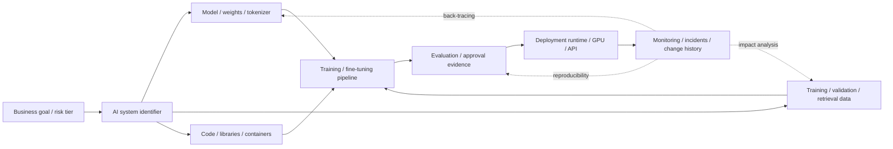
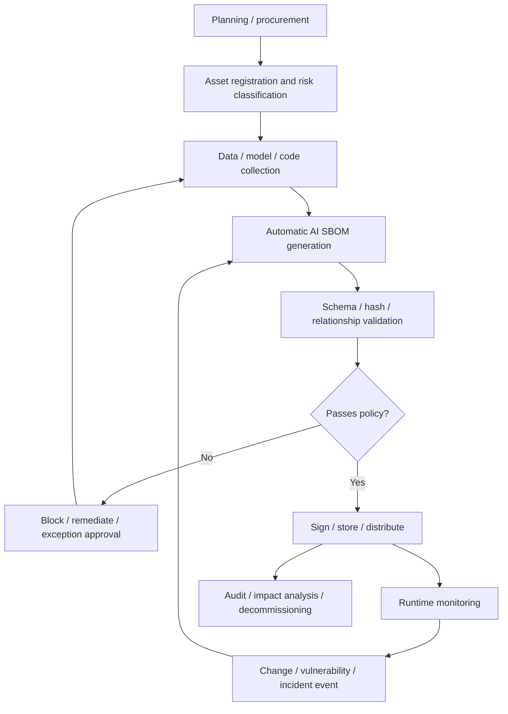

# AI Software BOM (AI SBOM) and AI Supply Chain Transparency

## 1. Overview

> **Definition**: An AI Software Bill of Materials (AI SBOM, also AIBOM) is a configuration specification that records, in a machine-readable form, the models, datasets, software, pipelines, infrastructure, and external services that make up an AI system, and the supply-chain relationships among them, together with version, provenance, license, and integrity information.

A traditional SBOM identifies the packages, libraries, containers, and dependencies that make up an application, thereby increasing the visibility of the software supply chain.
An AI system additionally has assets that affect the result—model weights, training data, the labeling process, embedding models, prompts, search indexes, evaluation sets, the GPU runtime, and external inference APIs.
Therefore, an SBOM that merely lists code dependencies has difficulty sufficiently explaining where a model came from, on what data it was trained, which model it inherited from, and what services it connects to at deployment.

The purpose of an AI SBOM is not merely to produce a list.
The core is to confirm the existence of components, trace the relationships among components, and quickly judge the impact of a change on performance, security, and legal liability.
For example, in a RAG service, replacing just the embedding model can change the distribution of search results and the possibility of personal-data exposure.
If the AI SBOM links the model, data, index, and evaluation results, one can work backward from the changed node to find the affected services and the items to be re-validated.

AI supply chain transparency is not the task of the development organization alone.
Procurement officers must verify the license and use restrictions of external models, security officers must check for malicious model files and vulnerable libraries, and privacy officers must verify the processing basis of training/retrieval data and whether deletion requests have been reflected.
The operations organization must track quality degradation and drift after a model update, and the audit organization must be able to reproduce the configuration and approval evidence at the time of a decision.

In this answer, we discuss the composition principles of an AI SBOM, the generation/validation methods by lifecycle, the use of CycloneDX and SPDX, differences from existing documents, adoption cases, and considerations from the professional engineer's perspective.
An AI SBOM should be understood not as a single document that replaces the model card or datasheet, but as an identification/tracing layer that links multiple explanatory documents and automatically generated configuration relationships.

## 2. Composition Principles and Management Scope of an AI SBOM

### 2.1 Why It Expands from a Traditional SBOM to an AI SBOM

For software packages, one can relatively clearly confirm identity by comparing versions and hashes.
In contrast, a model shows different behavior even with the same name if the weight file, tokenizer, quantization method, system prompt, and inference runtime differ.
A dataset's substantive training result also changes depending on the collection time, filtering rules, deduplication, and label quality of the original data.
That is, the identifier of an AI component must be a bundle of version, provenance, transformation history, and relationships rather than a mere name.

Also, the risk of an AI system arises not only from the components themselves but from the way they are combined.
Even if a public model is safe, combining it with a tool-calling agent that has broad permissions creates a new attack surface.
Even a normal dataset can heighten re-identification risk when a personal-data-containing embedding index is connected to a public search API.
An AI SBOM expresses such combination relationships, broadening the management scope from "what went in" to "how it is connected and what liability it creates."

### 2.2 Overall Composition Diagram

First of all, the business purpose and risk tier must be linked to the system identifier.
If the same base model is used for customer consultation and for medical decision support, even though the model is the same, the usage context, acceptable errors, and oversight requirements differ.
Therefore, it is desirable to make the top-level unit of an AI SBOM not just the model file but an AI system or deployment unit that has a purpose and operational boundary.

The model area records the model name, version, architecture, weight identifier, base-model lineage, whether it was fine-tuned, and the tokenizer.
The data area links the dataset name and version, source, collection/consent basis, preprocessing, labeling, splits, retention period, and deletion handling.
The code area overlaps with a general SBOM but must also include the training/inference frameworks and model-conversion tools.

The pipeline area is directly linked to the reproducibility of training and deployment.
Linking the training code commit, hyperparameters, GPUs used, evaluation set, and results to a single experiment or model release makes it possible to verify the phrase "the same model."
For RAG, one must also express document collection, chunking, embedding, the vector database, search ranking, and prompt templates as relationships.
The operations area holds the deployment region, endpoints, external APIs, permissions, monitoring, and incident tickets, reducing the gap between the actually used configuration and the development artifact.

### 2.3 Key Information by Management Target

| Management target | Key information to record | Management purpose |
|---|---|---|
| Model / weights | Name, version, hash, base model, fine-tuning/quantization history, license | Confirm model identity / lineage / usage rights |
| Dataset | Source, collection time, processing/labeling, consent/license, splits, quality metrics | Data rights / quality / bias / deletion response |
| Software | Package, version, hash, vulnerabilities, license, build relationships | Manage code supply-chain vulnerabilities and reproducibility |
| Pipeline | Training/evaluation/retrieval stages, code commits, parameters, tool versions | Experiment reproduction and change-impact analysis |
| Infrastructure | GPU/TPU, runtime, container, region, storage, network boundary | Operational security / performance / cost / failure analysis |
| External services | Provider, API version, contract/SLA, data-processing location, incident history | Third-party / Nth-party supply-chain risk management |
| Governance | Purpose, risk tier, approver, evaluation results, restrictions, decommissioning plan | Accountability / auditability / regulatory response |

Merely filling in the items of the table does not complete transparency.
For example, even if the source URL of a dataset is recorded, tracing is broken if it is not linked to which records were removed by preprocessing and which version of that dataset the model weights used.
Therefore, each item must have a unique identifier and creation time, and be connected as a graph through relationships such as `derived-from`, `uses`, `trained-on`, `deployed-as`, and `evaluated-by`.

## 3. Generation/Validation Process by Lifecycle

### 3.1 Generation, Consumption, and Feedback Flow

In the planning stage, one defines the system's purpose, users, allowed level of automation, and risk tier.
From this stage, one must put into contracts and procurement criteria which AI SBOM fields to require from the owners and providers of AI assets.
This is because if a model provider later does not disclose provenance and training-data information, it is hard to supplement in the operational stage.

In the development stage, one collects facts from repositories, the model registry, the data catalog, experiment-tracking systems, and CI/CD rather than from manual surveys.
Model files record a strong hash together with the model-registry version, and datasets record the relationship between originals and derivatives as well as access permissions.
Policies/restrictions/human-oversight requirements that cannot be collected automatically are separated into an evidence area signed by the responsible party, with links to the source documents supporting those values.

In the validation stage, one separately performs format validation and content validation.
Format validation checks the schema, required fields, identifier syntax, and referential integrity of relationships.
Content validation checks whether the model hash matches the actually deployed file, whether the license permits the intended use, whether data access permissions were approved, and whether the evaluation results are attributed to the current version.

In the deployment stage, one signs the AI SBOM as a release artifact and stores it together with the model, container, and manifest.
If the hash of a deployed model or the version of an external API does not match the AI SBOM, the policy engine halts deployment or sends it to an exception-approval procedure.
An important principle of the operational stage is not to generate the SBOM once and forget it.
Whenever a model update, data deletion, vulnerability disclosure, external API change, prompt change, or incident occurs, one generates a new version and records the difference from the previous version.

### 3.2 Minimal Data Model and the Meaning of Evidence

An AI SBOM record can generally be designed with the structure `component`, `version`, `supplier`, `license`, `hash`, `relationship`, `source`, `timestamp`, `lifecycle`, and `evidence`.
`component` distinguishes the type of model/data/code/service, and `relationship` expresses composition/derivation/training/deployment/evaluation relationships.
`evidence` links the identifiers of the model card, datasheet, evaluation report, contract, and approval ticket.
In this way, the AI SBOM becomes not a substitute for explanatory documents but an index that verifies the authenticity and scope of application of the explanatory documents.

For identifiers, one keeps both a human-readable name and a stable identifier that machines can compare.
A file hash is useful for whether files are identical, but does not guarantee semantic changes in a dataset or behavioral changes in an external API.
Therefore, for a dataset one must record the version/snapshot/collection conditions, and for an API the provider/contract version/model-routing policy.
Leaving "unknown" as a blank is also risky.
An unconfirmed value should be explicitly marked as `unknown`, and recorded together with the responsible party, confirmation deadline, and whether the risk is accepted, so that blind spots in management can be revealed.

### 3.3 Quality Validation Metrics

AI SBOM quality is evaluated by the degree to which it can be used in actual decision-making, rather than by document length.
First, completeness means whether known models/data/code/services are represented without omission.
Second, accuracy means whether the records match the version and hash of the actual artifacts.
Third, timeliness means whether it is regenerated within a set time after a change.
Fourth, traceability means whether one can move bidirectionally from a component to the deployment service and approval evidence.

For example, an organization can set metrics such as "100% AI SBOM generation success rate among releases of critical systems," "95% reflection rate within 24 hours of a model/data change," and "100% owner-designation rate for critical components."
However, raising only the generation rate without confirming the accuracy of essential relationships produces empty-shell automation.
A quality audit is needed that, for sampled releases, compares the SBOM's model hash, data snapshot, and deployment manifest against the actual system.

## 4. Comparison with Standards and Similar Documents

### 4.1 Use of CycloneDX and SPDX

CycloneDX is a format that can express software, hardware, services, dependencies, vulnerabilities, and machine-learning models in a single BOM model.
CycloneDX 1.7, released in October 2025, was adopted as the 2nd edition of ECMA-424 in December 2025, and is described as a general-purpose BOM that includes machine-learning models and supply-chain transparency.
It has the advantage that if an organization already uses an existing SBOM generation pipeline, it is easy to connect model- and data-related elements to the same BOM ecosystem.

The SPDX 3.0 line provides the AI Profile and Dataset Profile as separate profiles.
The AI Profile handles the exchange of AI systems and model artifacts, related software components, and dependencies, while the Dataset Profile handles information such as the name, version, source, license, and characteristics of a dataset.
It is therefore suitable for organizations that want to exchange AI configuration and data description in a fine-grained manner, but one must design the relationships among multiple profiles and check the support scope of consuming tools.

| Comparison criterion | CycloneDX 1.7 | SPDX 3.0 line |
|---|---|---|
| Central perspective | Expressing various BOM types in one object model | Expressing BOM exchange scope and conformance per profile |
| AI/ML expression | Integrates ML models, configuration, lineage/provenance into a general-purpose BOM | Distinguishes the AI and data areas with AI Profile and Dataset Profile |
| Standardization context | OWASP-project-based, adopted as ECMA-424 2nd edition | SPDX international-standard lineage and 3.0 profile structure |
| Adoption strength | Easy to connect to CI/CD and existing SBOM tools | Interoperability of AI/data/license per profile |
| Caution | Must extend the design of the organization's AI-governance fields | Must validate profile combinations and tool support |

Choosing one of the two formats does not by itself finish AI-governance design.
A standard aligns the syntax and semantics of data, but which fields to make mandatory, to what level to disclose the source of sensitive training data, and who approves risk are matters of organizational policy.
In practice, a strategy is possible in which one generates in the format well supported by internal pipelines and tools, and converts to the format required for vendor procurement or audit exchange.
During conversion, one must preserve the original identifiers and a conversion log so that model lineage or data relationships are not lost.

### 4.2 Differences from Model Cards, Datasheets, and SBOMs

A model card explains, in a human-readable form, a model's intended use, limitations, evaluation results, and ethical considerations.
A datasheet or data card explains the collection, composition, processing, quality, and constraints of the data.
A general SBOM centers on software components and dependencies, vulnerabilities, and licenses.
An AI SBOM does not replace these documents; it links each artifact and the actual release components with identifiers and relationships.

| Document | Main question | Strength | Relationship with AI SBOM |
|---|---|---|---|
| Model card | What use and limitations does this model have? | Interpretation/usage guidance and evaluation description | Explanatory evidence for the model record |
| Datasheet / data card | How was the data created and what constraints does it have? | Source/quality/bias/processing background | Basis for the dataset record |
| General SBOM | What is the software composition and vulnerabilities? | Package/version/license automation | The code subset of the AI SBOM |
| AI SBOM | What is the current AI system composed of and how is it connected? | Lineage/change/impact analysis/supply-chain tracing | The reference point that links other documents and artifacts |

The more documents there are, the more important a design that reduces duplicate entry becomes.
For example, if the model version in the model card and the model version in the AI SBOM differ from each other, one cannot tell which of the two documents is the latest.
It is appropriate to have explanatory documents, evaluation results, and the deployment BOM all reference a single identifier from the model registry, while keeping human-oriented explanations in the document body.

## 5. Implementation Architecture and Control Measures

### 5.1 Reference Architecture

The AI SBOM store is integrated with the data catalog, model registry, code repository, CI/CD, evaluation platform, and deployment platform.
Collectors read configuration information from each system and convert it into standard objects, and a relationship analyzer enriches the training/derivation/deployment/evaluation relationships.
The policy engine checks conditions such as license prohibitions, unverified provenance, incomplete risk assessment, a vulnerable runtime, and hash mismatch as release gates.
A signed BOM store guarantees per-release immutability, and a search index enables fast audit and impact analysis.

Permissions are separated into creator, consumer, and auditor.
A developer can create model and code components but may not need to see the detailed raw text of data containing personal information.
An auditor must be able to read relationships and approval evidence but need not have download permission for weights or original data.
Because the AI SBOM itself can contain sensitive provider information and security-vulnerability information, one separates public, internal, and restricted views.

### 5.2 Adoption Procedure

1. First, define the scope of business systems and AI assets, and designate owners of the models, data, code, services, and infrastructure.
2. Next, survey the fields already obtainable from the existing SBOM, data catalog, and model registry to reduce duplicate collection.
3. Select high-risk generative AI, external model APIs, and personal-data-processing systems as pilot targets.
4. Decide on a standard format and document, as policy, the required fields, the allowed use of `unknown`, the evidence-retention period, and change events.
5. Automatically generate the AI SBOM at commit/build/model-registration in CI/CD, and treat a generation failure as a release failure.
6. Store the deployment manifest and the signed BOM together, and compare them against the actual configuration at runtime.
7. When a vulnerability/license/data-deletion/model-drift event occurs, find the related systems through impact analysis and re-evaluate them.
8. Quarterly, select sample releases to audit completeness/accuracy/timeliness/traceability and improve the policy.

### 5.3 Security and Privacy Controls

An AI SBOM increases transparency but can also provide configuration information to an attacker.
Disclosing externally, as-is, the location of model files, vulnerable libraries, internal APIs, and dataset names becomes reconnaissance information for a supply-chain attack.
Therefore, an externally public BOM provides only minimal information and summary identifiers, and the detailed BOM is placed under strong authentication and purpose-specific permissions.

Recording the source of training data and copying the original personal information into the BOM are different things.
The BOM leaves, as references, the data-catalog identifier, processing basis, retention policy, and deletion-request status, while the raw text is kept in a separate protected store.
When a deletion or correction request arrives, one must find the models/embeddings/caches/backups derived from that dataset version and determine the scope of retraining and redeployment.
Here, the AI SBOM's `trained-on` and `derived-from` relationships help with the impact analysis of personal-data processing.

One applies a digital signature to the model weights and the BOM, and protects the signing key in a separate key-management system.
The fact that a BOM has not been tampered with does not by itself make the model safe, but it becomes a basis for distinguishing the configuration at release time from later changes.
External models and data are registered in the registry only when they pass through a trusted provider, hash verification, malicious-file scanning, license checks, and confirmation of evaluation results.

## 6. Application Cases

### 6.1 Case 1: In-house Knowledge RAG Service

Assume a company operates a RAG service that searches in-house regulations and project documents to answer questions.
Initially it managed only the LLM name and API key, but after changing the embedding model and chunking rules, search accuracy and access control could waver together.
The AI SBOM links the raw-store snapshot, document-collection commit, chunking version, embedding-model hash, vector-index version, search-ranking configuration, prompt template, and external LLM API version.

When a personal-data deletion request occurs, one finds the deletion target in the data catalog and, following the AI SBOM's relationships, looks up the document snapshot, embeddings, index, cache, and evaluation set.
For a deployment that changes the model, one computes the difference between the old BOM and the new BOM and re-performs the search-quality, permission-bypass, and hallucination-rate evaluations.
This method makes it possible to explain the cause and impact of a change rather than merely recording "we use RAG."

### 6.2 Case 2: Procuring an External Base Model

Assume a financial company purchases a base model from an external provider and uses it for consultation support.
Before contracting, it requires the model's version/weights or API version, the disclosure scope of the training-data source, commercial usage rights, whether input data is used for retraining, and the conditions for incident/update notification.
It links the AI SBOM, model card, and evaluation report provided by the vendor to internal records, marks undisclosed fields as `unknown`, and then designates a risk acceptor and a remediation deadline.

If, after deployment, the provider changes the model routing, the substantive configuration differs even under the same API name.
One receives the change-notification event of the SLA, stores a new BOM, and re-performs the accuracy/bias/privacy/explainability evaluations needed for the use purpose of financial consultation.
At contract termination, one confirms via the BOM relationships the scope of return and deletion of the model, prompts, retrieval data, logs, and derived artifacts.
In this case, the AI SBOM functions as a technical document and simultaneously as a reference point for procurement, audit, and responsibility demarcation.

## 7. Deep Dive: 2026 Standards/Policy Trends and Exam Points

Recent AI supply-chain discussion is expanding from competition over model performance to competition over the verification of configuration and provenance.
The AI SBOM minimum-elements guidance from CISA and international partners presents a direction for supplementing model-, data-, and system-level transparency information that is hard to capture with a traditional SBOM alone.
That said, the minimum elements of a guidance document must not be interpreted as a mandatory checklist that fully replaces every organization's risks and industry regulations; organizations must extend the fields to fit their usage context and risk tier.

CycloneDX 1.7 and the ECMA-424 2nd edition have evolved into a general-purpose BOM that can express not only software and hardware but also services, vulnerabilities, cryptographic assets, and machine-learning models from a supply-chain-transparency perspective.
The SPDX 3.0 line provides a profile structure for exchanging information about AI systems/models and datasets through the AI Profile and Dataset Profile.
The two formats are not so much a relationship in which one must competitively adopt only one, but interoperability means that can be chosen or converted according to the tool ecosystem, procurement requirements, and data-governance maturity.

In a professional engineer answer, defining an AI SBOM merely as an "AI component list" is insufficient.
First, one must explain the difference from an existing SBOM in terms of the relationships among model/data/pipeline/external services.
Second, one must present the closed loop of automatic generation and signing, release gates, runtime comparison, and change-impact analysis.
Third, one must also discuss the trade-off between transparency and confidentiality, minimal data collection and deletion requests, and the `unknown` handling of provider-undisclosed information.
Finally, one must emphasize in the conclusion that governance—responsible parties, quality metrics, audit, and exception approval—is the condition for success, more than the standard format itself.

## 8. Considerations and Implications

### 8.1 Consistency of Scope and Identification Unit

Whether to make the top-level unit of an AI SBOM the model or the service may differ by organization.
However, if each project decides arbitrarily, one either counts the same model multiple times or misses hidden data/tool dependencies within a single service.
One should use a system identifier that has a business purpose, deployment boundary, and risk tier as the basis, and hierarchically connect models/data/code/services beneath it.

### 8.2 Separating Automation from Human Judgment

Code, containers, model hashes, and pipeline versions should be generated automatically as much as possible to raise timeliness and accuracy.
On the other hand, the use purpose, consent basis, acceptable bias level, human oversight, and risk acceptance cannot be decided by automatic scanning alone.
It is desirable to distinguish the auto-generation area from the responsible-party-approval area, and to require supporting documents and an expiration date even for manual input.

### 8.3 Preserving Meaning Over Standard Adoption

When converting between CycloneDX and SPDX, moving only the name and version can cause the meaning of model lineage, data processing, and evaluation evidence to disappear.
Before choosing a standard, an organization must list the relationships and fields it needs, and measure information loss with conversion tests.
Values that cannot be converted should not be discarded arbitrarily but preserved as extension fields or external references.

### 8.4 Balancing Security and Openness

Transparency lets one discover supply-chain risk, but the detailed BOM itself can be sensitive operational information.
One creates per-role views for external providers, auditors, developers, and operators, and restricts vulnerabilities and internal locations with least privilege.
One classifies the integrity/availability/confidentiality of the BOM as assets of the information-security management system and sets retention/decommissioning policies.

### 8.5 Privacy and Data Sovereignty

The more detailed the data source and lineage recorded, the greater the risk of excessively copying original personal information.
One designs the AI SBOM as a place that references the data catalog and processing records rather than a place that stores the originals, and connects deletion/correction requests through to derived models and embeddings.
When using overseas clouds and external APIs, one specifies the processing region, whether input is used for retraining, and cross-border transfer and outsourcing relationships in the provider record.

### 8.6 A Continuous Quality/Operations System

An AI SBOM is not a one-time document task of a single release but part of change management and operational observation.
One defines model drift, data-distribution change, vulnerability announcements, external API changes, and incident tickets as SBOM-update events, and makes the impact-analysis results lead to re-evaluation.
One reports the completeness/accuracy/timeliness/traceability metrics to both management and the technical organization, controlling costs while prioritizing the closing of gaps in critical systems.

## References

- CISA, Software Bill of Materials for AI - Minimum Elements: https://www.cisa.gov/resources-tools/resources/software-bill-materials-ai-minimum-elements
- CISA, 2026 Minimum Elements for a Software Bill of Materials: https://www.cisa.gov/resources-tools/resources/2026-minimum-elements-software-bill-materials-sbom
- Ecma International, ECMA-424, 2nd edition, December 2025: https://ecma-international.org/publications-and-standards/standards/ecma-424/
- CycloneDX Specification Overview: https://cyclonedx.org/specification/overview/
- CycloneDX Authoritative Guide to ML-BOM: https://cyclonedx.org/guides/OWASP_CycloneDX-Authoritative-Guide-to-AI-ML-BOM-en.pdf
- SPDX Specification 3.0.1 AI Profile: https://spdx.github.io/spdx-spec/v3.0.1/model/AI/AI/
- SPDX Specification 3.0.1 Conformance: https://spdx.github.io/spdx-spec/v3.0.1/conformance/
- NIST AI Risk Management Framework: https://www.nist.gov/itl/ai-risk-management-framework

---

> **In one line**: An AI SBOM is an operational foundation that manages the composition and lineage of models, data, code, pipelines, and services as signable and verifiable relationships, thereby increasing the transparency, reproducibility, impact analysis, and accountability of the AI supply chain.
