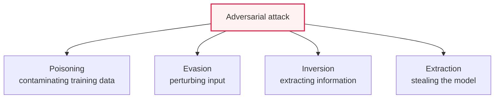

# AI Security Threats: Adversarial Attacks and Generative AI Vulnerabilities

## 1. Overview

### a. Definition
> Security threats that emerge with the increasing use of AI technology, including **adversarial attacks that target the training and inference process of machine learning** and **vulnerabilities specific to generative language models (LLMs)**.

The way AI security is fundamentally different from traditional information security is that "**the model itself is both the target and the channel of attack**." Whereas traditional hacking digs into the vulnerabilities of a system, an AI attack subtly manipulates training data, model parameters, and input values to make the AI reach a wrong judgment. For example, by attaching a tiny sticker invisible to the human eye to a stop sign, one can make an autonomous vehicle misrecognize it as a speed-limit sign. As AI takes on important judgments such as autonomous driving, medical diagnosis, and security monitoring, such manipulation leads directly to physical and social harm. Moreover, as generative AI has become popular, new types of threats such as hijacking through prompts and generation of harmful content have been added.

### b. Necessity
The more deeply AI is involved in critical infrastructure and decision-making, the greater the ripple effect of attacks that induce its malfunction. Embedding security throughout the entire AI lifecycle has become an essential task.

## 2. Four Types of Machine Learning Adversarial Attacks and Defenses

Adversarial attacks are divided by which point of the AI lifecycle they target. **Poisoning** injects malicious data at the training stage to contaminate the model, and **evasion** subtly perturbs the input at the inference stage to induce misclassification. **Inversion** analyzes the model output to reverse-extract the personal information used in training, and **extraction** replicates and steals the model through repeated queries. The defenses for each are data validation, adversarial training, privacy protection, and query limits.

| Attack | Content | Defense |
|---|---|---|
| **Poisoning** | Injecting malicious data into training data | Data validation/cleansing, anomaly detection |
| **Evasion** | Inducing misclassification via subtle input perturbation at inference | Adversarial training, input normalization |
| **Inversion** | Extracting training data/personal information from output | Differential privacy, output restriction |
| **Extraction** | Replicating/stealing the model via queries | Query limits, watermarking |

## 3. Generative Language Model (LLM) Security Vulnerabilities

Generative AI has new vulnerabilities owing to its nature of being instructed and responding in natural language. **Prompt injection** neutralizes or hijacks the original instructions with malicious input, and **jailbreaking** bypasses safeguards to elicit harmful output. **Data leakage** that exposes training/conversation data, **hallucination** that generates plausible falsehoods, and **misuse** exploited for generating phishing, malware, and deepfakes are also threats (the OWASP LLM Top 10 is a representative classification).

| Vulnerability | Content |
|---|---|
| **Prompt injection** | Hijacking/bypassing instructions with malicious input |
| **Jailbreak** | Eliciting harmful output by bypassing safeguards |
| **Data leakage** | Exposing training/conversation data and sensitive information |
| **Hallucination** | Misjudgment and spread of falsehoods via fabricated information |
| **Misuse** | Generating phishing/malware/deepfakes |

## 4. Countermeasures

Defense is layered across the entire AI lifecycle. One hardens the model with adversarial training and robustness testing, places guardrails that validate input and output, and responds to prompt injection with input validation and separation of privileges. One reduces hallucination with RAG and attaches fact-checking, monitors anomalies and drift with MLOps monitoring, and continuously checks with AI red teaming and governance.

## 5. Considerations and Implications

1. **Embedding security across all stages of the AI lifecycle (Secure AI)** is the principle. Because each stage—data collection, training, deployment, and operation—has its own unique threats, security must be integrated from the earliest design stage.
2. **Respond to the automation and sophistication of attacks with AI.** As attacks become more sophisticated with generative AI, defense too counters with AI-based detection and response, intensifying the spear-and-shield competition.
3. **Convergence of trustworthy AI (safety/robustness) and security** is needed. AI security must be handled comprehensively—beyond simple hacking defense—by combining it with trustworthiness issues such as bias and hallucination.

---

> **In one line**: AI security threats include the adversarial attacks of *poisoning, evasion, inversion, and extraction* and generative LLM vulnerabilities such as *prompt injection, jailbreaking, data leakage, and hallucination*, and are addressed at all stages of the AI lifecycle with adversarial training, guardrails, and governance.
