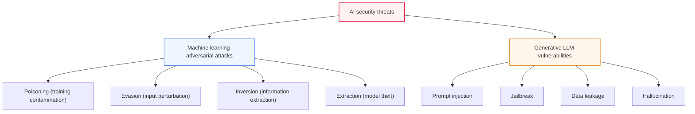
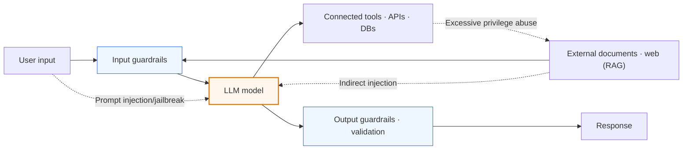

# AI Security Threats: Adversarial Attacks and Generative AI Vulnerabilities

## 1. Overview

### A. Definition
> **AI security threats** are new types of security threats arising from the expanding adoption of artificial intelligence, encompassing **adversarial attacks that directly target the training and inference processes** of machine learning and **vulnerabilities specific to generative AI**, typified by large language models (LLMs).

What fundamentally distinguishes AI security from conventional information security is that "**the model itself becomes both the target and the channel of attack**." Whereas traditional hacking exploits code vulnerabilities in operating systems, networks, and applications (buffer overflows, SQL injection, etc.), AI attacks cleverly manipulate not code defects but **the statistical decision boundaries the model learned from data**. They do so by contaminating training data, or by adding subtle noise to inputs that look normal to the human eye so that the AI reaches a completely different conclusion.

The most famous example is research in which a few stickers — which look like graffiti to the human eye — were attached to a stop sign, inducing an autonomous driving perception model to misclassify it as a "speed limit sign." The change is minute at the pixel level, but it pushes the input across the model's decision boundary. As AI takes on judgments involving human safety and property — autonomous driving, medical image diagnosis, financial fraud detection, security monitoring — such malfunctions lead directly to physical and social harm. On top of this, as generative AI became mainstream after ChatGPT, **threats specific to natural-language interfaces** — such as hijacking instructions via prompts, bypassing safeguards (jailbreaking), and mass generation of harmful content — have been newly added.

### B. Background and Necessity
The more deeply AI is involved in critical infrastructure and decision-making, the greater the impact of attacks that cause it to malfunction. Where security used to be a matter of "protecting the system," the question "can the learned judgment be trusted?" has now been added. In particular, as generative AI permeates enterprise work (writing code, summarizing documents, customer service), the internal data, tools, and privileges connected to models have become a new attack surface.

Accordingly, national regulations and standards are being put in place rapidly. OWASP published the **Top 10 for LLM Applications** to systematize generative AI vulnerabilities, MITRE released the **ATLAS** knowledge base organizing AI attack tactics and techniques, and NIST released the **AI Risk Management Framework (AI RMF)** and a taxonomy of adversarial machine learning. This means that AI security has become not a one-off response but **an ongoing task that must be embedded throughout the AI lifecycle (Secure AI by Design)**.

## 2. Overall Landscape of AI Security Threats

First, drawing an overall map of which points in the AI lifecycle the threats target clarifies the position of each attack and the points of defense.

Broadly, the threats fall into two branches. One is **machine learning adversarial attacks** targeting classification and prediction models in general, and the other is **vulnerabilities specific to generative LLMs** that take instructions in natural language. Each branch is explained below in prose from the perspectives of principle and defense.

## 3. Four Machine Learning Adversarial Attacks and Defenses

Adversarial attacks are understood systematically when classified by "which stage of the AI lifecycle they target, and to what end." Targeting the training stage is poisoning, targeting the inference stage is evasion, extracting information contained in the model is inversion, and replicating the model itself is extraction.

### A. Poisoning — Contaminating Training Data
**Poisoning** is an attack that mixes malicious samples into the data the model learns from, distorting the finished model's judgment from the outset. It exploits the fact that training is a process of "inducing rules from data." A particularly dangerous form is the **backdoor attack**, which malfunctions only when a specific trigger (e.g., a small pattern in the corner of an image) is present and otherwise behaves normally, making it hard to detect.

This attack is more dangerous the more data is collected in bulk from external sources. Recommendation and chatbot systems that continuously retrain on user feedback, and foundation models trained on publicly crawled data, become targets. The key to defense is placing **data provenance verification, outlier detection, and data cleansing** before training, and the retraining pipeline must include data integrity verification and change tracking to filter out contaminated samples.

### B. Evasion — Input Perturbation at Inference Time
**Evasion** is an attack against an already deployed model that subtly modifies input values at a level humans can hardly notice (adversarial perturbation) to induce misclassification. The stop sign stickers mentioned earlier, or the classic case of adding invisible noise to an image so that a "panda" is classified as a "gibbon," belong here. It exploits the property that a model's decision boundaries are surprisingly fragile in high-dimensional space.

Evasion is high-risk because it can be used to directly neutralize security models — bypassing spam filters, malware detection, or biometric authentication. The representative defense is **Adversarial Training**, which deliberately includes adversarial examples in training data to increase the model's robustness. Input normalization and preprocessing, ensembles of multiple models, and defensive distillation are also used in parallel. However, complete defense is difficult and this is an area where attack and defense keep evolving, so continuous robustness evaluation is more realistic than a definitive "solution."

### C. Inversion and Membership Inference — Information Extraction
**Model Inversion** is an attack that repeatedly observes and analyzes a model's outputs (probabilities, confidence scores) to reconstruct, in reverse, sensitive data used in training. The related **Membership Inference** determines "whether a particular individual's data was included in training," which in itself violates privacy. For example, sensitive information about a specific patient could be inferred from a medical diagnosis model.

This attack becomes more severe when a model excessively "memorizes" its training data, so defenses center on privacy-preserving techniques. **Differential Privacy** adds controlled noise to the training process to blur the influence of individual data points; the level of output detail (exposure of probability values) is limited; and, when necessary, Federated Learning avoids collecting raw data centrally.

### D. Extraction — Model Theft
**Model Extraction/Stealing** is an attack that sends a large number of queries to a public prediction API, collects the input-output pairs, and replicates a substitute model that behaves similarly to the original. It is both unauthorized theft of the intellectual property of a model trained at enormous cost and a stepping stone for designing evasion attacks using the replicated model.

The key to defense is API-level control. **Rate limiting, detection of abnormal query patterns, and embedding watermarks in outputs** suppress mass extraction, and the confidence information returned is minimized. The following table is supplementary material summarizing the four attacks by targeted stage and defense.

| Attack | Targeted stage | Goal | Representative defenses |
|---|---|---|---|
| **Poisoning** | Training | Distorted judgment, backdoor | Data provenance verification and cleansing, anomaly detection |
| **Evasion** | Inference | Induce misclassification | Adversarial training, input normalization, ensembles |
| **Inversion** | Inference (observation) | Reconstruct training/personal data | Differential privacy, output restriction |
| **Extraction** | Inference (API) | Replicate/steal the model | Query limiting, watermarking, anomaly detection |

## 4. Security Vulnerabilities of Generative Language Models (LLMs)

Because generative AI "receives instructions in natural language and responds in natural language," it has vulnerabilities that did not exist in conventional software. The key is that **the boundary between commands (developer instructions) and data (user and external input) is blurred**. This property is the common root of the threats below. The following is a detailed architecture diagram showing the data flow and threat points of an LLM application.

### A. Prompt Injection
**Prompt injection** is an attack that uses malicious input to neutralize or hijack the original instructions (system prompt) set by the developer, and it is ranked as the top threat in the OWASP LLM Top 10. There is **direct injection**, inserted directly as in "ignore all previous instructions and …," and **indirect injection**, which hides malicious instructions in external web pages, documents, or emails that the model reads. The latter is especially dangerous when the model trusts and processes external content, as in RAG, automatic summarization, or agents, and can cause actions the user never intended (data leakage, privilege misuse).

Defense is fundamentally "separating commands from data," but the difficulty of this field is that perfect separation is hard given the nature of natural language. Realistically, input validation and filtering, isolating external content behind a trust boundary, minimizing the privileges granted to the model (least privilege), and human confirmation before sensitive actions (human-in-the-loop) are combined.

### B. Jailbreak and Data Leakage
A **jailbreak** is an attack that bypasses the model's safety alignment with elaborate prompts to elicit outputs it should refuse, such as instructions for making explosives or malware. It sidesteps safeguards by, for instance, having the model roleplay or setting up hypothetical situations, and new bypass techniques and patches blocking them repeat endlessly. **Data leakage** goes in two directions: one is the model spitting out sensitive information memorized during training (personal data, API keys), and the other is internal confidential information that users entered into conversations leaking out through logs or retraining. As cases were reported in which employees pasted source code or meeting minutes into external chatbots and leaked secrets, many companies introduced internal usage policies and data masking.

### C. Hallucination and Misuse
**Hallucination** is the phenomenon in which a model plausibly fabricates untrue content, with citing nonexistent papers, court precedents, or APIs as if real being typical. It is not a malicious attack, but in areas where accuracy is vital, such as medicine, law, and finance, it leads to serious harm when incorrect information is used directly in decision-making. **Misuse** is the abuse of generative AI for mass-producing phishing emails, assisting malware writing, and creating deepfakes, raising attackers' productivity and the overall threat level across society. The following table is supplementary material summarizing the main LLM vulnerabilities.

| Vulnerability | Description | Representative responses |
|---|---|---|
| **Prompt injection** | Hijacking/bypassing instructions (direct/indirect) | Input validation, least privilege, content isolation |
| **Jailbreak** | Harmful output by bypassing safeguards | Strengthened safety alignment, output filters, red teaming |
| **Data leakage** | Exposure of sensitive training/conversation data | Data masking, usage policies, log control |
| **Hallucination** | Generating false information | RAG and citing sources, fact-checking, human review |
| **Misuse** | Phishing, malware, deepfakes | Usage monitoring, watermarking, policy and legislation |

## 5. Countermeasures — Defense in Depth

Defense consists not of a single measure at a particular point in time but of layered defense throughout the AI lifecycle. In the **training stage**, the model itself is hardened through data provenance verification and cleansing and adversarial training; in the **deployment and inference stage**, guardrails that inspect inputs and outputs and API query limits are put in place. Prompt injection is countered with input validation and privilege separation (minimizing the tools and data the model can access), and hallucination by having the model answer based on source documents via RAG, with fact-checking and source attribution attached. In the **operation stage**, MLOps monitoring constantly watches for shifts in input distribution (drift) and abnormal queries, and regular **AI red team** exercises and governance proactively discover new bypass techniques. Only by layering prevention, detection, and response hierarchically does the whole system avoid collapse when any single layer is breached.

## 6. Advanced — Standards and Regulatory Trends and Practical Application

AI security has entered the stage of being institutionalized into standards and regulatory frameworks beyond individual technologies. The **OWASP LLM Top 10** organizes representative threats to generative AI applications — prompt injection, insecure output handling, Excessive Agency, and others — from a developer's perspective and serves as a de facto industry checklist. **MITRE ATLAS** accumulates actually observed AI attack tactics and techniques in ATT&CK format to provide threat intelligence, and the **NIST AI RMF** presents risk management procedures for trustworthy AI. On the regulatory side, the **EU AI Act** mandates robustness, accuracy, and security requirements for high-risk AI, establishing security as a subject of compliance.

The axis of practical application is "blending AI-specific security into existing security and development processes." For example, the financial sector makes input/output guardrails and personal data masking mandatory for LLM-based customer consultation, and RAG systems handling internal documents isolate external content behind a trust boundary to block indirect prompt injection. Also, as misuse of generative AI increases, investment is expanding in content provenance labeling (watermarking, provenance authentication such as C2PA) and detection technologies to counter phishing and deepfakes. The key is to **treat the model as a new asset and attack surface, and embed security into every layer — data, model, application, and operations — from the design stage (Secure AI by Design)**.

## 7. Considerations and Implications

1. **Embedding security across all stages of the AI lifecycle (Secure AI by Design) is the principle.** Since each stage — data collection, training, deployment, and operation — has its own threats (poisoning → evasion → inversion/extraction), security must be integrated from the beginning of design rather than as an after-the-fact check, with controls layered per stage.

2. **The "spear and shield" competition of countering automated and sophisticated attacks with AI will intensify.** As generative AI makes attacks more sophisticated and massive, defense must also respond with AI-based anomaly detection and automated response. However, since adversarial robustness is an area that is hard to solve completely, risk must be managed on the premise of continuous evaluation and improvement rather than "perfect defense."

3. **Trustworthy AI (safety, robustness, privacy) and security must converge.** AI security must go beyond simple hacking defense and be handled in an integrated way combined with reliability issues such as bias and hallucination and with personal data protection. In particular, inversion and membership inference have a dual nature as both security and privacy problems.

4. **Connected privileges and attack surface must be minimized (Least Privilege).** As LLMs connect to tools, DBs, and external APIs, "excessive agency" has become a new key risk. The privileges and data access granted to models should be minimized, and human confirmation placed on sensitive actions to contain the scope of damage from prompt injection.

5. **Governance, standards, and regulatory compliance must be established as an ongoing system.** Referring to frameworks such as OWASP, MITRE ATLAS, NIST AI RMF, and the EU AI Act, threat classification, controls, and audits should be documented, and AI red teaming and regular inspections should be operated as ongoing organization-wide processes.

## References
- OWASP Top 10 for LLM Applications — https://owasp.org/www-project-top-10-for-large-language-model-applications/
- MITRE ATLAS (Adversarial Threat Landscape for AI Systems) — https://atlas.mitre.org/
- NIST AI Risk Management Framework — https://www.nist.gov/itl/ai-risk-management-framework

---

> **In one line**: AI security threats encompass adversarial attacks targeting training and inference (poisoning, evasion, inversion, extraction) and generative LLM vulnerabilities (prompt injection, jailbreak, data leakage, hallucination, misuse), and are countered by defense in depth (Secure AI by Design) that layers adversarial training, guardrails, least privilege, and governance across every layer of data, model, application, and operations.
