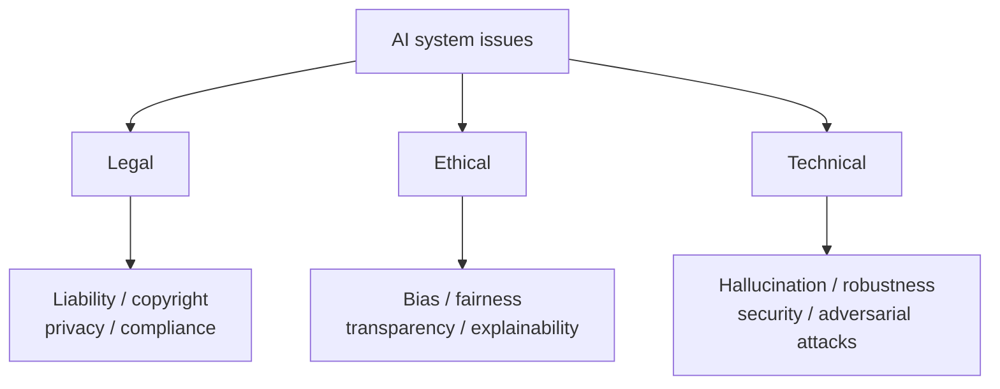

# Legal, Ethical, and Technical Issues of AI Systems and Their Solutions

## 1. Overview

### a. Definition
> The **legal-liability, ethical-trust, and technical-safety** problems that arise with the rapid spread of AI systems; managing these in an integrated manner to realize **Trustworthy AI** is the task.

The reason AI's issues are special is that the three layers are **intertwined with one another**. Algorithmic bias (ethical) leads directly to a discrimination lawsuit (legal), and hallucination (technical) gives rise to liability (legal) for spreading misinformation. Therefore, addressing only one layer merely shifts the problem to another layer, and law, ethics, and technology must be addressed **in an integrated manner**.

### b. Background and Necessity
As generative AI became popular, anyone can now easily use powerful AI, and accordingly the problems of accountability, bias, and safety have surfaced socially. As decisions made by AI directly affect people's lives—such as in hiring, lending, and healthcare—the question of "how far to trust a machine's judgment and who is responsible" has led to regulation. As systems such as the EU AI Act and Korea's Framework Act on AI are strengthened and social acceptance is demanded, preemptively managing AI's issues has become directly tied to corporate survival.

## 2. Issue Classification

Issues are divided into three according to their nature. **Legal** issues are matters of systems, contracts, and rights, addressing "who is responsible and what is lawful," and **ethical** issues are matters of norms and values, asking "is it fair and transparent." **Technical** issues are matters of the system's own defects—"is it accurate and safe." As noted earlier, these three are not independent but interact in a chain.

## 3. Content and Solutions by Issue

Because the issues of each layer have different causes, the solution approaches must also differ. Legal issues are addressed with systems and contracts, ethical issues with verification and transparency, and technical issues with engineering defense. For example, a copyright dispute over training data (legal) must be addressed by training with data whose license is clear and securing the basis for use by contract; gender bias in a hiring AI (ethical) is mitigated by data rebalancing and verification with fairness metrics; and a chatbot's hallucination (technical) is suppressed with RAG and fact-checking.

| Category | Key issues | Solutions |
|---|---|---|
| **Legal** | Unclear liability for incidents, training-data copyright, privacy infringement | Compliance with the Framework Act on AI/regulations, establishing a liability system, securing data lawfulness (licenses) |
| **Ethical** | Data/algorithm bias, discrimination, opacity | Bias mitigation/fairness verification, XAI (explainable AI), compliance with AI ethics standards |
| **Technical** | Hallucination, lack of robustness, adversarial attacks, privacy leakage | RAG/fact-checking, robustness testing, adversarial defense, PET/differential privacy |

In particular, bias is usually the result of **social bias already present in the training data** being reflected and amplified in the model, so it is important that fixing the algorithm alone is insufficient and one must check from the data stage.

## 4. Integrated Solution

Beyond individual responses, there must be a **governance system** that runs through the entire development-and-operation lifecycle so that issues do not recur. Once AI governance establishes responsibility and ethics principles, XAI makes the basis of judgments transparent, MLOps continuously monitors performance, bias, and drift during operation, and compliance aligns all of this with legal requirements.

| Measure | Content |
|---|---|
| **AI governance** | Responsibility/ethics system across the full development-operation lifecycle, AI impact assessment |
| **XAI / transparency** | Explaining the basis of judgments, disclosing model cards/datasheets |
| **MLOps / monitoring** | Continuous monitoring of performance, bias, and data drift |
| **Regulatory compliance** | Responding to the EU AI Act (risk-based) and Korea's Framework Act on AI |

The reason one must not validate a model once and be done but **continuously monitor with MLOps** is that performance and fairness can gradually collapse due to data drift, where the actual operational data diverges from the training-time data.

## 5. Related Regulations and Standards

Regulations and standards present the baseline for response. The EU AI Act takes a **risk-based** approach that regulates more strictly the greater the risk—prohibiting uses such as social scoring and imposing strict obligations on high-risk uses (healthcare, hiring, etc.). The NIST AI RMF and ISO/IEC 42001 provide management systems for executing this within the organization.

| Category | Content |
|---|---|
| **EU AI Act** | Risk-based regulation (prohibited, high, limited, minimal risk) |
| **NIST AI RMF** | Govern, Map, Measure, Manage framework |
| **ISO/IEC 42001** | International standard for AI management systems (AIMS) |

## 6. Considerations and Implications
From the professional engineer's perspective, the most important principle is **embedding from the design stage rather than after-the-fact regulation (Responsible AI by Design)**. Because the cost of restoring trust is far greater when one responds after a problem erupts, bias checks, explainability, and safety must be included as requirements from the early development stage. Second, the **triangular balance** of technology, systems, and ethics is the condition for trustworthy AI, and if any one gets ahead, overall trust collapses. Third, especially in high-risk areas, a control mechanism is essential that maintains **human oversight (Human-in-the-loop)** so that AI does not monopolize the final decision and places ultimate responsibility with a person. In the end, trustworthy AI is a matter of social acceptance rather than technical performance, and the organization that secures it will have competitiveness in the AI era.

---

> **In one line**: AI systems have *legal (liability/copyright), ethical (bias/transparency), and technical (hallucination/security)* issues intertwined with one another, and the key is to integrate AI governance, XAI, MLOps, and regulatory compliance from the design stage to realize trustworthy AI under human oversight.
