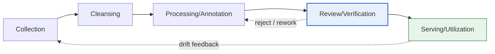
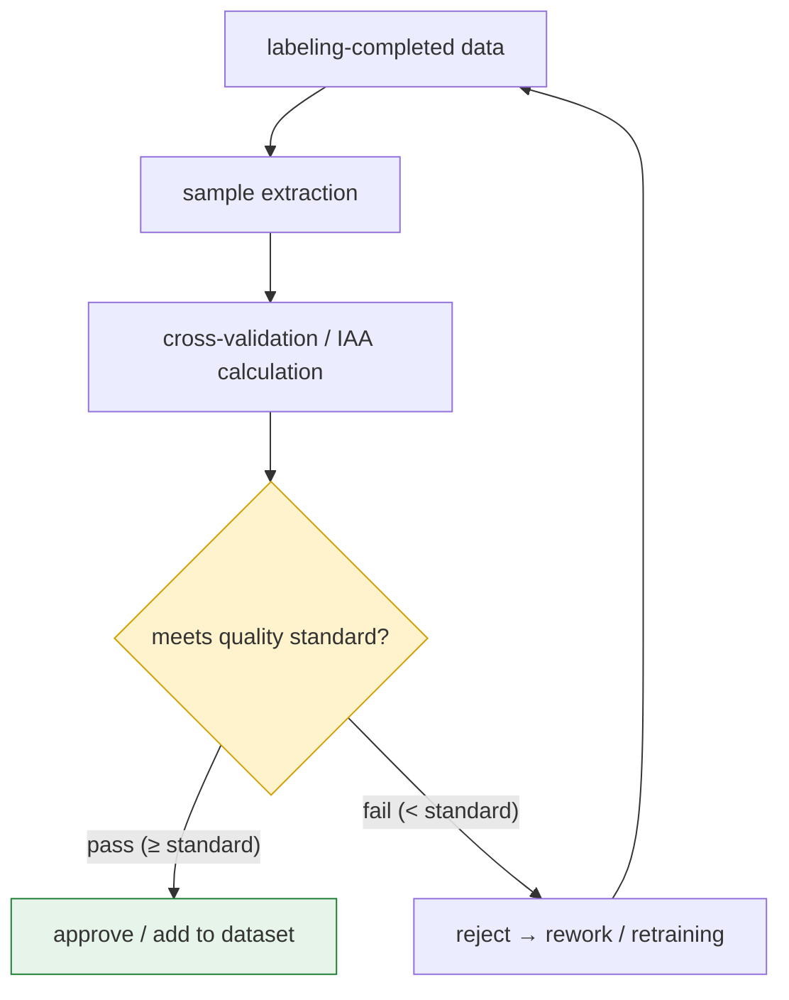

# Quality Management of AI Training Datasets

## 1. Overview

### a. Definition

> **Quality management of AI training datasets** is a systematic activity to secure and maintain the **accuracy, completeness, consistency, representativeness, and sufficiency** of data across the entire process of **collecting, cleansing, processing (labeling), reviewing, and utilizing** the data to be used for AI model training. In supervised learning in particular, the quality of the ground-truth labels is the center of management.

The reason the quality of AI training data is decisively important is the old truth of "**Garbage In, Garbage Out (GIGO)**." No matter how sophisticated the neural network, if it is trained on data with wrong labels or bias, it internalizes those errors and biases as they are. In supervised learning in particular, the quality of the answers (labels) determines the **ceiling of model performance**. Because a model trained on mislabeled data learns those errors as "correct answers," it cannot exceed that ceiling no matter how much the algorithm is improved.

For this reason, the center of gravity of recent AI development is shifting from "**model-centric**" to "**data-centric AI**." This perspective, championed by Andrew Ng, holds that "one fixes the model and code and systematically raises data quality to improve performance," and in actual industrial settings, reducing label noise and increasing data consistency often brings a larger and more stable performance improvement than changing the model architecture. For example, in domains with little and precise data—such as defect inspection and medical imaging—it is repeatedly reported that correcting several hundred errors in existing labels raises accuracy more than newly collecting thousands of pieces of data.

### b. Background and Necessity

Three currents lie behind why quality management has become essential. First, the **spread of AI into high-risk domains**. As areas where errors lead directly to accidents/misdiagnoses—such as object recognition in autonomous driving and lesion reading in medical imaging—increase, data defects have become directly tied to matters of safety, life, and legal liability. Second, **bias and fairness risk**. When a particular gender, race, age, or region is under- or over-represented in the data, the model learns discriminatory judgments unfavorable to that group. In fact, research showing that facial-recognition models had significantly higher error rates for people of color and women (for example, the MIT Media Lab's Gender Shades study, which found that the misclassification rate for darker-skinned women was markedly higher than for lighter-skinned men) shows that a lack of data representativeness results in social discrimination. Third, the **scaling-up of data hubs and public-data projects**. As large-scale crowdsourced labeling is performed, the quality at scale cannot be guaranteed without a system that quantitatively manages the variance and errors among workers.

## 2. Conceptual Diagram of the Data Lifecycle and Quality-Assurance Activities

Quality management is not a one-off activity limited to a particular stage but an activity across the entire lifecycle through which data flows. First, one takes a bird's-eye view with an overall flow diagram of what stages the data passes through and how it is fed back when problems are found in review.

Once one has grasped that the overall flow is a cycle of 'collection → cleansing → labeling → review → utilization,' one next needs to look in detail at the **internal architecture of the review stage**, the final gate of quality. Review is not simple visual inspection but consists of comparing the results of multiple workers (IAA), quantitatively inspecting samples, and a judgment logic that rejects sub-standard batches.

## 3. Quality-Assurance Activities by Stage

Quality assurance is carried out with a different focus at each stage of the lifecycle. We examine, at the level of principle, what each stage checks and why.

### a. Collection — Representativeness and Lawfulness

The core question of the collection stage is "does this data **represent the problem to be solved**." If the distribution of the training data differs from the actual operating environment (the population), the model learns biased decisions that fit only in the lab. For example, an autonomous-driving recognition model trained only on clear-daytime footage sharply degrades at night or in bad weather. Therefore, at the collection stage one checks class balance, coverage of diverse environments and conditions, and securing rare classes (the long tail). At the same time, **lawfulness and ethics** are also decided at this stage. Unauthorized collection of copyrighted data and consent-free collection of personal information (faces, license plates, voice) leave legal risks that are hard to reverse in later stages, so at the point of collection one must confirm de-identification, consent, and licensing.

### b. Cleansing — Removing Noise

The cleansing stage removes missing values, outliers, duplicates, and format inconsistencies from the source data to lay the foundation for subsequent labeling and training. Whether to simply delete missing values or to impute them, and whether an outlier is an error or an actual rare case, must be judged on the basis of domain knowledge. Duplicate data over-represents particular samples and induces bias, and in particular **data leakage**—where the same data is mixed across the training, validation, and test sets—is a fatal error that inflates performance beyond reality, so it must be filtered out at the cleansing stage.

### c. Processing/Annotation — Consistency

Labeling is the point where variance occurs most, in proportion to human involvement. If two workers label the same image differently, the model learns contradictory signals. Therefore, **clear labeling guidelines (including rules for edge cases) and worker training** are the key to consistency. The more ambiguous the guidelines, the greater the interpretation differences among workers, so it is effective to codify ambiguous edge cases (e.g., "should a partially occluded object be labeled?") with examples, correct the guidelines using a small amount of initial labeling results, and then enter the main work.

The labeling method itself also affects quality. Because the forms in which errors appear differ by task type—bounding boxes/segmentation for images, named-entity recognition (NER)/classification for text, transcription (STT) for speech—the review criteria must also differ. For example, for a bounding box the key error axis is "how accurately the box encloses the object (IoU)," while for classification it is "whether the label itself is correct." Also, automatic/semi-automatic labeling (Human-in-the-loop, where humans confirm/correct model predictions) is increasing to lower cost, and in this case review must be even stricter so that the model's initial bias is not transferred to the labels.

### d. Review/Verification — The Quantitative Gate

Review is the final gate of quality. The core tool is **Inter-Annotator Agreement (IAA)**, which quantifies how consistently multiple workers labeled the same data, using metrics such as Cohen's/Fleiss' Kappa. If the Kappa value, which corrects for chance agreement, is low (e.g., below 0.6), it is a signal that the guidelines are ambiguous or worker training is insufficient, so one reverts to retraining/guideline revision. In addition, for large-scale data where full inspection is impossible, one estimates the error rate with **sample-based inspection (e.g., AQL-based sampling)** and rejects batches that exceed the standard (e.g., error rate of 2% or less). That is, review is a quantitative gate that judges pass/reject by statistical criteria rather than by "feel."

| Activity | Focus | Representative techniques/metrics |
|---|---|---|
| **Collection management** | Representativeness/lawfulness | Class balance, coverage check, de-identification/license confirmation |
| **Cleansing/processing** | Noise removal | Missing-value/outlier handling, duplicate/data-leakage removal |
| **Labeling** | Consistency | Guidelines, worker training, codifying edge cases |
| **Review/verification** | Quantitative judgment | IAA (Kappa), cross-validation, sample inspection, error-rate standard |
| **Quality metrics** | Measurement/management | Quantifying accuracy, completeness, consistency, validity |

## 4. Quality-Management Procedures and Cases by Data Lifecycle

Quality management is operated as a cycle of planning → collection → processing → review → utilization. At the planning stage one defines the quality goals, standards, and metrics (KPIs); at the collection, processing, and review stages one applies and measures them; and at the utilization stage one also continuously monitors and updates. What is especially important here are **data drift and concept drift** that occur during operation. When the data distribution at training time and the actual operational data diverge over time (e.g., changes in consumption patterns, seasonality, emergence of new words), model performance gradually degrades. Therefore, a feedback loop that detects distribution changes in operational data and reflects them into retraining must be built into the procedure.

A representative domestic case is the "AI Training Data Construction (Data Dam)" project promoted by the Ministry of Science and ICT and the NIA. While performing large-scale crowdsourced labeling, it managed the quality of public datasets by standardizing construction guidelines, multi-stage review, and quantitative quality metrics (syntactic/semantic accuracy, etc.). As an industry case, one can cite autonomous-driving companies that, for hundreds of millions of driving-footage records, combined double/triple review with active-learning-based priority labeling—selectively labeling data the model is uncertain about (high uncertainty)—to raise quality efficiency relative to cost.

Why this feedback loop matters is well shown by a failure case. Microsoft's conversational chatbot 'Tay' (2016) reflected inbound user data into training without filtering during operation, and in just one day poured out hate speech, leading to the service's suspension. This symbolizes the danger of absorbing operational data into training as-is, without a 'collection → review' quality gate. Conversely, a well-designed system monitors the distribution changes of operational data as metrics and, when a threshold is exceeded, automatically triggers re-collection/re-labeling/retraining, blocking performance degradation before it escalates into an incident. That is, monitoring at the utilization stage is the starting point of the cycle that returns 'finished data' back to the 'collection stage.'

| Stage | Quality-management activity | Deliverables/criteria |
|---|---|---|
| **Planning** | Defining quality goals, standards, metrics (KPIs) | Quality management plan, target error rate |
| **Collection** | Verifying source fitness, representativeness, lawfulness | Data specification, bias/license checklist |
| **Processing/labeling** | Applying standard guidelines, checking bias | Labeling guide, completed worker training |
| **Review** | Multi-stage review, IAA/sample inspection | Review report, pass/reject judgment |
| **Utilization/management** | Version control, drift monitoring/update | Data version, retraining trigger |

## 5. Deep Dive — Trends in Data-Centric AI and MLOps Embedding

Data quality management is evolving from 'manual review' to '**continuous verification automatically embedded in the pipeline**.' First, the rise of the **data-centric AI** methodology. With the model fixed, one raises quality through label-noise detection/automatic correction, per-data-slice performance analysis, and systematic data augmentation. Tools that statistically detect label errors (e.g., the cleanlab family) and data-quality-verification frameworks (e.g., Great Expectations, TFDV) are spreading in practice.

Second, **embedding into the MLOps pipeline**. Each time data flows in, one automatically performs schema validation, statistical profiling, and anomaly detection, and constantly monitors the distribution difference between training and serving data (Training-Serving Skew) and drift. Combined with **data/model version control (DVC, Feature Store)** and **data lineage tracking**, this makes it possible to trace a problematic prediction back to its data source.

Third, **new challenges in the generative AI era**. Because the training data of LLMs and foundation models is so vast that full review is impossible, automatic filtering of harmful/biased/duplicate/personal-data content, copyright/license consistency, and management of the **Model Collapse** risk—where quality degrades when a model is trained again on data it generated—are emerging as new quality issues. Also, transparency standards such as **Datasheets for Datasets and data cards**, which document data provenance and processing history, are required.

## 6. Considerations and Implications

1. **Label quality is the ceiling of model performance**: The ceiling of supervised-learning performance is set by label quality. Therefore, quantitative review systems such as IAA (Kappa), double/triple review, and sample inspection, and above all securing **clear labeling guidelines**, are the top priority of quality management. One should treat the fact that guideline ambiguity appears directly as inter-worker disagreement as a management metric.

2. **A lack of representativeness leads directly to social discrimination**: Under-/over-representation of a particular group produces discriminatory judgments by the model (the facial-recognition error-rate-variance case). From the collection stage, one must quantitatively check class/group balance and coverage, and constantly measure bias with fairness metrics.

3. **The trade-off of quality, cost, and time**: Full review and multiple labeling raise quality but sharply increase cost and duration. An optimization strategy is needed to obtain 'maximum quality within a limited budget' by combining active learning (prioritizing uncertain data for labeling), sample-based review, and automatic label-error detection.

4. **Automatic embedding of quality verification (MLOps)**: Quality management is not a one-off activity at construction time but a continuous activity across the whole of operation. One must automatically insert schema/statistical/drift verification into the pipeline and track data versions/lineage to secure reproducibility and back-traceability.

5. **Responding to generative AI and governance**: In the era of large-scale and generated data, automatic filtering of harmful/biased/personal-data content, copyright consistency, prevention of model collapse, and transparency based on datasheets/data cards emerge as new quality and regulatory requirements. Quality management must be linked with data governance and the AI ethics system.

## References
- Andrew Ng, "Data-centric AI" concept — https://landing.ai/data-centric-ai
- Buolamwini & Gebru, "Gender Shades" (bias research) — https://www.media.mit.edu/projects/gender-shades/
- Gebru et al., "Datasheets for Datasets" — https://arxiv.org/abs/1803.09010
- NIA (National Information Society Agency), AI training data construction/quality management — https://www.nia.or.kr/
- Google, "TensorFlow Data Validation (TFDV)" — https://www.tensorflow.org/tfx/guide/tfdv

---

> **In one line**: Quality management of AI training data is an activity that manages accuracy, consistency, and representativeness across the *collection → cleansing → labeling → review → utilization* lifecycle; label review (IAA) and bias checking determine the ceiling of model performance and fairness, and it is recently evolving toward **data-centric AI and MLOps automatic verification**.
