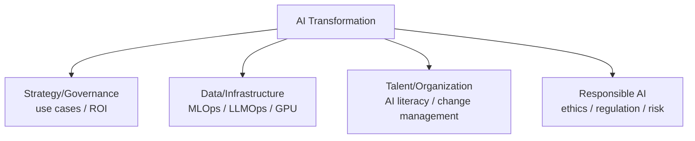

# AX (AI Transformation)

## 1. Overview

### a. Definition
> An enterprise-wide innovation activity that **embeds AI as a core driving force** across a company's products/services, business processes, decision-making, and even its overall business model, thereby redesigning the operating system itself. As the next stage of Digital Transformation (DX), it aims to reorganize the organization so that, on top of "what has been digitized," **AI performs judgment, generation, and automation**.

The essence of AX lies in **elevating AI from a single function/tool to an operating backbone**. Past AI adoption was a 'point'-level project in which a particular department attached a chatbot or a predictive model, but AX is a 'plane'-level transformation that changes data, infrastructure, talent, processes, and governance together so that AI flows through the entire organization. In other words, AX is changing the constitution from "a company that uses AI" to "a company that runs on AI (AI-native)."

### b. Background and Necessity
The decisive trigger that made AX a hot topic is the **emergence of generative AI (LLMs)**. In the past, AI was a high-barrier technology requiring a dedicated data scientist to train a model for each problem, but now it has become a **general purpose technology (GPT)** that summarizes documents, generates code, and handles customer responses when instructed in natural language. This created the conditions for AI use to spread from a few experts to all employees, and when a competitor raises productivity by tens of percent with AI, a company that fails to do so falls behind in cost and speed. Moreover, as the vast data accumulated through DX became usable as AI's 'fuel,' AX emerged as the answer to the question "how do we convert the data we have stored up into value?" In short, AX has the character of **a reorganization of competitiveness for survival, not a choice**.

## 2. AX Implementation System (Components)

AX does not hold together on any single axis alone. Even if an excellent model is introduced, no results come out if the data is not organized; even if infrastructure exists, it is useless if employees cannot use it; and without governance, hallucination/leakage incidents can actually increase risk. Only when the four axes interlock does the transformation endure.

| Component | Key content | Why it is needed |
|---|---|---|
| **Strategy/Governance** | AI vision, use-case discovery/prioritization, ROI measurement, CoE (dedicated organization) | Without knowing what and why, it drifts into 'AI for AI's sake' |
| **Data/Infrastructure** | Data pipelines/quality, MLOps/LLMOps, GPU/cloud, RAG/vector DB | AI performance is ultimately governed by the data and operations foundation |
| **Talent/Organization** | AI literacy training, reskilling, redesign of ways of working/processes | If people do not change, technology adoption stops at the pilot |
| **Responsible AI** | Control of hallucination/bias/copyright/privacy, AI ethics/regulation response | Without trust, the spread itself is impossible |

**Strategy/Governance** is the compass of AX. It prioritizes the many ideas emerging from the field by 'size of effect × feasibility,' and sets up an **AI CoE (Center of Excellence)** that coordinates scattered attempts to prevent duplicate investment and drift. **Data/Infrastructure** is the foundation of AX; especially in the generative AI era, **RAG (retrieval-augmented generation)** and vector DBs, which combine in-house knowledge into answers, and **LLMOps**, which automates model deployment/monitoring/retraining, become central. **Talent/Organization** is the hardest and most decisive axis, because no matter how many tools are installed, if employees cannot naturally use AI within their work flow, it does not lead to results. That is why literacy training must be accompanied by a **redesign of the way of working itself**. Finally, **Responsible AI** is a precondition for the spread. Because a single incident—sending a wrong answer to a customer due to hallucination, or leaking confidential information through training/prompts—can collapse enterprise-wide trust, control mechanisms must be laid down first for the spread to be possible.

## 3. Difference Between DX and AX (Comparison)

To understand AX accurately, it is effective to contrast it with the preceding **DX (Digital Transformation)**. The two are on a continuum, but their **subject and orientation** differ. DX focuses on **improving efficiency and automation** by moving analog/manual processes to digital, and here the human is still the subject of judgment while the system assists it. In contrast, AX is an **intelligentization** in which, on top of that digitized data, **AI directly performs judgment, prediction, and generation**, and the human's role shifts from 'execution' to 'oversight that verifies and coordinates AI's results.' The reason the decisive difference arises is in the **status of data**. In DX, data was the 'output' of digitization, but in AX, data becomes the 'fuel' that trains and drives AI. That is why an organization whose DX is weak and whose data is not organized immediately hits a wall in AX.

| Category | DX (Digital Transformation) | AX (AI Transformation) |
|---|---|---|
| **Orientation** | Efficiency/automation (digitization) | Intelligentization/autonomy (AI embedding) |
| **Core subject** | People (systems assist) | AI (people oversee/verify) |
| **Status of data** | Output of digitization | Fuel that drives AI |
| **Representative technologies** | Cloud, mobile, big data | LLMs, generative AI, MLOps, RAG |
| **Performance metrics** | Processing time/cost savings | Decision quality/creative output/autonomous operation |

## 4. AX Maturity Stages

AX is not completed at once but climbs up through maturity stages. Because each stage is possible only on the foundation of the previous stage, attempts to skip to a higher stage without data/organizational readiness mostly fail.

| Stage | State | Example |
|---|---|---|
| **1. Adoption (experiment)** | Per-department pilots, use of personal tools | Employees drafting documents with a chatbot |
| **2. Utilization (partial integration)** | AI embedded in specific tasks, use cases spreading | Call-center AI consultation assistant in constant operation |
| **3. Embedding (enterprise-wide spread)** | AI combined into core processes/decisions, data/MLOps standardized | AI constantly performing demand forecasting/pricing |
| **4. AI-Native (reinvention)** | The business model itself is AI-based, operation is impossible without AI | AI agents autonomously performing work |

The point of moving from stages 1-2 to stage 3 is the hardest. Individual/departmental experiments start easily, but melting them into enterprise-wide processes requires data governance, MLOps, and organizational change to support it simultaneously. Many companies fall into the **'POC swamp'** here, piling up only pilots without spreading them.

## 5. Application Cases

The effects of AX are revealed in concrete cases. In the **customer center**, it is widely reported that attaching an AI assistant that displays answer drafts and manuals in real time next to the consultant has shortened average handling time and the time it takes new consultants to become proficient. In **software development**, introducing code assistants (e.g., code autocompletion/generation) reduces the time to write repetitive code and reassigns the developer's role to focus on design and verification. In **manufacturing**, predictive maintenance (PdM), which predicts failures in advance from equipment sensor data, reduces unplanned downtime, and in the **pharmaceutical/materials** field, AI explores candidate substances to shorten the development cycle of new drugs and new materials. The common point is that they are designed in the direction of **augmenting** human productivity and judgment rather than replacing people.

## 6. Considerations and Implications (Professional Engineer Perspective)
- **Data governance is a precondition**: The success or failure of AX ultimately comes down to "how much trustworthy data has been secured." If DX and data organization are weak, AX becomes a house of cards, so a system of data quality/standards/access rights must be built in advance.
- **Use-case prioritization and ROI**: When technology itself becomes the goal, it drifts into 'AI for AI's sake.' Discipline is needed to select use cases by size of effect and feasibility, quantitatively measure performance, and judge whether to spread.
- **Escaping the POC swamp**: Pilot success and enterprise-wide spread are entirely different problems. Only by designing data, MLOps, and organizational change together on the premise of scale from the start can one move to stage-3 embedding.
- **Responsible AI and shadow-AI management**: Control over hallucination/bias/copyright/privacy risk is needed, along with an in-house safe-AI-use policy/platform to manage **shadow AI**, where employees input confidential information into external AI outside of controls.
- **Change management and reskilling**: The biggest obstacle to AX is not technology but people. One must make employees understand that AI does not replace but changes roles, and convert resistance into organizational capability through reskilling and incentives.
- **Outlook toward evolution into agents**: As it develops into **AI agents** that plan, use tools, and execute on their own—beyond single question-answering—the orientation of AX is shifting from 'assistance' to 'autonomous operation.' Designing a reliability/control system to match this is the next task.

---

> **In one line**: AX is a transformation that embeds AI into enterprise-wide operations along the four axes of *strategy, data/infrastructure, talent, and responsible AI*; going beyond DX, which digitizes processes, it aims for *intelligentization in which AI performs judgment and generation*, and—on the premise of data governance—advances beyond the 'POC swamp' toward AI-Native through use-case/ROI discipline and change management.
