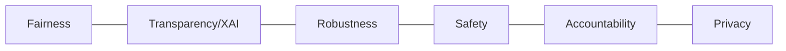
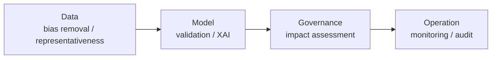

# AI Trustworthiness

## 1. Overview

### a. Definition
> The totality of the properties required so that an AI system **operates safely, fairly, and transparently as intended**, and so that people can **trust and utilize** its judgments and results. It is being normalized in the EU AI Act, NIST AI RMF, ISO/IEC 42001, and Korea's Framework Act on AI, among others.

Trustworthiness is not a single function but a **property combining several attributes**—fairness, transparency, robustness, safety, accountability, and privacy—and it is secured not only in the model algorithm but across data, operations, organization, and governance. In other words, a "highly accurate model" and "trustworthy AI" are different concepts; no matter how accurate, an AI cannot be trusted if it cannot explain the basis of its judgments or if it discriminates against a particular group.

### b. Background and Necessity
As AI came to be used in **high-risk decisions** directly tied to people's rights—such as hiring, lending, medical diagnosis, and criminal justice—risks emerged: expanding and reproducing the social bias embedded in training data as-is (bias), being unable to know why a decision was made (black box), malfunctioning on unforeseen input (lack of robustness), and, for generative AI, fabricating plausible falsehoods (hallucination). Because such risks spread beyond individual harm to matters of social acceptance and corporate liability, countries are moving toward mandating the securing of trustworthiness through regulation. In particular, as the risk surface widens with the spread of generative AI, trustworthiness has become a precondition for adoption rather than a choice.

## 2. Core Attributes

These six attributes are mutually complementary yet sometimes **conflict**. For example, opening the model's internals to increase transparency can weaken privacy or security, and excluding a particular variable for the sake of fairness can lower accuracy. That is why securing trustworthiness is a matter of **managing the balance (trade-offs) among attributes** rather than maximizing a single attribute.

### a. Fairness
If past discrimination is embedded in the training data, the model learns it and makes decisions unfavorable to a particular gender, race, or age. For example, training a hiring model on past successful-applicant data reproduces the existing gender bias as-is. That is why one quantitatively measures bias (gaps in performance/error rate among groups) and mitigates it at the data, algorithm, and post-processing stages.

### b. Transparency/Explainability (XAI)
People must be able to understand and verify the basis of a judgment for objection and accountability to be possible. XAI techniques such as SHAP and LIME present "how much each input contributed to the decision." The deeper the deep learning, the higher the performance but the harder the interpretation, so the balance between performance and explainability becomes a task.

### c. Robustness and d. Safety
Robustness is the property of not collapsing in performance even under adversarial input (adversarial examples), noise, and distribution changes, and safety is the property of controlling so that a malfunction does not lead to actual harm. A representative case in autonomous driving is an attack that misleads a sign with a few stickers, for which robustness testing (adversarial testing) and safety devices (human override, fail-safe) are needed together.

### e. Accountability and f. Privacy
Accountability is leaving logs, versions, and decision histories and placing governance so that the cause and responsibility can be traced when a problem occurs, and privacy is protecting data subjects through minimal collection of personal data, de-identification, and differential privacy (DP).

| Attribute | Description | Representative techniques |
|---|---|---|
| **Fairness** | Bias-free results, discrimination prevention | Bias measurement/mitigation, data rebalancing |
| **Transparency/Explainability (XAI)** | Presenting/interpreting the basis of judgment | SHAP, LIME, feature importance |
| **Robustness** | Stable against adversarial input/noise | Adversarial training, robustness testing |
| **Safety** | Harm prevention, malfunction control | Fail-safe, human-in-the-loop |
| **Accountability** | Tracing responsibility for results, governance | Logging, version control, audit |
| **Privacy** | Personal-data protection, data minimization | De-identification, differential privacy (DP) |

## 3. Ways to Secure It (Full Lifecycle)

Trustworthiness is not completed by a measure at any single stage. This is because if the data is biased, even the best model becomes biased (GIGO), and if the data distribution changes after deployment (drift), the initial validation becomes meaningless. Therefore, one must **distribute controls across the full lifecycle** of data-model-governance-operation.

| Stage | Activity | Reason |
|---|---|---|
| **Data** | Bias measurement/mitigation, securing quality/representativeness | Blocking the source of bias upstream |
| **Model** | Applying XAI, robustness/adversarial testing | Verifying vulnerabilities/explainability before deployment |
| **Governance** | AI impact assessment (AIA), risk management system | Identifying/grading risks in advance |
| **Operation** | Continuous monitoring, drift/anomaly surveillance, audit | Constantly detecting degradation of performance/fairness |

## 4. Related Regulations and Standards

| Category | Key content | Approach |
|---|---|---|
| **EU AI Act** | Risk-based four-tier regulation (prohibited, high, limited, minimal risk) | Differentiated obligations by risk tier |
| **NIST AI RMF** | The four functions of Govern, Map, Measure, Manage | Voluntary risk-management framework |
| **ISO/IEC 42001** | Certification standard for AI management systems (AIMS) | Organization-level management system |
| **Korea's Framework Act on AI** | Obligation to secure trustworthiness/safety of high-impact AI | Regulation of high-impact areas |

The reason the EU AI Act adopts **risk-based regulation**, grading risk and imposing strong obligations on high-risk AI, is that regulating all AI uniformly excessively suppresses innovation. This approach of concentrating regulatory resources where risk is high is also aligned with the Map (risk identification)-Measure (measurement) flow of the NIST RMF.

## 5. Considerations and Implications
- **Full-lifecycle governance is key**: Trustworthiness does not end with a one-time check after model release but must be continuously managed through drift monitoring and periodic audits.
- **Managing trade-offs among attributes**: Coordinating conflicting axes—accuracy vs. fairness, performance vs. explainability, transparency vs. privacy—to fit the domain's risk level is the professional engineer's domain of judgment.
- **Expansion due to generative AI**: As hallucination, harmful content, and alignment problems come to the fore, generative-specific trustworthiness controls such as guardrails, RLHF, and red-team testing are being added.
- **Responding to regulation/certification**: If it falls under an EU AI Act high-risk tier, conformity assessment, technical documentation, and post-market monitoring become mandatory, so domestic companies too need preemptive response for exports and global services.

---

> **In one line**: AI trustworthiness is the property of holding *fairness, transparency, robustness, safety, accountability, and privacy* in mutual balance; it is secured through *full-lifecycle management* of data-model-governance-operation and response to risk-based regulations/standards such as the EU AI Act, NIST RMF, and ISO 42001, and its importance is growing with the spread of generative AI.
