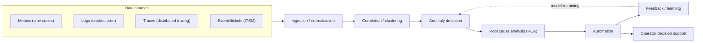
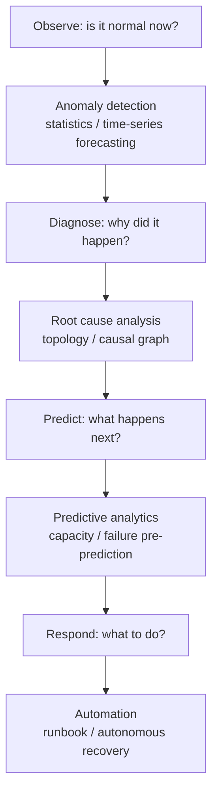

# AIOps (Artificial Intelligence for IT Operations)

## 1. Overview

> **Definition**: AIOps is an approach that applies big data and machine learning to IT operations—automatically detecting anomalies from vast operational data (metrics, logs, traces, events), inferring root causes, and automating responses—thereby transforming human-centered, reactive operations into data-driven, predictive and autonomous operations.

The term AIOps was proposed by Gartner in 2016 in the sense of "Algorithmic IT Operations" and later settled into "AI for IT Operations."
Its background lies in structural changes in the operating environment itself.
In the past era of monolithic and physical servers, the managed targets were static and few, so a skilled operator could keep the situation under control with threshold-based alerts and dashboards.
However, as microservices, containers, serverless, and multi-cloud spread, a single user request passes through dozens of services, instances are created and destroyed on the scale of minutes, and tens of billions of events pour in per day.
In such an environment, the method of a human chasing logs with their eyes to find the cause became physically impossible, and the volume of alerts also exploded to a level humans cannot handle (alert storm).

The second background is the siloing of data.
Monitoring tools were separated by metrics, logs, APM, and network, so one had to manually match correlations for a single failure while moving back and forth across multiple screens.
AIOps aims to collect and normalize this heterogeneous data into a single pipeline, raise the signal-to-noise ratio with statistics and machine learning, and have the algorithm first narrow down "what to look at" for the operator.

The third background is business demand.
In an era where digital services are directly revenue, the mean time to recovery (MTTR) of a failure leads to direct loss.
Because most of the MTTR is spent not on detection but on "root-cause identification (diagnosis)," AIOps, which automates and accelerates diagnosis, becomes a precondition for reliability (SRE) and business continuity.

One should emphasize in the answer that AIOps is not a single product but a **set of capabilities** running from **data collection → correlation/clustering → anomaly detection → root cause analysis (RCA) → automated response**.
Also, it is valid in both practice and the exam to understand AIOps from the perspective of **augmentation**—not replacing operators but automating repetitive, large-volume judgments so that operators can focus on higher-order decision-making.

## 2. Overall AIOps Structure and Data Pipeline

AIOps has a pipeline structure that gathers data from heterogeneous sources and refines its value stage by stage.
The conceptual diagram below shows the overall skeleton along which data flows from collection to autonomous response.

The **data collection/normalization** stage is the work of unifying different formats, timestamps, and tag schemes.
Metrics are regular time series, but logs are unstructured text and traces are graph structures, so standardizing them (e.g., the OpenTelemetry convention) so they can be joined by common entities (service, host, request ID) governs the quality of all subsequent analysis.
If normalization is poor, different signals cannot be grouped as the same event, and subsequent correlation analysis is neutralized.

The **correlation/clustering** stage compresses the exploding alerts into incident units.
It groups thousands of alerts derived from the same cause by time, topology, and text similarity (alert clustering/de-duplication), reducing the targets an operator must look at from dozens to one.
For example, when one DB slows down, the 40 services that call it all raise latency alerts simultaneously, but correlation consolidates these into a single event of "DB latency."

The **anomaly detection** stage overcomes the limits of static thresholds.
The traditional method uses a fixed threshold such as "alert when CPU exceeds 80%," but traffic varies greatly by weekday/weekend and time of day, so false positives and false negatives are frequent.
AIOps builds a dynamic baseline that has learned seasonality and trends, and alerts only when the actual value deviates from the predicted interval.

## 3. Core Techniques and Analysis Layers

The analysis layers of AIOps combine different machine-learning techniques according to purpose.
The diagram below expresses, from a process perspective, what question each layer answers.

### a. Anomaly Detection

Anomaly detection is the starting point of AIOps, discerning "what differs from usual."
For time-series metrics, one computes the expected value and prediction interval with seasonal decomposition (STL) or exponential-smoothing/ARIMA-family forecasting models, and marks it as anomalous when the observed value deviates.
For unstructured logs, one parses the logs into templates (log parsing) and then detects sudden changes in occurrence frequency/order, and for multidimensional metrics, one views points far from the normal pattern as anomalies using unsupervised learning such as Isolation Forest and autoencoders.
The core design challenge is the **balance between false positives and false negatives**.
Raising sensitivity increases alert fatigue, while lowering it misses actual failures.
Therefore, a feedback loop that reflects the operator's confirm/reject results back into training becomes the key to practicality.

### b. Correlation Analysis and Noise Reduction

In a large-scale system, a single root cause gives rise to countless symptom alerts.
Correlation analysis groups these into a single event using temporal proximity, service-dependency topology, and log-text similarity.
In practice, it is reported that this stage alone reduced the alert volume by more than 90%, which decisively lowers the operator's cognitive load.
Combining topology information (service map, CMDB) makes it possible to distinguish "a failure of an upstream service that propagated downstream," leaving only the alerts closest to the true cause.

### c. Root Cause Analysis (RCA)

RCA is the hardest layer, inferring the initial cause from a grouped event.
It back-traces the path along which the anomaly propagated in the service-dependency graph and compares the temporal causality with change events (deployments, configuration changes, infrastructure scaling).
It ranks candidate causes by combining features such as "was there a deployment just before the failure" and "does it occur only on a specific node."
Recently, research to distinguish correlation from causation using causal inference and graph neural networks is active, and a direction (generative AIOps) that combines LLMs to summarize logs and change history in natural language and present hypotheses is also emerging.

### d. Predictive Analytics and Automation

Predictive analytics learns trends to warn in advance of the point of capacity exhaustion, disk saturation, or performance degradation (e.g., "storage will reach 95% in 3 days").
Automation (autonomous recovery) connects the detection/diagnosis results to predefined runbooks or policies to execute actions.
Auto scale-out, pod restart, traffic rerouting, and automatic ticket creation/classification are representative.
It is safe to expand automation in stages according to the level of trust: **human-in-the-loop → advisory → fully autonomous**.

The table below is an auxiliary reference summarizing the purpose and representative techniques of each layer.

| Layer | Question answered | Representative techniques | Output |
|------|------------|-----------|--------|
| Anomaly detection | Is something anomalous now | STL, ARIMA, autoencoder, Isolation Forest | Anomaly signal |
| Correlation/clustering | Is it the same event | Time/topology/text-similarity clustering | Consolidated event |
| Root cause analysis | Why did it happen | Dependency graph, change comparison, causal inference | Ranked cause candidates |
| Predictive analytics | What happens next | Time-series forecasting, regression | Capacity/failure prediction |
| Automation | What to do | Runbook, policy engine, RPA | Autonomous/advisory action |

## 4. Comparison with Similar Concepts and Adoption Cases

Because AIOps is often confused with adjacent concepts, one must distinguish the differences at the level of principle.
Traditional **monitoring** relies on human-defined thresholds/rules and detects only "known failures," whereas AIOps handles even "unknown anomalies" with a learned baseline.
**Observability** is a *property* that ensures a system emits sufficient telemetry, and AIOps is a layer that *intelligently analyzes* that telemetry—a mutually complementary relationship in which good observability produces good input data and thereby raises AIOps accuracy.
**MLOps** manages the development/deployment/operation lifecycle of the machine-learning model itself, whereas AIOps *applies* machine learning to IT-infrastructure/service operations—their purposes differ.
If **DevOps** is the integration of the processes/culture of development and operations, AIOps can be said to be a technical reinforcement that intelligentizes that operations stage with data.

Looking at adoption cases, large commerce and finance companies report that in periods of surging traffic on Black Friday and holidays, they greatly reduced false-positive alerts with dynamic-baseline-based anomaly detection and compressed the number of failure events from thousands to dozens through correlation.
Telecom and cloud providers present cases of applying predictive models to network-equipment logs to recognize failures in advance and automatically reroute, thereby shortening MTTR.
Domestically as well, it is spreading in the direction of first applying anomaly detection and alert consolidation to the operation of large-scale public and financial systems to reduce the burden on night and weekend operations staff.
However, because such results are greatly governed by data quality and the consistency of topology information, one should adjust expectations to fit the data maturity of one's own environment rather than generalizing the figures of a case.

## 5. Deep Dive: Adoption Maturity and Latest Trends

AIOps adoption does not reach autonomous operation at once; it is realistic to climb through maturity stages.
Stage 1 is **data integration/visualization** to eliminate silos, stage 2 is **anomaly detection/alert consolidation** to reduce noise, stage 3 is **root cause analysis/prediction** to accelerate diagnosis, and stage 4 is **autonomous recovery** to automate even the response.
Many organizations remain at stages 2-3, because full autonomy carries the risk of a wrong automated action expanding a failure (automation risk).

As a latest trend, the **combination of generative AI/LLMs** stands out.
LLMs summarize vast logs, change history, and documents in natural language, and assist operators in the form of a copilot that conversationally presents "why this failure occurred and what to do."
However, because of the risk of LLM hallucination, verification grounded in evidence data (RAG/citation) and human confirmation must be performed together.
Also, because observational data may contain personal information and confidential information, data minimization and access control in the training/inference process are emerging as essential conditions for securing trustworthiness.
On the standardization side, OpenTelemetry has established itself as the de facto standard for telemetry collection, lowering vendor lock-in and becoming a foundation that increases the flexibility of AIOps tool selection.

## 6. Considerations and Implications

From the professional engineer's perspective, AIOps adoption must comprehensively consider the following.

- **Data quality governs success or failure**: If the consistency of tag schemes, timestamps, and topology (CMDB) is low, any algorithm produces wrong answers. Prior to AIOps investment, data standardization (OpenTelemetry, etc.) and service-map organization must come first, and the principle "garbage in, garbage out" applies as-is.
- **The trade-off between false positives/negatives and trust**: Raising sensitivity causes alert fatigue, and lowering it causes missed failures. A staged approach is safe: initially operate in advisory mode and correct the model with feedback, then gradually expand automation starting from scenarios where trust has accumulated.
- **Automation risk and control mechanisms**: Autonomous recovery raises efficiency but a wrong action can amplify a failure. Safety devices such as limiting the scope of actions, rollback strategies, circuit breakers, and human-approval gates must be designed together.
- **Organizational/process change (culture)**: AIOps is not a tool adoption but a transformation of the way of operating. The operator's role changes from "alert handler" to "supervisor who tames and verifies models," and consistency with ITSM processes and SRE culture is needed.
- **Security/privacy/governance**: Operational data may be mixed with sensitive information, and automated actions require audit trails. One must have data minimization, access control, and action logging to secure explainability and accountability.
- **Outlook and related technologies**: It evolves toward forming a closed loop of "observe → analyze → autonomous response" by combining with observability, SRE, MLOps, and platform engineering, and as generative AI copilots and causal inference mature, the level of diagnostic automation is expected to rise further.

---

> **In one line**: AIOps is an approach that intelligentizes anomaly detection, correlation analysis, root cause analysis, prediction, and automated response in IT operations with big data and machine learning, transforming reactive operations into predictive and autonomous ones; data quality, staged automation, and the design of safety devices determine its success or failure.
