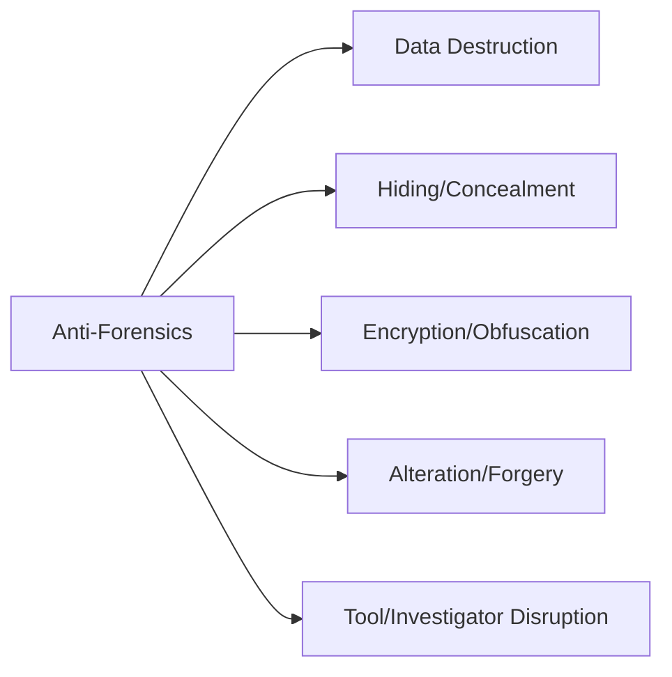
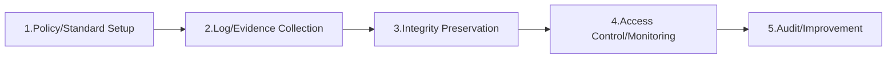

# Anti-Forensics and Countermeasure Compliance

## 1. Overview

### A. Definition
> A collective term for the techniques and actions that **hide, delete, alter, or forge** data, or that disrupt analysis tools and investigators, with the aim of obstructing, evading, or nullifying the **collection, analysis, and legal submission of evidence** in digital forensics.

Anti-forensics stands in a **spear-and-shield relationship** with forensics. The more forensics advances techniques to recover deleted data and reconstruct traces of activity into a timeline, the more sophisticated anti-forensics that seeks to nullify it becomes. Its goal is to destroy one or more of the three properties of evidence — namely its **existence, integrity, and interpretability** — thereby lowering its value as evidence or its legal admissibility.

### B. Background and Necessity
As forensic investigation techniques became advanced and standardized, trace-removal tools proliferated as a counter-reaction, and they are used widely in concealing crimes, destroying evidence of insider information leaks, and erasing traces of ransomware and hacking. On top of this, the default inclusion of full-disk encryption, the spread of cloud and large-capacity storage media, and the rise of memory-resident (fileless) attacks have **broadened the very surface on which evidence can hide**. For this reason, enterprises and institutions must equip themselves not with after-the-fact response but with a **proactive compliance framework** that secures and preserves evidence in advance, before it can be deleted.

## 2. Classification of Anti-Forensic Techniques

The techniques are divided by their purpose: whether they **destroy** evidence (destruction), **hide** it (concealment/encryption), **deceive** with it (alteration/forgery), or **obstruct analysis** (tool disruption). Because the purposes differ, so do the countermeasures — destruction is met with advance backup, concealment with search techniques, alteration with integrity verification, and tool disruption with multiple tools and live forensics.

| Type | Detailed Techniques | Response Difficulty | Focus of Response |
|---|---|---|---|
| **Data Destruction** | Wiping (Gutmann/DoD methods), degaussing, physical destruction | Recovery nearly impossible | Proactive collection/backup before deletion |
| **Hiding** | Steganography, slack space/HPA/DCO, hidden partitions, ADS | High | Low-level imaging, search of hidden areas |
| **Encryption/Obfuscation** | Full-disk encryption (BitLocker), volume encryption, packing | Obtaining the key is decisive | Live forensics, securing keys/memory |
| **Alteration/Forgery** | Timestamp tampering (Timestomp), log deletion/forgery, metadata manipulation | Requires integrity cross-verification | Cross-checking multiple sources, hash verification |
| **Tool Disruption** | Exploiting forensic-tool vulnerabilities, anti-debugging, memory-resident (fileless) | Very high | Memory forensics, multiple tools |

**Data destruction** in particular is hard to counter because multi-pass overwriting via the Gutmann/DoD methods or degaussing physically erases the magnetic recording itself, making after-the-fact recovery virtually impossible. So for this type alone, "**collecting it beforehand, before it is deleted**" is the only sure countermeasure, and this becomes the design principle of the compliance framework described below.

## 3. Countermeasure: Building a Compliance System

The core design principles of a compliance framework are "**proactiveness**" and "**integrity**." Since much of anti-forensics aims to delete or change evidence later, the defense focuses on **replicating and preserving evidence in real time to an external, immutable store**.

| Stage | Activities | Why It Is Needed |
|---|---|---|
| **Policy/Standard Setup** | Define evidence-management policy, legal requirements (Electronic Documents Act, Criminal Procedure Act), retention periods | Establish the basis for due process and admissibility |
| **Log/Evidence Collection** | Integrated logs (SIEM), endpoint (EDR), imaging automation — **proactive collection before deletion** | Securing evidence before destruction is the only sure method |
| **Integrity Preservation** | Hashes (SHA-256), digital signatures, timestamps, **WORM storage**, redundancy | Fundamentally block after-the-fact alteration/forgery |
| **Access Control/Monitoring** | Least privilege, separation of duties, anomaly detection (mass deletion/wiping) | Deter and detect early an insider's destruction of evidence |
| **Audit/Improvement** | Regular audits, CoC (Chain of Custody) checks, post-hoc improvement | Verify procedural compliance, improve the framework |

Here, **WORM (Write Once Read Many) storage** and hash chaining are decisive because, once written, data cannot be modified or deleted, so even an attacker who has hijacked administrator privileges cannot undo logs already recorded. If logs are kept only locally, an intruder deletes them too; but if they are pushed out immediately to WORM or a remote SIEM, deletion is nullified.

## 4. Countermeasure Process in Practice (When an Incident Occurs)

When an incident actually occurs, you must act according to standard procedures to preserve admissibility. Violating the order (for example, analyzing before preservation) can break integrity and lead to rejection in court.

| Stage | Content | Cautions |
|---|---|---|
| **Detect** | Real-time detection of deletion/alteration/anomalies (EDR/SIEM rules) | Rule-ify mass-deletion/wiping patterns |
| **Preserve** | Preserve evidence, maintain **CoC** (collection→storage→analysis→submission history) | Do not corrupt the original; analyze on a copy |
| **Analyze** | Timeline analysis, recovery (file carving), search for hidden data | Detect alteration via cross-verification of multiple sources |
| **Respond/Report** | Legal response, strengthen recurrence-prevention controls, audit reporting | Reinforce controls based on root cause |

**CoC (Chain of Custody)** refers to the unbroken record of who handled the evidence, when, and how, from collection through submission. If this chain is broken at even one point, the suspicion that "it could have been tampered with in the meantime" costs the evidence its admissibility, making it the factor that decides the legal success or failure of an anti-forensic response.

## 5. Considerations and Implications
- **Proactive evidence collection is key**: Once data is destroyed by wiping or degaussing, recovery is impossible, so securing it "before it is erased" through real-time log forwarding and automated imaging is the starting point of defense.
- **Responding to encrypted/cloud environments**: A system with full-disk encryption loses its key when powered off, making decryption difficult. Therefore you must also perform **live forensics** to secure memory and keys while the system is powered on.
- **Compliance with due process**: No matter how well evidence is collected, violating the warrant requirement, due process, CoC, or integrity forfeits its admissibility. Technology and legal requirements must be designed together.
- **Expansion of automation/AI**: The field is evolving toward capturing mass deletions and abnormal access in real time via AI-based anomaly detection and responding with automated imaging.

---

> **In one line**: Anti-forensics is a set of techniques that *destroy, hide, encrypt, alter, or forge evidence and disrupt tools to nullify forensics*; countermeasure compliance is built through policy → **proactive evidence collection** → integrity preservation (hashes/WORM/CoC) → monitoring → audit, and when an incident occurs, the detect-preserve-analyze-respond procedure and adherence to due process protect admissibility.
